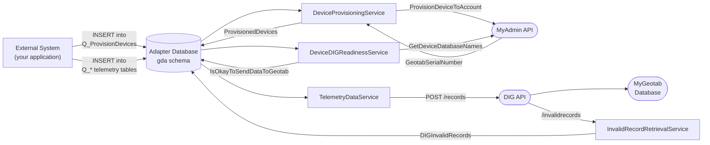
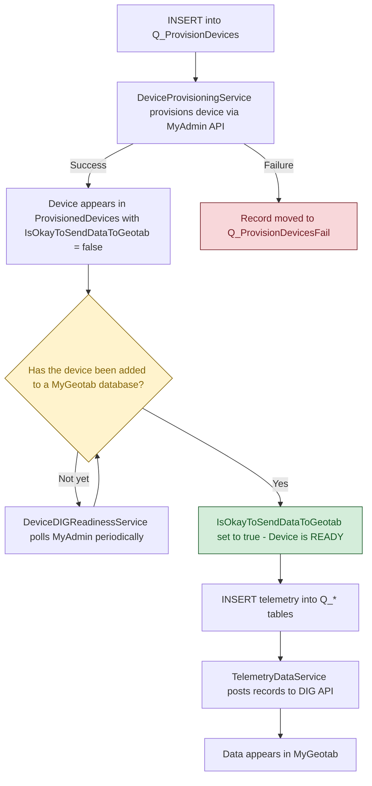
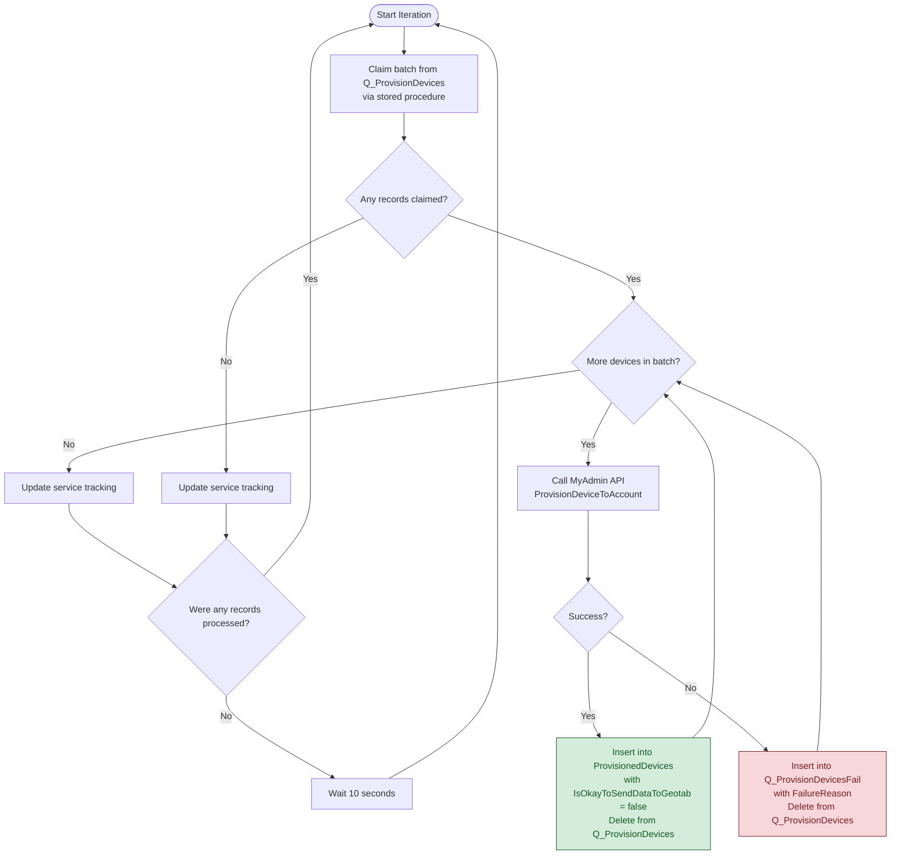
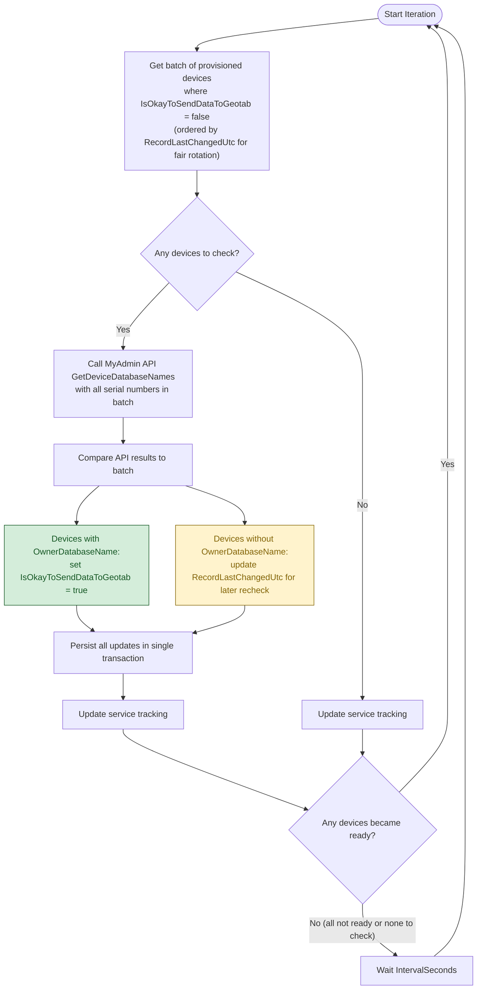
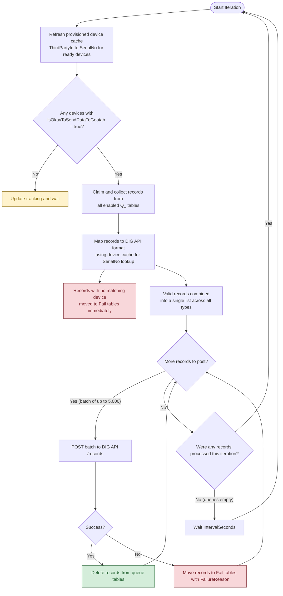
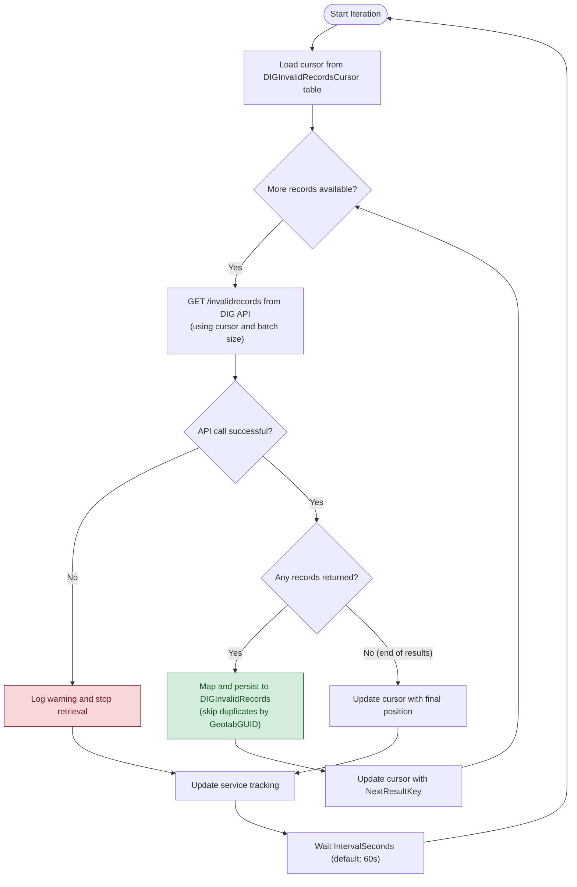

# Geotab DIG Adapter

**Current Version:** 5.0.0.0

> **Using AI to query your adapter database?** See [Section 7.8 AI-Assisted SQL Generation](#78-ai-assisted-sql-generation) for guidance on which files to provide as context to your LLM and key points that ensure accurate query results.

The Geotab [Data Intake Gateway (DIG)](https://github.com/Geotab/data-intake-gateway) enables integrators to stream telemetry data from custom (non-Geotab) telematics devices into the MyGeotab platform — handling much of the [Integrating Telematics Devices](https://docs.google.com/document/d/17Bsi6GxpadHiqajjc9S7bmlKDwv5Mz48dQ_5rm2hEoU/edit?tab=t.0#heading=h.k75aaczakk1u) process outlined in the *Asset & Trailer Tracker Playbook*. While the [MyGeotab API Adapter](https://github.com/Geotab/mygeotab-api-adapter) pulls data *out of* MyGeotab, the Geotab DIG Adapter pushes data *into* MyGeotab.

The Geotab DIG Adapter is a .NET 10.0 application that reads telemetry data from queue tables in a local database and posts it to the DIG API. It handles device provisioning, readiness checking, telemetry transmission, and invalid record retrieval — providing a complete pipeline for getting custom telematics data into MyGeotab. It supports both **SQL Server** and **PostgreSQL** databases and runs on Windows, Linux, or macOS.

The Geotab DIG Adapter is open source and available on [GitHub](https://github.com/Geotab/mygeotab-api-adapter). It can be used as-is or modified to meet specific requirements. At a minimum, it serves to demonstrate how a proper DIG integration may be implemented.

### Geotab DIG Adapter Highlights

- **Data Integrity** — A queue-based processing model with atomic claim/process/complete operations ensures reliable record delivery. Failed records are captured in dedicated fail tables with detailed failure reasons, and invalid records flagged by DIG are retrieved and persisted for analysis.
- **Resilience** — A state machine monitors connectivity to both the DIG API and the adapter database. When connectivity is lost, the adapter transitions to a waiting state, polls for restoration, and resumes processing where it left off once connectivity is re-established.
- **Database-Agnosticity** — Both SQL Server and PostgreSQL are supported. The [Dapper](https://github.com/DapperLib/Dapper) ORM is used to map .NET objects to database rows, and a repository pattern separates data-access code from application logic.
- **Configurability** — Via `appsettings.json`, individual telemetry record types can be enabled or disabled, batch sizes and processing intervals can be tuned, and services can be independently controlled.
- **Deployment Model** — The adapter is published using the self-contained deployment model, targeting Windows 64-bit (win-x64), Linux 64-bit (linux-x64), macOS Intel (osx-x64), and macOS Apple Silicon (osx-arm64) runtimes. No pre-installation of the .NET runtime is required.
- **Logging** — [NLog](https://nlog-project.org/) is incorporated as the logging mechanism, with log messages added strategically to assist with debugging and monitoring once the solution has been deployed.

This document provides detailed information about the Geotab DIG Adapter along with instructions related to its deployment.

> **Important — Cost Considerations:** While the Geotab DIG Adapter itself is free and open source, there are costs associated with sending Custom Telematics Device data to the Geotab platform via the Data Intake Gateway. Before proceeding, review the [Does it cost money to build a Custom Telematics Device integration?](https://docs.google.com/document/d/1Mddnxc2qKBCNYvVu0-BXcyR-blPlHwa0Zun0mBzZt88/edit?tab=t.0#heading=h.5y68mhkb2l3k) section of the *Custom Telematics Devices and MyGeotab* reference document for details on associated costs.

> **Tip:** This document is written in Markdown. You can render it in any Markdown viewer, paste it into Google Docs or Microsoft Word, or view it directly on GitLab/GitHub. Mermaid diagrams require a Mermaid-compatible renderer (GitLab, GitHub, VS Code with extensions, etc.).

## Table of Contents

1. [Quick Start Guide](#1-quick-start-guide)
   - [1.1 Prerequisites](#11-prerequisites) · [1.2 Download](#12-download) · [1.3 Database Setup](#13-database-setup) · [1.4 Deploy and Configure the Application](#14-deploy-and-configure-the-application)
2. [Architecture Overview](#2-architecture-overview)
   - [End-to-End Data Flow](#end-to-end-data-flow) · [Device Lifecycle](#device-lifecycle) · [Services](#services) · [State Machine](#state-machine) · [Database Schema](#database-schema) · [Project Structure](#project-structure)
3. [Operator Guide](#3-operator-guide)
   - [3.1 Device Provisioning](#31-device-provisioning) · [3.2 Sending Telemetry Data](#32-sending-telemetry-data) · [3.3 Queue Processing Model](#33-queue-processing-model) · [3.4 Monitoring](#34-monitoring) · [3.5 Invalid Record Retrieval](#35-invalid-record-retrieval)
4. [Configuration Guide](#4-configuration-guide)
   - [4.1 OverrideSettings](#41-overridesettings) · [4.2 DatabaseSettings](#42-databasesettings) · [4.3 MyAdminSettings](#43-myadminsettings) · [4.4 DIGSettings](#44-digsettings) · [4.5 AppSettings](#45-appsettings)
5. [Troubleshooting Guide](#5-troubleshooting-guide)
   - [5.1 Common Failure Scenarios](#51-common-failure-scenarios) · [5.2 Interpreting Fail Table Records](#52-interpreting-fail-table-records) · [5.3 DIG API Error Codes](#53-dig-api-error-codes) · [5.4 Authentication and Token Management](#54-authentication-and-token-management) · [5.5 Database Connectivity Issues](#55-database-connectivity-issues)
6. [API Reference](#6-api-reference)
   - [6.1 DIG Record Types](#61-dig-record-types) · [6.2 Field Mappings](#62-field-mappings--queue-table-to-dig-api) · [6.3 DIG API Endpoints Used](#63-dig-api-endpoints-used) · [6.4 MyAdmin API Endpoints Used](#64-myadmin-api-endpoints-used)
7. [Database Schema Reference](#7-database-schema-reference)
   - [7.1 Device Provisioning Tables](#71-device-provisioning-tables) · [7.2 Telemetry Queue Tables](#72-telemetry-queue-tables) · [7.3 Fail Tables](#73-fail-tables) · [7.4 Invalid Records Tables](#74-invalid-records-tables) · [7.5 System Tables](#75-system-tables) · [7.6 Stored Procedures](#76-stored-procedures) · [7.7 Database Setup](#77-database-setup) · [7.8 AI-Assisted SQL Generation](#78-ai-assisted-sql-generation)
8. [Developer Guide](#8-developer-guide)
   - [8.1 Prerequisites](#81-prerequisites) · [8.2 Building from Source](#82-building-from-source) · [8.3 Development Configuration](#83-development-configuration) · [8.4 Running Tests](#84-running-tests) · [8.5 Code Architecture](#85-code-architecture)
9. [Reference Materials](#9-reference-materials)
   - [Data Intake Gateway](#data-intake-gateway) · [Custom Telematics Devices](#custom-telematics-devices) · [Feedback](#feedback)

---

## 1. Quick Start Guide

High-level steps are shown in the following table with details provided in the subsections below.

| Step | Detail |
|------|--------|
| 1 | **Ensure that Prerequisites are Met:** Ensure that all prerequisites are met. See [1.1 Prerequisites](#11-prerequisites) for details. |
| 2 | **Download the Geotab DIG Adapter:** Download the Geotab DIG Adapter application. See [1.2 Download](#12-download) for details. |
| 3 | **Set Up the Adapter Database:** Set up the `gda` schema in the adapter database. See [1.3 Database Setup](#13-database-setup) for details. |
| 4 | **Deploy and Configure the Application:** Deploy and configure the Geotab DIG Adapter application. See [1.4 Deploy and Configure the Application](#14-deploy-and-configure-the-application) for details. |

### 1.1 Prerequisites

The Geotab DIG Adapter requires the following:

| Item | Detail |
|------|--------|
| Geotab Relationship | An established partnership or integration relationship with Geotab is required to obtain the DIG API and MyAdmin API credentials needed by the Geotab DIG Adapter. If you do not yet have an existing relationship with Geotab, visit [Integrate with Geotab](https://marketplace.geotab.com/integrate-geotab/) or [Become a Reseller](https://www.geotab.com/contact-us/become-a-reseller/) to get started. |
| Custom Telematics Device Setup | Once a Geotab relationship has been established, follow the steps outlined in the [Reseller Partners and/or Integration Partners](https://docs.google.com/document/d/1Mddnxc2qKBCNYvVu0-BXcyR-blPlHwa0Zun0mBzZt88/edit?tab=t.0#heading=h.o49mnvoz5p3y) section of the [Custom Telematics Devices and MyGeotab](https://docs.google.com/document/d/1Mddnxc2qKBCNYvVu0-BXcyR-blPlHwa0Zun0mBzZt88/edit?usp=sharing) reference document to set up custom telematics devices for use with the Data Intake Gateway. This process includes obtaining a **Product ID**, which is required when provisioning devices. See [Why do I need a Product ID?](https://docs.google.com/document/d/1Mddnxc2qKBCNYvVu0-BXcyR-blPlHwa0Zun0mBzZt88/edit?tab=t.0#heading=h.i26jghdyks3) for details. |
| Operating System | Windows 64-bit (win-x64), Linux 64-bit (linux-x64), or macOS (osx-x64 / osx-arm64). The deployment packages are self-contained and include the .NET runtime, libraries and dependencies needed to run on the respective platforms. There is no need to pre-install the .NET runtime. |
| Database | SQL Server or PostgreSQL. The Geotab DIG Adapter stores its data in a `gda` schema within a database named `geotabadapterdb`. If the [MyGeotab API Adapter](https://github.com/Geotab/mygeotab-api-adapter) is also being used, the two adapters share the same database — the MyGeotab API Adapter uses the `dbo` (SQL Server) or `public` (PostgreSQL) schema while the Geotab DIG Adapter uses the `gda` schema. If the Geotab DIG Adapter is being used on its own, the `geotabadapterdb` database must be created first. See [Section 7.7 Database Setup](#77-database-setup) for complete instructions. |
| MyAdmin API Credentials | A MyAdmin service account with the `Device_Admin` and `Third-Party-Integrator` roles, used for device provisioning. The credentials for this account are configured via the `MyAdminUser` and `MyAdminPassword` settings in `appsettings.json`. See [Service account access assignment and best practices](https://docs.google.com/document/d/1Mddnxc2qKBCNYvVu0-BXcyR-blPlHwa0Zun0mBzZt88/edit?tab=t.0#heading=h.yd5sqe939uoh) and [What are these MyAdmin roles needed for?](https://docs.google.com/document/d/1Mddnxc2qKBCNYvVu0-BXcyR-blPlHwa0Zun0mBzZt88/edit?tab=t.0#heading=h.1iyorafxnbth) in the *Custom Telematics Devices and MyGeotab* reference document for details. |
| DIG API Credentials | A separate MyAdmin service account with the `DIG-Access` role, used for sending custom telematics data to the [Data Intake Gateway](https://github.com/Geotab/data-intake-gateway). The credentials for this account are configured via the `DIGUser` and `DIGPassword` settings in `appsettings.json`. As a best practice, this should be a different account from the one used for device management. See [Service account access assignment and best practices](https://docs.google.com/document/d/1Mddnxc2qKBCNYvVu0-BXcyR-blPlHwa0Zun0mBzZt88/edit?tab=t.0#heading=h.yd5sqe939uoh) for details. |
| Networking / Firewall | The application must be able to make requests over HTTPS to the DIG API (e.g. `https://dig.geotab.com:443/`) and the MyAdmin API (e.g. `https://myadmin.geotab.com/v2/myadminapi.ashx`). If the application and database reside on separate servers, appropriate networking steps must be taken to ensure connectivity. |

### 1.2 Download

The latest version of the Geotab DIG Adapter is available on GitHub:

1. Go to [https://github.com/Geotab/mygeotab-api-adapter/releases](https://github.com/Geotab/mygeotab-api-adapter/releases)
2. The latest release will be shown first (at the top of the page). Scroll down to the **Assets** section and download the required files.

#### Application

| Operating System | File to Download |
|------------------|------------------|
| Windows 64-bit | `GeotabDIGAdapter_SCD_win-x64.zip` |
| Linux 64-bit | `GeotabDIGAdapter_SCD_linux-x64.zip` |
| macOS (Intel) | `GeotabDIGAdapter_SCD_osx-x64.zip` |
| macOS (Apple Silicon) | `GeotabDIGAdapter_SCD_osx-arm64.zip` |

#### Database Scripts

| Database | File to Download |
|----------|------------------|
| SQL Server | `SQLServer_GeotabDIGAdapter.zip` |
| PostgreSQL | `PostgreSQL_GeotabDIGAdapter.zip` |

> **Tip:** Developers working from source code can find the database scripts directly in `GeotabDIGAdapter/Scripts/`.

### 1.3 Database Setup

The Geotab DIG Adapter uses its own `gda` schema within a database named `geotabadapterdb`. Follow the complete setup procedure in [Section 7.7 Database Setup](#77-database-setup) using the scripts from the downloaded database script zip file (see [Section 1.2](#12-download)). This covers creating the database (for standalone installations), the `gda` schema, the `geotabdigadapter_client` database user, and executing the initial schema creation script. If the MyGeotab API Adapter is already installed, the database already exists and only the DIG-specific steps are required — Section 7.7 identifies which steps to skip.

### 1.4 Deploy and Configure the Application

#### Step 1: Deployment Prerequisites

Before deploying, ensure:

1. **MyAdmin service account** for device management has been set up with the `Device_Admin` and `Third-Party-Integrator` roles (see [Prerequisites](#11-prerequisites)).
2. **DIG service account** for data transmission has been set up with the `DIG-Access` role (see [Prerequisites](#11-prerequisites)).
3. Appropriate steps (networking, firewall, etc.) have been taken to ensure **connectivity** to the DIG API and MyAdmin API endpoints.
4. The **database setup** has been completed per the instructions in [Section 1.3](#13-database-setup).

#### Step 2: Install the Application

The Geotab DIG Adapter is packaged as a self-contained application that includes the .NET runtime and all dependencies. To install:

1. Copy the downloaded zip file to the desired location and extract the contents.

#### Step 3: Configure the Application

The deployment folder contains two configuration files: `appsettings.json` and `nlog.config`.

1. Modify **`appsettings.json`** as needed. See the [Configuration Guide](#4-configuration-guide) for details on all settings. At minimum, configure:
   - **`DatabaseSettings`** — database provider type and connection string (see [Section 4.2](#42-databasesettings))
   - **`MyAdminSettings`** — MyAdmin API credentials (see [Section 4.3](#43-myadminsettings))
   - **`DIGSettings`** — DIG API credentials (see [Section 4.4](#44-digsettings))
2. Review **`nlog.config`** and adjust logging settings if needed.

#### Step 4: Run the Application

##### Option 1: Run Manually

For testing purposes, the application can be launched by running the executable directly:

- **Windows:** `GeotabDIGAdapter.exe`
- **Linux / macOS:** `./GeotabDIGAdapter`

##### Option 2: Install as a Service

For continuous operation in a production environment, install the application as a service.

**Windows:**

Open PowerShell or Command Prompt as an **Administrator**:

```
sc.exe create GeotabDIGAdapter binPath="C:\<path>\GeotabDIGAdapter_SCD_win-x64\GeotabDIGAdapter.exe"
sc.exe start GeotabDIGAdapter
```

**Linux (systemd):**

1. Create a service unit file:
   ```
   sudo nano /etc/systemd/system/geotabdigadapter.service
   ```

2. Add the following configuration (replacing `<path>` and `<User>` as appropriate):
   ```
   [Unit]
   Description=Geotab DIG Adapter

   [Service]
   ExecStart=/<path>/GeotabDIGAdapter_SCD_linux-x64/GeotabDIGAdapter
   WorkingDirectory=/<path>/GeotabDIGAdapter_SCD_linux-x64
   User=<User>
   Restart=always
   RestartSec=10
   SyslogIdentifier=geotab-dig-adapter
   Environment=ASPNETCORE_ENVIRONMENT=Production
   Environment=DOTNET_PRINT_TELEMETRY_MESSAGE=false

   [Install]
   WantedBy=multi-user.target
   ```

3. Enable and start:
   ```
   sudo systemctl daemon-reload
   sudo systemctl enable geotabdigadapter.service
   sudo systemctl start geotabdigadapter.service
   ```

#### Next Steps

Once the application is running, proceed to the [Operator Guide](#3-operator-guide) to provision devices and begin sending telemetry data.

---

## 2. Architecture Overview

### End-to-End Data Flow



### Device Lifecycle

A device must pass through several states before telemetry data can flow. One of these states requires action **outside** the adapter — the device must be added to a MyGeotab database by the customer or their Geotab partner.



> **Warning — Adding the device to a MyGeotab database is an external action.** After the adapter provisions a device via the MyAdmin API, someone — typically the customer or their Geotab partner — must add that device to a MyGeotab database (e.g., via the MyGeotab user interface). The adapter cannot perform this step. The `DeviceDIGReadinessService` periodically checks the MyAdmin API to detect when this has occurred. Until it does, `IsOkayToSendDataToGeotab` remains `false` and any telemetry records for the device will **not** be sent to the DIG API. **Do not insert telemetry records into `Q_*` tables until `IsOkayToSendDataToGeotab = true`.**

### Services

The Geotab DIG Adapter runs five background services:

| # | Service | Purpose | Dependencies |
|---|---------|---------|-------------|
| 1 | **Orchestrator** | Application initialization, MyAdmin authentication, and connectivity monitoring. Manages state machine transitions. | None |
| 2 | **DeviceProvisioningService** | Reads from `Q_ProvisionDevices`, provisions devices via the MyAdmin API, and writes results to `ProvisionedDevices` (success) or `Q_ProvisionDevicesFail` (failure). | Orchestrator |
| 3 | **DeviceDIGReadinessService** | Checks provisioned devices against the MyAdmin API to determine if they have been assigned to a MyGeotab database. Sets `IsOkayToSendDataToGeotab = true` when ready. | DeviceProvisioningService |
| 4 | **TelemetryDataService** | Reads from `Q_*` telemetry queue tables, maps records to DIG API format, and posts them via HTTPS. **Only processes records for devices where `IsOkayToSendDataToGeotab = true`** (see [Device Lifecycle](#device-lifecycle)). Authenticates with the DIG API on startup. | DeviceDIGReadinessService |
| 5 | **InvalidRecordRetrievalService** | Polls the DIG API `/invalidrecords` endpoint using cursor-based pagination and persists rejected records to `DIGInvalidRecords` for analysis. | TelemetryDataService (for DIG auth) |

### State Machine

All services coordinate through a shared state machine:

- **Running** — services are actively processing.
- **Waiting** — services are paused due to a connectivity issue or initialization.

Wait reasons: `ApplicationNotInitialized`, `AdapterDatabaseNotAvailable`, `DIGNotAvailable`, `MyAdminNotAvailable`, `MyGeotabNotAvailable`, `DatabaseMaintenanceInProgress`.

When a connectivity issue is detected, the Orchestrator transitions the state machine to `Waiting`, polls for restoration every 10 seconds, and transitions back to `Running` when connectivity is restored.

### Database Schema

All Geotab DIG Adapter tables reside in the `gda` schema within the `geotabadapterdb` database. If the MyGeotab API Adapter is also being used, both adapters share the same database — the MyGeotab API Adapter uses the `dbo` (SQL Server) or `public` (PostgreSQL) schema while the Geotab DIG Adapter uses the `gda` schema. For detailed column definitions, see the [Database Schema Reference](#7-database-schema-reference).

### Project Structure

| Project | Description |
|---------|-------------|
| `GeotabDIGAdapter` | Main application — hosted services, DI registration, configuration, SQL scripts |
| `GeotabDIGAdapter.Core` | Core library — database models, entity mappers, DIG API client, MyAdmin API client, configuration classes |

> **Note:** The Geotab DIG Adapter shares several infrastructure projects with the MyGeotab API Adapter (database layer, configuration, helpers, logging, etc.). These shared projects appear in the solution file but are not DIG-specific. The two projects listed above contain all DIG-specific code.

---


## 3. Operator Guide

This section covers day-to-day operation: how to populate queue tables, what fields are required, and how data flows through the system.

> **Important — Before you begin:** Read the [Device Lifecycle](#device-lifecycle) diagram in Section 2. Devices must be provisioned **and** added to a MyGeotab database before telemetry data will flow. The adapter handles provisioning, but adding the device to a MyGeotab database is an external action performed by the customer or their Geotab partner.

### 3.1 Device Provisioning

Before telemetry data can be sent to the DIG API, devices must be provisioned and confirmed as ready. This is a three-step process:

**Step 1: Insert into `Q_ProvisionDevices`**

Your external system inserts one row per device:

**SQL Server:**
```sql
INSERT INTO gda.Q_ProvisionDevices
    (ThirdPartyId, ErpNo, ProductId, HardwareId, PromoCode, SubPlan)
VALUES
    ('MY-DEVICE-001', '<ErpNo>', <ProductId>, NULL, NULL, NULL);
```

**PostgreSQL:**
```sql
INSERT INTO gda."Q_ProvisionDevices"
    ("ThirdPartyId", "ErpNo", "ProductId", "HardwareId", "PromoCode", "SubPlan")
VALUES
    ('MY-DEVICE-001', '<ErpNo>', <ProductId>, NULL, NULL, NULL);
```

For column definitions, see [Q_ProvisionDevices](#71-device-provisioning-tables) in the Database Schema Reference. Only `ThirdPartyId` and `ProductId` are required. `ErpNo`, `HardwareId`, `PromoCode`, and `SubPlan` are optional — set to `NULL` if not applicable. All other columns (`id`, `RecordCreationTimeUtc`, `RecordLastChangedUtc`, `ProcessingStatus`, `ProcessingStartTimeUtc`, `RetryCount`) are managed automatically by the database and application.

**Step 2: Wait for provisioning**

The `DeviceProvisioningService` picks up the record, calls the MyAdmin API `ProvisionDeviceToAccount`, and writes the result:
- **Success** — a row is inserted into `ProvisionedDevices` with the `GeotabSerialNumber` assigned by MyAdmin. The device's `IsOkayToSendDataToGeotab` flag is initially set to `false`.
- **Failure** — a row is inserted into `Q_ProvisionDevicesFail` with the `FailureReason`.



> **Note:** Each device is provisioned and persisted individually (not batched). This ensures that if the adapter crashes mid-batch, devices already provisioned are not lost.

**Step 3: Add the device to a MyGeotab database (external action)**

After provisioning, the device exists in the Geotab platform but is **not yet assigned to a MyGeotab database**. Someone — typically the customer or their Geotab partner — must add the device to a MyGeotab database (e.g., via the MyGeotab user interface). **The adapter cannot perform this step.**

The `DeviceDIGReadinessService` periodically checks each provisioned device (where `IsOkayToSendDataToGeotab = false`) by calling the MyAdmin API `GetDeviceDatabaseNames`. Once a device has been assigned to a MyGeotab database, the flag is set to `true` and telemetry data for that device will be processed.



**Do not insert telemetry records into `Q_*` tables for a device until its `IsOkayToSendDataToGeotab` flag is `true`.** Records for devices that are not ready will not be sent to the DIG API.

You can monitor provisioning status by querying:

**SQL Server:**
```sql
-- Devices successfully provisioned and ready for telemetry:
SELECT TOP 100 * FROM gda.ProvisionedDevices WITH (NOLOCK)
WHERE IsOkayToSendDataToGeotab = 1;

-- Devices provisioned but not yet assigned to a database:
SELECT TOP 100 * FROM gda.ProvisionedDevices WITH (NOLOCK)
WHERE IsOkayToSendDataToGeotab = 0;

-- Devices that failed provisioning (most recent first):
SELECT TOP 100 * FROM gda.Q_ProvisionDevicesFail WITH (NOLOCK)
ORDER BY RecordCreationTimeUtc DESC;
```

**PostgreSQL:**
```sql
-- Devices successfully provisioned and ready for telemetry:
SELECT * FROM gda."ProvisionedDevices"
WHERE "IsOkayToSendDataToGeotab" = true LIMIT 100;

-- Devices provisioned but not yet assigned to a database:
SELECT * FROM gda."ProvisionedDevices"
WHERE "IsOkayToSendDataToGeotab" = false LIMIT 100;

-- Devices that failed provisioning (most recent first):
SELECT * FROM gda."Q_ProvisionDevicesFail"
ORDER BY "RecordCreationTimeUtc" DESC LIMIT 100;
```

### 3.2 Sending Telemetry Data

Once a device is provisioned and ready (`IsOkayToSendDataToGeotab = true`), you can insert telemetry records into the appropriate `Q_*` queue tables. The `TelemetryDataService` processes all enabled record types in each iteration.

> **Important:** The `ThirdPartyId` in every telemetry record must match a `ThirdPartyId` in the `ProvisionedDevices` table. Records with unrecognized `ThirdPartyId` values will not be processed.

#### GPS Records

For column definitions, see [Q_GpsRecords](#72-telemetry-queue-tables) in the Database Schema Reference.

**SQL Server:**
```sql
INSERT INTO gda.Q_GpsRecords
    (ThirdPartyId, [DateTime], Latitude, Longitude, Speed, IsGpsValid, IsIgnitionOn,
     IsAuxiliary1On, IsAuxiliary2On, IsAuxiliary3On, IsAuxiliary4On,
     IsAuxiliary5On, IsAuxiliary6On, IsAuxiliary7On, IsAuxiliary8On)
VALUES
    ('MY-DEVICE-001', '2026-04-08 12:00:00', 43.6532, -79.3832, 55.5, 1, 1,
     NULL, NULL, NULL, NULL,
     NULL, NULL, NULL, NULL);
```

**PostgreSQL:**
```sql
INSERT INTO gda."Q_GpsRecords"
    ("ThirdPartyId", "DateTime", "Latitude", "Longitude", "Speed", "IsGpsValid", "IsIgnitionOn",
     "IsAuxiliary1On", "IsAuxiliary2On", "IsAuxiliary3On", "IsAuxiliary4On",
     "IsAuxiliary5On", "IsAuxiliary6On", "IsAuxiliary7On", "IsAuxiliary8On")
VALUES
    ('MY-DEVICE-001', '2026-04-08 12:00:00', 43.6532, -79.3832, 55.5, true, true,
     NULL, NULL, NULL, NULL,
     NULL, NULL, NULL, NULL);
```

#### Generic Status Records

For column definitions, see [Q_GenericStatusRecords](#72-telemetry-queue-tables) in the Database Schema Reference.

**SQL Server:**
```sql
INSERT INTO gda.Q_GenericStatusRecords (ThirdPartyId, [DateTime], Code, Value)
VALUES ('MY-DEVICE-001', '2026-04-08 12:00:00', 5, 123456);
```

**PostgreSQL:**
```sql
INSERT INTO gda."Q_GenericStatusRecords" ("ThirdPartyId", "DateTime", "Code", "Value")
VALUES ('MY-DEVICE-001', '2026-04-08 12:00:00', 5, 123456);
```

#### Generic Fault Records

For column definitions, see [Q_GenericFaultRecords](#72-telemetry-queue-tables) in the Database Schema Reference.

**SQL Server:**
```sql
INSERT INTO gda.Q_GenericFaultRecords (ThirdPartyId, [DateTime], Code, FaultStateActive)
VALUES ('MY-DEVICE-001', '2026-04-08 12:00:00', 523, 1);
```

**PostgreSQL:**
```sql
INSERT INTO gda."Q_GenericFaultRecords" ("ThirdPartyId", "DateTime", "Code", "FaultStateActive")
VALUES ('MY-DEVICE-001', '2026-04-08 12:00:00', 523, true);
```

#### Other Record Types

For column definitions for the remaining record types, see [Section 7.2 Telemetry Queue Tables](#72-telemetry-queue-tables) in the Database Schema Reference:

- **Q_AccelerationRecords** — 3-axis accelerometer data (X, Y, Z in milli-g)
- **Q_BinaryRecords** — raw binary payload data
- **Q_BluetoothRecords** — Bluetooth beacon/device detection
- **Q_DriverChangeRecords** — driver login/logout events
- **Q_J1708FaultRecords** — J1708 protocol fault codes
- **Q_J1939FaultRecords** — J1939 protocol fault codes
- **Q_ObdiiFaultRecords** — OBDII diagnostic trouble codes
- **Q_VinRecords** — Vehicle Identification Number

### 3.3 Queue Processing Model

All queue tables follow the same processing pattern:

1. **INSERT** — Your external system inserts records with `ProcessingStatus = 0` (the default).
2. **CLAIM** — A stored procedure (`spClaimQ*Batch`) atomically selects and locks a batch of pending records using `FOR UPDATE SKIP LOCKED` (PostgreSQL) or `UPDLOCK, READPAST` (SQL Server). This prevents duplicate processing in multi-instance scenarios.
3. **PROCESS** — The service maps queue records to DIG API format and posts them.
4. **PERSIST** — On success, the queue record is deleted. On failure, the record is moved to the corresponding `Fail` table with a `FailureReason`.

Stale records (claimed but not completed within 30 minutes) are automatically released for reprocessing.



### 3.4 Monitoring

Use the `OServiceTracking` table to monitor service health:

**SQL Server:**
```sql
SELECT ServiceId, AdapterVersion, AdapterMachineName,
       EntitiesLastProcessedUtc, LastBatchSize,
       SuccessCount, FailureCount, RecordLastChangedUtc
FROM gda.OServiceTracking WITH (NOLOCK)
ORDER BY ServiceId;
```

**PostgreSQL:**
```sql
SELECT "ServiceId", "AdapterVersion", "AdapterMachineName",
       "EntitiesLastProcessedUtc", "LastBatchSize",
       "SuccessCount", "FailureCount", "RecordLastChangedUtc"
FROM gda."OServiceTracking"
ORDER BY "ServiceId";
```

Key indicators:
- **`EntitiesLastProcessedUtc`** — when the service last processed records. A stale timestamp indicates the service is idle or stuck.
- **`SuccessCount` / `FailureCount`** — cumulative counters. A rising failure count warrants investigation.
- **`LastBatchSize`** — the number of records processed in the most recent iteration. Consistently hitting the batch size limit may indicate you should increase `BatchSizePerType`.

### 3.5 Invalid Record Retrieval

The `InvalidRecordRetrievalService` periodically polls the DIG API `/invalidrecords` endpoint to retrieve records that were rejected after submission. These are records that the DIG API accepted (HTTP 200) but subsequently flagged as invalid during processing. Retrieved records are persisted to the `DIGInvalidRecords` table for analysis.

The service uses cursor-based pagination to ensure that only newly flagged records are retrieved on each polling cycle. Duplicate records (based on `GeotabGUID`) are automatically skipped.



> **Note:** The cursor is persisted after each page, not just at the end. If the adapter restarts mid-retrieval, it resumes from the last saved position without re-fetching previously retrieved records.

---

## 4. Configuration Guide

All configuration is in `appsettings.json` (located in the `GeotabDIGAdapter` project directory). The structure is organized into five sections.

#### Environment Variables for Sensitive Settings (Optional)

Credentials and connection strings can be entered directly into `appsettings.json` — this is the simplest approach and is perfectly acceptable for many deployments. However, organizations that use credential vaults or automated processes to manage secrets may prefer to populate environment variables instead of hard-coding credentials in configuration files. To do so, leave the placeholder values in `appsettings.json` as-is and create environment variables using the .NET configuration naming convention — replace each `:` in the setting path with `__` (double underscore).

**Windows (PowerShell):**
```powershell
[System.Environment]::SetEnvironmentVariable("DatabaseSettings__DatabaseConnectionString", "Server=myserver;Database=geotabadapterdb;User Id=geotabdigadapter_client;Password=mypassword;MultipleActiveResultSets=True;TrustServerCertificate=True", "Machine")
[System.Environment]::SetEnvironmentVariable("MyAdminSettings__MyAdminUser", "myadmin_user@example.com", "Machine")
[System.Environment]::SetEnvironmentVariable("MyAdminSettings__MyAdminPassword", "myadmin_password", "Machine")
[System.Environment]::SetEnvironmentVariable("MyAdminSettings__PromoCode", "my_promo_code", "Machine")
[System.Environment]::SetEnvironmentVariable("DIGSettings__DIGUser", "dig_user@example.com", "Machine")
[System.Environment]::SetEnvironmentVariable("DIGSettings__DIGPassword", "dig_password", "Machine")
```

**Linux (systemd service):**

Add `Environment=` lines to the `[Service]` section of the service unit file:
```
Environment=DatabaseSettings__DatabaseConnectionString=Server=myserver;Port=5432;Database=geotabadapterdb;User Id=geotabdigadapter_client;Password=mypassword
Environment=MyAdminSettings__MyAdminUser=myadmin_user@example.com
Environment=MyAdminSettings__MyAdminPassword=myadmin_password
Environment=MyAdminSettings__PromoCode=my_promo_code
Environment=DIGSettings__DIGUser=dig_user@example.com
Environment=DIGSettings__DIGPassword=dig_password
```

> **Note:** Environment variables take precedence over values in `appsettings.json`. Do not delete or remove the settings from `appsettings.json` — the placeholders must remain in place.

### 4.1 OverrideSettings

```json
"OverrideSettings": {
    "DisableMachineNameValidation": false
}
```

| Setting | Default | Description |
|---------|---------|-------------|
| `DisableMachineNameValidation` | `false` | Indicates whether machine name validation should be disabled. In most cases, the value should be `false`. It can be set to `true` only in cases where the application is deployed to a hosted environment in which machine names are not guaranteed to be static. **WARNING:** Extreme caution must be used when setting this value to `true`! Improper deployment could lead to application instability and data integrity issues! |

### 4.2 DatabaseSettings

```json
"DatabaseSettings": {
    "EnableLevel1DatabaseMaintenance": true,
    "Level1DatabaseMaintenanceIntervalMinutes": 30,
    "DatabaseProviderType": "SQLServer",
    "DatabaseConnectionString": "Server=<Server>;Database=geotabadapterdb;User Id=geotabdigadapter_client;Password=<Password>;MultipleActiveResultSets=True;TrustServerCertificate=True"
}
```

| Setting | Default | Range | Description |
|---------|---------|-------|-------------|
| `EnableLevel1DatabaseMaintenance` | `true` | — | Indicates whether Level 1 automated database maintenance should be enabled. |
| `Level1DatabaseMaintenanceIntervalMinutes` | `30` | 10 – 43,200 | The interval, in minutes, at which Level 1 database maintenance is to be executed. Only applicable if `EnableLevel1DatabaseMaintenance` is `true`. |
| `DatabaseProviderType` | `"SQLServer"` | `"SQLServer"` or `"PostgreSQL"` | The database provider. |
| `DatabaseConnectionString` | — | — | The database connection string. See examples below. |

**SQL Server connection string:**
```
Server=<Server>;Database=geotabadapterdb;User Id=geotabdigadapter_client;Password=<Password>;MultipleActiveResultSets=True;TrustServerCertificate=True
```

**PostgreSQL connection string:**
```
Server=<Server>;Port=<Port>;Database=geotabadapterdb;User Id=geotabdigadapter_client;Password=<Password>
```

### 4.3 MyAdminSettings

```json
"MyAdminSettings": {
    "MyAdminAPIEndpoint": "https://myadmin.geotab.com/v2/myadminapi.ashx",
    "MyAdminUser": "<MyAdminUser>",
    "MyAdminPassword": "<MyAdminPassword>",
    "PromoCode": "<PromoCode>"
}
```

| Setting | Description |
|---------|-------------|
| `MyAdminAPIEndpoint` | MyAdmin API URL. Use `https://myadmin.geotab.com/v2/myadminapi.ashx` for production. |
| `MyAdminUser` | MyAdmin service account username. The account must have the `Device_Admin` and `Third-Party-Integrator` roles. See [Prerequisites](#11-prerequisites) for details. |
| `MyAdminPassword` | MyAdmin service account password. |
| `PromoCode` | Promotional code for device provisioning, if one was provided when establishing a relationship with Geotab. Set to an empty string if not applicable. |

### 4.4 DIGSettings

```json
"DIGSettings": {
    "DIGAPIEndpoint": "https://dig.geotab.com:443/",
    "DIGUser": "<DIGUser>",
    "DIGPassword": "<DIGPassword>",
    "Services": {
        "DeviceProvisioningService": { ... },
        "DeviceDIGReadinessService": { ... },
        "TelemetryDataService": { ... },
        "InvalidRecordRetrievalService": { ... }
    }
}
```

| Setting | Description |
|---------|-------------|
| `DIGAPIEndpoint` | DIG API URL. Use `https://dig.geotab.com:443/` for production. |
| `DIGUser` | DIG API username. This is a MyAdmin service account with the `DIG-Access` role — as a best practice, a separate account from the one used for `MyAdminUser`. See [Prerequisites](#11-prerequisites) for details. |
| `DIGPassword` | DIG API password for the `DIG-Access` service account. |

#### DeviceProvisioningService

```json
"DeviceProvisioningService": {
    "EnableDeviceProvisioningService": true
}
```

| Setting | Default | Description |
|---------|---------|-------------|
| `EnableDeviceProvisioningService` | `true` | Indicates whether the device provisioning service should be enabled. |

The provisioning batch size (5,000) and iteration interval (10 seconds) are not configurable — they are set to optimal values in the code.

> **Warning:** `TelemetryDataService` and `InvalidRecordRetrievalService` both list `DeviceProvisioningService` as a prerequisite. If `EnableDeviceProvisioningService` is set to `false`, those services will wait indefinitely for it to run and will never process telemetry data or retrieve invalid records.

#### DeviceDIGReadinessService

```json
"DeviceDIGReadinessService": {
    "EnableDeviceDIGReadinessService": true
}
```

| Setting | Default | Description |
|---------|---------|-------------|
| `EnableDeviceDIGReadinessService` | `true` | Indicates whether the device DIG readiness checking service should be enabled. |

> **Warning:** If `EnableDeviceDIGReadinessService` is set to `false`, provisioned devices will never have their `IsOkayToSendDataToGeotab` flag set to `true` — even if the devices have been manually added to a MyGeotab database. As a result, `TelemetryDataService` will not process any telemetry records for those devices.

#### TelemetryDataService

```json
"TelemetryDataService": {
    "EnableTelemetryDataService": true,
    "BatchSizePerType": 1000,
    "IntervalSeconds": 10,
    "ProvisionedDeviceCacheRefreshIntervalSeconds": 300,
    "EnableAccelerationRecords": true,
    "EnableBinaryRecords": true,
    "EnableBluetoothRecords": true,
    "EnableDriverChangeRecords": true,
    "EnableGenericFaultRecords": true,
    "EnableGenericStatusRecords": true,
    "EnableGpsRecords": true,
    "EnableJ1708FaultRecords": true,
    "EnableJ1939FaultRecords": true,
    "EnableObdiiFaultRecords": true,
    "EnableVinRecords": true
}
```

| Setting | Default | Range | Description |
|---------|---------|-------|-------------|
| `EnableTelemetryDataService` | `true` | — | Master switch for telemetry processing. |
| `BatchSizePerType` | `1000` | 1 – 5,000 | Number of records to claim per record type per iteration. The DIG API limit is 5,000 records per call. |
| `IntervalSeconds` | `10` | 1 – 3,600 | Seconds to wait before the next processing iteration when no records were processed in the current iteration. When records are processed, the next iteration begins immediately. |
| `ProvisionedDeviceCacheRefreshIntervalSeconds` | `300` | 10 – 86,400 | How often the in-memory cache of provisioned devices is refreshed from the database (in seconds). |
| `Enable{RecordType}Records` | `true` | — | Per-type enable flags. Set to `false` to skip processing for specific record types. |

**Tuning recommendations:**
- **High-throughput environments:** Increase `BatchSizePerType` toward 5,000 and decrease `IntervalSeconds` toward 1.
- **Low-volume environments:** Default values are appropriate. Increasing `IntervalSeconds` reduces database polling overhead.
- **Selective record types:** Disable record types you don't use to skip unnecessary database queries each iteration.

#### InvalidRecordRetrievalService

```json
"InvalidRecordRetrievalService": {
    "EnableInvalidRecordRetrievalService": true,
    "IntervalSeconds": 60,
    "BatchSize": 1000
}
```

| Setting | Default | Range | Description |
|---------|---------|-------|-------------|
| `EnableInvalidRecordRetrievalService` | `true` | — | Enables/disables invalid record retrieval. |
| `IntervalSeconds` | `60` | 60 – 86,400 | Seconds between polling the DIG API for invalid records. |
| `BatchSize` | `1000` | 1 – 50,000 | Number of invalid records to retrieve per API call. |

### 4.5 AppSettings

```json
"AppSettings": {
    "GeneralSettings": {
        "TimeoutSecondsForDatabaseTasks": 600,
        "TimeoutSecondsForDIGTasks": 3600
    }
}
```

| Setting | Default | Range | Description |
|---------|---------|-------|-------------|
| `TimeoutSecondsForDatabaseTasks` | `600` | 10 – 10,800 | Timeout for database operations (in seconds). Increase if database maintenance or large batch operations are timing out. |
| `TimeoutSecondsForDIGTasks` | `3600` | 10 – 10,800 | Timeout for DIG API calls (in seconds). Increase for high-latency network environments. |

> **Note:** The defaults shown above reflect the values in the shipped `appsettings.json` file, which are intentionally generous to avoid timeouts out-of-the-box. The validated range is 10 – 10,800 seconds.

---

## 5. Troubleshooting Guide

### 5.1 Common Failure Scenarios

#### Devices Not Appearing in MyGeotab

| Symptom | Cause | Resolution |
|---------|-------|------------|
| Device stuck in `ProvisionedDevices` with `IsOkayToSendDataToGeotab = 0` | Device has not yet been added to a MyGeotab database. This is an external action — see [Device Lifecycle](#device-lifecycle). | Ensure someone (the customer or their Geotab partner) has added the device to a MyGeotab database. The `DeviceDIGReadinessService` will detect this automatically — check its status in `OServiceTracking`. |
| Device appears in `Q_ProvisionDevicesFail` | Provisioning failed — check `FailureReason`. | Common causes: invalid `ProductId`, invalid credentials, duplicate `ThirdPartyId`. |
| Device appears in MyGeotab but shows "Stopped" | `IsGpsValid` is not set to `true` on GPS records. | Ensure `IsGpsValid = true` in your GPS queue inserts. |
| GPS data sent but no trips detected | `IsIgnitionOn` not set on GPS records. | DIG uses `IsIgnitionOn` on GPS records (not status codes) for trip boundary detection. Set `IsIgnitionOn = true` when the vehicle is running. |

#### Telemetry Data Not Flowing

| Symptom | Cause | Resolution |
|---------|-------|------------|
| Queue tables growing, records not being processed | Service is paused (state machine in `Waiting`). | Check application logs for the wait reason. Common: database connectivity, DIG API unreachable, MyAdmin API unreachable. |
| Records processed but appear in fail tables | DIG API rejected the records. | Check `FailureReason` in the fail table. See [DIG API Error Codes](#53-dig-api-error-codes). |
| `SuccessCount` increasing but data not in MyGeotab | Records may be appearing as invalid on the DIG side. | Check `DIGInvalidRecords` table and the DIG API `/invalidrecords` endpoint. |
| Generic status records silently disappearing | Diagnostic codes 128-1999 are reserved for faults. | DIG accepts the API call but drops GenericStatusRecords with codes in the 128-1999 range. Use codes <=127 or >=2000 only. |

#### Service Not Starting

| Symptom | Cause | Resolution |
|---------|-------|------------|
| Application exits immediately | Database schema version mismatch. | Run the appropriate schema creation/upgrade script. Check `gda.MiddlewareVersionInfo` for the current version. |
| `FATAL` log on startup | `DIGInvalidRecordsCursor` table is empty. | Insert the sentinel row — see examples below. |
| Machine name validation error | Another adapter instance is running on this machine, or the machine name changed. | Stop the other instance, or set `DisableMachineNameValidation = true` in development environments. |

**Sentinel row restore — SQL Server:**
```sql
INSERT INTO gda.DIGInvalidRecordsCursor (id, NextResultKey, LastUpdatedUtc)
VALUES (1, 0, SYSUTCDATETIME());
```

**Sentinel row restore — PostgreSQL:**
```sql
INSERT INTO gda."DIGInvalidRecordsCursor" ("id", "NextResultKey", "LastUpdatedUtc")
VALUES (1, 0, (now() AT TIME ZONE 'UTC'));
```

### 5.2 Interpreting Fail Table Records

Every queue table has a corresponding `*Fail` table. When a record fails processing, the original record data is copied to the fail table along with:

- **`OriginalQueueId`** — the `id` of the original queue record (for traceability).
- **`OriginalRecordLastChangedUtc`** — the timestamp of the original record.
- **`FailureReason`** — a text description of why processing failed.

Common failure reasons:

| FailureReason Pattern | Meaning | Action |
|-----------------------|---------|--------|
| `"HTTP 401 Unauthorized"` | DIG API authentication token expired. | The adapter automatically re-authenticates. If persistent, check DIG credentials. |
| `"HTTP 429 Too Many Requests"` | DIG API rate limit exceeded. | The adapter has built-in rate limiting. If persistent, increase `IntervalSeconds`. |
| `"HTTP 400 Bad Request"` | Invalid record data. | Check the record fields — likely a malformed value or unsupported field combination. |
| `"ThirdPartyId not found..."` | Device not in `ProvisionedDevices` or not ready. | Ensure the device is provisioned and `IsOkayToSendDataToGeotab = true`. |
| `"Connection refused"` / `"timeout"` | Network connectivity issue to DIG API. | Check network, firewall rules, and `DIGAPIEndpoint` configuration. |

### 5.3 DIG API Error Codes

The DIG API returns standard HTTP status codes:

| Code | Meaning | Adapter Behavior |
|------|---------|-----------------|
| 200 | Success | Records deleted from queue, `SuccessCount` incremented. |
| 400 | Bad Request — invalid record format | Records moved to fail table with error details. |
| 401 | Unauthorized — token expired | Automatic re-authentication using refresh token, then retry. |
| 403 | Forbidden — insufficient permissions | Records moved to fail table. Check DIG user permissions. |
| 429 | Rate Limited | Built-in rate limiter with backoff. Records remain in queue for next iteration. |
| 500+ | Server Error | Records remain in queue. Adapter retries with exponential backoff (Polly). |

### 5.4 Authentication and Token Management

The adapter manages DIG API authentication automatically:

1. **Initial authentication** — `TelemetryDataService` authenticates on startup using username/password credentials configured in `DIGSettings`.
2. **Token refresh** — when a bearer token expires, the adapter uses the refresh token to obtain a new bearer token without re-authenticating.
3. **Re-authentication** — if the refresh token has also expired, the adapter performs a full re-authentication using the original credentials.
4. **Thread safety** — re-authentication is protected by a semaphore to prevent concurrent re-auth attempts from multiple threads.

If authentication fails persistently:
- Verify `DIGUser` and `DIGPassword` in `appsettings.json`.
- Verify `DIGAPIEndpoint` is reachable from the adapter host.
- Check the DIG API status — the adapter will automatically reconnect when the API is restored.

### 5.5 Database Connectivity Issues

The adapter monitors database connectivity and automatically pauses all services when the database is unreachable. When connectivity is restored, services resume automatically.

For SQL Server, ensure:
- `MultipleActiveResultSets=True` is in the connection string (required for concurrent operations).
- `TrustServerCertificate=True` is included if using self-signed certificates.
- The `geotabdigadapter_client` user has permissions on the `gda` schema.

For PostgreSQL, ensure:
- The `geotabdigadapter_client` role has `USAGE` and appropriate permissions on the `gda` schema.
- The PostgreSQL server's `pg_hba.conf` allows connections from the adapter host.

---

## 6. API Reference

### 6.1 DIG Record Types

The Geotab DIG Adapter supports 11 telemetry record types. Each maps from a queue table (`gda.Q_*`) to a DIG API record type.

| # | Queue Table | DIG API Type | Config Flag | Description |
|---|------------|--------------|-------------|-------------|
| 1 | `Q_GpsRecords` | `GpsRecord` | `EnableGpsRecords` | GPS position, speed, ignition, auxiliary inputs |
| 2 | `Q_AccelerationRecords` | `AccelerationRecord` | `EnableAccelerationRecords` | 3-axis accelerometer data (milli-g) |
| 3 | `Q_BinaryRecords` | `BinaryRecord` | `EnableBinaryRecords` | Raw binary payload data |
| 4 | `Q_BluetoothRecords` | `BluetoothRecord` | `EnableBluetoothRecords` | Bluetooth beacon/device detection |
| 5 | `Q_DriverChangeRecords` | `DriverChangeRecord` | `EnableDriverChangeRecords` | Driver login/logout events |
| 6 | `Q_GenericFaultRecords` | `GenericFaultRecord` | `EnableGenericFaultRecords` | Generic diagnostic fault codes |
| 7 | `Q_GenericStatusRecords` | `GenericStatusRecord` | `EnableGenericStatusRecords` | Generic diagnostic status values |
| 8 | `Q_J1708FaultRecords` | `J1708FaultRecord` | `EnableJ1708FaultRecords` | J1708 protocol fault codes |
| 9 | `Q_J1939FaultRecords` | `J1939FaultRecord` | `EnableJ1939FaultRecords` | J1939 protocol fault codes |
| 10 | `Q_ObdiiFaultRecords` | `ObdiiFaultRecord` | `EnableObdiiFaultRecords` | OBDII diagnostic trouble codes |
| 11 | `Q_VinRecords` | `VinRecord` | `EnableVinRecords` | Vehicle Identification Number |

### 6.2 Field Mappings — Queue Table to DIG API

Each queue table record is mapped to a DIG API JSON record by an entity mapper. The mapping is straightforward — field names are preserved. The DIG API JSON format follows this structure:

```json
{
    "Type": "GpsRecord",
    "DateTime": "2026-04-08T12:00:00Z",
    "SerialNo": "GA1234567890",
    "Latitude": 43.6532,
    "Longitude": -79.3832,
    "Speed": 55.5,
    "IsGpsValid": true,
    "IsIgnitionOn": true
}
```

Key mapping details:
- **`SerialNo`** is looked up from the `ProvisionedDevices` table using the record's `ThirdPartyId`. It is the `GeotabSerialNumber` assigned during provisioning.
- **`DateTime`** is serialized as ISO 8601 UTC format.
- **`Type`** is set automatically by the mapper based on the record type.
- Processing/system columns (`id`, `ProcessingStatus`, `ProcessingStartTimeUtc`, `RetryCount`, `RecordCreationTimeUtc`, `RecordLastChangedUtc`) are not sent to the DIG API.

### 6.3 DIG API Endpoints Used

| Endpoint | Method | Service | Purpose |
|----------|--------|---------|---------|
| `/authenticate` | POST | TelemetryDataService | Obtain bearer and refresh tokens |
| `/refreshtoken` | POST | TelemetryDataService | Refresh an expired bearer token |
| `/records` | POST | TelemetryDataService | Submit telemetry records (up to 5,000 per call) |
| `/invalidrecords` | GET | InvalidRecordRetrievalService | Retrieve records rejected by DIG (cursor-paginated) |

### 6.4 MyAdmin API Endpoints Used

| Method | Service | Purpose |
|--------|---------|---------|
| `Authenticate` | Orchestrator | Obtain MyAdmin API session |
| `ProvisionDeviceToAccount` | DeviceProvisioningService | Provision a custom telematics device and get its Geotab serial number |
| `GetDeviceDatabaseNames` | DeviceDIGReadinessService | Check if a provisioned device has been assigned to a MyGeotab database |

---

## 7. Database Schema Reference

All tables are in the `gda` schema. The schema is created by the initialization scripts in `GeotabDIGAdapter/Scripts/`.

> **Tip — SQL Query Writing:** For a concise, query-oriented reference optimized for AI tools and LLMs, see [SCHEMA_REFERENCE.md](SCHEMA_REFERENCE.md). It includes INSERT examples for every queue table, provider-specific syntax differences, enum value mappings, and common query patterns for both SQL Server and PostgreSQL.

In the tables below, the **MSSQL / PG Type** column shows the SQL Server type first, then the PostgreSQL type separated by a slash (e.g., `bit / boolean`). Where both databases use the same type, it is listed once. The **Nullable** column indicates whether the column is nullable (`YES`) or required (`NO`).

### 7.1 Device Provisioning Tables

#### ProvisionedDevices

Successfully provisioned devices.

| Column | MSSQL / PG Type | Nullable | Description |
|--------|----------------|----------|-------------|
| `id` | bigint | NO | The unique identifier for the record in this table. Entirely unrelated to the Geotab system. |
| `ThirdPartyId` | varchar(50) | NO | Your device identifier (unique index) |
| `ErpNo` | varchar(50) | YES | ERP number |
| `GeotabSerialNumber` | varchar(50) | NO | Geotab-assigned serial number |
| `IsOkayToSendDataToGeotab` | bit / boolean | NO | `true` when device is ready for telemetry |
| `DeviceProvisionedDateTimeUtc` | datetime2 / timestamp | YES | When provisioned |
| `RecordLastChangedUtc` | datetime2 / timestamp | NO | A timestamp, in Coordinated Universal Time (UTC), indicating the last time that the subject record was updated in this table. |

#### Q_ProvisionDevices

Device provisioning queue.

| Column | MSSQL / PG Type | Nullable | Description |
|--------|----------------|----------|-------------|
| `id` | bigint | NO | The unique identifier for the record in this table. Entirely unrelated to the Geotab system. |
| `ThirdPartyId` | varchar(50) | NO | Your unique device identifier |
| `ErpNo` | varchar(50) | YES | ERP number |
| `HardwareId` | int / integer | YES | Hardware identifier |
| `ProductId` | int / integer | NO | Product ID assigned by Geotab during integrator onboarding |
| `PromoCode` | varchar(50) | YES | Promotional code |
| `SubPlan` | varchar(50) | YES | Subscription plan |
| `RecordCreationTimeUtc` | datetime2 / timestamp | NO | A timestamp, in Coordinated Universal Time (UTC), indicating when the subject record was inserted into this table. Auto-set on insert. |
| `RecordLastChangedUtc` | datetime2 / timestamp | NO | A timestamp, in Coordinated Universal Time (UTC), indicating the last time that the subject record was updated in this table. |
| `ProcessingStatus` | tinyint / smallint | NO | `0` = pending, `1` = in progress (default: `0`) |
| `ProcessingStartTimeUtc` | datetime2 / timestamp | YES | Set when claimed for processing |
| `RetryCount` | tinyint / smallint | NO | Incremented on retry (default: `0`) |

#### Q_ProvisionDevicesFail

Failed device provisioning attempts.

| Column | MSSQL / PG Type | Nullable | Description |
|--------|----------------|----------|-------------|
| `id` | bigint | NO | The unique identifier for the record in this table. Entirely unrelated to the Geotab system. |
| `OriginalQueueId` | bigint | NO | Reference to original `Q_ProvisionDevices.id` |
| `ThirdPartyId` | varchar(50) | NO | Device identifier |
| `ErpNo` | varchar(50) | YES | ERP number |
| `HardwareId` | int / integer | YES | Hardware identifier |
| `ProductId` | int / integer | NO | Product identifier |
| `PromoCode` | varchar(50) | YES | Promotional code |
| `SubPlan` | varchar(50) | YES | Subscription plan |
| `OriginalRecordLastChangedUtc` | datetime2 / timestamp | NO | The `RecordLastChangedUtc` value from the original queue record. |
| `FailureReason` | nvarchar(max) / text | NO | Why provisioning failed |
| `RecordCreationTimeUtc` | datetime2 / timestamp | NO | A timestamp, in Coordinated Universal Time (UTC), indicating when this failure record was inserted into this table. Auto-set on insert. |

### 7.2 Telemetry Queue Tables

Each telemetry record type has a queue table and a corresponding fail table. All queue tables include the following common columns in addition to their record-specific columns:

| Column | MSSQL / PG Type | Nullable | Description |
|--------|----------------|----------|-------------|
| `id` | bigint | NO | The unique identifier for the record in this table. Entirely unrelated to the Geotab system. |
| `ThirdPartyId` | varchar(50) | NO | Device identifier (must exist in `ProvisionedDevices`) |
| `DateTime` | datetime2 / timestamp | NO | A timestamp, in Coordinated Universal Time (UTC), indicating when the subject data was captured or generated by the third-party device. |
| `RecordCreationTimeUtc` | datetime2 / timestamp | NO | A timestamp, in Coordinated Universal Time (UTC), indicating when the subject record was inserted into this table. Auto-set on insert. |
| `RecordLastChangedUtc` | datetime2 / timestamp | NO | A timestamp, in Coordinated Universal Time (UTC), indicating the last time that the subject record was updated in this table. |
| `ProcessingStatus` | tinyint / smallint | NO | `0` = pending, `1` = in progress (default: `0`) |
| `ProcessingStartTimeUtc` | datetime2 / timestamp | YES | Set when claimed for processing |
| `RetryCount` | tinyint / smallint | NO | Incremented on retry (default: `0`) |

The record-specific columns for each queue table are:

**Q_GpsRecords:**

| Column | MSSQL / PG Type | Nullable | Description |
|--------|----------------|----------|-------------|
| `Latitude` | real | NO | Latitude in decimal degrees |
| `Longitude` | real | NO | Longitude in decimal degrees |
| `Speed` | real | YES | Speed in km/h |
| `IsGpsValid` | bit / boolean | YES | Indicates whether the GPS coordinates are valid. When `false`, the rules engine considers the coordinates as inaccurate and ignores them, and the device shows as stopped on the live Map. Must be `true` for the device to show as active in MyGeotab. |
| `IsIgnitionOn` | bit / boolean | YES | Ignition state — DIG uses this for trip boundary detection |
| `IsAuxiliary1On` ... `IsAuxiliary8On` | bit / boolean | YES | Auxiliary input states (8 columns) |

**Q_AccelerationRecords:**

| Column | MSSQL / PG Type | Nullable | Description |
|--------|----------------|----------|-------------|
| `X` | smallint | NO | X-axis acceleration (forward or backward) in milli-g |
| `Y` | smallint | NO | Y-axis acceleration (right or left) in milli-g |
| `Z` | smallint | NO | Z-axis acceleration (up or down) in milli-g |

**Q_BinaryRecords:**

| Column | MSSQL / PG Type | Nullable | Description |
|--------|----------------|----------|-------------|
| `Data` | varbinary(max) / bytea | NO | Arbitrary binary or string data, base64-encoded. Used to store data that falls outside the supported MyGeotab record data schemas. |

**Q_BluetoothRecords:**

| Column | MSSQL / PG Type | Nullable | Description |
|--------|----------------|----------|-------------|
| `Address` | varchar(17) | NO | Bluetooth MAC address |
| `Data` | real | NO | Bluetooth data value |
| `DataType` | tinyint / smallint | NO | Bluetooth data type identifier |

**Q_DriverChangeRecords:**

| Column | MSSQL / PG Type | Nullable | Description |
|--------|----------------|----------|-------------|
| `KeyType` | tinyint / smallint | NO | Driver key type identifier. Use `84` for Custom key type. |
| `DriverId` | varbinary(239) / bytea | NO | The driver's key identifier (e.g., key fob serial number), base64-encoded. This value must match the Driver ID key value configured for the driver in MyGeotab (see the [DIG API Endpoint Workflow Guide](https://docs.google.com/document/d/1XFHQ1s-um6HcW3qPRNiKX7bj-_X-O--4Fj4_j_An8U0/edit) for details on driver assignment). |

**Q_GenericFaultRecords:**

| Column | MSSQL / PG Type | Nullable | Description |
|--------|----------------|----------|-------------|
| `Code` | int / integer | NO | Fault diagnostic code (valid range: 128–1999 inclusive) |
| `FaultStateActive` | bit / boolean | NO | Whether the fault is currently active (defaults to `false`) |

**Q_GenericStatusRecords:**

| Column | MSSQL / PG Type | Nullable | Description |
|--------|----------------|----------|-------------|
| `Code` | int / integer | NO | Diagnostic code (codes <=127 and >=2000 supported; 128-1999 silently dropped by DIG) |
| `Value` | int / integer | NO | Raw value (DIG applies conversion: `FinalValue = (RawValue x Conversion) + Offset`) |

**Q_J1708FaultRecords:**

| Column | MSSQL / PG Type | Nullable | Description |
|--------|----------------|----------|-------------|
| `MessageId` | tinyint / smallint | NO | J1708 MID (Message Identifier) |
| `ParameterId` | smallint | YES | J1708 PID (Parameter Identifier) |
| `SubsystemId` | smallint | YES | J1708 SID (Subsystem Identifier) |
| `FailureModeIdentifier` | tinyint / smallint | NO | J1708 FMI (Failure Mode Identifier) |
| `OccurrenceCount` | tinyint / smallint | NO | Number of fault occurrences |
| `FaultStateActive` | bit / boolean | NO | Whether the fault is currently active |

**Q_J1939FaultRecords:**

| Column | MSSQL / PG Type | Nullable | Description |
|--------|----------------|----------|-------------|
| `SuspectParameterNumber` | int / integer | NO | J1939 SPN (Suspect Parameter Number) |
| `FailureModeIdentifier` | tinyint / smallint | NO | J1939 FMI (Failure Mode Identifier) |
| `OccurrenceCount` | tinyint / smallint | NO | Number of fault occurrences |
| `SourceAddress` | tinyint / smallint | NO | J1939 source address |
| `MalfunctionLamp` | bit / boolean | YES | Malfunction indicator lamp state |
| `RedStopLamp` | bit / boolean | YES | Red stop lamp state |
| `AmberWarningLamp` | bit / boolean | YES | Amber warning lamp state |
| `ProtectWarningLamp` | bit / boolean | YES | Protect warning lamp state |
| `FaultStateActive` | bit / boolean | NO | Whether the fault is currently active |

**Q_ObdiiFaultRecords:**

| Column | MSSQL / PG Type | Nullable | Description |
|--------|----------------|----------|-------------|
| `Code` | varchar(10) | NO | OBDII DTC code (e.g., `P0301`) |
| `FaultStateActive` | bit / boolean | NO | Whether the fault is currently active |

**Q_VinRecords:**

| Column | MSSQL / PG Type | Nullable | Description |
|--------|----------------|----------|-------------|
| `VehicleIdentificationNumber` | varchar(17) | NO | Vehicle Identification Number |

### 7.3 Fail Tables

All fail tables share these common columns (in addition to the record-specific columns from the corresponding queue table):

| Column | MSSQL / PG Type | Nullable | Description |
|--------|----------------|----------|-------------|
| `id` | bigint | NO | The unique identifier for the record in this table. Entirely unrelated to the Geotab system. |
| `OriginalQueueId` | bigint | NO | Reference to original queue record `id` |
| `ThirdPartyId` | varchar(50) | NO | Device identifier |
| `DateTime` | datetime2 / timestamp | NO | Original record timestamp |
| *(record-specific columns)* | — | — | Copied from the original queue record (same types and nullability) |
| `OriginalRecordLastChangedUtc` | datetime2 / timestamp | NO | The `RecordLastChangedUtc` value from the original queue record. |
| `FailureReason` | nvarchar(max) / text | NO | Why the record failed |
| `RecordCreationTimeUtc` | datetime2 / timestamp | NO | A timestamp, in Coordinated Universal Time (UTC), indicating when this failure record was inserted into this table. Auto-set on insert. |

### 7.4 Invalid Records Tables

#### DIGInvalidRecords

Records rejected by the DIG API, retrieved via the `/invalidrecords` endpoint.

| Column | MSSQL / PG Type | Nullable | Description |
|--------|----------------|----------|-------------|
| `id` | bigint | NO | The unique identifier for the record in this table. Entirely unrelated to the Geotab system. |
| `GeotabGUID` | nvarchar(50) / varchar(50) | NO | DIG-assigned record identifier (unique index) |
| `RecordType` | nvarchar(50) / varchar(50) | NO | Record type that was rejected |
| `SerialNo` | nvarchar(50) / varchar(50) | NO | Device serial number |
| `RecordDateTime` | datetime2 / timestamp | NO | Original record timestamp |
| `BaseRecordJson` | nvarchar(max) / text | NO | Full JSON of the rejected record |
| `Cause` | nvarchar(1000) / varchar(1000) | NO | Reason for rejection |
| `TimeStamp` | datetime2 / timestamp | NO | DIG server timestamp |
| `UserId` | nvarchar(100) / varchar(100) | NO | DIG user that submitted the record |
| `RetrievedAtUtc` | datetime2 / timestamp | NO | When the adapter retrieved the record (default: current UTC time) |
| `RecordCreationTimeUtc` | datetime2 / timestamp | NO | A timestamp, in Coordinated Universal Time (UTC), indicating when the subject record was inserted into this table. Auto-set on insert. |

#### DIGInvalidRecordsCursor

Maintains the pagination cursor for the `/invalidrecords` endpoint.

| Column | MSSQL / PG Type | Nullable | Description |
|--------|----------------|----------|-------------|
| `id` | int / integer | NO | The unique identifier for the record in this table. Enforced as `1` by a CHECK constraint (single-row table). |
| `NextResultKey` | int / integer | NO | Cursor for next page of results (default: 0) |
| `LastUpdatedUtc` | datetime2 / timestamp | NO | When the cursor was last updated (default: current UTC time) |

> **Caution:** This table must always contain exactly one row (the sentinel row with `id = 1`). Never DELETE from this table — use UPDATE to reset the cursor. If the row is missing, the `InvalidRecordRetrievalService` will crash on startup. To restore, see the sentinel row examples in [Section 5.1](#51-common-failure-scenarios).

### 7.5 System Tables

#### MiddlewareVersionInfo

Tracks the database schema version. The adapter validates this on startup.

| Column | MSSQL / PG Type | Nullable | Description |
|--------|----------------|----------|-------------|
| `id` | bigint | NO | The unique identifier for the record in this table. Entirely unrelated to the Geotab system. |
| `DatabaseVersion` | nvarchar(50) / varchar(50) | NO | Schema version (e.g., `5.0.0.0`) |
| `RecordCreationTimeUtc` | datetime2 / timestamp | NO | A timestamp, in Coordinated Universal Time (UTC), indicating when the subject record was inserted into this table. |

#### OServiceTracking

Stores runtime metrics for each service.

| Column | MSSQL / PG Type | Nullable | Description |
|--------|----------------|----------|-------------|
| `id` | bigint | NO | The unique identifier for the record in this table. Entirely unrelated to the Geotab system. |
| `ServiceId` | nvarchar(50) / varchar(50) | NO | Unique service identifier |
| `AdapterVersion` | nvarchar(50) / varchar(50) | YES | Application version |
| `AdapterMachineName` | nvarchar(100) / varchar(100) | YES | Host machine name |
| `EntitiesLastProcessedUtc` | datetime2 / timestamp | YES | Last processing timestamp |
| `LastProcessedFeedVersion` | bigint | YES | Feed version marker |
| `LastBatchSize` | int / integer | YES | Records in last batch |
| `SuccessCount` | bigint | YES | Cumulative successes |
| `FailureCount` | bigint | YES | Cumulative failures |
| `RecordLastChangedUtc` | datetime2 / timestamp | NO | A timestamp, in Coordinated Universal Time (UTC), indicating the last time that the subject record was updated in this table. |

### 7.6 Stored Procedures

Each queue table has a corresponding claim stored procedure:

| Stored Procedure | Queue Table | Parameters |
|-----------------|-------------|------------|
| `gda.spClaimQProvisionDevicesBatch` | `Q_ProvisionDevices` | `@BatchSize`, `@StaleThresholdMinutes` |
| `gda.spClaimQGpsRecordsBatch` | `Q_GpsRecords` | `@BatchSize`, `@StaleThresholdMinutes` |
| `gda.spClaimQAccelerationRecordsBatch` | `Q_AccelerationRecords` | `@BatchSize`, `@StaleThresholdMinutes` |
| `gda.spClaimQBinaryRecordsBatch` | `Q_BinaryRecords` | `@BatchSize`, `@StaleThresholdMinutes` |
| `gda.spClaimQBluetoothRecordsBatch` | `Q_BluetoothRecords` | `@BatchSize`, `@StaleThresholdMinutes` |
| `gda.spClaimQDriverChangeRecordsBatch` | `Q_DriverChangeRecords` | `@BatchSize`, `@StaleThresholdMinutes` |
| `gda.spClaimQGenericFaultRecordsBatch` | `Q_GenericFaultRecords` | `@BatchSize`, `@StaleThresholdMinutes` |
| `gda.spClaimQGenericStatusRecordsBatch` | `Q_GenericStatusRecords` | `@BatchSize`, `@StaleThresholdMinutes` |
| `gda.spClaimQJ1708FaultRecordsBatch` | `Q_J1708FaultRecords` | `@BatchSize`, `@StaleThresholdMinutes` |
| `gda.spClaimQJ1939FaultRecordsBatch` | `Q_J1939FaultRecords` | `@BatchSize`, `@StaleThresholdMinutes` |
| `gda.spClaimQObdiiFaultRecordsBatch` | `Q_ObdiiFaultRecords` | `@BatchSize`, `@StaleThresholdMinutes` |
| `gda.spClaimQVinRecordsBatch` | `Q_VinRecords` | `@BatchSize`, `@StaleThresholdMinutes` |

All claim procedures:
1. Select rows where `ProcessingStatus = 0` (pending), ordered by `id`, limited to `@BatchSize`.
2. Also select rows where `ProcessingStatus = 1` (claimed) but `ProcessingStartTimeUtc` is older than `@StaleThresholdMinutes` (stale record recovery).
3. Atomically update matched rows: set `ProcessingStatus = 1`, `ProcessingStartTimeUtc = GETUTCDATE()` / `now()`.
4. Return the claimed rows to the caller.
5. Use row-level locking (`FOR UPDATE SKIP LOCKED` in PostgreSQL, `UPDLOCK, READPAST` in SQL Server) to prevent conflicts in multi-instance scenarios.

### 7.7 Database Setup

The Geotab DIG Adapter uses a `gda` schema within the `geotabadapterdb` database. If the MyGeotab API Adapter is already installed, the database already exists and only the DIG-specific schema and user need to be created. For standalone installations, all steps below are required.

> **Note:** The Geotab DIG Adapter and the MyGeotab API Adapter can coexist in the same database. The DIG adapter uses the `gda` schema while the MyGeotab API Adapter uses the `public` (PostgreSQL) / `dbo` (SQL Server) schema. Each adapter has its own database user.

> **Tip:** The database scripts referenced in the steps below can be found in the downloaded database script zip file (see [Section 1.2 Download](#12-download)) or, for developers working from source code, in `GeotabDIGAdapter/Scripts/`.

#### SQL Server

##### Step 1: Create Database

If the database does not already exist (standalone installations), create it:

```sql
CREATE DATABASE [geotabadapterdb];
```

##### Step 2: Set Database Collation

Ensure that the database collation is set to be case-sensitive. Skip this step if the database already exists with the correct collation.

```sql
ALTER DATABASE [geotabadapterdb] COLLATE SQL_Latin1_General_CP1_CS_AS;
```

##### Step 3: Set Database Recovery Model

Unless there is a specific need for point-in-time recovery, the database recovery model can be set to **simple** to reduce disk space usage. Skip this step if the database already exists and the recovery model is already configured as desired.

```sql
ALTER DATABASE [geotabadapterdb] SET RECOVERY SIMPLE;
```

##### Step 4: Create `gda` Schema

The SQL Server initial schema creation script does not create the `gda` schema itself. Create it before running the script:

```sql
USE [geotabadapterdb];
IF NOT EXISTS (SELECT * FROM sys.schemas WHERE name = 'gda')
  EXEC('CREATE SCHEMA [gda]');
```

##### Step 5: Create Client Login and User

Create a login named `geotabdigadapter_client` along with a database user (first replacing `<Password>` with the desired password):

```sql
USE [master];
CREATE LOGIN [geotabdigadapter_client] WITH
  PASSWORD=N'<Password>',
  DEFAULT_DATABASE=[geotabadapterdb],
  DEFAULT_LANGUAGE=[us_english],
  CHECK_EXPIRATION=OFF, CHECK_POLICY=OFF;

USE [geotabadapterdb];
CREATE USER [geotabdigadapter_client] FOR LOGIN [geotabdigadapter_client] WITH DEFAULT_SCHEMA=[gda];
ALTER ROLE [db_owner] ADD MEMBER [geotabdigadapter_client];
```

##### Step 6: Execute Database Schema Creation Script

Execute the **MSSQL_5.0.0.0_InitialSchemaCreation.sql** script. This will create all of the required tables, stored procedures, and permissions in the `gda` schema.

##### Step 7: Verify Setup

Verify that the schema was created successfully:

```sql
USE [geotabadapterdb];
SELECT * FROM [gda].[MiddlewareVersionInfo];
SELECT TABLE_SCHEMA, TABLE_NAME FROM INFORMATION_SCHEMA.TABLES WHERE TABLE_SCHEMA = 'gda' ORDER BY TABLE_NAME;
```

The `MiddlewareVersionInfo` query should return a row with the current database version (e.g., `5.0.0.0`). The tables query should list all DIG adapter tables in the `gda` schema.

#### PostgreSQL

##### Step 1: Create `geotabdigadapter_client` Login

Create a login/role named `geotabdigadapter_client` (first replacing `<Password>` with the desired password):

```sql
CREATE ROLE geotabdigadapter_client WITH
  LOGIN
  NOSUPERUSER
  INHERIT
  NOCREATEDB
  NOCREATEROLE
  NOREPLICATION
  PASSWORD '<Password>';
```

##### Step 2: Create Database

If the database does not already exist (standalone installations), create it:

> **Note:** Depending on the version of PostgreSQL being used, it may be necessary to change the values of `LC_COLLATE` and `LC_CTYPE` (e.g., from `en_US.utf8` to `English_United States.1252`).

```sql
CREATE DATABASE geotabadapterdb WITH
  OWNER = geotabdigadapter_client
  ENCODING = 'UTF8'
  LC_COLLATE = 'en_US.utf8'
  LC_CTYPE = 'en_US.utf8'
  TABLESPACE = pg_default
  CONNECTION LIMIT = -1
  IS_TEMPLATE = FALSE;
```

##### Step 3: Create `gda` Schema and Set Default Permissions

Connect to the `geotabadapterdb` database and execute the following. The `CREATE SCHEMA` statement creates the `gda` schema (required before setting default privileges). The `ALTER DEFAULT PRIVILEGES` statements ensure that the `geotabdigadapter_client` user will have access to objects created in the `gda` schema in the future.

```sql
CREATE SCHEMA IF NOT EXISTS gda;
ALTER DEFAULT PRIVILEGES IN SCHEMA gda GRANT ALL ON SEQUENCES TO geotabdigadapter_client;
ALTER DEFAULT PRIVILEGES IN SCHEMA gda GRANT EXECUTE ON FUNCTIONS TO geotabdigadapter_client;
```

##### Step 4: Execute Database Schema Creation Script

Execute the **PG_5.0.0.0_InitialSchemaCreation.sql** script. This will create all required tables, functions, and grants in the `gda` schema.

##### Step 5: Verify Setup

Verify that the schema was created successfully:

```sql
SELECT * FROM gda."MiddlewareVersionInfo";
SELECT table_name FROM information_schema.tables WHERE table_schema = 'gda' ORDER BY table_name;
```

The `MiddlewareVersionInfo` query should return a row with the current database version (e.g., `5.0.0.0`). The tables query should list all DIG adapter tables in the `gda` schema.

### 7.8 AI-Assisted SQL Generation

The Geotab DIG Adapter documentation is designed to support AI-assisted SQL generation. When using an LLM (Large Language Model) or AI coding assistant to generate queries against the adapter database, provide the following files as context for best results:

| File | Purpose |
|------|---------|
| [`SCHEMA_REFERENCE.md`](SCHEMA_REFERENCE.md) | Complete table and column definitions and data types — designed specifically for AI consumption |
| This README — [Section 7](#7-database-schema-reference) | Schema reference including table categories, stored procedures, and database setup |

> **Tip:** Always tell the LLM which database engine you are using (PostgreSQL or SQL Server), as identifier quoting and function syntax differ between the two.

#### Key Concepts Covered in the Documentation

The documentation provided above covers the following important concepts. These can be used to verify the accuracy of generated queries:

- **All DIG adapter tables use the `gda.` schema** — not `dbo.` or `public.`. The DIG adapter coexists in the same `geotabadapterdb` database as the MyGeotab API Adapter but uses a separate schema.
- **Queue tables use `ProcessingStatus` for workflow state:** `0` = pending, `1` = in progress. Records are inserted with status `0` and claimed for processing by the adapter.
- **Fail tables track rejected records.** Each queue table has a corresponding fail table (e.g., `fail_DIGGpsRecords2`) that stores records which failed during DIG API submission. Join fail tables back to their queue tables via the `DIG<Type>Id` column.
- **Device provisioning tables link via `DeviceId`.** The `Q_ProvisionDevices` table tracks device provisioning requests and can be joined to telemetry queue tables through the `DeviceId` column.
- **Invalid records are tracked separately.** The `DIGInvalidRecords2` table stores records rejected by the DIG API for data quality issues, along with the rejection reason.

#### Example Prompt

> I have a Geotab DIG Adapter database on **SQL Server**. Using the SCHEMA_REFERENCE.md in this repository for table and column definitions, write a query that shows all failed GPS record submissions from the last 7 days, including the device ID, failure reason, and the original GPS coordinates from the queue table. All DIG tables are in the `gda.` schema.

---

## 8. Developer Guide

This section is for developers who want to build the Geotab DIG Adapter from source, run tests, or use the codebase as a reference when building their own DIG integration.

### 8.1 Prerequisites

| Requirement | Detail |
|-------------|--------|
| .NET 10.0 SDK | Required to build the solution. Download from [https://dotnet.microsoft.com/download](https://dotnet.microsoft.com/download). |
| SQL Server and/or PostgreSQL | A local or remote database instance for development and testing. See [Section 7.7 Database Setup](#77-database-setup) for setup instructions. |
| IDE | Visual Studio 2026 (18.0+), JetBrains Rider, or VS Code with the C# Dev Kit extension. |

### 8.2 Building from Source

1. Clone the repository:
   ```
   git clone https://github.com/Geotab/mygeotab-api-adapter.git
   ```

2. Open `MyGeotabAPIAdapter.sln` in your IDE.

3. Build the solution:
   ```
   dotnet build MyGeotabAPIAdapter.sln
   ```

4. Set **`GeotabDIGAdapter`** as the startup project (not `MyGeotabAPIAdapter`).

> **Note:** The solution contains both the MyGeotab API Adapter and the Geotab DIG Adapter. The DIG-specific projects are `GeotabDIGAdapter` (main application) and `GeotabDIGAdapter.Core` (core library). The remaining projects are shared infrastructure used by both adapters.

### 8.3 Development Configuration

The Geotab DIG Adapter uses the standard .NET configuration layering:

1. `appsettings.json` — base configuration (checked into source control with placeholder values)
2. `appsettings.Development.json` — development overrides (not checked in, not included in published output)
3. Environment variables — highest priority overrides

To set up a local development environment:

1. Copy `GeotabDIGAdapter/appsettings.json` to `GeotabDIGAdapter/appsettings.Development.json`.
2. Update the copy with your local database connection string, MyAdmin credentials, and DIG credentials.
3. Ensure the `ASPNETCORE_ENVIRONMENT` environment variable is set to `Development` (this is typically the default when running from an IDE).

The `appsettings.Development.json` file is excluded from source control (`.gitignore`) and from published output (`.csproj`), so credentials are never accidentally committed or deployed.

### 8.4 Running Tests

The solution includes a shared test project (`MyGeotabAPIAdapter.Tests`) that covers both the MyGeotab API Adapter and the Geotab DIG Adapter. Tests are written using [xUnit](https://xunit.net/).

```
dotnet test MyGeotabAPIAdapter.sln
```

Tests can also be run from the IDE's built-in test runner (Test Explorer in Visual Studio, test gutter icons in Rider/VS Code).

### 8.5 Code Architecture

The Geotab DIG Adapter follows a layered architecture with consistent patterns across all record types. Understanding one record type end-to-end provides the blueprint for all others.

#### Project Responsibilities

| Project | Layer | Responsibility |
|---------|-------|----------------|
| `GeotabDIGAdapter` | Application | Hosted services, dependency injection registration, configuration binding, SQL scripts |
| `GeotabDIGAdapter.Core` | Core | Database entity models (`DbGda*`), entity mappers, DIG API client, MyAdmin API client, repository interfaces, configuration classes |

#### Key Patterns

- **Repository Pattern** — Data access is abstracted through `BaseRepository<T>` using [Dapper](https://github.com/DapperLib/Dapper) for object-relational mapping. Each database entity has a corresponding model class (e.g., `DbGdaQGpsRecord`).

- **Entity Mapper Pattern** — Each record type has a mapper that transforms between layers: queue record → DIG API model (e.g., `DbGdaQGpsRecordDIGGpsRecordEntityMapper`). Mappers are registered in DI and injected into services.

- **Claim-Process-Persist Pattern** — All queue tables follow the same processing lifecycle. Stored procedures handle atomic claim semantics. Services handle mapping and API calls. Persistence is handled through unit-of-work transactions.

#### Record Type Anatomy

Each of the 11 telemetry record types follows the same structure. Using GPS as an example:

| Component | GPS Example | Location |
|-----------|-------------|----------|
| Queue table | `gda.Q_GpsRecords` | SQL scripts |
| Fail table | `gda.Q_GpsRecordsFail` | SQL scripts |
| Claim stored procedure | `gda.spClaimQGpsRecordsBatch` | SQL scripts |
| Queue entity model | `DbGdaQGpsRecord` | `GeotabDIGAdapter.Core` |
| Fail entity model | `DbGdaQGpsRecordFail` | `GeotabDIGAdapter.Core` |
| DIG API model | `DIGGpsRecord` | `GeotabDIGAdapter.Core` |
| Entity mapper | `DbGdaQGpsRecordDIGGpsRecordEntityMapper` | `GeotabDIGAdapter.Core` |
| Config flag | `EnableGpsRecords` | `appsettings.json` |
| Collect method | `CollectGpsRecordsAsync` | `TelemetryDataService.cs` |

To add support for a new record type, each of these components would need to be created following the same pattern.

---

## 9. Reference Materials

### Data Intake Gateway

| Document | Description |
|----------|-------------|
| [Data Intake Gateway API Specification](https://github.com/Geotab/data-intake-gateway/blob/develop/data-intake-gateway-api.yaml) | OpenAPI specification for the DIG REST API, including all endpoints, request/response schemas, and authentication requirements |
| [Data Intake Gateway Guide v2.3.1](https://docs.google.com/document/d/15uNuPqwFcPLe6vKs_JgY5nPTy2isQ3WYUu4oyQ3cEfQ/edit) | Comprehensive guide to the Data Intake Gateway, covering architecture, record types, and integration concepts |
| [DIG API Endpoint Workflow Guide](https://docs.google.com/document/d/1XFHQ1s-um6HcW3qPRNiKX7bj-_X-O--4Fj4_j_An8U0/edit) | Step-by-step workflow guide for DIG API endpoints, including record type classification (StatusRecord vs. GenericStatusRecord vs. GenericFaultRecord) |
| [DIG API Authentication and Token Management Workflow Guide](https://docs.google.com/document/d/1aRPIDz7d49BEqEID_ZLjtrhwAuHacWO1WhTMUVUXwMI/edit) | Guide to DIG API authentication flows and token lifecycle management |

### Custom Telematics Devices

| Document | Description |
|----------|-------------|
| [Custom Telematics Devices and MyGeotab](https://docs.google.com/document/d/1Mddnxc2qKBCNYvVu0-BXcyR-blPlHwa0Zun0mBzZt88/edit) | Overview of how custom telematics devices integrate with MyGeotab, including device provisioning and the data flow from third-party devices into the MyGeotab platform |
| [MyGeotab Diagnostics Reference](https://docs.google.com/spreadsheets/d/1sy7IOhWmFoo40_I-ruOJO8bVTMLXqHa11d0oJtaoIcE/edit) | Reference spreadsheet of MyGeotab diagnostic codes with conversion and offset factors for use with GenericStatusRecord (Telematics Device source diagnostics) |

### Feedback

Help us prioritize future efforts and better understand how the Geotab DIG Adapter is used. If you would like to provide any feedback about the Geotab DIG Adapter, please feel free to complete the 100% voluntary [Geotab DIG Adapter - Usage Survey](https://docs.google.com/forms/d/e/1FAIpQLSfMMnFxiaTuaw222-3OaA2tOATRDGnQJGA-rrBo48VM51fcRQ/viewform?usp=header).
