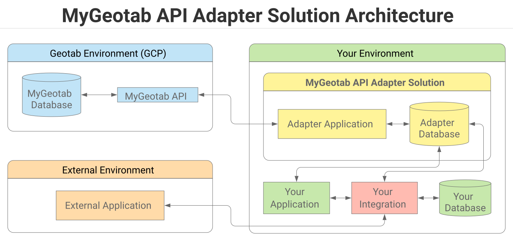
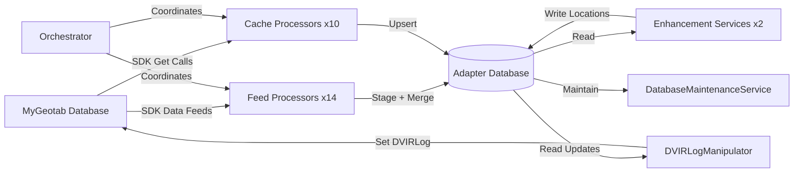
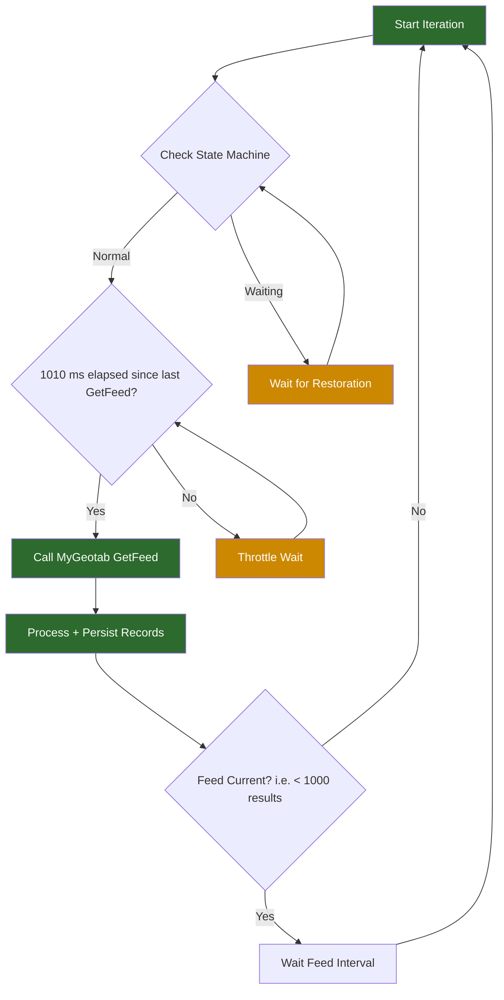
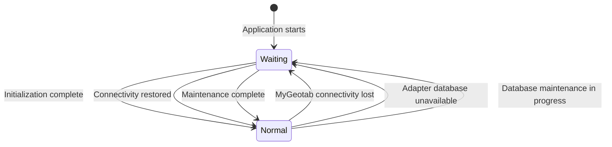
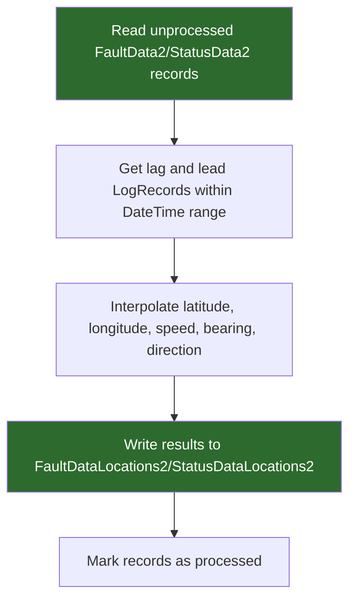
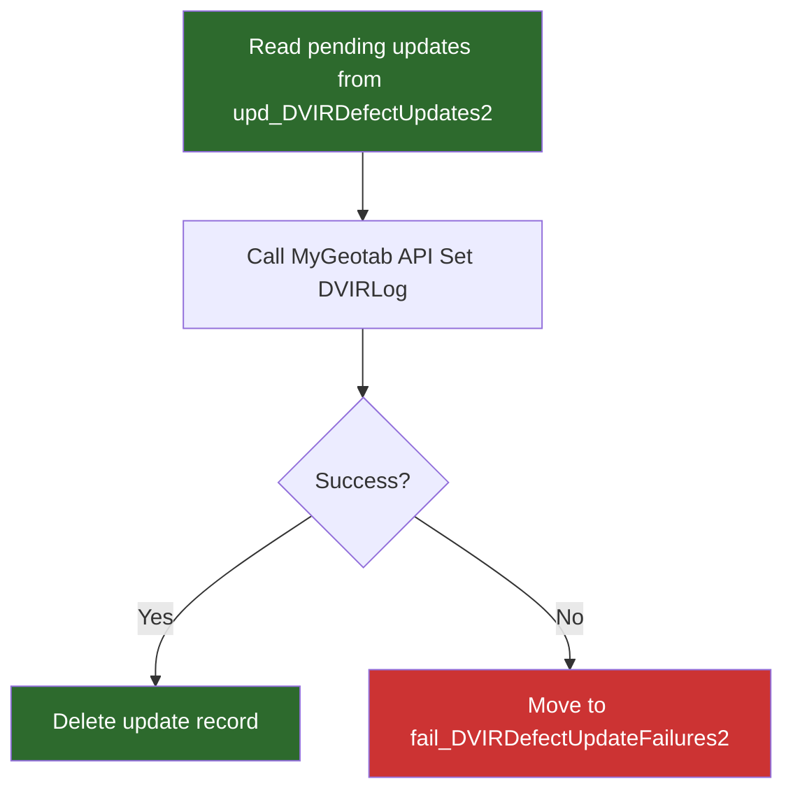

# MyGeotab API Adapter

**Current Version:** 5.0.0.1 | [Change Log](CHANGELOG.md)

> **Using AI to query your adapter database?** See [Section 8.6 AI-Assisted SQL Generation](#86-ai-assisted-sql-generation) for guidance on which files to provide as context to your LLM and key points that ensure accurate query results.

The [MyGeotab API Adapter](https://github.com/Geotab/mygeotab-api-adapter) is a free, open source .NET 10.0 (C#) application that downloads data from a MyGeotab database and writes it to a local SQL Server or PostgreSQL database. It uses the [MyGeotab SDK](https://geotab.github.io/sdk/) data feeds to pull the most common data sets incrementally, streaming them into tables that can serve as the foundation for downstream integrations with external systems.

The MyGeotab API Adapter supports both **SQL Server** and **PostgreSQL** databases and runs on Windows, Linux, or macOS. It is published using the self-contained deployment model — no pre-installation of the .NET runtime is required.

For developers, the solution serves as both an example of proper MyGeotab API integration via data feeds and a ready-to-use starting point for building new integrations with the Geotab platform.

### Data Model 2 (DM2)

The adapter database uses Data Model 2 (DM2), which is reflected in the "2" suffix on all table names (e.g., `LogRecords2`, `Devices2`). DM2 replaced the original data model (deprecated in version 4.0.0), which served only as a staging database where raw data was deposited for further ETL processing downstream.

DM2 is designed for greater performance, scalability and maintainability:

- **Normalized with indexes and relationships** between tables.
- **Numeric primary keys** — where possible, the string values of Geotab [Entity](https://developers.geotab.com/myGeotab/apiReference/objects/Entity) Ids are converted to their underlying numeric values and used as the primary key, facilitating fast queries even with many joins and large data volumes. See the ["GeotabId" and "id" Columns](SCHEMA_REFERENCE.md#geotabid-and-id-columns) section in SCHEMA_REFERENCE.md for more information.
- **Partitioned tables** — high-volume "feed data" tables are partitioned by month, week, or day. See [Section 3.6 Automated Database Maintenance](#36-automated-database-maintenance) for details.
- **Automated database maintenance** — built-in index optimization and statistics updates keep query performance strong as data volumes grow.

With DM2, it is possible to achieve fast throughput speed while also providing the ability to query the data with fast results even with large data volumes.

### MyGeotab API Adapter Highlights

When contemplating a new MyGeotab integration, there are many potential options. This section identifies some key features of the MyGeotab API Adapter solution which may serve both to highlight the benefit of its use as well as to identify likely requirements for a new integration being built from scratch.

In contrast to starting a brand new integration from the ground up, the most obvious benefit of utilizing the adapter solution is that it's already available and open source on [GitHub](https://github.com/Geotab/mygeotab-api-adapter). So, it can be used as-is, or modified as necessary to meet specific requirements. A custom-built solution will most likely need to incorporate many of the features that are built into the MyGeotab API Adapter. Thus, at a bare minimum, the solution can serve to demonstrate ways by which such requirements may be implemented.

Highlights of the MyGeotab API Adapter solution are as follows:

- **Efficiency** — The number of MyGeotab API calls is minimized via data feeds and caching. Chattiness with the adapter database is also minimized. Asynchronous methods and parallel processing are incorporated where possible.
- **Data Integrity** — Feed tokens are tracked and persisted. Write operations are executed within transactions to ensure all-or-none processing. Feeds continue from the last feed versions upon restart. Safeguards are in place to prevent missing or duplicating data or inadvertently mixing data from multiple MyGeotab databases.
- **Data Feeds** — Fourteen data feed processors pull incremental data from MyGeotab, and ten cache processors maintain up-to-date reference data. Each processor runs independently and can be enabled or disabled individually.
- **Data Enhancement** — Location interpolation services enrich FaultData and StatusData records with latitude, longitude, speed, bearing, and compass direction by interpolating from nearby GPS log records.
- **Database-Agnosticity** — Both SQL Server and PostgreSQL are supported. The [Dapper](https://github.com/DapperLib/Dapper) ORM is used to map .NET objects to database rows, and a repository pattern separates data-access code from application logic.
- **Configurability** — Via `appsettings.json`, individual feeds and caches can be enabled or disabled, polling intervals can be tuned, device and diagnostic filtering can be applied, and data enhancement services can be independently controlled.
- **Resilience** — A state machine monitors connectivity to both MyGeotab and the adapter database. When connectivity is lost, the adapter transitions to a waiting state, polls for restoration, and resumes processing where it left off. Database operations use [Polly](https://github.com/App-vNext/Polly) retry policies for transient failure handling.
- **Deployment Model** — The adapter is published using the self-contained deployment model, targeting Windows 64-bit (win-x64), Linux 64-bit (linux-x64), macOS Intel (osx-x64), and macOS Apple Silicon (osx-arm64) runtimes.
- **Logging** — [NLog](https://nlog-project.org/) is incorporated as the logging mechanism, with log messages added strategically to assist with debugging and monitoring once the solution has been deployed.
- **Code Readability and Reusability** — One of the primary objectives in developing this solution was to ensure maximum reusability. Effort has been made to ensure extensive code commenting throughout in order to assist integrators. Generic classes are used where possible — for example, a single Generic Geotab Object Feeder class handles data feed extraction for all entity types, and a single Generic Entity Persister handles database writes for all entity types.

This document provides detailed information about the MyGeotab API Adapter along with instructions related to its deployment.

> **Important:** The MyGeotab API Adapter requires MyGeotab credentials with all "View" clearances enabled. It is recommended that a dedicated Service Account be set up for this purpose and assigned to the **Company Group**. See the [Service Account Guidelines](https://docs.google.com/document/d/1KXJY3S6xyTjp9-qLgxo4PTedQjEuxrqKDlVWgfcC_lc/edit#heading=h.flbpi6nh4xjx) document for more details.

> **Tip:** This document is written in Markdown. You can render it in any Markdown viewer, paste it into Google Docs or Microsoft Word, or view it directly on GitLab/GitHub. Mermaid diagrams require a Mermaid-compatible renderer (GitLab, GitHub, VS Code with extensions, etc.).

## Table of Contents

1. [Quick Start Guide](#1-quick-start-guide)
   - [1.1 Prerequisites](#11-prerequisites) · [1.2 Download](#12-download) · [1.3 Database Setup](#13-database-setup) · [1.4 Deploy and Configure the Application](#14-deploy-and-configure-the-application)
2. [Architecture Overview](#2-architecture-overview)
   - [End-to-End Data Flow](#end-to-end-data-flow) · [Services](#services) · [Data Feed Processing Model](#data-feed-processing-model) · [State Machine](#state-machine) · [Cache Processing Model](#cache-processing-model) · [Database Schema](#database-schema) · [Project Structure](#project-structure)
3. [Operator Guide](#3-operator-guide)
   - [3.1 Data Feed Concepts](#31-data-feed-concepts) · [3.2 Device and Diagnostic Filtering](#32-device-and-diagnostic-filtering) · [3.3 Minimum Interval Sampling](#33-minimum-interval-sampling) · [3.4 Data Enhancement Services](#34-data-enhancement-services) · [3.5 DVIRLog Manipulator](#35-dvirlog-manipulator) · [3.6 Automated Database Maintenance](#36-automated-database-maintenance) · [3.7 Monitoring](#37-monitoring) · [3.8 Distributed Deployment](#38-distributed-deployment)
4. [Configuration Guide](#4-configuration-guide)
   - [Environment Variables for Sensitive Settings](#environment-variables-for-sensitive-settings) · [4.1 OverrideSettings](#41-overridesettings) · [4.2 DatabaseSettings](#42-databasesettings) · [4.3 LoginSettings](#43-loginsettings) · [4.4 GeneralSettings](#44-generalsettings) · [4.5 Caches](#45-caches) · [4.6 GeneralFeedSettings](#46-generalfeedsettings) · [4.7 Feeds](#47-feeds) · [4.8 DataEnhancementServices](#48-dataenhancementservices) · [4.9 Manipulators](#49-manipulators) · [4.10 nlog.config](#410-nlogconfig)
5. [Troubleshooting Guide](#5-troubleshooting-guide)
   - [5.1 Data Not Appearing in Database](#51-data-not-appearing-in-database) · [5.2 Enhancement Service Issues](#52-enhancement-service-issues) · [5.3 DVIR Manipulation Issues](#53-dvir-manipulation-issues) · [5.4 Service Not Starting](#54-service-not-starting) · [5.5 Automated Database Maintenance Issues](#55-automated-database-maintenance-issues) · [5.6 MyGeotab Connectivity Issues](#56-mygeotab-connectivity-issues) · [5.7 Database Connectivity Issues](#57-database-connectivity-issues)
6. [API Reference](#6-api-reference)
   - [6.1 MyGeotab Data Feed Types](#61-mygeotab-data-feed-types) · [6.2 MyGeotab Cache Types](#62-mygeotab-cache-types) · [6.3 Data Enhancement Mappings](#63-data-enhancement-mappings) · [6.4 MyGeotab API Methods Used](#64-mygeotab-api-methods-used)
7. [Database Schema Reference](#7-database-schema-reference)
   - [7.1 Tables and Processors](#71-tables-and-processors) · [7.2 Database Setup](#72-database-setup)
8. [Best Practices for Querying the Adapter Database](#8-best-practices-for-querying-the-adapter-database)
   - [8.1 Future-Proofing Queries Against Changes to Diagnostic Ids](#81-future-proofing-queries-against-changes-to-diagnostic-ids) · [8.2 Using NOLOCK and READ UNCOMMITTED (SQL Server)](#82-using-nolock-and-read-uncommitted-sql-server) · [8.3 Leveraging System Tables and Catalogs](#83-leveraging-system-tables-and-catalogs) · [8.4 Incorporating DateTime Ranges for Partition Pruning](#84-incorporating-datetime-ranges-for-partition-pruning) · [8.5 Avoiding Unnecessary Transactions](#85-avoiding-unnecessary-transactions) · [8.6 AI-Assisted SQL Generation](#86-ai-assisted-sql-generation)
9. [Query Examples](#9-query-examples)
   - [9.1 BinaryData Queries](#91-binarydata-queries) · [9.2 DeviceStatusInfo Queries](#92-devicestatusinfo-queries) · [9.3 DriverChange Queries](#93-driverchange-queries) · [9.4 DutyStatusAvailability Queries](#94-dutystatusavailability-queries) · [9.5 DVIRLog Queries](#95-dvirlog-queries) · [9.6 ExceptionEvent Queries](#96-exceptionevent-queries) · [9.7 FaultData Queries](#97-faultdata-queries) · [9.8 FuelAndEnergyUsed Queries](#98-fuelandenergyused-queries) · [9.9 Group Queries](#99-group-queries) · [9.10 StatusData Queries](#910-statusdata-queries) · [9.11 Trip Queries](#911-trip-queries)
10. [Developer Guide](#10-developer-guide)
    - [10.1 Prerequisites](#101-prerequisites) · [10.2 Building from Source](#102-building-from-source) · [10.3 Development Configuration](#103-development-configuration) · [10.4 Running Tests](#104-running-tests) · [10.5 Code Architecture](#105-code-architecture)
11. [Reference Materials](#11-reference-materials)
    - [MyGeotab API](#mygeotab-api) · [Videos](#videos) · [Geotab DIG Adapter](#geotab-dig-adapter) · [Feedback](#feedback)

---

## 1. Quick Start Guide

High-level steps are shown in the following table with details provided in the subsections below.

| Step | Detail |
|------|--------|
| 1 | **Ensure that Prerequisites are Met:** Ensure that all prerequisites are met. See [1.1 Prerequisites](#11-prerequisites) for details. |
| 2 | **Download the MyGeotab API Adapter:** Download the MyGeotab API Adapter application and database scripts. See [1.2 Download](#12-download) for details.<br><br>**Watch video:** ▶️ [How to Download the MyGeotab API Adapter](https://drive.google.com/file/d/18ybU8AdUZLjv4LWG90l-0D4X6-g5E6a9/view?usp=sharing) |
| 3 | **Set Up the Adapter Database:** Set up the adapter database. See [1.3 Database Setup](#13-database-setup) for details.<br><br>**Watch video:** ▶️ [How to Set Up the MyGeotab API Adapter Database](https://drive.google.com/file/d/1GgkOSNGG9SvmEs9oyIzVcYYSc6z7HBxc/view?usp=drive_link) |
| 4 | **Deploy and Configure the Application:** Deploy and configure the MyGeotab API Adapter application. See [1.4 Deploy and Configure the Application](#14-deploy-and-configure-the-application) for details.<br><br>**Watch videos:**<br>▶️ [How to Deploy and Configure the MyGeotab API Adapter Application](https://drive.google.com/file/d/1p0t37xHBWudFviYmmV-bWteUAbg77xgH/view?usp=drive_link)<br>▶️ [How to Start the MyGeotab API Adapter Application](https://drive.google.com/file/d/17ElhV8cPYJbbloXdci98L_8e2KSMW0Lu/view?usp=drive_link)<br>▶️ [How to Upgrade the MyGeotab API Adapter](https://drive.google.com/file/d/1eYDU7cw49S2hHYZYfOp9p26Yszq67wz6/view?usp=drive_link)<br>▶️ [How to Install the MyGeotab API Adapter as a Windows Service](https://drive.google.com/file/d/14CdkaAwkSVwsX5MavN1F71LTVDhOpd2P/view?usp=drive_link) |

### 1.1 Prerequisites

The MyGeotab API Adapter requires the following:

| Item | Detail |
|------|--------|
| MyGeotab Credentials | A MyGeotab service account with the required clearances (listed below), assigned to the **Company Group**. It is recommended that a dedicated service account be created for this purpose. See the [Service Account Guidelines](https://docs.google.com/document/d/1KXJY3S6xyTjp9-qLgxo4PTedQjEuxrqKDlVWgfcC_lc/edit#heading=h.flbpi6nh4xjx) document for more details. |
| Operating System | Windows 64-bit (win-x64), Linux 64-bit (linux-x64), or macOS (osx-x64 / osx-arm64). The deployment packages are self-contained and include the .NET runtime, libraries and dependencies needed to run on the respective platforms. There is no need to pre-install the .NET runtime. |
| Database | **SQL Server** or **PostgreSQL**. The solution was developed and tested with SQL Server 2019 and PostgreSQL 16. It is recommended to use a version equal to or greater than these. Cloud-based versions (Google Cloud SQL, Amazon RDS, Azure) are also likely to be suitable, although Geotab cannot provide support for them. In Azure, if SQL Server is chosen, **Azure SQL Database** is not supported due to the adapter database being partitioned — use **Azure SQL Managed Instance** or **SQL Server on a VM** instead. It is recommended to have access to [SQL Server Management Studio](https://docs.microsoft.com/en-us/sql/ssms/download-sql-server-management-studio-ssms) or [pgAdmin](https://www.pgadmin.org/) to view data that the adapter writes to the database. |
| Networking / Firewall | The application must be able to make requests over HTTPS to the MyGeotab server (e.g. `https://my.geotab.com/`). If the application and database reside on separate servers, appropriate networking steps must be taken to ensure connectivity. |

**Required MyGeotab clearances for the service account:**

| Clearance |
|-----------|
| Audit log |
| List devices |
| List Users/Drivers |
| View Asset Inspection logs |
| View binary data |
| View device status information |
| View engine diagnostics |
| View engine failure modes |
| View engine measurement related features |
| View engine units of measurement |
| View exception rules |
| View exceptions |
| View groups |
| View trailers |
| View zones |

> **Note:** If the DVIRLogManipulator service is enabled, the MyGeotab user associated with the `RepairUserId` must also have **"Mark Asset Inspection logs as repaired"** and **"Administer Asset Inspection logs"** clearances. See [Section 3.5 DVIRLog Manipulator](#35-dvirlog-manipulator) for details.

### 1.2 Download

**Watch video:** ▶️ [How to Download the MyGeotab API Adapter](https://drive.google.com/file/d/18ybU8AdUZLjv4LWG90l-0D4X6-g5E6a9/view?usp=sharing)

The latest version of the MyGeotab API Adapter is available on GitHub as a pre-published release that can be deployed to Windows, Linux, or macOS systems and use either PostgreSQL or SQL Server to store data extracted from the Geotab platform. Download instructions are as follows:

1. Go to [https://github.com/Geotab/mygeotab-api-adapter/releases](https://github.com/Geotab/mygeotab-api-adapter/releases)
2. The latest release will be shown first (at the top of the page). Scroll down to the **Assets** section and download the required files.

#### Application

| Operating System | File to Download |
|------------------|------------------|
| Windows 64-bit | `MyGeotabAPIAdapter_SCD_win-x64.zip` |
| Linux 64-bit | `MyGeotabAPIAdapter_SCD_linux-x64.zip` |
| macOS (Intel) | `MyGeotabAPIAdapter_SCD_osx-x64.zip` |
| macOS (Apple Silicon) | `MyGeotabAPIAdapter_SCD_osx-arm64.zip` |

#### Database Scripts

| Database | File to Download |
|----------|------------------|
| SQL Server | `SQLServer.zip` |
| PostgreSQL | `PostgreSQL.zip` |

> **Tip:** Developers working from source code can find the database scripts in `MyGeotabAPIAdapter/Scripts/SQLServer/v2/` (SQL Server) and `MyGeotabAPIAdapter/Scripts/PostgreSQL/v2/` (PostgreSQL).

### 1.3 Database Setup

**Watch video:** ▶️ [How to Set Up the MyGeotab API Adapter Database](https://drive.google.com/file/d/1GgkOSNGG9SvmEs9oyIzVcYYSc6z7HBxc/view?usp=drive_link)

Out-of-the-box, the MyGeotab API Adapter supports SQL Server and PostgreSQL for use as the database into which data retrieved via the MyGeotab API is written, as described in the [Prerequisites](#11-prerequisites) section. Database setup procedures differ depending on the type of database chosen.

Follow the complete setup procedure in [Section 7.2 Database Setup](#72-database-setup) using the scripts from the downloaded database script zip file (see [Section 1.2 Download](#12-download)). This covers creating the database, the `geotabadapter_client` database user, partition setup, and executing the schema creation script.

### 1.4 Deploy and Configure the Application

**Watch videos:**
- ▶️ [How to Deploy and Configure the MyGeotab API Adapter Application](https://drive.google.com/file/d/1p0t37xHBWudFviYmmV-bWteUAbg77xgH/view?usp=drive_link)
- ▶️ [How to Start the MyGeotab API Adapter Application](https://drive.google.com/file/d/17ElhV8cPYJbbloXdci98L_8e2KSMW0Lu/view?usp=drive_link)
- ▶️ [How to Upgrade the MyGeotab API Adapter](https://drive.google.com/file/d/1eYDU7cw49S2hHYZYfOp9p26Yszq67wz6/view?usp=drive_link)
- ▶️ [How to Install the MyGeotab API Adapter as a Windows Service](https://drive.google.com/file/d/14CdkaAwkSVwsX5MavN1F71LTVDhOpd2P/view?usp=drive_link)

#### Step 1: Deployment Prerequisites

Before deploying, ensure:

1. **Permission** has been granted by the owner of the MyGeotab database with which the adapter will be interacting.
2. A **MyGeotab service account** with all "View" clearances has been created (see [Prerequisites](#11-prerequisites)).
3. Appropriate steps (networking, firewall, etc.) have been taken to ensure **connectivity** to the MyGeotab server.
4. The **database setup** has been completed per the instructions in [Section 1.3 Database Setup](#13-database-setup).
5. The server hosting the adapter database has enough **disk space** and a database maintenance strategy is implemented to prevent unlimited growth.

#### Step 2: Install the Application

The MyGeotab API Adapter is packaged as a self-contained application that includes the .NET runtime and all dependencies. To install:

1. Copy the zip file containing the application that was [downloaded](#12-download) earlier to the desired location and extract the contents.

#### Step 3: Configure the Application

The deployment folder contains two configuration files: `appsettings.json` and `nlog.config`.

1. Modify **`appsettings.json`** as needed. See the [Section 4 Configuration Guide](#4-configuration-guide) for details on all settings. At minimum, configure:
   - **`DatabaseSettings`** — database provider type and connection string (see [Section 4.2 DatabaseSettings](#42-databasesettings))
   - **`LoginSettings`** — MyGeotab server, database, and credentials (see [Section 4.3 LoginSettings](#43-loginsettings))
   - **`Feeds`** — enable the data feeds you want to process (see [Section 4.7 Feeds](#47-feeds))
2. Review **`nlog.config`** and adjust logging settings if needed (see [Section 4.10 nlog.config](#410-nlogconfig)).

#### Step 4: Run the Application

##### Option 1: Run Manually

For testing purposes, or in cases where there is a desire to only run the adapter for a limited period of time (e.g. to collect some data for ad-hoc analysis), the application can be launched by simply running the executable directly:

- **Windows:** `MyGeotabAPIAdapter.exe`
- **Linux / macOS:** `./MyGeotabAPIAdapter`

##### Option 2: Install as a Service

For continuous operation in a production environment, install the application as a service.

**Windows:** (▶️ [How to Install the MyGeotab API Adapter as a Windows Service](https://drive.google.com/file/d/14CdkaAwkSVwsX5MavN1F71LTVDhOpd2P/view?usp=drive_link))

Open PowerShell or Command Prompt as an **Administrator**:

1. Create the service (replace `C:\<path>` with the actual deployment path):
   ```
   sc.exe create MyGeotabAPIAdapter binPath="C:\<path>\MyGeotabAPIAdapter_SCD_win-x64\MyGeotabAPIAdapter.exe"
   ```

2. Start the service:
   ```
   sc.exe start MyGeotabAPIAdapter
   ```

After creating the service, it can be managed (set to start automatically, etc.) from the Services console (`services.msc`). The following commands can also be used:

3. Stop the service:
   ```
   sc.exe stop MyGeotabAPIAdapter
   ```

4. Delete the service:
   ```
   sc.exe delete MyGeotabAPIAdapter
   ```

**Linux (systemd):**

1. Create a service unit file:
   ```
   sudo nano /etc/systemd/system/mygeotabapiadapter.service
   ```

2. Add the following configuration (replacing `<path>` and `<User>` as appropriate):
   ```
   [Unit]
   Description=MyGeotab API Adapter

   [Service]
   ExecStart=/<path>/MyGeotabAPIAdapter_SCD_linux-x64/MyGeotabAPIAdapter
   WorkingDirectory=/<path>/MyGeotabAPIAdapter_SCD_linux-x64
   User=<User>
   Restart=always
   RestartSec=10
   SyslogIdentifier=mygeotab-api-adapter
   Environment=ASPNETCORE_ENVIRONMENT=Production
   Environment=DOTNET_PRINT_TELEMETRY_MESSAGE=false

   [Install]
   WantedBy=multi-user.target
   ```

3. Reload the systemd daemon:
   ```
   sudo systemctl daemon-reload
   ```

4. Enable the service to start on boot:
   ```
   sudo systemctl enable mygeotabapiadapter.service
   ```

5. Start the service:
   ```
   sudo systemctl start mygeotabapiadapter.service
   ```

6. Check the status of the service:
   ```
   sudo systemctl status mygeotabapiadapter.service
   ```

##### Option 3: Scheduled Task / Cron Job

A third option is to set up a Scheduled Task (Windows) or cron job (Linux). However, installing as a service (Option 2) is the recommended approach for production use and is not detailed further here.

#### Next Steps

Once the application is running, proceed to the [Section 3 Operator Guide](#3-operator-guide) to learn about data feeds, filtering, data enhancement services, and monitoring.

---

## 2. Architecture Overview

The following diagram provides an overview of the MyGeotab API Adapter solution architecture.



Geotab does not host the MyGeotab API Adapter. Rather, the solution must be hosted by the Geotab partner/reseller or customer. It consists of two components — the adapter application and the adapter database. The adapter is a collection of .NET 10.0 Background Services (C#) that interface between the MyGeotab API and the database, pulling data from the former and writing to tables in the latter. Each customer MyGeotab database must have a dedicated adapter and database pair; it is not possible to mix data from multiple MyGeotab databases. The Geotab partner/reseller or customer is responsible for integrating between the adapter database and any downstream applications or databases.

The adapter uses the MyGeotab SDK's [data feed](https://geotab.github.io/sdk/software/api/runner.html#sample:data-feed) mechanism to pull incremental data from a MyGeotab database. Each data feed maintains a version (cursor) that tracks the last-processed record, ensuring that only new or changed data is retrieved on each poll.

### End-to-End Data Flow



### Services

The adapter runs 29 hosted background services. Each service runs independently and can be enabled or disabled via configuration. Note that some services depend on others — see [Service Interdependencies](#service-interdependencies) for details.

| # | Service | Type | Purpose | Pauses for DB Maintenance |
|---|---------|------|---------|---------------------------|
| 1 | Orchestrator2 | Orchestration | Application initialization, connectivity monitoring, state machine management | No |
| 2 | DatabaseMaintenanceService2 | Maintenance | Database partitioning, statistics updates, index defragmentation | No |
| 3 | AuditLogProcessor2 | Feed Processor | Pulls audit log entries from MyGeotab | Yes |
| 4 | BinaryDataProcessor2 | Feed Processor | Pulls binary data records from MyGeotab | Yes |
| 5 | ChargeEventProcessor2 | Feed Processor | Pulls EV charging event records from MyGeotab | Yes |
| 6 | DeviceStatusInfoProcessor2 | Feed Processor | Pulls device status information from MyGeotab | Yes |
| 7 | DriverChangeProcessor2 | Feed Processor | Pulls driver change records from MyGeotab | Yes |
| 8 | DutyStatusAvailabilityProcessor2 | Feed Processor | Pulls duty status availability records from MyGeotab | Yes |
| 9 | DutyStatusLogProcessor2 | Feed Processor | Pulls duty status log records from MyGeotab | Yes |
| 10 | DVIRLogProcessor2 | Feed Processor | Pulls DVIR (Daily Vehicle Inspection Report) logs from MyGeotab | Yes |
| 11 | ExceptionEventProcessor2 | Feed Processor | Pulls exception event records from MyGeotab | Yes |
| 12 | FaultDataProcessor2 | Feed Processor | Pulls fault diagnostic records from MyGeotab | Yes |
| 13 | FuelAndEnergyUsedProcessor2 | Feed Processor | Pulls fuel and energy usage records from MyGeotab | Yes |
| 14 | LogRecordProcessor2 | Feed Processor | Pulls GPS log records from MyGeotab | Yes |
| 15 | StatusDataProcessor2 | Feed Processor | Pulls status diagnostic records from MyGeotab | Yes |
| 16 | TripProcessor2 | Feed Processor | Pulls trip records from MyGeotab | Yes |
| 17 | ControllerProcessor2 | Cache Processor | Maintains Controller reference data | No |
| 18 | DeviceProcessor2 | Cache Processor | Maintains Device reference data | Yes |
| 19 | DiagnosticProcessor2 | Cache Processor | Maintains Diagnostic reference data | Yes |
| 20 | FailureModeProcessor2 | Cache Processor | Maintains FailureMode reference data | Yes |
| 21 | GroupProcessor2 | Cache Processor | Maintains Group reference data | Yes |
| 22 | RuleProcessor2 | Cache Processor | Maintains Rule reference data | Yes |
| 23 | UnitOfMeasureProcessor2 | Cache Processor | Maintains UnitOfMeasure reference data | No |
| 24 | UserProcessor2 | Cache Processor | Maintains User reference data | Yes |
| 25 | ZoneProcessor2 | Cache Processor | Maintains Zone reference data | Yes |
| 26 | ZoneTypeProcessor2 | Cache Processor | Maintains ZoneType reference data | Yes |
| 27 | FaultDataLocationService2 | Data Enhancement | Interpolates location data for FaultData records | Yes |
| 28 | StatusDataLocationService2 | Data Enhancement | Interpolates location data for StatusData records | Yes |
| 29 | DVIRLogManipulator2 | Manipulator | Propagates DVIR defect updates from adapter database back to MyGeotab | Yes |

### Data Feed Processing Model

All feed processors follow the same lifecycle pattern. On each iteration, the processor calls the MyGeotab SDK `GetFeed` method with the last-known feed version, maps the returned entities to database objects, and persists them to the database.

When a `GetFeed` call returns fewer than 1,000 records, the feed is considered **current** (up-to-date). When 1,000 or more records are returned, the feed is considered **behind**. After processing and persisting the returned records, the processor checks this status: if the feed is current, it waits for the configured feed interval before the next iteration; if the feed is behind, it immediately starts the next iteration to catch up as quickly as possible. To avoid exceeding the MyGeotab API rate limit (1 request per second per `GetFeed` entity type), a minimum interval of 1,010 ms is enforced between consecutive `GetFeed` calls.



### State Machine

The adapter uses a state machine to coordinate all services. The state machine tracks the overall application state (`Normal` or `Waiting`) along with the reason for any wait condition. All services check the state machine before each processing iteration.



**State reasons:**

| StateReason | Description |
|-------------|-------------|
| `ApplicationNotInitialized` | The Orchestrator has not yet completed initialization tasks |
| `MyGeotabNotAvailable` | The MyGeotab API is unreachable or authentication has failed |
| `AdapterDatabaseNotAvailable` | The adapter database is unreachable |
| `AdapterDatabaseMaintenance` | Level 2 database maintenance is in progress; services pause to avoid contention |
| `NoReason` | Normal operating state — no wait condition is active |

When Level 2 database maintenance is initiated, the `DatabaseMaintenanceService2` requests a pause from the state machine. Each service that participates in maintenance pausing must acknowledge the pause before maintenance proceeds. The only services that do not pause are `Orchestrator2`, `ControllerProcessor2`, and `UnitOfMeasureProcessor2`.

### Cache Processing Model

The cache processors use a two-tier update model to keep reference data current without overloading the MyGeotab API:

- **Incremental updates** run at a short interval (e.g., every 1-10 minutes). The processor calls the MyGeotab `Get` method and upserts any new or changed entities.
- **Full refreshes** run at a longer interval (e.g., every 24 hours or 7 days). The processor retrieves the complete data set and reconciles it with the database, detecting entities that have been removed from MyGeotab.

The `IntervalDailyReferenceStartTimeUTC` setting controls the starting reference point for interval calculations.

### Database Schema

The adapter database uses the `dbo` schema (SQL Server) or `public` schema (PostgreSQL) within a database named `geotabadapterdb`. The database user is `geotabadapter_client`.

Tables are organized into the following categories:

| Category | Examples | Description |
|----------|----------|-------------|
| Feed Data | LogRecords2, StatusData2, FaultData2, Trips2 | Data points collected using data feeds; not modified once written; high-volume tables are partitioned |
| Reference Data | Devices2, Diagnostics2, Groups2, Users2, Zones2 | Reference data maintained by cache processors; only the latest version of each record is maintained |
| Enhanced Data | FaultDataLocations2, StatusDataLocations2 | Populated by services that augment raw feed data (e.g., location interpolation) |
| Commands | upd_DVIRDefectUpdates2 | Used for issuing data manipulation commands to the Geotab platform |
| Command Exceptions | fail_DVIRDefectUpdateFailures2 | Failed command records with error messages for debugging |
| System | OServiceTracking2, MiddlewareVersionInfo2, stg_* | Adapter runtime metadata, staging tables, and configuration state |

See [Section 7 Database Schema Reference](#7-database-schema-reference) for full details.

### Project Structure

The solution contains the following MyGeotab API Adapter projects (the [Geotab DIG Adapter](../GeotabDIGAdapter/README.md) projects share several of these libraries):

| Project | Description |
|---------|-------------|
| MyGeotabAPIAdapter | Main application — hosted services, dependency injection, configuration, SQL scripts |
| MyGeotabAPIAdapter.Configuration | Configuration interfaces, classes, and enums |
| MyGeotabAPIAdapter.Database | Database models, data access (Dapper), caches, entity mappers |
| MyGeotabAPIAdapter.Database.EntityPersisters | Generic entity persistence with bulk insert/update |
| MyGeotabAPIAdapter.Exceptions | Custom exception types |
| MyGeotabAPIAdapter.Geospatial | Compass rose, location interpolation, geospatial helpers |
| MyGeotabAPIAdapter.GeotabObjectMappers | MyGeotab SDK object to database entity mappers |
| MyGeotabAPIAdapter.Helpers | Date/time, exception, string, and general helpers |
| MyGeotabAPIAdapter.Logging | Message and entity persistence logging |
| MyGeotabAPIAdapter.MyGeotabAPI | MyGeotab API helper and authentication |
| MyGeotabAPIAdapter.Tests | xUnit test suite |

---

## 3. Operator Guide

### 3.1 Data Feed Concepts

The MyGeotab API Adapter uses the MyGeotab SDK's [data feed](https://geotab.github.io/sdk/software/api/runner.html#sample:data-feed) mechanism to pull data incrementally. Each data feed maintains a **feed version** (a cursor) that tracks the last-processed record. On each poll, the adapter calls `GetFeed` with the last-known version and receives only new or changed records since that version.

Feed versions are stored in the `OServiceTracking2` table (`LastProcessedFeedVersion` column) and are updated after each successful batch. This allows the adapter to resume from where it left off after a restart.

The `FeedStartOption` setting (see [Section 4.6 GeneralFeedSettings](#46-generalfeedsettings)) controls how feeds initialize:

| FeedStartOption | Behavior |
|-----------------|----------|
| `CurrentTime` | Begins pulling data from the current time forward. Historical data is not retrieved. |
| `SpecificTime` | Begins pulling data from the UTC time specified in `FeedStartSpecificTimeUTC`. |
| `FeedVersion` | Resumes from the stored feed version in `OServiceTracking2`. Use this option after a restart to continue from where the adapter left off. |

#### Service Interdependencies

Individual services can be enabled or disabled using the `Enable<EntityType>Cache` and `Enable<EntityType>Feed` settings. This provides flexibility to download only the desired data. However, there are logical dependencies that must be enforced — for example, LogRecord data is useless without knowing which Device it came from.

When a service starts, it checks whether its prerequisite services are already running. If not, warning messages are written to the log and the service will keep checking until its prerequisites are running. For example, if the StatusDataProcessor has been enabled but the DeviceProcessor and DiagnosticProcessor have not, the log will contain messages like:

> `PAUSING SERVICE: MyGeotabAPIAdapter.StatusDataProcessor2 because of the following: > The prerequisite DeviceProcessor2 and DiagnosticProcessor2 have never been run.`

> **Note:** Because all services start at the same time and some take longer than others to initialize, it is normal to see these messages during the first few minutes after the adapter starts. If services have been enabled appropriately based on the table below, these messages will stop appearing once all services have come online.

The following table lists the direct service dependencies for each service. Note that the listed dependencies may also have their own dependencies.

| Service | Direct Service Dependencies |
|---------|----------------------------|
| AuditLogProcessor2 | UserProcessor2 |
| BinaryDataProcessor2 | DeviceProcessor2 |
| ChargeEventProcessor2 | DeviceProcessor2 |
| ControllerProcessor2 | None |
| DatabaseMaintenanceService2 | None |
| DeviceProcessor2 | None |
| DeviceStatusInfoProcessor2 | DeviceProcessor2, UserProcessor2 |
| DiagnosticProcessor2 | None |
| DriverChangeProcessor2 | DeviceProcessor2, UserProcessor2 |
| DutyStatusAvailabilityProcessor2 | DeviceProcessor2, UserProcessor2 |
| DutyStatusLogProcessor2 | DeviceProcessor2, UserProcessor2 |
| DVIRLogManipulator2 | DVIRLogProcessor2 |
| DVIRLogProcessor2 | DeviceProcessor2, UserProcessor2 |
| ExceptionEventProcessor2 | DeviceProcessor2, RuleProcessor2, UserProcessor2 |
| FailureModeProcessor2 | None |
| FaultDataLocationService2 | None |
| FaultDataProcessor2 | ControllerProcessor2, DeviceProcessor2, DiagnosticProcessor2, FailureModeProcessor2, UserProcessor2 |
| FuelAndEnergyUsedProcessor2 | DeviceProcessor2 |
| GroupProcessor2 | None |
| LogRecordProcessor2 | DeviceProcessor2 |
| Orchestrator2 | None |
| RuleProcessor2 | None |
| StatusDataLocationService2 | None |
| StatusDataProcessor2 | DeviceProcessor2, DiagnosticProcessor2 |
| TripProcessor2 | DeviceProcessor2, UserProcessor2 |
| UnitOfMeasureProcessor2 | None |
| UserProcessor2 | None |
| ZoneProcessor2 | None |
| ZoneTypeProcessor2 | None |

> **Note:** In addition to the dependencies listed above, all services except Orchestrator2 depend on DatabaseMaintenanceService2 having completed its initial startup tasks (including partition management). This universal dependency is not repeated in the table above.

### 3.2 Device and Diagnostic Filtering

By default, the adapter pulls data for all devices and all diagnostics. Use the `DevicesToTrack` and `DiagnosticsToTrack` settings (see [Section 4.6 GeneralFeedSettings](#46-generalfeedsettings)) to narrow the scope:

- **`DevicesToTrack`**: Set to a comma-separated list of MyGeotab Device IDs to include only those devices. Leave as `"*"` for all devices.
- **`DiagnosticsToTrack`**: Set to a comma-separated list of MyGeotab Diagnostic IDs to include only those diagnostics. Leave as `"*"` for all diagnostics.
- **`ExcludeDiagnosticsToTrack`**: When set to `true`, inverts the `DiagnosticsToTrack` list — listed diagnostics are excluded instead of included.

Filtering applies to StatusData, FaultData, and LogRecord feeds.

### 3.3 Minimum Interval Sampling

[LogRecord](https://developers.geotab.com/myGeotab/apiReference/objects/LogRecord) and [StatusData](https://developers.geotab.com/myGeotab/apiReference/objects/StatusData) entities typically account for a very large proportion of the data volume in a MyGeotab database — hundreds of millions of records per day for fleets of over 100K devices, for example. In some cases, this massive data volume may be deemed excessive and there may be a preference to reduce data volume such that data points are no more frequent than one per device every *x* number of seconds. To address this need, "minimum interval sampling" capability has been added to the MyGeotab API Adapter via the **EnableMinimunIntervalSamplingForLogRecords**, **EnableMinimunIntervalSamplingForStatusData**, **MinimumIntervalSamplingDiagnostics** and **MinimumIntervalSamplingIntervalSeconds** settings in the [Section 4.6 GeneralFeedSettings](#46-generalfeedsettings) section of the `appsettings.json` file.

> **Warning:** There is no way to later back-fill data if minimum interval sampling has been used, other than clearing the adapter database, adjusting `appsettings.json`, and re-running the extraction process.

> **Note:** Minimum interval sampling does not ensure records are captured at a regular "polling interval" of one record every *n* seconds. Rather, it ensures that a minimum of *n* seconds exists between the DateTime values of records that are written to the adapter database.

#### Minimum Interval Sampling for LogRecords

With regard to LogRecords, minimum interval sampling is applied on a per-Device basis and can be enabled based on the following rules:

1. **`EnableLogRecordFeed`** must be set to `true`.
2. **`EnableDeviceCache`** must be set to `true`. This is because the LogRecordProcessor requires the DeviceCache to be operational.
3. **`EnableMinimunIntervalSamplingForLogRecords`** must be set to `true`. Otherwise, normal processing of LogRecords will occur.
4. **`MinimumIntervalSamplingIntervalSeconds`** must be set to a value ranging from 1 through 3600.
5. *(Optional)* `DevicesToTrack` can be used to limit the collection of LogRecords to a specific set of devices.

#### Minimum Interval Sampling for StatusData

With regard to StatusData, minimum interval sampling is applied on a per-Device + Diagnostic basis and can be enabled based on the following rules:

1. **`EnableStatusDataFeed`** must be set to `true`.
2. **`EnableDeviceCache`** and **`EnableDiagnosticCache`** must both be set to `true`. This is because the StatusDataProcessor requires the DeviceCache and DiagnosticCache to be operational.
3. **`EnableMinimunIntervalSamplingForStatusData`** must be set to `true`. Otherwise, normal processing of StatusData will occur.
4. **`MinimumIntervalSamplingIntervalSeconds`** must be set to a value ranging from 1 through 3600.
5. **`DiagnosticsToTrack`** must be set to a comma-separated list of Diagnostic IDs. The default wildcard (`*`) value cannot be used if `EnableMinimunIntervalSamplingForStatusData` is set to `true`.
6. **`ExcludeDiagnosticsToTrack`** must be set to `false` if `EnableMinimunIntervalSamplingForStatusData` is set to `true`.
7. **`MinimumIntervalSamplingDiagnostics`** must be set to a comma-separated list of Diagnostic IDs that is either the same as the list provided in `DiagnosticsToTrack`, or a subset thereof. Minimum interval sampling will only be applied to StatusData records with Diagnostic IDs in this list. Normal processing will occur for StatusData records with Diagnostic IDs in `DiagnosticsToTrack` but not in `MinimumIntervalSamplingDiagnostics`.
8. *(Optional)* **`DevicesToTrack`** can be used to limit the collection of StatusData to a specific set of devices.

#### Example Configuration

Take the following example highlighting a specific combination of values in the `appsettings.json` file:

```json
"EnableDeviceCache": true,
"EnableDiagnosticCache": true,
"FeedStartOption": "SpecificTime",
"FeedStartSpecificTimeUTC": "2024-04-01T08:00:00Z",
"DevicesToTrack": "*",
"DiagnosticsToTrack": "DiagnosticOilPressureId,DiagnosticIgnitionId,DiagnosticEngineRoadSpeedId",
"ExcludeDiagnosticsToTrack": false,
"EnableMinimunIntervalSamplingForLogRecords": true,
"EnableMinimunIntervalSamplingForStatusData": true,
"MinimumIntervalSamplingDiagnostics": "DiagnosticOilPressureId,DiagnosticEngineRoadSpeedId",
"MinimumIntervalSamplingIntervalSeconds": 300,
"EnableLogRecordFeed": true,
"EnableStatusDataFeed": true
```

Based on the above setting configuration:

- **LogRecords:**
  - The LogRecords2 table in the adapter database will be populated with data for all devices (that the MyGeotab user configured in the [Section 4.3 LoginSettings](#43-loginsettings) section of `appsettings.json` has access to).
  - The minimum interval between successive LogRecords for a given device will be 300 seconds (5 minutes).
- **StatusData:**
  - The StatusData2 table in the adapter database will be populated with data for all devices (that the MyGeotab user configured in the [Section 4.3 LoginSettings](#43-loginsettings) section of `appsettings.json` has access to).
  - Only StatusData records with the `DiagnosticOilPressureId`, `DiagnosticIgnitionId` and `DiagnosticEngineRoadSpeedId` Diagnostic IDs will be collected.
  - All StatusData records with the `DiagnosticIgnitionId` Diagnostic ID will be collected.
  - For StatusData records with the `DiagnosticOilPressureId` and `DiagnosticEngineRoadSpeedId` Diagnostic IDs, the minimum interval between successive StatusData records for a given device will be 300 seconds (5 minutes).

See [Section 4.6 GeneralFeedSettings](#46-generalfeedsettings) for all related settings.

### 3.4 Data Enhancement Services

The FaultDataLocationService and StatusDataLocationService interpolate geographic location data for FaultData and StatusData records using LogRecord GPS data as a reference.



**Key points:**
- The **LogRecord feed must be enabled** for interpolation to work — LogRecord GPS data is the reference source.
- The `BufferMinutes` setting (default: 1440) delays processing to allow LogRecord data to accumulate before interpolation begins.
- Monitor progress via the `vwStatsForLocationInterpolationProgress` view.
- Operation mode can be `"Continuous"` (runs all the time) or `"Scheduled"` (runs during a daily window).

See [Section 4.8 DataEnhancementServices](#48-dataenhancementservices) for all configuration settings.

### 3.5 DVIRLog Manipulator

The DVIRLogManipulator service provides bidirectional DVIR workflow: the DVIRLog feed pulls DVIR data down from MyGeotab, and the DVIRLogManipulator pushes defect updates back to MyGeotab.



Using the DVIRLog Manipulator, it is possible — without directly using the MyGeotab API — to:

- Add repair remarks to existing DVIRDefects
- Change the repair status of existing DVIRDefects

**End-to-End Bidirectional Workflow Scenario:**

A practical example where the DVIRLog Manipulator could be used is an integration between Geotab and an enterprise asset management (EAM) system. In this scenario:

| Step | Detail |
|------|--------|
| 1 | Using the Geotab Drive app, drivers completing vehicle inspection reports (DVIRs) log any defects that they discover. |
| 2 | The MyGeotab API Adapter's DVIRLog processor retrieves the DVIRLogs and writes them to tables (`DVIRLogs2`, `DVIRDefects2`, `DVIRDefectRemarks2`) in the adapter database. |
| 3 | A third-party integration service extracts the defect information from the adapter database and generates repair work orders in the EAM system. |
| 4 | As repair remarks are added to the work orders in the EAM and when the repair orders are closed upon completion of corrective maintenance activities, the third-party integration service writes these remarks and updates to the `upd_DVIRDefectUpdates2` table in the adapter database. |
| 5 | The DVIRLog Manipulator service captures the repair remarks and status updates as they are written to the `upd_DVIRDefectUpdates2` table and makes the appropriate updates to the corresponding DVIRLogs in the Geotab system. |
| 6 | Drivers using the Geotab Drive app as well as supervisors and fleet managers using the MyGeotab web-based application are able to keep up-to-date on the status of repairs as updates flow from the EAM system into the Geotab system via this workflow. |

The above workflow is illustrated with diagrams in the [DVIRLog Manipulator section](https://docs.google.com/presentation/d/1PhsDhZwj23i2oWXrqZozf4h0svUEHZLnFXtzMYyk4kQ/edit#slide=id.g79aa91c757_2_74) of the MyGeotab API Adapter presentation.

**Usage:**

1. Enable the DVIRLog feed (`EnableDVIRLogFeed: true` — see [Section 4.7 Feeds](#47-feeds)).
2. Enable the DVIRLogManipulator (`EnableDVIRLogManipulator: true` — see [Section 4.9 Manipulators](#49-manipulators)).
3. Insert DVIR defect update records into the `upd_DVIRDefectUpdates2` table per the rules below.

**Rules for Insertion Into the `upd_DVIRDefectUpdates2` Table:**

| Rule | Detail |
|------|--------|
| 1 | Values must always be provided for the `DVIRLogId`, `DVIRDefectId` and `RecordCreationTimeUtc` fields. |
| 2 | The value provided for `DVIRLogId` must correspond to the `id` of the record in the DVIRLogs2 table which represents the DVIRLog to be updated. |
| 3 | The value provided for `DVIRDefectId` must correspond to the `id` of the record in the DVIRDefects2 table which represents the DVIRDefect to be updated. |
| 4 | **To add a remark** to a DVIRDefect: Values must be provided for the `Remark`, `RemarkDateTimeUtc` and `RemarkUserId` fields. |
| 5 | **To update the repair status** of a DVIRDefect: Values must be provided for the `RepairDateTimeUtc`, `RepairStatusId` and `RepairUserId` fields. |
| 6 | **To add a remark and update the repair status** at the same time: Values must be provided for the `Remark`, `RemarkDateTimeUtc`, `RemarkUserId`, `RepairDateTimeUtc`, `RepairStatusId` and `RepairUserId` fields. |
| 7 | The `RepairStatusId` of a DVIRDefect **cannot be changed** once it has been set to `1` (Repaired) or `2` (NotNecessary). |
| 8 | The only values that may be supplied for `RepairStatusId` are `1` (Repaired) or `2` (NotNecessary) — other than `null` when only a repair remark is to be added. |
| 9 | Values provided for `RepairUserId` and `RemarkUserId` must correspond to the `id` values of records in the Users2 table which represent valid User Ids in the MyGeotab database. The User associated with `RepairUserId` must have **"Mark Asset Inspection logs as repaired"** and **"Administer Asset Inspection logs"** clearances. The User associated with `RemarkUserId` must have **"Perform Asset Inspections"** and **"Administer Asset Inspection logs"** clearances. |

**Feedback and Exceptions:**

DVIRLog updates made by the DVIRLogManipulator service are captured by the DVIRLog Processor and written to the adapter database as updates to the DVIRLogs2, DVIRDefects2 and DVIRDefectRemarks2 tables. Records that have been processed are deleted from the `upd_DVIRDefectUpdates2` table.

Any rows in `upd_DVIRDefectUpdates2` that do not pass validation checks or for which exceptions are encountered will be copied to the `fail_DVIRDefectUpdateFailures2` table before being deleted from `upd_DVIRDefectUpdates2`. The `FailureMessage` column provides details about the reason why a given command failed.

> **Warning:** Rows are never deleted from the `fail_DVIRDefectUpdateFailures2` table. It is up to the integrator to delete rows from this table once the error messages have been evaluated and appropriate actions have been taken.

### 3.6 Automated Database Maintenance

There are many indexes on tables within the adapter database. These indexes facilitate high-performance querying, but become fragmented over time, leading to performance degradation if no maintenance is performed. The `DatabaseMaintenanceService2` provides automated database maintenance capabilities — including database partitioning and index maintenance — without the need for regular manual intervention. This should enable performance to remain strong even with millions or billions of records in the different tables.

> **Note:** If technical resources with sufficient database maintenance knowledge are available and there is a desire to implement more-advanced database maintenance strategies, the `EnableLevel1DatabaseMaintenance` and `EnableLevel2DatabaseMaintenance` settings in [Section 4.2 DatabaseSettings](#42-databasesettings) can be used to disable the built-in capabilities. However, partition management cannot be disabled.

#### Partition Management

The `spManagePartitions` stored procedure (SQL Server) or function (PostgreSQL) is executed once daily by `DatabaseMaintenanceService2`. Each time it is executed, partitions will be created as needed up to and including for the month following that of the current day. This ensures that partitions will always be in-place when they are needed for any incoming data.

- Partitions are created on a monthly, weekly, or daily basis depending on the initial configuration.
- `DBPartitionInfo2` stores the initial partition parameters.

**Choosing the Right Partition Interval:**

| Fleet Size | Recommended Partition Interval |
|------------|-------------------------------|
| Up to low thousands | `monthly` |
| Low to mid tens of thousands | `weekly` |
| Mid tens of thousands and over | `daily` |

> **Note:** The suggested partition interval choices above are only general guidelines and may not be ideal for any specific fleet. It may be a worthwhile exercise to set up a test environment and experiment with the different partition intervals to see which one results in better query performance once a significant amount of data has been collected.

#### Level 1 Maintenance (Non-Interfering)

Level 1 database maintenance involves unobtrusive operations that can be executed while the adapter is online and operating normally. It is configured via the `EnableLevel1DatabaseMaintenance` and `Level1DatabaseMaintenanceIntervalMinutes` settings in [Section 4.2 DatabaseSettings](#42-databasesettings). Level 1 maintenance utilizes the `vwStatsForLevel1DBMaintenance` view.

**PostgreSQL:**

- **VACUUM and ANALYZE:** Performed on tables meeting any of these criteria:
  - Dead tuple ratio greater than 0.2
  - Over 1,000 dead tuples
- **ANALYZE Only:** Performed on tables where the modification ratio since the last analysis is greater than 0.1.

**SQL Server:**

- **UPDATE STATISTICS:** Performed on tables where the modification ratio since the last analysis is greater than 0.1.

#### Level 2 Maintenance (Interfering)

Level 2 database maintenance involves rebuilding indexes, which is more obtrusive and must be done within a database maintenance window during which adapter services are paused to avoid contention. It is configured via the `EnableLevel2DatabaseMaintenance`, `Level2DatabaseMaintenanceIntervalMinutes`, `Level2DatabaseMaintenanceWindowStartTimeUTC` and `Level2DatabaseMaintenanceWindowMaxMinutes` settings in [Section 4.2 DatabaseSettings](#42-databasesettings). Level 2 maintenance utilizes the `vwStatsForLevel2DBMaintenance` view.

When Level 2 maintenance is initiated, all participating services are paused via the state machine before maintenance proceeds. It can optionally be restricted to a daily time window.

**PostgreSQL:**

- **REINDEX:** Performed on indexes that are over 1,000 bytes in size and have a bloat ratio greater than 0.3.

**SQL Server:**

- **REBUILD Entire Index:** An entire index is rebuilt if more than half of its partitions are over 30 percent fragmented.
- **REBUILD Index Partition:** An index partition is rebuilt if it is over 30 percent fragmented (and not already captured as part of an entire index rebuild).
- **REORGANIZE Index:** An index partition (or an entire index if there is only one partition) is reorganized if it is between 10 and 30 percent fragmented (and not already captured as part of an entire index rebuild).

#### Longer-Term Data Retention Strategy

Despite the database partitioning and automated maintenance capabilities offered, if the adapter is being deployed as part of a longer-term solution, it will be necessary to plan and implement a data retention strategy. Performance will degrade over time as data volumes grow if left unchecked. Additionally, the associated data storage costs may become significant — particularly in cloud environments.

The fact that the adapter database is partitioned lends well to data retention strategies as it is much easier to separate older data by partition. For example, to keep only the last 12 months of data in the adapter database and archive older data:

**PostgreSQL:**

1. Identify and detach partitions older than 12 months from the parent tables.
2. Backup the old partitions (to CSV, to an archive database, or using `pg_dump`).
3. Drop the detached partitions after successful backup.
4. Run `ANALYZE` and `VACUUM FULL` for cleanup and performance.

**SQL Server:**

1. Identify partitions older than 12 months and switch them to archive tables.
2. Backup the archive tables (using SQL Backup or export to CSV).
3. Drop the old partitions from the partition function.

> **Warning:** It is possible for the database to grow very large very quickly, resulting in potential disk space and performance issues. For example, running the adapter against a MyGeotab database with a fleet of ~20,000 devices and pulling data for all supported feeds could result in a PostgreSQL database growing to ~40 GB in size within 7 days, including ~225,000,000 StatusData, ~65,000,000 LogRecord and ~10,000,000 Trip records.

See [Section 4.2 DatabaseSettings](#42-databasesettings) for maintenance configuration.

### 3.7 Monitoring

The `OServiceTracking2` table provides real-time insight into service health.

**SQL Server:**

```sql
SELECT TOP 100
    ServiceId,
    AdapterVersion,
    AdapterMachineName,
    EntitiesLastProcessedUtc,
    LastProcessedFeedVersion,
    RecordLastChangedUtc
FROM [dbo].[OServiceTracking2] WITH (NOLOCK)
ORDER BY ServiceId;
```

**PostgreSQL:**

```sql
SELECT
    "ServiceId",
    "AdapterVersion",
    "AdapterMachineName",
    "EntitiesLastProcessedUtc",
    "LastProcessedFeedVersion",
    "RecordLastChangedUtc"
FROM "OServiceTracking2"
ORDER BY "ServiceId"
LIMIT 100;
```

**Location interpolation progress:**

**SQL Server:**

```sql
SELECT * FROM [dbo].[vwStatsForLocationInterpolationProgress] WITH (NOLOCK);
```

**PostgreSQL:**

```sql
SELECT * FROM "vwStatsForLocationInterpolationProgress";
```

**Aggregated record counts by table:**

**SQL Server:**

```sql
SELECT t.name AS TableName,
    SUM(p.rows) AS RecordCount
FROM sys.tables t
JOIN sys.partitions p ON t.object_id = p.object_id
WHERE t.type = 'U'
    AND p.index_id IN (0, 1)
GROUP BY t.name
ORDER BY t.name;
```

**PostgreSQL:**

```sql
WITH partitioned_tables AS (
    SELECT part.relname AS parent_table,
        child.relname AS partition_table
    FROM pg_partitioned_table p
    JOIN pg_class part ON p.partrelid = part.oid
    JOIN pg_inherits i ON part.oid = i.inhparent
    JOIN pg_class child ON i.inhrelid = child.oid
    WHERE part.relname NOT LIKE 'pg_%'
        AND part.relname NOT LIKE 'sql_%'
        AND child.relname NOT LIKE 'pg_%'
        AND child.relname NOT LIKE 'sql_%'
),
table_counts AS (
    SELECT relname AS table_name,
        coalesce(SUM(n_live_tup), 0) AS record_count
    FROM pg_stat_all_tables
    WHERE relname NOT LIKE 'pg_%'
        AND relname NOT LIKE 'sql_%'
    GROUP BY relname
)
SELECT
    CASE
        WHEN pt.parent_table IS NOT NULL THEN pt.parent_table
        ELSE tc.table_name
    END AS TableName,
    SUM(tc.record_count) AS RecordCount
FROM table_counts tc
LEFT JOIN partitioned_tables pt ON tc.table_name = pt.partition_table
GROUP BY TableName
ORDER BY TableName;
```

**Record counts by partition:**

**SQL Server:**

```sql
WITH PartitionInfo AS (
    SELECT (SCHEMA_NAME(A.schema_id) + '.' + A.Name) AS TableName,
        B.partition_number AS PartitionNumber,
        B.row_count AS RecordCount,
        FG.name AS FileGroupName,
        ROW_NUMBER() OVER (PARTITION BY SCHEMA_NAME(A.schema_id), A.Name,
            B.partition_number ORDER BY B.partition_number) AS RowNum
    FROM sys.dm_db_partition_stats B
    LEFT JOIN sys.objects A
        ON A.object_id = B.object_id
    LEFT JOIN sys.partitions P
        ON P.object_id = B.object_id
            AND P.partition_id = B.partition_id
    LEFT JOIN sys.allocation_units AU
        ON P.partition_id = AU.container_id
    LEFT JOIN sys.data_spaces DS
        ON AU.data_space_id = DS.data_space_id
    LEFT JOIN sys.filegroups FG
        ON DS.data_space_id = FG.data_space_id
    WHERE SCHEMA_NAME(A.schema_id) <> 'sys'
        AND (B.index_id = 0 OR B.index_id = 1)
)
SELECT TableName,
    PartitionNumber,
    RecordCount,
    FileGroupName
FROM PartitionInfo
WHERE RowNum = 1
ORDER BY TableName, PartitionNumber;
```

**PostgreSQL:**

```sql
SELECT parent_table.relname AS parent_table,
    child_table.relname AS partition,
    pg_catalog.pg_get_expr(child_table.relpartbound, child_table.oid) AS partition_bound,
    COALESCE(stats.n_live_tup, 0) AS record_count
FROM pg_inherits AS pi
JOIN pg_class AS parent_table
    ON pi.inhparent = parent_table.oid
JOIN pg_class AS child_table
    ON pi.inhrelid = child_table.oid
LEFT JOIN pg_stat_all_tables AS stats
    ON stats.relname = child_table.relname
WHERE parent_table.relkind = 'p'
    AND child_table.relkind = 'r'
ORDER BY parent_table.relname, child_table.relname;
```

> **Note:** These queries use system tables/catalogs for approximate counts with minimal performance impact. See [Section 8.3 Leveraging System Tables and Catalogs](#83-leveraging-system-tables-and-catalogs) for more information on this approach.

### 3.8 Distributed Deployment

The adapter includes machine name validation to prevent two instances from writing to the same database simultaneously. When a service starts, it records its machine name in `OServiceTracking2`. If a different machine attempts to run the same service, an error is raised.

Set `DisableMachineNameValidation` to `true` only in environments where machine names are not static (e.g., container/Kubernetes environments). See [Section 4.1 OverrideSettings](#41-overridesettings).

> **Warning:** Running multiple adapter instances against the same database without proper coordination can result in data corruption — duplicate records, missed feed versions, and conflicting merge operations.

---

## 4. Configuration Guide

Sections 4.1 through 4.9 cover settings in `appsettings.json`. Section 4.10 covers the separate `nlog.config` file. Settings can be overridden using environment variables or an `appsettings.Development.json` file (see [Section 10.3 Development Configuration](#103-development-configuration)).

### Environment Variables for Sensitive Settings

Sensitive settings such as credentials should be provided via environment variables rather than stored in `appsettings.json`. Use double underscores (`__`) to represent JSON nesting levels.

**Windows (PowerShell):**

```powershell
$env:LoginSettings__MyGeotabServer = "my.geotab.com"
$env:LoginSettings__MyGeotabDatabase = "MyDatabase"
$env:LoginSettings__MyGeotabUser = "user@example.com"
$env:LoginSettings__MyGeotabPassword = "password"
$env:DatabaseSettings__DatabaseConnectionString = "Server=localhost;Database=geotabadapterdb;User Id=geotabadapter_client;Password=password;MultipleActiveResultSets=True;TrustServerCertificate=True"
```

**Linux (systemd service override):**

```ini
[Service]
Environment="LoginSettings__MyGeotabServer=my.geotab.com"
Environment="LoginSettings__MyGeotabDatabase=MyDatabase"
Environment="LoginSettings__MyGeotabUser=user@example.com"
Environment="LoginSettings__MyGeotabPassword=password"
Environment="DatabaseSettings__DatabaseConnectionString=Server=localhost;Database=geotabadapterdb;User Id=geotabadapter_client;Password=password;MultipleActiveResultSets=True;TrustServerCertificate=True"
```

> **Note:** Environment variables take precedence over `appsettings.json` values.

### 4.1 OverrideSettings

```json
"OverrideSettings": {
    "DisableMachineNameValidation": false
}
```

| Setting | Default | Description |
|---------|---------|-------------|
| `DisableMachineNameValidation` | `false` | When `false`, validates that only one adapter instance writes to a given database. Set to `true` only if machine names are not static (e.g., container environments). See [Section 3.8 Distributed Deployment](#38-distributed-deployment). |

> **Warning:** Extreme caution must be used when setting `DisableMachineNameValidation` to `true`. Improper deployment could lead to application instability and data integrity issues.

### 4.2 DatabaseSettings

The DatabaseSettings section contains settings used to connect to the adapter database that is paired with the MyGeotab API Adapter. It also includes settings that govern [Section 3.6 Automated Database Maintenance](#36-automated-database-maintenance) functionality.

```json
"DatabaseSettings": {
    "EnableLevel1DatabaseMaintenance": true,
    "Level1DatabaseMaintenanceIntervalMinutes": 30,
    "EnableLevel2DatabaseMaintenance": true,
    "Level2DatabaseMaintenanceIntervalMinutes": 60,
    "EnableLevel2DatabaseMaintenanceWindow": false,
    "Level2DatabaseMaintenanceWindowStartTimeUTC": "2020-06-23T06:00:00Z",
    "Level2DatabaseMaintenanceWindowMaxMinutes": 60,
    "DatabaseProviderType": "SQLServer",
    "DatabaseConnectionString": "Server=<Server>;Database=geotabadapterdb;User Id=geotabadapter_client;Password=<Password>;MultipleActiveResultSets=True;TrustServerCertificate=True"
}
```

| Setting | Default | Description |
|---------|---------|-------------|
| `EnableLevel1DatabaseMaintenance` | `true` | Enable Level 1 (non-interfering) maintenance — statistics updates and index reorganization. See [Section 3.6 Automated Database Maintenance](#36-automated-database-maintenance). |
| `Level1DatabaseMaintenanceIntervalMinutes` | `30` | Interval in minutes between Level 1 maintenance runs. Only used if `EnableLevel1DatabaseMaintenance` is `true`. **Min: 10. Max: 43200 (30 days).** |
| `EnableLevel2DatabaseMaintenance` | `true` | Enable Level 2 (interfering) maintenance — index rebuilds; pauses all participating services. See [Section 3.6 Automated Database Maintenance](#36-automated-database-maintenance). |
| `Level2DatabaseMaintenanceIntervalMinutes` | `60` | Interval in minutes between Level 2 maintenance runs. Only used if `EnableLevel2DatabaseMaintenance` is `true`. **Min: 30. Max: 43200 (30 days).** |
| `EnableLevel2DatabaseMaintenanceWindow` | `false` | If `true`, Level 2 maintenance will only occur within a daily maintenance window defined by the `Level2DatabaseMaintenanceWindowStartTimeUTC` and `Level2DatabaseMaintenanceWindowMaxMinutes` settings. If `false`, Level 2 maintenance will occur at regular intervals defined by `Level2DatabaseMaintenanceIntervalMinutes`. Only used if `EnableLevel2DatabaseMaintenance` is `true`. |
| `Level2DatabaseMaintenanceWindowStartTimeUTC` | `2020-06-23T06:00:00Z` | An ISO 8601 date and time string used to specify a time of day to serve as the basis upon which Level 2 database maintenance window start and end times are calculated. **Only the time portion of the string is used;** the date entered is irrelevant. To avoid time-zone related issues, Coordinated Universal Time (UTC) should be used. Only used if `EnableLevel2DatabaseMaintenance` is `true`. |
| `Level2DatabaseMaintenanceWindowMaxMinutes` | `60` | The maximum number of minutes that a Level 2 database maintenance window can extend to. Once started, if Level 2 database maintenance is still underway when this number of minutes has elapsed, the maintenance will stop, allowing normal operation of other services to resume. Only used if `EnableLevel2DatabaseMaintenance` is `true`. |
| `DatabaseProviderType` | `"SQLServer"` | Database provider: `"SQLServer"` or `"PostgreSQL"` |
| `DatabaseConnectionString` | *(see examples below)* | The database connection string. See connection string examples below. |

**SQL Server connection string example:**

```
Server=<Server>;Database=geotabadapterdb;User Id=geotabadapter_client;Password=<Password>;MultipleActiveResultSets=True;TrustServerCertificate=True
```

**PostgreSQL connection string example:**

```
Server=<Server>;Port=<Port>;Database=geotabadapterdb;User Id=geotabadapter_client;Password=<Password>
```

### 4.3 LoginSettings

The LoginSettings section is used to configure the credentials that the adapter will use to authenticate to the MyGeotab database with which the current MyGeotab API Adapter instance is paired.

```json
"LoginSettings": {
    "MyGeotabServer": "<MyGeotabServer>",
    "MyGeotabDatabase": "<MyGeotabDatabase>",
    "MyGeotabUser": "<MyGeotabUser>",
    "MyGeotabPassword": "<MyGeotabPassword>"
}
```

| Setting | Description |
|---------|-------------|
| `MyGeotabServer` | The MyGeotab server (e.g., `my.geotab.com`) |
| `MyGeotabDatabase` | The name of the MyGeotab database to authenticate against. **Warning:** It is not possible to mix data from multiple MyGeotab databases within a single adapter database. Once data has been added to the adapter database, it is not possible to change this setting. |
| `MyGeotabUser` | The MyGeotab username to be used for authentication. A dedicated service account with the required clearances is recommended — see [Section 1.1 Prerequisites](#11-prerequisites). |
| `MyGeotabPassword` | The password associated with the MyGeotab user |

### 4.4 GeneralSettings

The GeneralSettings section includes settings that do not fall into any of the other categories.

```json
"GeneralSettings": {
    "TimeoutSecondsForDatabaseTasks": 600,
    "TimeoutSecondsForMyGeotabTasks": 3600
}
```

| Setting | Default | Description |
|---------|---------|-------------|
| `TimeoutSecondsForDatabaseTasks` | `600` | The maximum number of seconds allowed for an individual **adapter database operation** (select, insert, update, delete) to complete. If a database operation does not complete within this amount of time, it will be assumed that there is a loss of connectivity, the existing operation will be rolled back and the adapter will resume normal operation after establishing that there is connectivity to the adapter database. **Min: 10. Max: 3600.** |
| `TimeoutSecondsForMyGeotabTasks` | `3600` | The maximum number of seconds allowed for a **MyGeotab API call** to wait for a response. If a response is not received within this amount of time, it will be assumed that there is a loss of connectivity, the existing operation will be rolled back and the adapter will resume normal operation after establishing that there is connectivity to the MyGeotab database via API. **Min: 10. Max: 3600.** |

### 4.5 Caches

The Caches section governs the timing and frequency by which the adapter updates and refreshes caches of entities obtained from the MyGeotab database configured in [Section 4.3 LoginSettings](#43-loginsettings).

> **Note:** It is generally not necessary to adjust the cache settings. These settings are provided in case there are any special situations, but in most cases, the default values are sufficient.

Each cache can be individually enabled or disabled; however, some feed processors depend on specific caches — see [Service Interdependencies](#service-interdependencies) before disabling any cache. Each cache has the following settings (except DVIRDefect, which only has a refresh interval):

| Setting Pattern | Description |
|-----------------|-------------|
| `Enable<Type>Cache` | Indicates whether the cache for the subject entity type should be enabled. Must be set to either `true` or `false`. |
| `<Type>CacheIntervalDailyReferenceStartTimeUTC` | An ISO 8601 date and time string used to specify a time of day to serve as the basis upon which cache update and refresh times are calculated using the associated interval settings. **Only the time portion of the string is used;** the date entered is irrelevant. To avoid time-zone related issues, Coordinated Universal Time (UTC) should be used (e.g. `2020-06-23T06:00:00Z`). |
| `<Type>CacheUpdateIntervalMinutes` | The frequency, in minutes, by which the subject cache should be "updated" — capturing new and changed objects. **Min: 1. Max: 10080 (1 week).** |
| `<Type>CacheRefreshIntervalMinutes` | The frequency, in minutes, by which the subject cache should be "refreshed" — dumped and repopulated to make identification of deleted entities possible, since deletes do not propagate from MyGeotab through the MyGeotab API data feeds. **Min: 60 (1 hour). Max: 10080 (1 week).** |

**Cache defaults:**

| Cache Type | Enable | Update Interval (min) | Refresh Interval (min) | Notes |
|------------|--------|-----------------------|------------------------|-------|
| Controller | `true` | 10 | 10080 (7 days) | |
| Device | `true` | 1 | 1440 (1 day) | |
| Diagnostic | `true` | 10 | 1440 (1 day) | |
| DVIRDefect | *(always active when DVIRLog feed is enabled)* | — | 1440 (1 day) | *Not yet supported with Data Model 2.* |
| FailureMode | `true` | 10 | 1440 (1 day) | |
| Group | `true` | 10 | 1440 (1 day) | *Not yet supported.* |
| Rule | `true` | 10 | 1440 (1 day) | *Not yet supported with Data Model 2.* |
| UnitOfMeasure | `true` | 30 | 10080 (7 days) | |
| User | `true` | 1 | 1440 (1 day) | |
| Zone | `true` | 10 | 1440 (1 day) | |
| ZoneType | `true` | 30 | 10080 (7 days) | |

> **Important:** Cache refreshes and updates may occur slightly after the configured times due to the amount of time required to process cache and feed data during each iteration.

**Cache configuration example:**

As an example, to refresh the User cache at 2:00am EDT every day and update it every six hours (i.e., at 8:00am, 2:00pm and 8:00pm), the settings in the User cache section would be configured as follows:

```json
"User": {
    "EnableUserCache": true,
    "UserCacheIntervalDailyReferenceStartTimeUTC": "2020-06-23T06:00:00Z",
    "UserCacheUpdateIntervalMinutes": 360,
    "UserCacheRefreshIntervalMinutes": 1440
}
```

### 4.6 GeneralFeedSettings

The GeneralFeedSettings section contains settings that apply to all data feeds. See [Section 3.1 Data Feed Concepts](#31-data-feed-concepts) for an overview of how feeds work.

```json
"GeneralFeedSettings": {
    "FeedStartOption": "CurrentTime",
    "FeedStartSpecificTimeUTC": "2020-06-23T06:00:00Z",
    "DevicesToTrack": "*",
    "DiagnosticsToTrack": "*",
    "ExcludeDiagnosticsToTrack": false,
    "EnableMinimunIntervalSamplingForLogRecords": false,
    "EnableMinimunIntervalSamplingForStatusData": false,
    "MinimumIntervalSamplingDiagnostics": "*",
    "MinimumIntervalSamplingIntervalSeconds": 300
}
```

| Setting | Default | Description |
|---------|---------|-------------|
| `FeedStartOption` | `"CurrentTime"` | Alternate ways that polling via data feeds may be initiated. Must be set to one of the following values: `"CurrentTime"` — data feeds will be started from the current point in time; `"SpecificTime"` — data feeds will be started at the specific point in time specified by `FeedStartSpecificTimeUTC`; `"FeedVersion"` — each data feed will be started at the specific version captured in the `OServiceTracking2` table. If the data feed for a specific object type has not yet been run, it will start at version zero, effectively allowing the feed to pull all of the respective data from the database. **Warning:** If any data has already been captured for a given feed (as determined by the existence of a corresponding entry in the `OServiceTracking2` table), the `FeedStartOption` will automatically switch to `FeedVersion` — overriding any other value. This mechanism is in place to avoid issues related to data duplication or gaps. |
| `FeedStartSpecificTimeUTC` | `"2020-06-23T06:00:00Z"` | Only used if `FeedStartOption` is `"SpecificTime"`. The UTC time (formatted as `yyyy-MM-ddTHH:mm:ssZ`) at which to start all data feeds. |
| `DevicesToTrack` | `"*"` | A comma-separated list of device IDs that correspond to devices to be tracked. The default value of `*` indicates that data will be captured for all devices. Alternatively, if a comma-separated list of device IDs is provided (e.g., `b1,b2`), any feed data with relations to devices will be filtered such that only the data associated with the specified devices will be persisted to the adapter database. **Warning:** In order to capture data related to all devices, the value of this setting must be `*`. |
| `DiagnosticsToTrack` | `"*"` | A comma-separated list of diagnostic IDs that correspond to diagnostics (StatusData or FaultData) to be tracked. The default value of `*` indicates that data will be captured for all diagnostics. Alternatively, if a comma-separated list of diagnostic IDs is provided (e.g., `DiagnosticOdometerId,DiagnosticFuelLevelId`), any feed data with relations to diagnostics will be filtered such that only the data associated with the specified diagnostics will be persisted to the adapter database. **Warning:** In order to capture data related to all diagnostics, the value of this setting must be `*`. |
| `ExcludeDiagnosticsToTrack` | `false` | Indicates whether the `DiagnosticsToTrack` should be excluded, effectively inverting functionality. If `false`, only the data associated with the specified diagnostics will be persisted to the adapter database. If `true`, all data EXCEPT for the data associated with the specified diagnostics will be persisted to the adapter database. |
| `EnableMinimunIntervalSamplingForLogRecords` | `false` | Indicates whether minimum interval sampling should be applied to the LogRecord feed. Only used if `EnableLogRecordFeed` is `true`. If set to `true`, a minimum interval defined by `MinimumIntervalSamplingIntervalSeconds` will be applied between LogRecords that are written to the `LogRecords2` table. See [Section 3.3 Minimum Interval Sampling](#33-minimum-interval-sampling). |
| `EnableMinimunIntervalSamplingForStatusData` | `false` | Indicates whether minimum interval sampling should be applied to the StatusData feed. Only used if `EnableStatusDataFeed` is `true`. If set to `true`, a minimum interval defined by `MinimumIntervalSamplingIntervalSeconds` will be applied between StatusData entities with a Diagnostic Id included in the `MinimumIntervalSamplingDiagnostics` list that are written to the `StatusData2` table. All StatusData entities with a Diagnostic Id included in the `DiagnosticsToTrack` list but not in the `MinimumIntervalSamplingDiagnostics` list will be persisted to the `StatusData2` table. See [Section 3.3 Minimum Interval Sampling](#33-minimum-interval-sampling). |
| `MinimumIntervalSamplingDiagnostics` | `"*"` | A comma-separated list of diagnostic IDs for which minimum interval sampling will be applied to the StatusData feed. Only used if `EnableStatusDataFeed` is `true`. A minimum interval defined by `MinimumIntervalSamplingIntervalSeconds` will be applied between StatusData entities with a Diagnostic Id included in this list that are written to the `StatusData2` table. This list must be equal to the list provided in the `DiagnosticsToTrack` setting or a subset thereof. `ExcludeDiagnosticsToTrack` must be set to `false`. The wildcard `*` cannot be used for the `DiagnosticsToTrack` setting nor this setting. See [Section 3.3 Minimum Interval Sampling](#33-minimum-interval-sampling). |
| `MinimumIntervalSamplingIntervalSeconds` | `300` | The minimum duration, in seconds, that should be applied between the DateTime values of entities that are written to their respective table(s) in the adapter database for any entity type that has minimum interval sampling enabled. **Min: 1. Max: 3600 (1 hour).** See [Section 3.3 Minimum Interval Sampling](#33-minimum-interval-sampling). |

### 4.7 Feeds

The Feeds section governs the use of [data feeds](https://developers.geotab.com/myGeotab/guides/dataFeed) for the various MyGeotab [entity](https://developers.geotab.com/myGeotab/apiReference/objects/Entity) types that the adapter supports. In order to provide ultimate flexibility, each supported entity type has its own feed configuration section consisting of the following settings which include the subject entity type name:

| Setting | Description |
|---------|-------------|
| `Enable<EntityType>Feed` | Indicates whether the data feed for the subject entity type should be enabled. Must be set to either `true` or `false`. |
| `<EntityType>FeedIntervalSeconds` | The minimum number of seconds to wait between `GetFeed()` calls for the subject entity type. **Min: 2. Max: 604800 (1 week).** |

Each feed can be individually enabled or disabled; however, some feeds depend on specific caches or other feeds — see [Service Interdependencies](#service-interdependencies) before disabling any feed.

**Feed defaults:**

| Feed | Enable | Interval (sec) | Additional Settings |
|------|--------|-----------------|---------------------|
| AuditLog | `false` | 10 | — |
| BinaryData | `false` | 10 | — |
| ChargeEvent | `false` | 10 | — |
| DeviceStatusInfo | `false` | 10 | — |
| DriverChange | `false` | 10 | — |
| DutyStatusAvailability | `false` | 300 | `DutyStatusAvailabilityFeedLastAccessDateCutoffDays`: `30` |
| DutyStatusLog | `false` | 10 | — |
| DVIRLog | `false` | 10 | — |
| ExceptionEvent | `false` | 10 | `TrackZoneStops`: `true` |
| FaultData | `false` | 10 | `PopulateEffectOnComponentAndRecommendation`: `true` |
| FuelAndEnergyUsed | `false` | 10 | — |
| LogRecord | `false` | 10 | — |
| StatusData | `false` | 10 | — |
| Trip | `false` | 10 | — |

> **Note:** All feeds are disabled by default. Enable the feeds you need by setting `Enable<EntityType>Feed` to `true` in the `Feeds` section.

Certain feeds have additional settings beyond the ones listed above. Those additional settings are described in the following table:

| Setting | Default | Description |
|---------|---------|-------------|
| `DutyStatusAvailabilityFeedLastAccessDateCutoffDays` | `30` | Used by the DutyStatusAvailability feed. Used to reduce the number of unnecessary `Get` calls when retrieving DutyStatusAvailability information for all Drivers. Data is not queried for Drivers who have not accessed the Geotab system for more than this many days in the past. This value should be set to approximately twice the longest possible cycle for a HOS ruleset. **Min: 14. Max: 60.** |
| `TrackZoneStops` | `true` | Used by the ExceptionEvent feed. Only used if `EnableExceptionEventFeed` is set to `true`. Indicates whether exceptions with an ExceptionRuleBaseType of ZoneStop are to be persisted to the adapter database. |
| `PopulateEffectOnComponentAndRecommendation` | `true` | Used by the FaultData feed. Only used if `EnableFaultDataFeed` is set to `true`. Indicates whether the `EffectOnComponent` and `Recommendation` columns in the `FaultData2` table will be populated. Setting this to `false` will result in these columns being set to null, potentially saving disk space. **Warning:** There is no way to update these columns for records that have already been downloaded. |

### 4.8 DataEnhancementServices

Two data enhancement services interpolate location data for FaultData and StatusData records. Both share the same configuration structure.

```json
"DataEnhancementServices": {
    "FaultData": {
        "EnableFaultDataLocationService": false,
        "FaultDataLocationServiceOperationMode": "Continuous",
        ...
    },
    "StatusData": {
        "EnableStatusDataLocationService": false,
        "StatusDataLocationServiceOperationMode": "Continuous",
        ...
    }
}
```

| Setting Pattern | Default | Description |
|-----------------|---------|-------------|
| `Enable<Type>LocationService` | `false` | Enable the location interpolation service |
| `<Type>LocationServiceOperationMode` | `"Continuous"` | If set to `"Continuous"`, the service will keep running indefinitely. If set to `"Scheduled"`, the service will run indefinitely but pause operation outside of a daily time window defined by `<Type>LocationServiceDailyStartTimeUTC` and `<Type>LocationServiceDailyRunTimeSeconds`. Must be set to either `"Continuous"` or `"Scheduled"`. |
| `<Type>LocationServiceDailyStartTimeUTC` | `"2020-06-23T06:00:00Z"` | Only used if `<Type>LocationServiceOperationMode` is set to `"Scheduled"`. An ISO 8601 date and time string used to specify a time of day to serve as the start time for the daily operation window. **Only the time portion of the string is used;** the date entered is irrelevant. To avoid time-zone related issues, Coordinated Universal Time (UTC) should be used. |
| `<Type>LocationServiceDailyRunTimeSeconds` | `21600` | Only used if `<Type>LocationServiceOperationMode` is set to `"Scheduled"`. The duration, in seconds, that the service will run for each day, starting from the time defined in `<Type>LocationServiceDailyStartTimeUTC`. **Min: 300 (5 min). Max: 82800 (23 hours).** |
| `<Type>LocationServiceExecutionIntervalSeconds` | `10` | While the service is running, either continuously or within a daily operation window, if no records are processed in a given iteration, the service will pause for this duration in seconds before the next iteration. If one or more records are processed, the next batch starts immediately. This throttling mechanism is designed to maximize throughput while preventing excessive CPU usage and database I/O. **Min: 2. Max: 604800 (1 week).** |
| `<Type>LocationServicePopulateSpeed` | `true` | Calculate and store speed at the interpolated location |
| `<Type>LocationServicePopulateBearing` | `true` | Calculate and store bearing (degrees from north) |
| `<Type>LocationServicePopulateDirection` | `true` | Calculate and store compass direction (e.g., "N", "NNE", "NE") |
| `<Type>LocationServiceNumberOfCompassDirections` | `16` | Only used if `<Type>LocationServicePopulateDirection` is set to `true`. The number of cardinal directions on the compass rose to use when determining direction based on the Bearing value. Must be one of `4`, `8`, or `16`. |
| `<Type>LocationServiceMaxDaysPerBatch` | `2` | Used by the `sp<Type>2WithLagLeadLongLatBatch` stored procedure (SQL Server) or function (PostgreSQL). The maximum number of days over which unprocessed records in a batch can span. **Min: 1. Max: 10.** |
| `<Type>LocationServiceMaxBatchSize` | `100000` | Used by the `sp<Type>2WithLagLeadLongLatBatch` stored procedure (SQL Server) or function (PostgreSQL). The maximum number of unprocessed records to retrieve for interpolation per batch. **Min: 10000. Max: 500000.** |
| `<Type>LocationServiceBufferMinutes` | `1440` | Used by the `sp<Type>2WithLagLeadLongLatBatch` stored procedure (SQL Server) or function (PostgreSQL). When getting the DateTime range of a batch of unprocessed records, this buffer in minutes is applied to either end of the DateTime range when selecting LogRecords to use for interpolation such that lag LogRecords can be obtained for records that are early in the batch and lead LogRecords can be obtained for records that are late in the batch. **Min: 10. Max: 1440.** |

> **Important:** The LogRecord feed must be enabled for location interpolation to work, as the service uses LogRecord GPS data as the reference for interpolation.

### 4.9 Manipulators

The Manipulators section governs services responsible for issuing data manipulation commands to the Geotab platform. Manipulators may be used in conjunction with feeds to facilitate bidirectional integration between the Geotab platform and external systems. See [Section 3.5 DVIRLog Manipulator](#35-dvirlog-manipulator) for more information.

```json
"Manipulators": {
    "DVIRLog": {
        "EnableDVIRLogManipulator": false,
        "DVIRLogManipulatorIntervalSeconds": 2
    }
}
```

| Setting | Default | Description |
|---------|---------|-------------|
| `EnableDVIRLogManipulator` | `false` | Indicates whether the `DVIRLogManipulator2` service should be enabled. Must be set to either `true` or `false`. |
| `DVIRLogManipulatorIntervalSeconds` | `2` | The minimum number of seconds to wait between starts of iterations of the `DVIRLogManipulator2` processing logic. **Min: 2. Max: 604800 (1 week).** |

> **Important:** The DVIRLog feed must also be enabled for the DVIRLogManipulator to function.

### 4.10 nlog.config

The MyGeotab API Adapter uses the [NLog](https://nlog-project.org/) LoggerProvider for Microsoft.Extensions.Logging to capture information and write it to log files for debugging purposes. NLog configuration settings are found in the `nlog.config` file, which is located in the same directory as the executable (`MyGeotabAPIAdapter.exe`).

Below is the content of the `nlog.config` file included with the adapter:

```xml
<?xml version="1.0" encoding="utf-8" ?>
<nlog xmlns="http://www.nlog-project.org/schemas/NLog.xsd" xsi:schemaLocation="NLog NLog.xsd"
      xmlns:xsi="http://www.w3.org/2001/XMLSchema-instance"
      autoReload="true"
      internalLogFile="LOG-MyGeotab_API_Adapter-internal.log"
      internalLogLevel="Error" >

  <!-- the targets to write to -->
  <targets>
    <!-- write logs to file -->
    <target xsi:type="File" name="target1" fileName="LOG-MyGeotab_API_Adapter.log"
            maxArchiveFiles="100" archiveAboveSize="5120000" archiveEvery="Day">
      <layout xsi:type="CsvLayout" delimiter="Pipe" withHeader="true">
        <column name="Time" layout="${longdate}" />
        <column name="Level" layout="${level:upperCase=true}"/>
        <column name="Message" layout="${message}" />
        <column name="Exception" layout="${exception}"/>
        <column name="Logger" layout="${logger}" />
        <column name="All Event Properties" layout="${all-event-properties}" />
      </layout>
    </target>
    <target xsi:type="Console" name="target2"
            layout="${date}|${level:uppercase=true}|${message} ${exception}|${logger}|${all-event-properties}" />
  </targets>

  <!-- rules to map from logger name to target -->
  <rules>
    <logger name="*" minlevel="Info" writeTo="target1,target2" />
  </rules>
</nlog>
```

> **Important:** Only the settings listed in the following table should be modified. Changing anything else could lead to unpredictable consequences.

| Setting | Default | Description |
|---------|---------|-------------|
| `autoReload` | `true` | Whether the `nlog.config` file should be watched for changes and reloaded automatically when changed |
| `maxArchiveFiles` | `100` | Maximum number of archive files to keep. If less than or equal to 0, old files are not deleted. |
| `archiveAboveSize` | `5120000` | Size in bytes above which log files will be automatically archived (default: 5 MB) |
| `archiveEvery` | `Day` | Automatically archive log files at this interval. Values: `Day`, `Hour`, `Minute`, `Month`, `None`, `Year`, `Sunday`, `Monday`, `Tuesday`, `Wednesday`, `Thursday`, `Friday`, `Saturday` |
| `minlevel` | `Info` | The minimum [log level](https://github.com/NLog/NLog/wiki/Configuration-file#log-levels) to capture. Values: `Trace` (most verbose — protocol payloads, typically development only), `Debug` (debugging info, typically not in production), `Info` (informational, recommended for production), `Warn` (non-critical issues, temporary failures), `Error` (exceptions), `Fatal` (very serious errors) |

---

## 5. Troubleshooting Guide

### 5.1 Data Not Appearing in Database

| Symptom | Possible Cause | Resolution |
|---------|---------------|------------|
| No data at all | Feed(s) not enabled | Set `Enable<FeedType>Feed` to `true` in [Section 4.7 Feeds](#47-feeds) |
| No data at all | MyGeotab credentials invalid | Verify `LoginSettings` in [Section 4.3 LoginSettings](#43-loginsettings); check logs for authentication errors |
| No data at all | Database connection failed | Verify `DatabaseConnectionString` in [Section 4.2 DatabaseSettings](#42-databasesettings); check logs for connection errors |
| Data stops after running | MyGeotab connectivity lost | Check logs for `MyGeotabNotAvailable` state reason; verify network connectivity to MyGeotab server |
| Only some data types present | Specific feeds not enabled | Enable the desired feeds individually |
| Older data missing | `FeedStartOption` set to `CurrentTime` | Use `SpecificTime` with a past date or `FeedVersion` to resume from a stored position |
| Device-specific data missing | Device not in `DevicesToTrack` | Set `DevicesToTrack` to `"*"` or add the specific Device ID |

### 5.2 Enhancement Service Issues

| Symptom | Possible Cause | Resolution |
|---------|---------------|------------|
| Locations not being interpolated | Enhancement service not enabled | Set `Enable<Type>LocationService` to `true` in [Section 4.8 DataEnhancementServices](#48-dataenhancementservices) |
| Locations not being interpolated | LogRecord feed not enabled | The LogRecord feed is required as the reference source for location interpolation |
| Interpolation progress stalled | Buffer period not elapsed | Wait for `BufferMinutes` (default: 1440 min / 24 hours) after the data timestamp |
| Interpolation progress stalled | Service in `Scheduled` mode, outside window | Check the `OperationMode` and `DailyStartTimeUTC` settings |

### 5.3 DVIR Manipulation Issues

| Symptom | Possible Cause | Resolution |
|---------|---------------|------------|
| Updates not propagating to MyGeotab | DVIRLogManipulator not enabled | Set `EnableDVIRLogManipulator` to `true` |
| Updates not propagating to MyGeotab | DVIRLog feed not enabled | The DVIRLog feed must also be enabled |
| Updates accumulating in fail table | Invalid update data | Check `fail_DVIRDefectUpdateFailures2.FailureMessage` for specific error details |

### 5.4 Service Not Starting

| Symptom | Possible Cause | Resolution |
|---------|---------------|------------|
| Version mismatch error | Multiple adapter versions on same database | Ensure all instances run the same adapter version; check `OServiceTracking2.AdapterVersion` |
| Machine name validation error | Another instance already registered | Stop the other instance or set `DisableMachineNameValidation` to `true` (with caution) |
| Partition-related errors | Partition scheme not created | Run `spManagePartitions` before the cumulative schema script; see [Section 7.2 Database Setup](#72-database-setup) |
| Schema version mismatch | Database schema outdated | Run the appropriate upgrade scripts from `Scripts/` |

### 5.5 Automated Database Maintenance Issues

| Symptom | Possible Cause | Resolution |
|---------|---------------|------------|
| Level 2 maintenance not completing | Maintenance window too short | Increase `Level2DatabaseMaintenanceWindowMaxMinutes` |
| Services paused for extended period | Large indexes requiring rebuild | Review `DBMaintenanceLogs2` for duration details; consider scheduling maintenance during off-peak hours |

### 5.6 MyGeotab Connectivity Issues

- **Authentication failures:** Verify that the MyGeotab credentials (`MyGeotabUser`, `MyGeotabPassword`) are correct and that the service account has all "View" clearances enabled. Check logs for specific error messages.
- **API timeouts:** Increase `TimeoutSecondsForMyGeotabTasks` if the MyGeotab server is responding slowly. The adapter uses Polly retry policies with exponential backoff for transient failures.
- **Feed version issues:** If a feed appears stuck, check `OServiceTracking2.LastProcessedFeedVersion` for the affected service. In rare cases, restarting the feed from scratch (by resetting this value) may be necessary.

### 5.7 Database Connectivity Issues

**SQL Server:**
- Ensure `MultipleActiveResultSets=True` is in the connection string (required for concurrent operations).
- Ensure `TrustServerCertificate=True` is in the connection string if using self-signed certificates.
- Verify the `geotabadapter_client` user has `db_owner` role membership.

**PostgreSQL:**
- Verify `pg_hba.conf` allows connections from the adapter host.
- Verify the `geotabadapter_client` role has appropriate permissions on the `public` schema.
- Ensure that future partitions exist for the current date range — the adapter cannot insert data into non-existent partitions.

---

## 6. API Reference

This section provides reference tables for the MyGeotab API objects, feed types, cache types, and methods used by the adapter. It is intended to help developers understand the relationship between the MyGeotab API and the adapter database.

### 6.1 MyGeotab Data Feed Types

The adapter uses the MyGeotab SDK's `GetFeed` method to pull incremental data for each of the feed types listed below. Each feed writes to a corresponding table in the adapter database. The **Config Flag** column identifies the setting in `appsettings.json` that enables or disables the feed — see [Section 4.7 Feeds](#47-feeds) for configuration details.

| # | MyGeotab Entity | Feed Processor | Destination Table | Config Flag |
|---|-----------------|---------------|-------------------|-------------|
| 1 | AuditLog | AuditLogProcessor2 | AuditLogs2 | `EnableAuditLogFeed` |
| 2 | BinaryData | BinaryDataProcessor2 | BinaryData2 | `EnableBinaryDataFeed` |
| 3 | ChargeEvent | ChargeEventProcessor2 | ChargeEvents2 | `EnableChargeEventFeed` |
| 4 | DeviceStatusInfo | DeviceStatusInfoProcessor2 | DeviceStatusInfo2 | `EnableDeviceStatusInfoFeed` |
| 5 | DriverChange | DriverChangeProcessor2 | DriverChanges2 | `EnableDriverChangeFeed` |
| 6 | DutyStatusAvailability | DutyStatusAvailabilityProcessor2 | DutyStatusAvailabilities2 | `EnableDutyStatusAvailabilityFeed` |
| 7 | DutyStatusLog | DutyStatusLogProcessor2 | DutyStatusLogs2 | `EnableDutyStatusLogFeed` |
| 8 | DVIRLog | DVIRLogProcessor2 | DVIRLogs2, DVIRDefects2, DVIRDefectRemarks2 | `EnableDVIRLogFeed` |
| 9 | ExceptionEvent | ExceptionEventProcessor2 | ExceptionEvents2 | `EnableExceptionEventFeed` |
| 10 | FaultData | FaultDataProcessor2 | FaultData2 | `EnableFaultDataFeed` |
| 11 | FuelAndEnergyUsed | FuelAndEnergyUsedProcessor2 | FuelAndEnergyUsed2 | `EnableFuelAndEnergyUsedFeed` |
| 12 | LogRecord | LogRecordProcessor2 | LogRecords2 | `EnableLogRecordFeed` |
| 13 | StatusData | StatusDataProcessor2 | StatusData2 | `EnableStatusDataFeed` |
| 14 | Trip | TripProcessor2 | Trips2 | `EnableTripFeed` |

### 6.2 MyGeotab Cache Types

The adapter maintains in-memory caches of reference data from the MyGeotab database. Some caches also persist their data to adapter database tables. The **Config Flag** column identifies the setting in `appsettings.json` that enables or disables the cache — see [Section 4.5 Caches](#45-caches) for configuration details.

| # | MyGeotab Entity | Cache Processor | Destination Table | Config Flag |
|---|-----------------|----------------|-------------------|-------------|
| 1 | Controller | ControllerProcessor2 | *(in-memory only)* | `EnableControllerCache` |
| 2 | Device | DeviceProcessor2 | Devices2 | `EnableDeviceCache` |
| 3 | Diagnostic | DiagnosticProcessor2 | Diagnostics2, DiagnosticIds2 | `EnableDiagnosticCache` |
| 4 | DVIRDefect | *(in-memory cache)* | *(in-memory only)* | *(always active with DVIRLog feed)* |
| 5 | FailureMode | FailureModeProcessor2 | *(in-memory only)* | `EnableFailureModeCache` |
| 6 | Group | GroupProcessor2 | Groups2 | `EnableGroupCache` |
| 7 | Rule | RuleProcessor2 | Rules2 | `EnableRuleCache` |
| 8 | UnitOfMeasure | UnitOfMeasureProcessor2 | *(in-memory only)* | `EnableUnitOfMeasureCache` |
| 9 | User | UserProcessor2 | Users2 | `EnableUserCache` |
| 10 | Zone | ZoneProcessor2 | Zones2 | `EnableZoneCache` |
| 11 | ZoneType | ZoneTypeProcessor2 | ZoneTypes2 | `EnableZoneTypeCache` |

### 6.3 Data Enhancement Mappings

Data enhancement services augment feed data with additional information derived from other tables. Currently, the adapter supports location interpolation, which adds geographic coordinates to FaultData and StatusData records using GPS data from LogRecords2. See [Section 4.8 DataEnhancementServices](#48-dataenhancementservices) for configuration details.

| Service | Source Table | Destination Table | Fields Added |
|---------|-------------|-------------------|--------------|
| FaultDataLocationService2 | FaultData2 | FaultDataLocations2 | Latitude, Longitude, Speed, Bearing, Direction |
| StatusDataLocationService2 | StatusData2 | StatusDataLocations2 | Latitude, Longitude, Speed, Bearing, Direction |

### 6.4 MyGeotab API Methods Used

The following table lists all MyGeotab SDK API methods called by the adapter, along with the service that calls each method. This information is useful for understanding the adapter's API footprint and for configuring the MyGeotab user account's [security clearances](#12-download).

| Method | Service(s) | Purpose |
|--------|-----------|---------|
| `Authenticate` | Orchestrator2 | Establish MyGeotab session |
| `GetFeed<AuditLog>` | AuditLogProcessor2 | Pull incremental AuditLog data |
| `GetFeed<BinaryData>` | BinaryDataProcessor2 | Pull incremental BinaryData records |
| `GetFeed<ChargeEvent>` | ChargeEventProcessor2 | Pull incremental ChargeEvent data |
| `GetFeed<DeviceStatusInfo>` | DeviceStatusInfoProcessor2 | Pull incremental DeviceStatusInfo data |
| `GetFeed<DriverChange>` | DriverChangeProcessor2 | Pull incremental DriverChange data |
| `GetFeed<DutyStatusLog>` | DutyStatusLogProcessor2 | Pull incremental DutyStatusLog data |
| `GetFeed<DVIRLog>` | DVIRLogProcessor2 | Pull incremental DVIRLog data |
| `GetFeed<ExceptionEvent>` | ExceptionEventProcessor2 | Pull incremental ExceptionEvent data |
| `GetFeed<FaultData>` | FaultDataProcessor2 | Pull incremental FaultData records |
| `GetFeed<FuelAndEnergyUsed>` | FuelAndEnergyUsedProcessor2 | Pull incremental FuelAndEnergyUsed data |
| `GetFeed<LogRecord>` | LogRecordProcessor2 | Pull incremental LogRecord data |
| `GetFeed<StatusData>` | StatusDataProcessor2 | Pull incremental StatusData records |
| `GetFeed<Trip>` | TripProcessor2 | Pull incremental Trip data |
| `Get<Controller>` | ControllerProcessor2 | Retrieve Controller data |
| `Get<Device>` | DeviceProcessor2 | Retrieve Device data |
| `Get<Diagnostic>` | DiagnosticProcessor2 | Retrieve Diagnostic data |
| `Get<DutyStatusAvailability>` | DutyStatusAvailabilityProcessor2 | Retrieve DutyStatusAvailability data |
| `Get<FailureMode>` | FailureModeProcessor2 | Retrieve FailureMode data |
| `Get<Group>` | GroupProcessor2 | Retrieve Group data |
| `Get<Rule>` | RuleProcessor2 | Retrieve Rule data |
| `Get<UnitOfMeasure>` | UnitOfMeasureProcessor2 | Retrieve UnitOfMeasure data |
| `Get<User>` | UserProcessor2 | Retrieve User data |
| `Get<Zone>` | ZoneProcessor2 | Retrieve Zone data |
| `Get<ZoneType>` | ZoneTypeProcessor2 | Retrieve ZoneType data |
| `Set<DVIRLog>` | DVIRLogManipulator2 | Propagate DVIRDefect updates back to MyGeotab |

---

## 7. Database Schema Reference

> **Tip:** For a query-oriented schema reference optimized for AI-assisted SQL generation, see [SCHEMA_REFERENCE.md](SCHEMA_REFERENCE.md).

The adapter database uses the `dbo` schema (SQL Server) or `public` schema (PostgreSQL) within a database named `geotabadapterdb`. The database user is `geotabadapter_client`. The database tables are organized into the categories below.

Most tables have both a `GeotabId` column (string identifier for the Geotab system) and an `id` column (numeric primary key optimized for query performance). See the ["GeotabId" and "id" Columns](SCHEMA_REFERENCE.md#geotabid-and-id-columns) section in SCHEMA_REFERENCE.md for details.

### 7.1 Tables and Processors

The following table maps each adapter database table to the service or processor that populates it. For complete table definitions, column descriptions, logical relationships, views, and stored procedures, see [SCHEMA_REFERENCE.md](SCHEMA_REFERENCE.md).

#### Feed Data Tables

| Table | Feed Processor |
|-------|---------------|
| AuditLogs2 | AuditLogProcessor2 |
| BinaryData2 | BinaryDataProcessor2 |
| ChargeEvents2 | ChargeEventProcessor2 |
| DriverChanges2 | DriverChangeProcessor2 |
| DutyStatusLogs2 | DutyStatusLogProcessor2 |
| DVIRLogs2, DVIRDefects2, DVIRDefectRemarks2 | DVIRLogProcessor2 |
| ExceptionEvents2 | ExceptionEventProcessor2 |
| FaultData2 | FaultDataProcessor2 |
| FuelAndEnergyUsed2 | FuelAndEnergyUsedProcessor2 |
| LogRecords2 | LogRecordProcessor2 |
| StatusData2 | StatusDataProcessor2 |
| Trips2 | TripProcessor2 |

#### Reference Data Tables

| Table | Cache Processor |
|-------|----------------|
| DefectSeverities2, RepairStatuses2 | DVIRLogProcessor2 |
| Devices2 | DeviceProcessor2 |
| DeviceStatusInfo2 | DeviceStatusInfoProcessor2 |
| Diagnostics2, DiagnosticIds2 | DiagnosticProcessor2 |
| DutyStatusAvailabilities2 | DutyStatusAvailabilityProcessor2 |
| Groups2 | GroupProcessor2 |
| Rules2 | RuleProcessor2 |
| Users2 | UserProcessor2 |
| Zones2 | ZoneProcessor2 |
| ZoneTypes2 | ZoneTypeProcessor2 |

#### Enhanced Data Tables

| Table | Enhancement Service |
|-------|-------------------|
| FaultDataLocations2 | FaultDataLocationService2 |
| StatusDataLocations2 | StatusDataLocationService2 |

### 7.2 Database Setup

**Watch video:** ▶️ [How to Set Up the MyGeotab API Adapter Database](https://drive.google.com/file/d/1GgkOSNGG9SvmEs9oyIzVcYYSc6z7HBxc/view?usp=drive_link)

The MyGeotab API Adapter uses the `dbo` (SQL Server) / `public` (PostgreSQL) schema within the `geotabadapterdb` database.

> **Note:** The MyGeotab API Adapter and the Geotab DIG Adapter can coexist in the same database. The MyGeotab API Adapter uses the `dbo`/`public` schema, while the DIG Adapter uses the `gda` schema. Each adapter has its own database user.

> **Tip:** The database scripts referenced in the steps below can be found in the downloaded database script zip file (see [Section 1.2 Download](#12-download)) or, for developers working from source code, in `MyGeotabAPIAdapter/Scripts/`.

> **Warning:** It is possible for the database to grow very large very quickly, resulting in potential **disk space and performance issues**. In particular, the **feed data tables** can accumulate vast quantities of records within short periods of time. See the [Section 3.6 Automated Database Maintenance](#36-automated-database-maintenance) section for more information.

#### SQL Server

> **Note:** In Azure, if SQL Server is chosen, **Azure SQL Database** is not supported due to the adapter database being partitioned. An **Azure SQL Managed Instance** or **SQL Server on a VM** are the supported options.

##### Step 1: Create Database

```sql
CREATE DATABASE [geotabadapterdb];
```

##### Step 2: Set Database Collation

Ensure that the database collation is set to be case-sensitive:

```sql
ALTER DATABASE [geotabadapterdb] COLLATE SQL_Latin1_General_CP1_CS_AS;
```

##### Step 3: Set Database Recovery Model

Unless there is a specific need for point-in-time recovery, the database recovery model can be set to **simple** to reduce disk space usage:

```sql
ALTER DATABASE [geotabadapterdb] SET RECOVERY SIMPLE;
```

##### Step 4: Create Client Login and User

Create a login named `geotabadapter_client` along with a database user (first replacing `<Password>` with the desired password):

```sql
USE [master];
CREATE LOGIN [geotabadapter_client] WITH
  PASSWORD=N'<Password>',
  DEFAULT_DATABASE=[geotabadapterdb],
  DEFAULT_LANGUAGE=[us_english],
  CHECK_EXPIRATION=OFF, CHECK_POLICY=OFF;

USE [geotabadapterdb];
CREATE USER [geotabadapter_client] FOR LOGIN [geotabadapter_client] WITH DEFAULT_SCHEMA=[dbo];
ALTER ROLE [db_owner] ADD MEMBER [geotabadapter_client];
```

##### Step 5: Execute Partition Management Stored Procedure Script

The **MSSQL_0.0.0.1_spManagePartitions.sql** script creates the `DBPartitionInfo2` table and the `spManagePartitions` stored procedure in the adapter database. This procedure manages FileGroups, data files, and partitions. FileGroups with associated data files are created on a monthly basis, while partitions are created on a basis defined by the `@PartitionInterval` parameter (`'monthly'`, `'weekly'`, or `'daily'`). FileGroups, files, and partitions will always be created through until the end of the next calendar month. The adapter periodically executes this procedure during normal operation to ensure future partitions are created before any data needs to be added. Advanced users may wish to alter the partitioning scheme, in which case this procedure can be modified accordingly. Note that data files are created on the machine where the database resides, regardless of whether the script is executed from that machine or another machine connected to the database server.

> **Important:** Before executing this script, open it and set the `@filePath` variable to the desired data file directory for your SQL Server instance (e.g., `D:\MSSQL\Data\`). By default, this variable is set to `C:\Program Files\Microsoft SQL Server\MSSQL15.MSSQLSERVER\MSSQL\DATA\`. Query `SELECT SERVERPROPERTY('InstanceDefaultDataPath')` to find the correct value for your environment.

Execute the **MSSQL_0.0.0.1_spManagePartitions.sql** script.

##### Step 6: Determine Data Collection Start Date and Execute spManagePartitions Stored Procedure

> **Warning:** Before proceeding with this step, it is important to determine the desired date from which Geotab data will be collected. Data files will be created for each month, week, or day starting from that specified when executing the `spManagePartitions` stored procedure. **Once this procedure has been executed, there is no easy way to make changes, other than deleting and recreating the adapter database.** Geotab is unable to provide SQL Server support.

**MinDateTimeUTC:**

Determine the desired date from which Geotab data should be collected. This should correspond with the values specified for the **`FeedStartOption`** and **`FeedStartSpecificTimeUTC`** settings in the [Section 4.6 GeneralFeedSettings](#46-generalfeedsettings) section of `appsettings.json`.

**PartitionInterval:**

Determine the interval by which database tables and indexes should be partitioned. Partition interval options include: **`monthly`**, **`weekly`**, and **`daily`**. See [Choosing the Right Partition Interval](#36-automated-database-maintenance) for more information.

Once the `MinDateTimeUTC` and `PartitionInterval` values have been decided, execute the `spManagePartitions` stored procedure to partition the database by modifying the SQL below, replacing `<MinDateTimeUTC>` and `<PartitionInterval>` with the desired values. For example, to start collecting data from January 2022 and have the database partitioned on a monthly basis, the SQL statement would be: `EXEC [dbo].[spManagePartitions] @MinDateTimeUTC = '2022-01-01', @PartitionInterval = 'monthly';`

```sql
USE [geotabadapterdb];
EXEC [dbo].[spManagePartitions]
  @MinDateTimeUTC='<MinDateTimeUTC>',
  @PartitionInterval='<PartitionInterval>';
```

##### Step 7: Verify Database Partitions

After executing the `spManagePartitions` stored procedure, verify that the database has been partitioned as expected. The data file directory (set via `@filePath` in Step 5) should contain files such as the following (assuming a hypothetical current date of 2024-10-17 and a `@MinDateTimeUTC` of `2022-01-01`):

- `geotabadapterdb.mdf`
- `geotabadapterdb_log.ldf`
- `FG_geotabadapterdb_202201.ndf`
- `FG_geotabadapterdb_202202.ndf`
- `FG_geotabadapterdb_202203.ndf`
- *(additional files for the months in-between)*
- `FG_geotabadapterdb_202410.ndf`
- `FG_geotabadapterdb_202411.ndf`

Note that a file is created for the month after the current month. This is to ensure that the partition file will exist before any data needs to be allocated to it. The adapter will periodically execute the `spManagePartitions` stored procedure during normal operation to ensure the creation of future partitions.

The following queries can also be used for further validation:

```sql
USE [geotabadapterdb];
-- Check FileGroup and Partition data:
SELECT * FROM sys.filegroups;
SELECT * FROM sys.partition_functions;
SELECT * FROM sys.partition_range_values;
SELECT * FROM sys.partition_schemes;
SELECT * FROM sys.data_spaces;
SELECT * FROM sys.dm_db_partition_stats;
```

##### Step 8: Execute Database Schema Script(s)

> **Important:** The partition scheme must be created (Steps 5-7) before running any schema script. Partitioned tables reference `DateTimePartitionScheme_MyGeotabApiAdapter` and will silently fail to create if it does not exist.

Follow **one** of the two paths below depending on your scenario:

**Path A — New Installation:**

Execute the **MSSQL_CumulativeSchemaCreation.sql** script. This will create all of the required tables, indexes, views, stored procedures, etc. in the adapter database and bring it to the latest version. This is the recommended approach for new deployments as it eliminates the need to run the initial schema creation script followed by individual upgrade scripts.

> **Note:** When deploying future upgrades to the adapter, it will be necessary to run any applicable database upgrade scripts as described in Path B.

**Path B — Upgrading an Existing Installation:**

Over time, as changes are made to the adapter database schema, additional scripts are provided to facilitate upgrading an existing adapter database. Such scripts are prefixed with **`MSSQL_x.x.x.x_`** where **`x`** is a placeholder for the adapter version. For example, if there were database schema changes for a hypothetical version 3.1.0.0 of the adapter, the associated database upgrade script would be named `MSSQL_3.1.0.0_<SomeDescription>.sql`.

Execute any available adapter database upgrade scripts in sequential order (based on the versions in the script file names) up until and including the script where the version number matches that of the adapter application.

> **Note:** Not all updates of the adapter will include database schema changes. Database upgrade scripts are only provided for adapter versions that include database schema changes. As such, when running database upgrade scripts, simply ensure to run them up until and including the script where the version number matches that of the adapter application OR the closest version below the application version.

##### Step 9: Verify Setup

Verify that the schema was created successfully:

```sql
USE [geotabadapterdb];
-- Verify schema version:
SELECT * FROM [dbo].[MiddlewareVersionInfo2];
```

The `MiddlewareVersionInfo2` query should return a row with the current database version (e.g., `5.0.0.0`).

#### PostgreSQL

##### Step 1: Create `geotabadapter_client` Login

Create a login/role named `geotabadapter_client` (first replacing `<Password>` with the desired password):

```sql
CREATE ROLE geotabadapter_client WITH
  LOGIN
  NOSUPERUSER
  INHERIT
  NOCREATEDB
  NOCREATEROLE
  NOREPLICATION
  PASSWORD '<Password>';
```

##### Step 2: Create Database

> **Note:** The `LC_COLLATE` and `LC_CTYPE` values are OS-dependent. On **Linux/macOS**, use `en_US.utf8`. On **Windows**, use `English_United States.1252` — the `en_US.utf8` locale is not available and will cause the `CREATE DATABASE` statement to fail.

```sql
CREATE DATABASE geotabadapterdb WITH
  OWNER = geotabadapter_client
  ENCODING = 'UTF8'
  LC_COLLATE = 'en_US.utf8'
  LC_CTYPE = 'en_US.utf8'
  TABLESPACE = pg_default
  CONNECTION LIMIT = -1
  IS_TEMPLATE = FALSE;
```

##### Step 3: Set Default Permissions

Connect to the newly-created **geotabadapterdb** database and execute the following statements. This will ensure that the `geotabadapter_client` user will have access to all of the relevant objects that get created in the future.

```sql
-- Grant full privileges on all future sequences to the role
ALTER DEFAULT PRIVILEGES IN SCHEMA public GRANT ALL ON SEQUENCES TO geotabadapter_client;
-- Grant execute privileges on all future functions to the role
ALTER DEFAULT PRIVILEGES IN SCHEMA public GRANT EXECUTE ON FUNCTIONS TO geotabadapter_client;
```

##### Step 4: Execute Partition Management Function Script

The **PG_0.0.0.1_spManagePartitions.sql** script creates the `DBPartitionInfo2` table and the `spManagePartitions` function in the adapter database. This function manages partitions dynamically based on the specified interval, creating partitions on a monthly, weekly, or daily basis as defined by the `PartitionInterval` parameter. Partitions will always be created through until the end of the next calendar period from the date at which this function is executed. The adapter periodically executes this function during normal operation to ensure future partitions are created before any data needs to be added. Advanced users may wish to alter the partitioning scheme, in which case this function can be modified accordingly.

Execute the **PG_0.0.0.1_spManagePartitions.sql** script.

##### Step 5: Execute Database Schema Script(s)

Follow **one** of the two paths below depending on your scenario:

**Path A — New Installation:**

Execute the **PG_CumulativeSchemaCreation.sql** script. This will create all of the required tables, views, functions, and grants in the adapter database and bring it to the latest version. This is the recommended approach for new deployments as it eliminates the need to run the initial schema creation script followed by individual upgrade scripts.

> **Note:** When deploying future upgrades to the adapter, it will be necessary to run any applicable database upgrade scripts as described in Path B.

**Path B — Upgrading an Existing Installation:**

Such scripts are prefixed with **`PG_x.x.x.x_`** where **`x`** is a placeholder for the adapter version. For example, if there were database schema changes for a hypothetical version 3.1.0.0 of the adapter, the associated database upgrade script would be named `PG_3.1.0.0_<SomeDescription>.sql`.

Execute any available adapter database upgrade scripts in sequential order (based on the versions in the script file names) up until and including the script where the version number matches that of the adapter application.

> **Note:** Not all updates of the adapter will include database schema changes. Database upgrade scripts are only provided for adapter versions that include database schema changes. As such, when running database upgrade scripts, simply ensure to run them up until and including the script where the version number matches that of the adapter application OR the closest version below the application version.

##### Step 6: Determine Data Collection Start Date and Execute spManagePartitions Function

> **Warning:** Before proceeding with this step, it is important to determine the desired date from which Geotab data will be collected. Partitions will be created for feed data tables for each month, week, or day starting from that specified when executing the `spManagePartitions` function. **Once this function has been executed, there is no easy way to make changes, other than deleting and recreating the adapter database.** Geotab is unable to provide PostgreSQL support.

**MinDateTimeUTC:**

Determine the desired date from which Geotab data should be collected. This should correspond with the values specified for the **`FeedStartOption`** and **`FeedStartSpecificTimeUTC`** settings in the [Section 4.6 GeneralFeedSettings](#46-generalfeedsettings) section of `appsettings.json`.

**PartitionInterval:**

Determine the interval by which database tables should be partitioned. Partition interval options include: **`monthly`**, **`weekly`**, and **`daily`**. See [Choosing the Right Partition Interval](#36-automated-database-maintenance) for more information.

Once the `MinDateTimeUTC` and `PartitionInterval` values have been decided, execute the `spManagePartitions` function to partition the database by modifying the SQL below, replacing `<MinDateTimeUTC>` and `<PartitionInterval>` with the desired values. For example, to start collecting data from January 2022 and have the database partitioned on a monthly basis, the SQL statement would be: `SELECT public."spManagePartitions"('2022-01-01', 'monthly');`

```sql
SELECT public."spManagePartitions"('<MinDateTimeUTC>'::timestamp, '<PartitionInterval>');
```

##### Step 7: Verify Database Partitions and Setup

After executing the `spManagePartitions` function, verify that the database has been partitioned as expected. In pgAdmin, expand the `FaultData2` table and its **Partitions** item. Assuming a hypothetical current date of 2024-10-17 and a `MinDateTimeUTC` of `2022-01-01`, the following partitions should be listed:

- `FaultData2_202201`
- `FaultData2_202202`
- `FaultData2_202203`
- *(additional partitions for the months in-between)*
- `FaultData2_202410`
- `FaultData2_202411`

Note that a partition is created for the month after the current month. This is to ensure that the partition will exist before any data needs to be allocated to it. The adapter will periodically execute the `spManagePartitions` function during normal operation to ensure the creation of future partitions.

The following queries can be used for further validation:

```sql
-- Verify partition structure:
SELECT
    parent_table.relname AS parent_table,
    child_table.relname AS partition,
    pg_catalog.pg_get_expr(child_table.relpartbound, child_table.oid) AS partition_bound
FROM
    pg_inherits AS pi
JOIN
    pg_class AS parent_table
    ON pi.inhparent = parent_table.oid
JOIN
    pg_class AS child_table
    ON pi.inhrelid = child_table.oid
WHERE
    parent_table.relkind = 'p'
    AND child_table.relkind = 'r'
ORDER BY
    parent_table.relname, child_table.relname;

-- Verify schema version:
SELECT * FROM "MiddlewareVersionInfo2";
```

The `MiddlewareVersionInfo2` query should return a row with the current database version (e.g., `5.0.0.0`).

#### Upgrading an Existing Database

Over time, as changes are made to the adapter database schema, additional scripts are provided to facilitate upgrading an existing adapter database. These scripts are prefixed with the database type and version number:

- **SQL Server:** `MSSQL_x.x.x.x_<Description>.sql`
- **PostgreSQL:** `PG_x.x.x.x_<Description>.sql`

Execute any available upgrade scripts in **sequential order** (based on the versions in the script file names) up to and including the script where the version number matches that of the adapter application. Not all adapter versions include database schema changes — upgrade scripts are only provided for versions that include schema changes.

> **Note:** If setting up a brand new adapter database, use the `CumulativeSchemaCreation` script instead of running the initial schema creation script followed by each upgrade script individually. The cumulative script brings an empty database to the latest version in a single step. When deploying future upgrades, run only the applicable upgrade scripts.

---

## 8. Best Practices for Querying the Adapter Database

This section includes information that is important when using the adapter database — including best practices that may be applicable in certain scenarios.

### 8.1 Future-Proofing Queries Against Changes to Diagnostic Ids

Occasionally, Diagnostic Ids change in MyGeotab via the assignment of KnownIds by Geotab. For example, the Diagnostic named "Generic Adblue / diesel exhaust fluid (DEF) tank level" originally had a GeotabId of `aCDbCr55QuUu2GhWCSN0CkQ`, which was later replaced with a KnownId of `DiagnosticGenericAdblueTankLevelId`.

This kind of change poses a problem for queries that filter on a specific GeotabId:

- A query using the **old** GeotabId (`aCDbCr55QuUu2GhWCSN0CkQ`) will return historical data but will miss any data written after the KnownId was assigned.
- A query using the **new** GeotabId (`DiagnosticGenericAdblueTankLevelId`) will return data from the point of assignment onward but will miss historical data recorded under the old Id.

The adapter database solves this problem through the **DiagnosticIds2** and **Diagnostics2** tables. Every Diagnostic has an underlying GUID that does not change when a KnownId is assigned. This GUID is stored in the `GeotabGUIDString` column of the `DiagnosticIds2` table. When a KnownId is assigned, a new row is inserted into `DiagnosticIds2` with the new GeotabId but the same `GeotabGUIDString` as the original. The `DiagnosticIds2` table therefore contains one record for each unique combination of `GeotabGUIDString` and `GeotabId`.

The feed data tables (`StatusData2` and `FaultData2`) link to `DiagnosticIds2` via the `DiagnosticId` column, which references `DiagnosticIds2.id`.

By using a self-join on `DiagnosticIds2` via `GeotabGUIDString`, queries can retrieve all data for a given Diagnostic regardless of which GeotabId was in effect at the time the data was recorded. The following CTE pattern demonstrates this approach:

**SQL Server:**

```sql
WITH RelatedDiagnosticIds AS (
    SELECT did2.id
    FROM DiagnosticIds2 did1
    JOIN DiagnosticIds2 did2
        ON did1.GeotabGUIDString = did2.GeotabGUIDString
    WHERE did1.GeotabId = N'aCDbCr55QuUu2GhWCSN0CkQ'
)
SELECT sd.*
FROM StatusData2 sd WITH (NOLOCK)
JOIN RelatedDiagnosticIds rdid
    ON sd.DiagnosticId = rdid.id
ORDER BY sd.DateTime;
```

**PostgreSQL:**

```sql
WITH "RelatedDiagnosticIds" AS (
    SELECT did2."id"
    FROM public."DiagnosticIds2" did1
    JOIN public."DiagnosticIds2" did2
        ON did1."GeotabGUIDString" = did2."GeotabGUIDString"
    WHERE did1."GeotabId" = 'aCDbCr55QuUu2GhWCSN0CkQ'
)
SELECT sd.*
FROM public."StatusData2" sd
JOIN "RelatedDiagnosticIds" rdid
    ON sd."DiagnosticId" = rdid."id"
ORDER BY sd."DateTime";
```

Both queries return the same results regardless of whether the old or new GeotabId is used in the `WHERE` clause. Note that the `NOLOCK` hint is applied only to the feed data table (`StatusData2`), not to reference tables. See [Section 8.2 Using NOLOCK and READ UNCOMMITTED (SQL Server)](#82-using-nolock-and-read-uncommitted-sql-server) for guidance on NOLOCK usage.

### 8.2 Using NOLOCK and READ UNCOMMITTED (SQL Server)

> **Note:** This section applies only to SQL Server. PostgreSQL uses a multi-version concurrency control (MVCC) model that does not exhibit the same locking behavior.

The adapter is constantly inserting data into feed data tables (e.g., `LogRecords2`, `StatusData2`, `FaultData2`, `Trips2`). Under SQL Server's default isolation level, these ongoing inserts acquire locks that can slow down `SELECT` queries running against the same tables.

The `NOLOCK` table hint can be used in `SELECT` queries on **feed data tables** to avoid waiting for these locks:

```sql
SELECT * FROM StatusData2 WITH (NOLOCK) WHERE ...
```

> **Warning:** Only use `NOLOCK` on feed data tables. Do **not** use it on reference data tables (e.g., `Devices2`, `Diagnostics2`, `Groups2`). Reference data tables are periodically updated by cache processors, and dirty reads against these tables could return inconsistent or partially-updated data.

Since feed data tables only have data *inserted* (not updated or deleted), the risk of dirty-read anomalies is minimal. Data read via `NOLOCK` on these tables will be accurate once the inserting transaction commits, which happens almost immediately.

Similarly, stored procedures that `SELECT` data from feed data tables for downstream processing can use `SET TRANSACTION ISOLATION LEVEL READ UNCOMMITTED` at the session level to achieve the same effect across all queries in the session.

### 8.3 Leveraging System Tables and Catalogs

Querying system tables (SQL Server) or catalogs (PostgreSQL) is a low-impact, high-performance way to obtain metadata such as record counts without querying the actual data tables.

Benefits of this approach:

- **No full table scans** — record counts are maintained by the database engine and can be read directly from metadata.
- **No contention** with concurrent writes by the adapter.
- **Works well for partitioned tables** — partition-level row counts are aggregated automatically.

The one drawback is that the counts are approximate rather than exact. However, in a high-throughput system where data is constantly being inserted, even a `COUNT(*)` result is immediately outdated by the time it is returned. The approximate counts from system metadata are therefore fit for purpose in most scenarios.

**SQL Server:**

```sql
/* Check counts */
--EXEC sp_updatestats;
SELECT t.name AS TableName,
    SUM(p.rows) AS RecordCount
FROM sys.tables t
JOIN sys.partitions p ON t.object_id = p.object_id
WHERE t.type = 'U' -- User tables only
    AND p.index_id IN (0, 1) -- 0 = heap, 1 = clustered index
GROUP BY t.name
ORDER BY t.name;
```

**PostgreSQL:**

```sql
/* Check counts */
--ANALYZE;
WITH partitioned_tables AS (
    SELECT part.relname AS parent_table,
        child.relname AS partition_table
    FROM pg_partitioned_table p
    JOIN pg_class part ON p.partrelid = part.oid
    JOIN pg_inherits i ON part.oid = i.inhparent
    JOIN pg_class child ON i.inhrelid = child.oid
    WHERE part.relname NOT LIKE 'pg_%'
        AND part.relname NOT LIKE 'sql_%'
        AND child.relname NOT LIKE 'pg_%'
        AND child.relname NOT LIKE 'sql_%'
),
table_counts AS (
    SELECT relname AS table_name,
        coalesce(SUM(n_live_tup), 0) AS record_count
    FROM pg_stat_all_tables
    WHERE relname NOT LIKE 'pg_%'
        AND relname NOT LIKE 'sql_%'
    GROUP BY relname
)
SELECT
    CASE
        WHEN pt.parent_table IS NOT NULL THEN pt.parent_table
        ELSE tc.table_name
    END AS TableName,
    SUM(tc.record_count) AS RecordCount
FROM table_counts tc
LEFT JOIN partitioned_tables pt ON tc.table_name = pt.partition_table
GROUP BY TableName
ORDER BY TableName;
```

### 8.4 Incorporating DateTime Ranges for Partition Pruning

The adapter database uses table partitioning (by month, week, or day) on high-volume feed data tables. Queries against these tables should incorporate `DateTime` range filters to leverage partition pruning.

Without a `DateTime` range, the database engine must scan **all** partitions, which can mean traversing billions of records across months or years of data. With an appropriate `DateTime` range, only the partitions that overlap the specified time window are scanned, resulting in dramatically faster query execution.

**SQL Server:**

```sql
SELECT * FROM dbo.LogRecords2
WHERE DateTime >= '2025-01-01 00:00:00'
  AND DateTime < '2025-02-01 00:00:00';
```

**PostgreSQL:**

```sql
SELECT * FROM public."LogRecords2"
WHERE "DateTime" >= '2025-01-01 00:00:00'
  AND "DateTime" < '2025-02-01 00:00:00';
```

> **Tip:** Always use `>=` for the start and `<` for the end of DateTime ranges rather than `BETWEEN`. This avoids ambiguity at partition boundaries and ensures each record falls into exactly one partition's range.

### 8.5 Avoiding Unnecessary Transactions

> **Warning:** Use caution when determining scenarios in which database transactions can be avoided as described in this section. Forego transactions only if no data integrity issues can arise as a result of doing so.

Database transactions place locks on tables and/or rows which can cause the overall system to slow down since other processes that need to read or write data must wait for the locks to be released before proceeding. The MyGeotab API Adapter itself avoids using transactions when they are not necessary — for example, when persisting updates to records in the location tables (FaultDataLocations2 / StatusDataLocations2), transactions are not used because any records that don't get updated will simply be reprocessed on the next iteration of the service with no risk of data corruption.

When designing processes that interact with the adapter database, careful thought can be put into this idea and transactions can be avoided where it is determined that doing so would not cause any data integrity issues. This can result in better overall system performance.

### 8.6 AI-Assisted SQL Generation

The MyGeotab API Adapter documentation is designed to support AI-assisted SQL generation. When using an LLM (Large Language Model) or AI coding assistant to generate queries against the adapter database, provide the following files as context for best results:

| File | Purpose |
|------|---------|
| [`SCHEMA_REFERENCE.md`](SCHEMA_REFERENCE.md) | Complete table and column definitions, data types, relationships, and ERD — designed specifically for AI consumption |
| This README — [Section 8](#8-best-practices-for-querying-the-adapter-database) | Query patterns, indexing strategy, date filtering, and performance guidance |
| This README — [Section 9](#9-query-examples) | Concrete SQL examples for both SQL Server and PostgreSQL covering common use cases |

> **Tip:** Always tell the LLM which database engine you are using (PostgreSQL or SQL Server), as JSON handling, identifier quoting, and pagination syntax differ significantly between the two.

#### Key Concepts Covered in the Documentation

The documentation provided above covers the following important concepts. These can be used to verify the accuracy of generated queries:

- **Join on `id` columns, not `GeotabId`.** The `id` column is the adapter database's primary key and is used in all foreign key relationships. `GeotabId` is the original identifier from MyGeotab and should not be used for joins between adapter database tables.
- **Use half-open intervals for date ranges:** `WHERE DateTime >= '2025-01-01' AND DateTime < '2025-02-01'` (not `BETWEEN` or `<=`). This avoids boundary issues and leverages partition pruning.
- **JSON column syntax differs between engines.** SQL Server uses `CROSS APPLY OPENJSON(...)`, while PostgreSQL uses `jsonb_array_elements(...)` with lateral joins.
- **Check for soft deletes.** Some tables include a `DeletedDateTime` column (e.g., Trips2) or an `EntityStatus` column. Active records typically have `EntityStatus = 1` and `DeletedDateTime IS NULL`.
- **Duration values are stored in ticks.** A tick is 100 nanoseconds. There are 10,000,000 ticks in a second. Convert to seconds using `DrivingTicks / 10000000.0` or use appropriate TimeSpan methods in application code.

#### Example Prompt

> I have a MyGeotab API Adapter database on **PostgreSQL**. Using the SCHEMA_REFERENCE.md in this repository for table and column definitions, write a query that returns all completed trips for January 2025 with device name, driver name, distance, and driving duration in minutes. Only include devices in the "Vehicle" group. Use half-open date intervals and join on id columns, not GeotabId.

---

## 9. Query Examples

> **Note:** To avoid accidental execution of costly queries, the sample queries in the following sections are generally limited to 100 records using `OFFSET 0 ROWS FETCH NEXT 100 ROWS ONLY` for SQL Server or `LIMIT 100` for PostgreSQL. Additionally, commented-out DateTime ranges have been included as a reminder to take advantage of [partition pruning](#84-incorporating-datetime-ranges-for-partition-pruning) where possible. These queries can be modified as needed, for example, by adding conditions to the WHERE clauses to filter by Users, Devices/Vehicles, Diagnostics, etc.

### 9.1 BinaryData Queries

#### Get BinaryData with Device Details for Target Groups and Time Period

The following query returns BinaryData along with associated Device detail for January of 2025 for devices that belong to the "Vehicle" and "Diesel" groups (limited to the first 100 records).

**SQL Server:**

```sql
WITH FilteredDevices AS (
    SELECT DISTINCT
        d.id AS DeviceId 
    FROM dbo.Devices2 d
    CROSS APPLY OPENJSON(d.Groups) WITH (id nvarchar(max)) AS item
    JOIN dbo.Groups2 g
        ON item.id = g.GeotabId
    WHERE g.Name IN ('Vehicle', 'Diesel')
),
FilteredBinaryData AS (
    SELECT 
        b.id, b.GeotabId, b.BinaryType, b.ControllerId, b.Data, 
        b.DateTime, b.DeviceId AS BinaryDataDeviceId, b.Version, 
        b.RecordCreationTimeUtc
    FROM dbo.BinaryData2 b
    INNER JOIN FilteredDevices fd
        ON b.DeviceId = fd.DeviceId
    WHERE b.DateTime >= '2025-01-01 00:00:00' 
        AND b.DateTime < '2025-02-01 00:00:00'
    ORDER BY b.DateTime
    OFFSET 0 ROWS FETCH NEXT 100 ROWS ONLY	  
)
SELECT fb.*,
    dv.id AS DeviceId, dv.GeotabId AS DeviceGeotabId, dv.DeviceType, 
    dv.Name AS DeviceName, dv.SerialNumber AS DeviceSerialNumber, 
    dv.VIN AS DeviceVin
FROM FilteredBinaryData fb
LEFT JOIN dbo.Devices2 dv 
    ON fb.BinaryDataDeviceId = dv.id 
ORDER BY fb.DateTime;
```

**PostgreSQL:**

```sql
SELECT 
    fb.*,
    dv."id" AS "DeviceId", 
    dv."GeotabId" AS "DeviceGeotabId", 
    dv."DeviceType", 
    dv."Name" AS "DeviceName", 
    dv."SerialNumber", 
    dv."VIN" AS "DeviceVin"
FROM (
    SELECT 
        b."id", b."GeotabId", b."BinaryType", b."ControllerId", b."Data", 
        b."DateTime", b."DeviceId" AS "BinaryDataDeviceId", b."Version", 
        b."RecordCreationTimeUtc"
    FROM public."BinaryData2" b
    WHERE b."DateTime" >= '2025-02-01 00:00:00' 
      AND b."DateTime" < '2025-03-01 00:00:00'
      AND EXISTS (
            SELECT 1
            FROM public."Devices2" d,
               LATERAL jsonb_array_elements(d."Groups"::jsonb) AS item,
               public."Groups2" g
            WHERE d."id" = b."DeviceId"
            AND item->>'id' = g."GeotabId"
            AND g."Name" IN ('Vehicle', 'Diesel')
      )
    ORDER BY b."DateTime"
    LIMIT 100
) fb
LEFT JOIN public."Devices2" dv 
    ON fb."BinaryDataDeviceId" = dv."id" 
ORDER BY fb."DateTime";
```

### 9.2 DeviceStatusInfo Queries

#### Get DeviceStatusInfo with Device and Driver Details for Target Groups

The following query returns DeviceStatusInfo along with associated Device and Driver detail for devices that belong to the "Vehicle" and "Diesel" groups (limited to the first 100 records).

**SQL Server:**

```sql
WITH FilteredDevices AS (
    SELECT DISTINCT
        d.id AS DeviceId 
    FROM dbo.Devices2 d
    CROSS APPLY OPENJSON(d.Groups) WITH (id nvarchar(max)) AS item
    JOIN dbo.Groups2 g
        ON item.id = g.GeotabId
    WHERE g.Name IN ('Vehicle', 'Diesel')
),
FilteredDeviceStatusInfos AS (
    SELECT 
        dsi.id, dsi.GeotabId, dsi.CurrentStateDuration, dsi.DateTime, 
        dsi.DeviceId AS DeviceStatusInfoDeviceId, dsi.DriverId AS DeviceStatusInfoDriverId, 
        dsi.IsDeviceCommunicating, dsi.IsDriving, dsi.IsHistoricLastDriver,
        dsi.Latitude, dsi.Longitude, dsi.Speed, dsi.RecordLastChangedUtc
    FROM dbo.DeviceStatusInfo2 dsi 
    INNER JOIN FilteredDevices fd
        ON dsi.DeviceId = fd.DeviceId 
    ORDER BY dsi.DateTime
    OFFSET 0 ROWS FETCH NEXT 100 ROWS ONLY	 
)
SELECT fdsi.*,
    dv.id AS DeviceId, dv.GeotabId AS DeviceGeotabId, dv.DeviceType, 
    dv.Name AS DeviceName, dv.SerialNumber AS DeviceSerialNumber, dv.VIN AS DeviceVin,
    u.GeotabId AS DriverGeotabId, u.FirstName AS DriverFirstName,
    u.LastName AS DriverLastName, u.Name AS DriverName
FROM FilteredDeviceStatusInfos fdsi
LEFT JOIN dbo.Devices2 dv 
    ON fdsi.DeviceStatusInfoDeviceId = dv.id
LEFT JOIN dbo.Users2 u
    ON fdsi.DeviceStatusInfoDriverId = u.id
ORDER BY fdsi.DateTime;
```

**PostgreSQL:**

```sql
SELECT
    fdsi.*,
    dv."id" AS "DeviceId",
    dv."GeotabId" AS "DeviceGeotabId",
    dv."DeviceType",
    dv."Name" AS "DeviceName",
    dv."SerialNumber",
    dv."VIN" AS "DeviceVin",
    u."GeotabId" AS "DriverGeotabId",
    u."FirstName" AS "DriverFirstName",
    u."LastName" AS "DriverLastName",
    u."Name" AS "DriverName"
FROM (
    SELECT
        dsi."id", dsi."GeotabId", dsi."CurrentStateDuration", dsi."DateTime", 
        dsi."DeviceId" AS "DeviceStatusInfoDeviceId", dsi."DriverId" AS "DeviceStatusInfoDriverId", 
        dsi."IsDeviceCommunicating", dsi."IsDriving", dsi."IsHistoricLastDriver",
        dsi."Latitude", dsi."Longitude", dsi."Speed", dsi."RecordLastChangedUtc"
    FROM public."DeviceStatusInfo2" dsi
    WHERE EXISTS (
            SELECT 1
            FROM public."Devices2" d,
                LATERAL jsonb_array_elements(d."Groups"::jsonb) AS item,
                public."Groups2" g
            WHERE d."id" = dsi."DeviceId"
            AND item->>'id' = g."GeotabId"
            AND g."Name" IN ('Vehicle', 'Diesel')
      )
    ORDER BY dsi."DateTime"
    LIMIT 100
) fdsi
LEFT JOIN public."Devices2" dv
  ON fdsi."DeviceStatusInfoDeviceId" = dv."id"
LEFT JOIN public."Users2" u
  ON fdsi."DeviceStatusInfoDriverId" = u."id"
ORDER BY fdsi."DateTime";
```

### 9.3 DriverChange Queries

#### Get DriverChanges with Device and Driver Details for Target Groups and Time Period

The following query returns DriverChanges along with associated Device and Driver detail for January of 2025 for devices that belong to the "Vehicle" and "Diesel" groups (limited to the first 100 records).

**SQL Server:**

```sql
WITH FilteredDevices AS (
    SELECT DISTINCT
        d.id AS DeviceId 
    FROM dbo.Devices2 d
    CROSS APPLY OPENJSON(d.Groups) WITH (id nvarchar(max)) AS item
    JOIN dbo.Groups2 g
        ON item.id = g.GeotabId
    WHERE g.Name IN ('Vehicle', 'Diesel')
),
FilteredDriverChanges AS (
    SELECT 
        dc.id, dc.GeotabId, dc.DateTime, dc.DeviceId AS DriverChangeDeviceId, 
        dc.DriverId AS DriverChangeDriverId, dc.Type, dc.Version, dc.RecordLastChangedUtc
    FROM dbo.DriverChanges2 dc 
    INNER JOIN FilteredDevices fd
        ON dc.DeviceId = fd.DeviceId 
    WHERE dc.DateTime >= '2025-01-01 00:00:00' 
        AND dc.DateTime < '2025-02-01 00:00:00'
    ORDER BY dc.DateTime
    OFFSET 0 ROWS FETCH NEXT 100 ROWS ONLY	 
)
SELECT fdc.*,
    dv.id AS DeviceId, dv.GeotabId AS DeviceGeotabId, dv.DeviceType, 
    dv.Name AS DeviceName, dv.SerialNumber AS DeviceSerialNumber, dv.VIN AS DeviceVin,
    u.GeotabId AS DriverGeotabId, u.FirstName AS DriverFirstName,
    u.LastName AS DriverLastName, u.Name AS DriverName
FROM FilteredDriverChanges fdc
LEFT JOIN dbo.Devices2 dv 
    ON fdc.DriverChangeDeviceId = dv.id
LEFT JOIN dbo.Users2 u
    ON fdc.DriverChangeDriverId = u.id
ORDER BY fdc.DateTime;
```

**PostgreSQL:**

```sql
SELECT
    fe.*,
    dv."id" AS "DeviceId",
    dv."GeotabId" AS "DeviceGeotabId",
    dv."DeviceType",
    dv."Name" AS "DeviceName",
    dv."SerialNumber",
    dv."VIN" AS "DeviceVin",
    u."GeotabId" AS "DriverGeotabId",
    u."FirstName" AS "DriverFirstName",
    u."LastName" AS "DriverLastName",
    u."Name" AS "DriverName"
FROM (
    SELECT
        dc."id", dc."GeotabId", dc."DateTime", dc."DeviceId" AS "DriverChangeDeviceId", 
        dc."DriverId" AS "DriverChangeDriverId", dc."Type", dc."Version", dc."RecordLastChangedUtc"
    FROM public."DriverChanges2" dc
    WHERE dc."DateTime" >= '2025-01-01 00:00:00'
      AND dc."DateTime" < '2025-02-01 00:00:00'
      AND EXISTS (
            SELECT 1
            FROM public."Devices2" d,
                LATERAL jsonb_array_elements(d."Groups"::jsonb) AS item,
                public."Groups2" g
            WHERE d."id" = dc."DeviceId"
            AND item->>'id' = g."GeotabId"
            AND g."Name" IN ('Vehicle', 'Diesel')
      )
    ORDER BY dc."DateTime"
    LIMIT 100
) fe
LEFT JOIN public."Devices2" dv
  ON fe."DriverChangeDeviceId" = dv."id"
LEFT JOIN public."Users2" u
  ON fe."DriverChangeDriverId" = u."id"
ORDER BY fe."DateTime";
```

### 9.4 DutyStatusAvailability Queries

This section demonstrates queries involving DutyStatusAvailability records in the [DutyStatusAvailabilities2](#dutystatusavailabilities2) table.

#### The Pseudo Data Feed for DutyStatusAvailability

The MyGeotab API's `GetFeed` method does not support the DutyStatusAvailability entity type. Results for DutyStatusAvailability `Get` requests are calculated dynamically, resulting in longer response times than are typical for pre-calculated data. It is also necessary to retrieve DutyStatusAvailability on a per-driver basis using batched `Get` requests wrapped in `MultiCall` requests, in order to support larger fleets where the number of requests required to cover all drivers could not be made in a single `MultiCall` request. The result of the combination of these factors is that it can take some time for DutyStatusAvailability to be retrieved for all drivers in a fleet.

#### Maintaining Currency of Values Via Time Offsets

> **Warning:** Duration values in the DutyStatusAvailabilities2 table are inaccurate (out-of-date). The amount of inaccuracy can be defined as the duration between the value of the `RecordLastChangedUtc` field and the current time, in Coordinated Universal Time (UTC). This offset must be subtracted from the duration values in order to improve currency of the data upon consumption.

As a result of the pseudo data feed and inherent time required to update DutyStatusAvailability records for all drivers, by the time the last driver's record is being updated, minutes may have elapsed since the first driver's record was updated. The amount of time elapsed since a record was last updated will depend on a number of factors — particularly the number of drivers in the fleet.

#### Determining How Much Driving and On-Duty Time a Driver Has Left in the Day

The following is an extract from an example record in the DutyStatusAvailabilities2 table. For this scenario, the objective is to determine how much driving and on-duty time a particular driver has remaining in the day, with an assumed current UTC time of **2025-07-29 13:32:10**:

| Column | Value |
|--------|-------|
| `DrivingTicks` | 452166240000 |
| `DutyTicks` | 454808390000 |
| `RecordLastChangedUtc` | 2025-07-29 13:29:10 |

| Step | Detail |
|------|--------|
| 1 | **Convert ticks to durations:** A tick is 100 nanoseconds. There are 10,000,000 ticks in a second. `DrivingTicks` = 452166240000 = **12:33:36.624**. `DutyTicks` = 454808390000 = **12:38:00.839**. |
| 2 | **Calculate elapsed time since record update:** `RecordLastChangedUtc` = 2025-07-29 13:29:10. Current UTC = 2025-07-29 13:32:10. Elapsed = **00:03:00**. |
| 3 | **Subtract the offset:** Driving = 12:33:36.624 - 00:03:00 = **12:30:36.624**. Duty = 12:38:00.839 - 00:03:00 = **12:35:00.839**. |

The driver has approximately twelve hours and thirty minutes of driving time and twelve hours and thirty-five minutes of on-duty time remaining.

> **Warning:** Even if time offsets are calculated as noted above, availability values may occasionally still be inaccurate due to driver status changes that may occur between successive updates.

### 9.5 DVIRLog Queries

#### Get DVIRLogs with Device, Driver, CertifiedByUser and RepairedByUser Details for Target Groups and Time Period

The following query returns DVIRLogs along with associated Device, Driver, CertifiedByUser and RepairedByUser detail for January of 2025 for devices that belong to the "Vehicle" and "Diesel" groups (limited to the first 100 records).

**SQL Server:**

```sql
WITH FilteredDevices AS (
    SELECT DISTINCT
        d.id AS DeviceId 
    FROM dbo.Devices2 d
    CROSS APPLY OPENJSON(d.Groups) WITH (id nvarchar(max)) AS item
    JOIN dbo.Groups2 g
        ON item.id = g.GeotabId
    WHERE g.Name IN ('Vehicle', 'Diesel')
),
FilteredDVIRLogs AS (
    SELECT 
        dl.id, dl.GeotabId, dl.AuthorityAddress, dl.AuthorityName, 
        dl.CertifiedByUserId, dl.CertifiedDate, dl.CertifyRemark,
        dl.DateTime, dl.DeviceId AS DVIRLogDeviceId,
        dl.DriverId AS DVIRLogDriverId, dl.DriverRemark, dl.DurationTicks,
        dl.EngineHours AS EngineHoursInSeconds, dl.IsSafeToOperate,
        dl.LoadHeight AS LoadHeightMeters, 
        dl.LoadWidth AS LoadWidthMeters, dl.LocationLatitude,
        dl.LocationLongitude, dl.LogType, dl.Odometer AS OdometerMeters,
        dl.RepairDate, dl.RepairedByUserId, dl.RepairRemark, dl.Version,
        dl.RecordLastChangedUtc
    FROM dbo.DVIRLogs2 dl 
    INNER JOIN FilteredDevices fd
        ON dl.DeviceId = fd.DeviceId 
    WHERE dl.DateTime >= '2025-01-01 00:00:00' 
        AND dl.DateTime < '2025-02-01 00:00:00'
    ORDER BY dl.DateTime
    OFFSET 0 ROWS FETCH NEXT 100 ROWS ONLY	 
)
SELECT fdl.*,
    dv.id AS DeviceId, dv.GeotabId AS DeviceGeotabId, dv.DeviceType, 
    dv.Name AS DeviceName, dv.SerialNumber AS DeviceSerialNumber, 
    dv.VIN AS DeviceVin,
    ud.GeotabId AS DriverGeotabId, ud.FirstName AS DriverFirstName,
    ud.LastName AS DriverLastName, ud.Name AS DriverName,
    uc.GeotabId AS CertifiedByUserGeotabId, 
    uc.FirstName AS CertifiedByUserFirstName,
    uc.LastName AS CertifiedByUserLastName, 
    uc.Name AS CertifiedByUserName,
    ur.GeotabId AS RepairedByUserGeotabId, 
    ur.FirstName AS RepairedByUserFirstName,
    ur.LastName AS RepairedByUserLastName, 
    ur.Name AS RepairedByUserName
FROM FilteredDVIRLogs fdl
LEFT JOIN dbo.Devices2 dv 
    ON fdl.DVIRLogDeviceId = dv.id
LEFT JOIN dbo.Users2 ud
    ON fdl.DVIRLogDriverId = ud.id
LEFT JOIN dbo.Users2 uc
    ON fdl.CertifiedByUserId = uc.id
LEFT JOIN dbo.Users2 ur
    ON fdl.RepairedByUserId = ur.id		
ORDER BY fdl.DateTime;
```

**PostgreSQL:**

```sql
SELECT
    fdl.*,
    dv."id" AS "DeviceId",
    dv."GeotabId" AS "DeviceGeotabId",
    dv."DeviceType",
    dv."Name" AS "DeviceName",
    dv."SerialNumber" AS "DeviceSerialNumber",
    dv."VIN" AS "DeviceVin",
    ud."GeotabId" AS "DriverGeotabId",
    ud."FirstName" AS "DriverFirstName",
    ud."LastName" AS "DriverLastName",
    ud."Name" AS "DriverName",
    uc."GeotabId" AS "CertifiedByUserGeotabId",
    uc."FirstName" AS "CertifiedByUserFirstName",
    uc."LastName" AS "CertifiedByUserLastName",
    uc."Name" AS "CertifiedByUserName",
    ur."GeotabId" AS "RepairedByUserGeotabId",
    ur."FirstName" AS "RepairedByUserFirstName",
    ur."LastName" AS "RepairedByUserLastName",
    ur."Name" AS "RepairedByUserName"
FROM (
    SELECT
        dl."id", dl."GeotabId", dl."AuthorityAddress", dl."AuthorityName",
        dl."CertifiedByUserId", dl."CertifiedDate", dl."CertifyRemark",
        dl."DateTime", dl."DeviceId" AS "DVIRLogDeviceId",
        dl."DriverId" AS "DVIRLogDriverId", dl."DriverRemark",
        dl."DurationTicks", dl."EngineHours" AS "EngineHoursInSeconds",
        dl."IsSafeToOperate", dl."LoadHeight" AS "LoadHeightMeters",
        dl."LoadWidth" AS "LoadWidthMeters", dl."LocationLatitude",
        dl."LocationLongitude", dl."LogType",
        dl."Odometer" AS "OdometerMeters", dl."RepairDate",
        dl."RepairedByUserId", dl."RepairRemark", dl."Version",
        dl."RecordLastChangedUtc"
    FROM public."DVIRLogs2" dl
    WHERE
        dl."DateTime" >= '2025-01-01 00:00:00'
        AND dl."DateTime" < '2025-02-01 00:00:00'
        AND EXISTS (
            SELECT 1
            FROM public."Devices2" d,
                LATERAL jsonb_array_elements(d."Groups"::jsonb) AS item,
                public."Groups2" g
            WHERE d."id" = dl."DeviceId"
                AND item->> 'id' = g."GeotabId"
                AND g."Name" IN ('Vehicle', 'Diesel')
        )
    ORDER BY dl."DateTime"
    LIMIT 100
) fdl
LEFT JOIN public."Devices2" dv 
    ON fdl."DVIRLogDeviceId" = dv."id"
LEFT JOIN public."Users2" ud 
    ON fdl."DVIRLogDriverId" = ud."id"
LEFT JOIN public."Users2" uc 
    ON fdl."CertifiedByUserId" = uc."id"
LEFT JOIN public."Users2" ur 
    ON fdl."RepairedByUserId" = ur."id"
ORDER BY fdl."DateTime";
```

#### Get DVIRDefects Associated with a DVIRLog

The following query returns all DVIRDefects associated with the DVIRLog having an id of '62E29A4F-AC3A-4C92-B8B8-A215856B18C2'.

**SQL Server:**

```sql
SELECT
    defect.id AS DVIRDefectId,
    defect.GeotabId AS DVIRDefectGeotabId,
    defect.DVIRLogId,
    defect.DVIRLogDateTime,
    defect.DefectListAssetType,
    defect.DefectListId,
    defect.DefectListName,
    defect.PartId,
    defect.PartName,
    defect.DefectId,
    defect.DefectName,
    defect.DefectSeverityId,
    defectSeverity.Name AS DefectSeverityName,
    defect.RepairDateTime,
    defect.RepairStatusId,
    repairStatus.Name AS RepairStatusName,
    defect.RepairUserId,
    repairUser.Name AS DefectRepairUserName,
    repairUser.EmployeeNo AS DefectRepairUserEmployeeNo,
    repairUser.FirstName AS DefectRepairUserFirstName,
    repairUser.LastName AS DefectRepairUserLastName,
    defect.RecordLastChangedUtc AS DefectRecordLastChangedUtc
FROM dbo.DVIRDefects2 AS defect
INNER JOIN dbo.DVIRLogs2 AS log 
    ON defect.DVIRLogId = log.id
LEFT JOIN dbo.Users2 AS repairUser 
    ON defect.RepairUserId = repairUser.id
LEFT JOIN dbo.DefectSeverities2 AS defectSeverity 
    ON defect.DefectSeverityId = defectSeverity.id
LEFT JOIN dbo.RepairStatuses2 AS repairStatus 
    ON defect.RepairStatusId = repairStatus.id
WHERE log.id = '62E29A4F-AC3A-4C92-B8B8-A215856B18C2';
```

**PostgreSQL:**

```sql
SELECT
    defect."id" AS "DVIRDefectId",
    defect."GeotabId" AS "DVIRDefectGeotabId",
    defect."DVIRLogId",
    defect."DVIRLogDateTime",
    defect."DefectListAssetType",
    defect."DefectListId",
    defect."DefectListName",
    defect."PartId",
    defect."PartName",
    defect."DefectId",
    defect."DefectName",
    defect."DefectSeverityId",
    "defectSeverity"."Name" AS "DefectSeverityName",
    defect."RepairDateTime",
    defect."RepairStatusId",
    "repairStatus"."Name" AS "RepairStatusName",
    defect."RepairUserId",
    "repairUser"."Name" AS "DefectRepairUserName",
    "repairUser"."EmployeeNo" AS "DefectRepairUserEmployeeNo",
    "repairUser"."FirstName" AS "DefectRepairUserFirstName",
    "repairUser"."LastName" AS "DefectRepairUserLastName",
    defect."RecordLastChangedUtc" AS "DefectRecordLastChangedUtc"
FROM public."DVIRDefects2" AS defect
INNER JOIN public."DVIRLogs2" AS log
    ON defect."DVIRLogId" = log."id"
LEFT JOIN public."Users2" AS "repairUser"
    ON defect."RepairUserId" = "repairUser".id
LEFT JOIN public."DefectSeverities2" AS "defectSeverity"
    ON defect."DefectSeverityId" = "defectSeverity".id
LEFT JOIN public."RepairStatuses2" AS "repairStatus"
    ON defect."RepairStatusId" = "repairStatus".id
WHERE log.id = '62E29A4F-AC3A-4C92-B8B8-A215856B18C2';
```

#### Get DVIRDefectRemarks Associated with a DVIRDefect

The following query returns all DVIRDefectRemarks associated with the DVIRDefect having an id of 'C3DF3159-41AF-4431-B5FD-EDA2557989F4'.

**SQL Server:**

```sql
SELECT
    remark.id AS RemarkId,
    remark.GeotabId AS RemarkGeotabId,
    remark.DVIRDefectId,
    remark.DVIRLogDateTime AS RemarkDVIRLogDateTime,
    remark.DateTime AS RemarkDateTime,
    remark.Remark,
    remark.RemarkUserId,
    remarkUser.Name AS RemarkUserName,
    remarkUser.EmployeeNo AS RemarkUserEmployeeNo,
    remarkUser.FirstName AS RemarkUserFirstName,
    remarkUser.LastName AS RemarkUserLastName,
    remark.RecordLastChangedUtc AS RemarkRecordLastChangedUtc
FROM dbo.DVIRDefectRemarks2 AS remark
LEFT JOIN dbo.Users2 AS remarkUser 
    ON remark.RemarkUserId = remarkUser.id
WHERE remark.DVIRDefectId = 'C3DF3159-41AF-4431-B5FD-EDA2557989F4'
ORDER BY remark.DateTime;
```

**PostgreSQL:**

```sql
SELECT
    remark."id" AS "RemarkId",
    remark."GeotabId" AS "RemarkGeotabId",
    remark."DVIRDefectId",
    remark."DVIRLogDateTime" AS "RemarkDVIRLogDateTime",
    remark."DateTime" AS "RemarkDateTime",
    remark."Remark",
    remark."RemarkUserId",
    "remarkUser"."Name" AS "RemarkUserName",
    "remarkUser"."EmployeeNo" AS "RemarkUserEmployeeNo",
    "remarkUser"."FirstName" AS "RemarkUserFirstName",
    "remarkUser"."LastName" AS "RemarkUserLastName",
    remark."RecordLastChangedUtc" AS "RemarkRecordLastChangedUtc"
FROM public."DVIRDefectRemarks2" AS remark
LEFT JOIN public."Users2" AS "remarkUser" 
    ON remark."RemarkUserId" = "remarkUser"."id"
WHERE remark."DVIRDefectId" = 'C3DF3159-41AF-4431-B5FD-EDA2557989F4'
ORDER BY remark."DateTime";
```

### 9.6 ExceptionEvent Queries

#### Updates to ExceptionEvents

ExceptionEvents are generated in the MyGeotab database when Rules are broken/triggered. ExceptionEvents often occur over an extended duration. Since ExceptionEvents can be triggered by Rules made up of conditions measured by data points from a variety of sources (LogRecords, StatusData, FaultData, Zones, etc.), there can be a number of updates for any given ExceptionEvent. With DM2, the MyGeotab API Adapter takes care of this complexity by providing a **single record per ExceptionEvent in the ExceptionEvents2 table**.

#### Invalidated/Reprocessed ExceptionEvents

ExceptionEvents can sometimes be invalidated — either due to additional data points being received that result in one or more conditions of the associated Rule no longer being considered to have been broken, or because of data being [reprocessed](https://support.geotab.com/help/mygeotab/groups-and-rules/exceptions/data-reprocessing). In cases where ExceptionEvents are invalidated or dismissed, the **State** of the subject ExceptionEvents will be updated in the ExceptionEvents2 table accordingly.

#### Get ExceptionEvents with Device and Driver Details for Target Groups, Rules and Time Period

The following query returns "Speeding" and "After Hours Usage" ExceptionEvents along with associated Device and Driver detail for January of 2025 for devices that belong to the "Vehicle" and "Diesel" groups (limited to the first 100 records).

Note that the "FilteredRules" portion uses the `GeotabId` column of the Rules2 table instead of the `Name` column. This provides more resilience against issues such as name changes, casing, etc.

**SQL Server:**

```sql
WITH FilteredDevices AS (
    SELECT DISTINCT
        d.id AS DeviceId 
    FROM dbo.Devices2 d
    CROSS APPLY OPENJSON(d.Groups) WITH (id nvarchar(max)) AS item
    JOIN dbo.Groups2 g
        ON item.id = g.GeotabId
    WHERE g.Name IN ('Vehicle', 'Diesel')
),
FilteredRules AS (
    SELECT *,
        r.id AS RuleId 
    FROM dbo.Rules2 r
    WHERE r.GeotabId IN ('aL-F0vzJo4US8DzGl-XVhXg', 'RuleAfterHoursUsageId')
),
FilteredExceptionEvents AS (
    SELECT 
        e.id, e.GeotabId, e.ActiveFrom, e.ActiveTo, 
        e.DeviceId AS ExceptionEventDeviceId, e.Distance, 
        e.DriverId AS ExceptionEventDriverId, e.DurationTicks, e.LastModifiedDateTime, 
        e.RuleId AS ExceptionEventRuleId, e.State, e.Version, e.RecordLastChangedUtc
    FROM dbo.ExceptionEvents2 e 
    INNER JOIN FilteredDevices fd
        ON e.DeviceId = fd.DeviceId 
    INNER JOIN FilteredRules fr
        ON e.RuleId = fr.RuleId 
    WHERE e.ActiveFrom >= '2025-01-01 00:00:00' 
        AND e.ActiveFrom < '2025-02-01 00:00:00'
    ORDER BY e.ActiveFrom
    OFFSET 0 ROWS FETCH NEXT 100 ROWS ONLY	 
)
SELECT fe.*,
    r.GeotabId AS RuleGeotabId, r.Name AS RuleName,
    dv.id AS DeviceId, dv.GeotabId AS DeviceGeotabId, dv.DeviceType, 
    dv.Name AS DeviceName, dv.SerialNumber AS DeviceSerialNumber, dv.VIN AS DeviceVin,
    u.GeotabId AS DriverGeotabId, u.FirstName AS DriverFirstName,
    u.LastName AS DriverLastName, u.Name AS DriverName
FROM FilteredExceptionEvents fe
LEFT JOIN dbo.Devices2 dv 
    ON fe.ExceptionEventDeviceId = dv.id
LEFT JOIN dbo.Rules2 r
    ON fe.ExceptionEventRuleId = r.id
LEFT JOIN dbo.Users2 u
    ON fe.ExceptionEventDriverId = u.id
ORDER BY fe.ActiveFrom;
```

**PostgreSQL:**

```sql
SELECT
    fe.*,
    r."GeotabId" AS "RuleGeotabId",
    r."Name" AS "RuleName",
    dv."id" AS "DeviceId",
    dv."GeotabId" AS "DeviceGeotabId",
    dv."DeviceType",
    dv."Name" AS "DeviceName",
    dv."SerialNumber",
    dv."VIN" AS "DeviceVin",
    u."GeotabId" AS "DriverGeotabId",
    u."FirstName" AS "DriverFirstName",
    u."LastName" AS "DriverLastName",
    u."Name" AS "DriverName"
FROM (
    SELECT
        e."id", e."GeotabId", e."ActiveFrom", e."ActiveTo",
        e."DeviceId" AS "ExceptionEventDeviceId", e."Distance",
        e."DriverId" AS "ExceptionEventDriverId", e."DurationTicks", e."LastModifiedDateTime",
        e."RuleId" AS "ExceptionEventRuleId", e."State", e."Version", e."RecordLastChangedUtc"
    FROM public."ExceptionEvents2" e
    WHERE e."ActiveFrom" >= '2025-01-01 00:00:00'
      AND e."ActiveFrom" < '2025-02-01 00:00:00'
      AND EXISTS (
            SELECT 1
            FROM public."Devices2" d,
                LATERAL jsonb_array_elements(d."Groups"::jsonb) AS item,
                public."Groups2" g
            WHERE d."id" = e."DeviceId"
            AND item->>'id' = g."GeotabId"
            AND g."Name" IN ('Vehicle', 'Diesel')
      )
      AND EXISTS (
            SELECT 1
            FROM public."Rules2" r
            WHERE r."id" = e."RuleId"
            AND r."GeotabId" IN ('aL-F0vzJo4US8DzGl-XVhXg', 'RuleAfterHoursUsageId')
        )
    ORDER BY e."ActiveFrom"
    LIMIT 100
) fe
LEFT JOIN public."Devices2" dv
  ON fe."ExceptionEventDeviceId" = dv."id"
LEFT JOIN public."Rules2" r
  ON fe."ExceptionEventRuleId" = r."id"
LEFT JOIN public."Users2" u
  ON fe."ExceptionEventDriverId" = u."id"
ORDER BY fe."ActiveFrom";
```

### 9.7 FaultData Queries

#### Get FaultData with Location, Device, Diagnostic and User Details

The following query returns records from the FaultData2 table along with interpolated location information from the FaultDataLocations2 table and information from the related Devices2, Diagnostics2 and Users2 tables.

**SQL Server:**

```sql
WITH FilteredFaultData AS (
    SELECT 
        fd.id, fd.GeotabId, fd.AmberWarningLamp, fd.ClassCode, fd.ControllerId, fd.ControllerName, fd.Count, fd.DateTime, fd.DismissDateTime, fd.FailureModeCode, fd.FailureModeId, fd.FailureModeName, fd.FaultLampState, fd.FaultState, fd.MalfunctionLamp, fd.ProtectWarningLamp, fd.RedStopLamp, fd.Severity, fd.SourceAddress, fd.RecordCreationTimeUtc, fd.DeviceId, fd.DiagnosticId, fd.DismissUserId, 
        fdl.Latitude, fdl.Longitude, fdl.Speed, fdl.Bearing, fdl.Direction, fdl.LongLatProcessed, fdl.LongLatReason
    FROM dbo.FaultData2 fd
    INNER JOIN dbo.FaultDataLocations2 fdl 
        ON fd.id = fdl.id
    --WHERE fd.DateTime >= '2025-01-01 00:00:00' 
    --  AND fd.DateTime < '2025-02-01 00:00:00'
    ORDER BY fd.DateTime
    OFFSET 0 ROWS FETCH NEXT 100 ROWS ONLY
)
SELECT ffd.*,
    dv.id AS DeviceId, dv.GeotabId AS DeviceGeotabId, dv.DeviceType, dv.Name AS DeviceName, dv.SerialNumber AS DeviceSerialNumber, dv.VIN AS DeviceVin,
    di.id AS DiagnosticId, di.GeotabId AS DiagnosticGeotabId, di.DiagnosticCode, di.DiagnosticName, di.DiagnosticSourceId, di.DiagnosticSourceName, di.DiagnosticUnitOfMeasureName, di.OBD2DTC, 
    u.id AS DismissUserId, u.GeotabId AS DismissUserGeotabId, u.Name AS DismissUserName
FROM FilteredFaultData ffd
LEFT JOIN dbo.Users2 u 
    ON ffd.DismissUserId = u.id 
LEFT JOIN dbo.Devices2 dv 
    ON ffd.DeviceId = dv.id 
LEFT JOIN dbo.Diagnostics2 di 
    INNER JOIN dbo.DiagnosticIds2 diid 
        ON di.GeotabGUIDString = diid.GeotabGUIDString 
    ON ffd.DiagnosticId = diid.id
ORDER BY ffd.DateTime;
```

**PostgreSQL:**

```sql
WITH "FilteredFaultData" AS (
    SELECT 
        fd."id", fd."GeotabId", fd."AmberWarningLamp", fd."ClassCode", fd."ControllerId", fd."ControllerName", fd."Count", fd."DateTime", fd."DismissDateTime", fd."FailureModeCode", fd."FailureModeId", fd."FailureModeName", fd."FaultLampState", fd."FaultState", fd."MalfunctionLamp", fd."ProtectWarningLamp", fd."RedStopLamp", fd."Severity", fd."SourceAddress", fd."RecordCreationTimeUtc", fd."DeviceId", fd."DiagnosticId", fd."DismissUserId", 
        fdl."Latitude", fdl."Longitude", fdl."Speed", fdl."Bearing", fdl."Direction", fdl."LongLatProcessed", fdl."LongLatReason"
    FROM public."FaultData2" fd
    INNER JOIN public."FaultDataLocations2" fdl 
        ON fd."id" = fdl."id"
    -- WHERE fd."DateTime" >= '2025-01-01 00:00:00' 
    --   AND fd."DateTime" < '2025-02-01 00:00:00'
    ORDER BY fd."DateTime"
    LIMIT 100
)
SELECT ffd.*,
    dv."id" AS "DeviceId", dv."GeotabId" AS "DeviceGeotabId", dv."DeviceType", dv."Name" AS "DeviceName", dv."SerialNumber" AS "DeviceSerialNumber", dv."VIN" AS "DeviceVin",
    di."id" AS "DiagnosticId", di."GeotabId" AS "DiagnosticGeotabId", di."DiagnosticCode", di."DiagnosticName", di."DiagnosticSourceId", di."DiagnosticSourceName", di."DiagnosticUnitOfMeasureName", di."OBD2DTC", 
    u."id" AS "DismissUserId", u."GeotabId" AS "DismissUserGeotabId", u."Name" AS "DismissUserName"
FROM "FilteredFaultData" ffd
LEFT JOIN public."Users2" u 
    ON ffd."DismissUserId" = u."id"
LEFT JOIN public."Devices2" dv 
    ON ffd."DeviceId" = dv."id"
LEFT JOIN public."Diagnostics2" di 
INNER JOIN public."DiagnosticIds2" diid 
    ON di."GeotabGUIDString" = diid."GeotabGUIDString"
    ON ffd."DiagnosticId" = diid."id"
ORDER BY ffd."DateTime";
```

#### Get J1939 FMI and SPN

In the FaultData query above:
- The **FMI** (Failure Mode Identifier) is found in the `FailureModeCode` column of the result set.
- The **SPN** (Suspect Parameter Number) is found in the `DiagnosticCode` column of the result set.
- The SPN description is found in the `DiagnosticName` column of the result set.

#### Get OBD-II DTC

In the FaultData query above, OBD-II Diagnostic Trouble Codes (DTCs) are included in the `OBD2DTC` column of the result set (via the join to `Diagnostics2`).

Alternatively, to get a list of all DTC codes along with associated Diagnostic properties:

**SQL Server:**

```sql
SELECT di.OBD2DTC, diid.GeotabId AS DiagnosticGeotabId, di.GeotabGUIDString, di.ControllerId, di.DiagnosticCode, di.DiagnosticName, di.DiagnosticSourceId, di.DiagnosticSourceName, di.DiagnosticUnitOfMeasureId, di.DiagnosticUnitOfMeasureName
FROM dbo.DiagnosticIds2 diid
INNER JOIN dbo.Diagnostics2 di
    ON diid.GeotabGUIDString = di.GeotabGUIDString
WHERE di.OBD2DTC IS NOT NULL
ORDER BY di.OBD2DTC, DiagnosticGeotabId;
```

**PostgreSQL:**

```sql
SELECT di."OBD2DTC", diid."GeotabId" AS "DiagnosticGeotabId", di."GeotabGUIDString", di."ControllerId", di."DiagnosticCode", di."DiagnosticName", di."DiagnosticSourceId", di."DiagnosticSourceName", di."DiagnosticUnitOfMeasureId", di."DiagnosticUnitOfMeasureName"
FROM public."DiagnosticIds2" diid
INNER JOIN public."Diagnostics2" di
    ON diid."GeotabGUIDString" = di."GeotabGUIDString"
WHERE di."OBD2DTC" IS NOT NULL
ORDER BY di."OBD2DTC", "DiagnosticGeotabId";
```

### 9.8 FuelAndEnergyUsed Queries

FuelAndEnergyUsed entities are calculated on a per-Trip basis, so one of the most practical ways to query these entities is by relating them to Trips as shown in [Section 9.11 Trip Queries](#911-trip-queries) under "Get Trips with Device, Driver and Fuel/Energy Used Details for Target Groups and Time Period."

### 9.9 Group Queries

#### Get Devices in a Group

The following query returns a list of Devices belonging to the "Vehicle" group.

**SQL Server:**

```sql
SELECT 
    g.id AS GroupId, 
    g.GeotabId AS GroupGeotabId, 
    g.Name AS GroupName, 
    d.id AS DeviceId, 
    d.GeotabId AS DeviceGeotabId, 
    d.Name AS DeviceName 
FROM dbo.Devices2 d
CROSS APPLY OPENJSON(d.Groups) WITH (id nvarchar(max)) AS item
JOIN dbo.Groups2 g
    ON item.id = g.GeotabId
WHERE g.Name = 'Vehicle'
ORDER BY g.Name, d.id;
```

**PostgreSQL:**

```sql
SELECT 
    g.id AS "GroupId", 
    g."GeotabId" AS "GroupGeotabId", 
    g."Name" AS "GroupName", 
    d.id AS "DeviceId", 
    d."GeotabId" AS "DeviceGeotabId", 
    d."Name" AS "DeviceName"
FROM public."Devices2" d,
    LATERAL jsonb_array_elements(d."Groups"::jsonb) AS item
JOIN public."Groups2" g
    ON item->>'id' = g."GeotabId"
WHERE g."Name" = 'Vehicle'
ORDER BY g."Name", d."id";
```

#### Get Devices in a List of Groups

The following query returns a distinct list of Devices belonging to one or more of a list of groups ("Vehicle" and "Diesel").

**SQL Server:**

```sql
SELECT DISTINCT
    d.id AS DeviceId, 
    d.GeotabId AS DeviceGeotabId, 
    d.Name AS DeviceName 
FROM dbo.Devices2 d
CROSS APPLY OPENJSON(d.Groups) WITH (id nvarchar(max)) AS item
JOIN dbo.Groups2 g
    ON item.id = g.GeotabId
WHERE g.Name IN ('Vehicle', 'Diesel')
ORDER BY d.id;
```

**PostgreSQL:**

```sql
SELECT DISTINCT
    d.id AS "DeviceId", 
    d."GeotabId" AS "DeviceGeotabId", 
    d."Name" AS "DeviceName"
FROM public."Devices2" d,
    LATERAL jsonb_array_elements(d."Groups"::jsonb) AS item
JOIN public."Groups2" g
    ON item->>'id' = g."GeotabId"
WHERE g."Name" IN ('Vehicle', 'Diesel')
ORDER BY d."id";
```

#### List Devices by Group

The following query returns a list of Devices by Group. All Groups having at least one Device assigned are listed. If a Device is assigned to multiple Groups, it will appear once for each Group.

**SQL Server:**

```sql
SELECT	
    g.id as GroupId,
    g.GeotabId as GroupGeotabId,
    g.Name AS GroupName, 
    d.id AS DeviceId, 
    d.GeotabId AS DeviceGeotabId, 
    d.Name AS DeviceName
FROM dbo.Devices2 d
CROSS APPLY OPENJSON(d.Groups) WITH (id nvarchar(50)) AS item
JOIN dbo.Groups2 g 
    ON item.id = g.GeotabId
ORDER BY g.Name, d.id;
```

**PostgreSQL:**

```sql
SELECT 
    g."id" AS "GroupId",
    g."GeotabId" AS "GroupGeotabId",
    g."Name" AS "GroupName", 
    d."id" AS "DeviceId", 
    d."GeotabId" AS "DeviceGeotabId", 
    d."Name" AS "DeviceName"
FROM public."Devices2" d
CROSS JOIN LATERAL jsonb_array_elements(d."Groups"::jsonb) AS item
JOIN public."Groups2" g 
    ON item->>'id' = g."GeotabId"
ORDER BY g."Name", d."id";
```

#### Filtering by Groups Within Larger Queries

The following query returns records from the StatusData2 table along with interpolated location information from the StatusDataLocations2 table and information from the related Devices2 and Diagnostics2 tables *only* for devices that belong to the "Vehicle" and "Diesel" groups.

**SQL Server:**

```sql
WITH FilteredDevices AS (
    SELECT DISTINCT
        d.id AS DeviceId 
    FROM dbo.Devices2 d
    CROSS APPLY OPENJSON(d.Groups) WITH (id nvarchar(max)) AS item
    JOIN dbo.Groups2 g
        ON item.id = g.GeotabId
    WHERE g.Name IN ('Vehicle', 'Diesel')
),
FilteredStatusData AS (
    SELECT 
        sd.id, sd.GeotabId, sd.Data, sd.DateTime, sd.DeviceId, sd.DiagnosticId, sd.RecordCreationTimeUtc,
        sdl.Latitude, sdl.Longitude, sdl.Speed, sdl.Bearing, sdl.Direction, sdl.LongLatProcessed, sdl.LongLatReason
    FROM dbo.StatusData2 sd
    INNER JOIN FilteredDevices d
        ON sd.DeviceId = d.DeviceId
    INNER JOIN dbo.StatusDataLocations2 sdl 
        ON sd.id = sdl.id
    --WHERE sd.DateTime >= '2025-01-01 00:00:00' 
    --  AND sd.DateTime < '2025-02-01 00:00:00'
    ORDER BY sd.DateTime
    OFFSET 0 ROWS FETCH NEXT 100 ROWS ONLY
)
SELECT fsd.*,
    dv.id AS DeviceId, dv.GeotabId AS DeviceGeotabId, dv.DeviceType, dv.Name AS DeviceName, dv.SerialNumber AS DeviceSerialNumber, dv.VIN AS DeviceVin,
    di.id AS DiagnosticId, di.GeotabId AS DiagnosticGeotabId, di.DiagnosticCode, di.DiagnosticName, di.DiagnosticSourceId, di.DiagnosticSourceName, di.DiagnosticUnitOfMeasureName, di.OBD2DTC
FROM FilteredStatusData fsd
LEFT JOIN dbo.Devices2 dv 
    ON fsd.DeviceId = dv.id 
LEFT JOIN dbo.Diagnostics2 di 
    INNER JOIN dbo.DiagnosticIds2 diid 
        ON di.GeotabGUIDString = diid.GeotabGUIDString 
    ON fsd.DiagnosticId = diid.id
ORDER BY fsd.DateTime;
```

**PostgreSQL:**

```sql
SELECT fsd.*,
    dv."id" AS "DeviceId", dv."GeotabId" AS "DeviceGeotabId", dv."DeviceType", dv."Name" AS "DeviceName", dv."SerialNumber" AS "DeviceSerialNumber", dv."VIN" AS "DeviceVin",
    di."id" AS "DiagnosticId", di."GeotabId" AS "DiagnosticGeotabId", di."DiagnosticCode", di."DiagnosticName", di."DiagnosticSourceId", di."DiagnosticSourceName", di."DiagnosticUnitOfMeasureName", di."OBD2DTC"
FROM (
    SELECT 
        sd."id", sd."GeotabId", sd."Data", sd."DateTime", sd."DeviceId", sd."DiagnosticId", sd."RecordCreationTimeUtc", 
        sdl."Latitude", sdl."Longitude", sdl."Speed", sdl."Bearing", sdl."Direction", sdl."LongLatProcessed", sdl."LongLatReason"
    FROM public."StatusData2" sd
    INNER JOIN public."StatusDataLocations2" sdl 
        ON sd."id" = sdl."id"
    WHERE sd."DateTime" >= '2025-01-01 00:00:00' 
        AND sd."DateTime" < '2025-02-01 00:00:00'
        AND EXISTS (
            SELECT 1
            FROM public."Devices2" d,
               LATERAL jsonb_array_elements(d."Groups"::jsonb) AS item,
               public."Groups2" g
            WHERE d."id" = sd."DeviceId"
            AND item->>'id' = g."GeotabId"
            AND g."Name" IN ('Vehicle', 'Diesel')
        )
    ORDER BY sd."DateTime"
    LIMIT 100
) fsd
LEFT JOIN public."Devices2" dv 
    ON fsd."DeviceId" = dv."id"
LEFT JOIN public."Diagnostics2" di 
INNER JOIN public."DiagnosticIds2" diid 
    ON di."GeotabGUIDString" = diid."GeotabGUIDString"
    ON fsd."DiagnosticId" = diid."id"
ORDER BY fsd."DateTime";
```

### 9.10 StatusData Queries

#### Get StatusData with Location, Device and Diagnostic Details

The following query returns records from the StatusData2 table along with interpolated location information from the StatusDataLocations2 table and information from the related Devices2 and Diagnostics2 tables.

**SQL Server:**

```sql
WITH FilteredStatusData AS (
    SELECT 
        sd.id, sd.GeotabId, sd.Data, sd.DateTime, sd.DeviceId, sd.DiagnosticId, sd.RecordCreationTimeUtc,
        sdl.Latitude, sdl.Longitude, sdl.Speed, sdl.Bearing, sdl.Direction, sdl.LongLatProcessed, sdl.LongLatReason
    FROM dbo.StatusData2 sd
    INNER JOIN dbo.StatusDataLocations2 sdl 
        ON sd.id = sdl.id
    --WHERE sd.DateTime >= '2025-01-01 00:00:00' 
    --  AND sd.DateTime < '2025-02-01 00:00:00'
    ORDER BY sd.DateTime
    OFFSET 0 ROWS FETCH NEXT 100 ROWS ONLY
)
SELECT fsd.*,
    dv.id AS DeviceId, dv.GeotabId AS DeviceGeotabId, dv.DeviceType, dv.Name AS DeviceName, dv.SerialNumber AS DeviceSerialNumber, dv.VIN AS DeviceVin,
    di.id AS DiagnosticId, di.GeotabId AS DiagnosticGeotabId, di.DiagnosticCode, di.DiagnosticName, di.DiagnosticSourceId, di.DiagnosticSourceName, di.DiagnosticUnitOfMeasureName, di.OBD2DTC
FROM FilteredStatusData fsd
LEFT JOIN dbo.Devices2 dv 
    ON fsd.DeviceId = dv.id 
LEFT JOIN dbo.Diagnostics2 di 
    INNER JOIN dbo.DiagnosticIds2 diid 
        ON di.GeotabGUIDString = diid.GeotabGUIDString 
    ON fsd.DiagnosticId = diid.id
ORDER BY fsd.DateTime;
```

**PostgreSQL:**

```sql
WITH "FilteredStatusData" AS (
    SELECT 
        sd."id", sd."GeotabId", sd."Data", sd."DateTime", sd."DeviceId", sd."DiagnosticId", sd."RecordCreationTimeUtc", 
        sdl."Latitude", sdl."Longitude", sdl."Speed", sdl."Bearing", sdl."Direction", sdl."LongLatProcessed", sdl."LongLatReason"
    FROM public."StatusData2" sd
    INNER JOIN public."StatusDataLocations2" sdl 
        ON sd."id" = sdl."id"
    -- WHERE sd."DateTime" >= '2025-01-01 00:00:00' 
    --   AND sd."DateTime" < '2025-02-01 00:00:00'
    ORDER BY sd."DateTime"
    LIMIT 100
)
SELECT fsd.*,
    dv."id" AS "DeviceId", dv."GeotabId" AS "DeviceGeotabId", dv."DeviceType", dv."Name" AS "DeviceName", dv."SerialNumber" AS "DeviceSerialNumber", dv."VIN" AS "DeviceVin",
    di."id" AS "DiagnosticId", di."GeotabId" AS "DiagnosticGeotabId", di."DiagnosticCode", di."DiagnosticName", di."DiagnosticSourceId", di."DiagnosticSourceName", di."DiagnosticUnitOfMeasureName", di."OBD2DTC"
FROM "FilteredStatusData" fsd
LEFT JOIN public."Devices2" dv 
    ON fsd."DeviceId" = dv."id"
LEFT JOIN public."Diagnostics2" di 
INNER JOIN public."DiagnosticIds2" diid 
    ON di."GeotabGUIDString" = diid."GeotabGUIDString"
    ON fsd."DiagnosticId" = diid."id"
ORDER BY fsd."DateTime";
```

### 9.11 Trip Queries

#### Uniquely Identify Trips

Unlike other Geotab entity types where the Id property is the unique identifier, with the Trip entity, there are updates that occur throughout the duration of a Trip and each update, when captured in near real-time using the `GetFeed` method, will have a different Id value. A unique Trip can be identified by using the combination of **DeviceId** and **Start**.

With DM2, the MyGeotab API Adapter takes care of this complexity by providing a **single record per Trip in the Trips2 table**.

#### How it Works in the API Adapter

While processing the feed of Trip data:

- If a Trip entity is found to have a combination of `DeviceId` + `Start` that doesn't exist in the Trips2 table, a new record will be created in the Trips2 table.
  - The **id** of the new record is a unique identifier created by the database when the record is created. It serves as the unique identifier for the Trip within the adapter database.
  - The **GeotabId** of the Trip record comes from the Geotab Trip entity. However, it **is useless from an integration perspective** because it will change when the record in the Trips2 table is updated as updates for the subject Trip are processed.
- If a Trip entity is found to have a combination of `DeviceId` + `Start` for which there is an existing record in the Trips2 table, that existing record will be updated with property values of the incoming Trip entity.

#### Identify Completed Trips

A completed trip will have a `StopDurationTicks` value **greater than zero**. This is because the `StopDurationTicks` is the duration the vehicle was stopped at the end of a Trip and can only be calculated once the next Trip starts.

#### Identifying Deleted/Invalidated Trips

Because Trips are dynamically-calculated based on various data points flowing from devices into the Geotab platform (see [Understanding trips and idling time](https://support.geotab.com/help/mygeotab/reports/safety-reports/idling-time) for more information), Trips will sometimes be invalidated and deleted from the MyGeotab database as new information becomes available.

The `DeletedDateTime` column in the Trips2 table can be used to identify Trips that have been deleted from the MyGeotab database. Normally, the value will be null. If the subject Trip was deleted, a DateTime value will be present. This "soft delete" provides integrators the ability to propagate Trip deletions downstream.

#### Get Trips with Device and Driver Details for Target Groups and Time Period

The following query returns Trips along with associated Device and Driver detail for January of 2025 for devices that belong to the "Vehicle" and "Diesel" groups (limited to the first 100 records).

**SQL Server:**

```sql
WITH FilteredDevices AS (
    SELECT DISTINCT
        d.id AS DeviceId 
    FROM dbo.Devices2 d
    CROSS APPLY OPENJSON(d.Groups) WITH (id nvarchar(max)) AS item
    JOIN dbo.Groups2 g
        ON item.id = g.GeotabId
    WHERE g.Name IN ('Vehicle', 'Diesel')
),
FilteredTrips AS (
    SELECT 
        t.id, t.GeotabId, t.AfterHoursDistance, t.AfterHoursDrivingDurationTicks,
        t.AfterHoursEnd, t.AfterHoursStart, t.AfterHoursStopDurationTicks,
        t.AverageSpeed, t.DeletedDateTime, t.DeviceId AS TripDeviceId, t.Distance, 
        t.DriverId AS TripDriverId, t.DrivingDurationTicks, t.IdlingDurationTicks, 
        t.MaximumSpeed, t.NextTripStart, t.SpeedRange1, t.SpeedRange1DurationTicks, 
        t.SpeedRange2, t.SpeedRange2DurationTicks, t.SpeedRange3, 
        t.SpeedRange3DurationTicks, t.Start, t.Stop, t.StopDurationTicks, 
        t.StopPointX, t.StopPointY, t.WorkDistance, t.WorkDrivingDurationTicks, 
        t.WorkStopDurationTicks, t.EntityStatus, t.RecordLastChangedUtc
    FROM dbo.Trips2 t
    INNER JOIN FilteredDevices fd
        ON t.DeviceId = fd.DeviceId
    WHERE t.Start >= '2025-01-01 00:00:00' 
        AND t.Start < '2025-02-01 00:00:00'
    ORDER BY t.Start
    OFFSET 0 ROWS FETCH NEXT 100 ROWS ONLY	  
)
SELECT ft.*,
    dv.id AS DeviceId, dv.GeotabId AS DeviceGeotabId, dv.DeviceType, 
    dv.Name AS DeviceName, dv.SerialNumber AS DeviceSerialNumber, dv.VIN AS DeviceVin,
    u.GeotabId AS DriverGeotabId, u.FirstName AS DriverFirstName,
    u.LastName AS DriverLastName, u.Name AS DriverName
FROM FilteredTrips ft
LEFT JOIN dbo.Devices2 dv 
    ON ft.TripDeviceId = dv.id 
LEFT JOIN dbo.Users2 u
    ON ft.TripDriverId = u.id
ORDER BY ft.Start;
```

**PostgreSQL:**

```sql
SELECT 
    ft.*,
    dv."id" AS "DeviceId", 
    dv."GeotabId" AS "DeviceGeotabId", 
    dv."DeviceType", 
    dv."Name" AS "DeviceName", 
    dv."SerialNumber", 
    dv."VIN" AS "DeviceVin",
    u."GeotabId" AS "DriverGeotabId", 
    u."FirstName" AS "DriverFirstName",
    u."LastName" AS "DriverLastName", 
    u."Name" AS "DriverName"
FROM (
    SELECT 
        t."id", t."GeotabId", t."AfterHoursDistance", t."AfterHoursDrivingDurationTicks",
        t."AfterHoursEnd", t."AfterHoursStart", t."AfterHoursStopDurationTicks",
        t."AverageSpeed", t."DeletedDateTime", t."DeviceId" AS "TripDeviceId", t."Distance", 
        t."DriverId" AS "TripDriverId", t."DrivingDurationTicks", t."IdlingDurationTicks", 
        t."MaximumSpeed", t."NextTripStart", t."SpeedRange1", t."SpeedRange1DurationTicks", 
        t."SpeedRange2", t."SpeedRange2DurationTicks", t."SpeedRange3", 
        t."SpeedRange3DurationTicks", t."Start", t."Stop", t."StopDurationTicks", 
        t."StopPointX", t."StopPointY", t."WorkDistance", t."WorkDrivingDurationTicks", 
        t."WorkStopDurationTicks", t."EntityStatus", t."RecordLastChangedUtc"
    FROM public."Trips2" t
    WHERE t."Start" >= '2025-01-01 00:00:00' 
      AND t."Start" < '2025-02-01 00:00:00'
      AND EXISTS (
            SELECT 1
            FROM public."Devices2" d,
               LATERAL jsonb_array_elements(d."Groups"::jsonb) AS item,
               public."Groups2" g
            WHERE d."id" = t."DeviceId"
            AND item->>'id' = g."GeotabId"
            AND g."Name" IN ('Vehicle', 'Diesel')
      )
    ORDER BY t."Start"
    LIMIT 100
) ft
LEFT JOIN public."Devices2" dv ON ft."TripDeviceId" = dv.id 
LEFT JOIN public."Users2" u ON ft."TripDriverId" = u.id
ORDER BY ft."Start";
```

#### Get Trips with Device, Driver and Fuel/Energy Used Details for Target Groups and Time Period

The following query returns Trips along with associated Device, Driver and Fuel/Energy used detail for January of 2025 for devices that belong to the "Vehicle" and "Diesel" groups (limited to the first 100 records).

**SQL Server:**

```sql
WITH FilteredDevices AS (
    SELECT DISTINCT
        d.id AS DeviceId 
    FROM dbo.Devices2 d
    CROSS APPLY OPENJSON(d.Groups) WITH (id nvarchar(max)) AS item
    JOIN dbo.Groups2 g
        ON item.id = g.GeotabId
    WHERE g.Name IN ('Vehicle', 'Diesel')
),
FilteredTrips AS (
    SELECT 
        t.id, t.GeotabId, t.AfterHoursDistance, t.AfterHoursDrivingDurationTicks,
        t.AfterHoursEnd, t.AfterHoursStart, t.AfterHoursStopDurationTicks,
        t.AverageSpeed, t.DeletedDateTime, t.DeviceId AS TripDeviceId, t.Distance, 
        t.DriverId AS TripDriverId, t.DrivingDurationTicks, t.IdlingDurationTicks, 
        t.MaximumSpeed, t.NextTripStart, t.SpeedRange1, t.SpeedRange1DurationTicks, 
        t.SpeedRange2, t.SpeedRange2DurationTicks, t.SpeedRange3, 
        t.SpeedRange3DurationTicks, t.Start, t.Stop, t.StopDurationTicks, 
        t.StopPointX, t.StopPointY, t.WorkDistance, t.WorkDrivingDurationTicks, 
        t.WorkStopDurationTicks, t.EntityStatus, t.RecordLastChangedUtc
    FROM dbo.Trips2 t
    INNER JOIN FilteredDevices fd
        ON t.DeviceId = fd.DeviceId
    WHERE t.Start >= '2025-01-01 00:00:00' 
        AND t.Start < '2025-02-01 00:00:00'
    ORDER BY t.Start
    OFFSET 0 ROWS FETCH NEXT 100 ROWS ONLY	  
)
SELECT ft.*,
    dv.id AS DeviceId, dv.GeotabId AS DeviceGeotabId, dv.DeviceType, 
    dv.Name AS DeviceName, dv.SerialNumber AS DeviceSerialNumber, dv.VIN AS DeviceVin,
    u.GeotabId AS DriverGeotabId, u.FirstName AS DriverFirstName,
    u.LastName AS DriverLastName, u.Name AS DriverName,
    feu.id AS FuelAndEnergyUsedId, feu.GeotabId AS FuelAndEnergyUsedGeotabId, 
    feu.DateTime AS FuelAndEnergyUsedDateTime, feu.DeviceId AS FuelAndEnergyUsedDeviceId, 
    feu.TotalEnergyUsedKwh, feu.TotalFuelUsed, feu.TotalIdlingEnergyUsedKwh, 
    feu.TotalIdlingFuelUsedL, feu.Version AS FuelAndEnergyUsedVersion, 
    feu.RecordLastChangedUtc AS FuelAndEnergyUsedRecordLastChangedUtc
FROM FilteredTrips ft
LEFT JOIN dbo.Devices2 dv 
    ON ft.TripDeviceId = dv.id 
LEFT JOIN dbo.Users2 u
    ON ft.TripDriverId = u.id
LEFT JOIN dbo.FuelAndEnergyUsed2 feu
    ON ft.Stop = feu.DateTime AND ft.TripDeviceId = feu.DeviceId
ORDER BY ft.Start;
```

**PostgreSQL:**

```sql
SELECT 
    ft.*,
    dv."id" AS "DeviceId", 
    dv."GeotabId" AS "DeviceGeotabId", 
    dv."DeviceType", 
    dv."Name" AS "DeviceName", 
    dv."SerialNumber", 
    dv."VIN" AS "DeviceVin",
    u."GeotabId" AS "DriverGeotabId", 
    u."FirstName" AS "DriverFirstName",
    u."LastName" AS "DriverLastName", 
    u."Name" AS "DriverName",
    feu."id" AS "FuelAndEnergyUsedId", 
    feu."GeotabId" AS "FuelAndEnergyUsedGeotabId", 
    feu."DateTime" AS "FuelAndEnergyUsedDateTime", 
    feu."DeviceId" AS "FuelAndEnergyUsedDeviceId", 
    feu."TotalEnergyUsedKwh", feu."TotalFuelUsed", 
    feu."TotalIdlingEnergyUsedKwh", feu."TotalIdlingFuelUsedL", 
    feu."Version" AS "FuelAndEnergyUsedVersion", 
    feu."RecordLastChangedUtc" AS "FuelAndEnergyUsedRecordLastChangedUtc"	
FROM (
    SELECT 
        t."id", t."GeotabId", t."AfterHoursDistance", t."AfterHoursDrivingDurationTicks",
        t."AfterHoursEnd", t."AfterHoursStart", t."AfterHoursStopDurationTicks",
        t."AverageSpeed", t."DeletedDateTime", t."DeviceId" AS "TripDeviceId", t."Distance", 
        t."DriverId" AS "TripDriverId", t."DrivingDurationTicks", t."IdlingDurationTicks", 
        t."MaximumSpeed", t."NextTripStart", t."SpeedRange1", t."SpeedRange1DurationTicks", 
        t."SpeedRange2", t."SpeedRange2DurationTicks", t."SpeedRange3", 
        t."SpeedRange3DurationTicks", t."Start", t."Stop", t."StopDurationTicks", 
        t."StopPointX", t."StopPointY", t."WorkDistance", t."WorkDrivingDurationTicks", 
        t."WorkStopDurationTicks", t."EntityStatus", t."RecordLastChangedUtc"
    FROM public."Trips2" t
    WHERE t."Start" >= '2025-01-01 00:00:00' 
      AND t."Start" < '2025-02-01 00:00:00'
      AND EXISTS (
            SELECT 1
            FROM public."Devices2" d,
               LATERAL jsonb_array_elements(d."Groups"::jsonb) AS item,
               public."Groups2" g
            WHERE d."id" = t."DeviceId"
            AND item->>'id' = g."GeotabId"
            AND g."Name" IN ('Vehicle', 'Diesel')
      )
    ORDER BY t."Start"
    LIMIT 100
) ft
LEFT JOIN public."Devices2" dv ON ft."TripDeviceId" = dv.id 
LEFT JOIN public."Users2" u ON ft."TripDriverId" = u.id
LEFT JOIN public."FuelAndEnergyUsed2" feu ON ft."Stop" = feu."DateTime" AND ft."TripDeviceId" = feu."DeviceId"
ORDER BY ft."Start";
```

---

## 10. Developer Guide

### 10.1 Prerequisites

| Requirement | Detail |
|-------------|--------|
| .NET SDK | [.NET 10.0 SDK](https://dotnet.microsoft.com/download) or higher |
| Database | SQL Server 2019+ or PostgreSQL 16+ (for running the adapter locally) |
| IDE | Visual Studio 2026 (18.0+), JetBrains Rider, or VS Code with C# extensions |

### 10.2 Building from Source

```bash
git clone https://github.com/Geotab/mygeotab-api-adapter.git mygeotab-api-adapter
cd mygeotab-api-adapter
dotnet build MyGeotabAPIAdapter.sln
```

Set `MyGeotabAPIAdapter` as the startup project in your IDE.

> **Note:** The solution contains both the MyGeotab API Adapter and the Geotab DIG Adapter projects. Both are built together. See the [Geotab DIG Adapter README](../GeotabDIGAdapter/README.md) for DIG-specific documentation.

### 10.3 Development Configuration

Configuration is loaded from `appsettings.json` with overrides from `appsettings.Development.json` and environment variables (in that order of precedence).

To set up a development environment:

1. Copy `appsettings.json` to `appsettings.Development.json` (this file is gitignored).
2. Configure your MyGeotab credentials and database connection string in `appsettings.Development.json`.
3. Enable the feeds and services you want to test.

### 10.4 Running Tests

```bash
dotnet test MyGeotabAPIAdapter.sln
```

Tests are in the `MyGeotabAPIAdapter.Tests` project and use the [xUnit](https://xunit.net/) framework.

### 10.5 Code Architecture

#### Key Patterns

| Pattern | Description |
|---------|-------------|
| **Feed Processor** | All feed processors follow the same lifecycle: check state machine → call `GetFeed` → map entities → write to staging table → execute merge stored procedure → update feed version. |
| **Cache Processor** | Cache processors use a two-tier model: incremental updates at short intervals, full refreshes at longer intervals. |
| **Stage + Merge** | Feed data is written to `stg_*` staging tables first, then upserted into destination tables via merge stored procedures for atomic updates. |
| **Entity Mapper** | Dedicated mapper classes convert MyGeotab SDK objects into database entity objects (e.g., `LogRecord` → `DbLogRecord2`). |
| **Polly Resilience** | Database operations use Polly retry policies (up to 10 retries with exponential backoff) for transient failure handling. |
| **BackgroundService Awaiter** | Each hosted service has a corresponding `BackgroundServiceAwaiter` that enables other services to wait for prerequisite services to initialize. |
| **State Machine Coordination** | `StateMachine2` coordinates all services — managing initialization sequencing, connectivity monitoring, and database maintenance pausing. |

#### Feed Processor Anatomy (LogRecord example)

| Component | Value |
|-----------|-------|
| MyGeotab Entity | `LogRecord` |
| SDK Method | `GetFeed<LogRecord>` |
| Processor Service | `LogRecordProcessor2` |
| Entity Mapper | `GeotabLogRecordDbLogRecord2ObjectMapper` |
| Staging Table | `stg_LogRecords2` |
| Merge Stored Procedure | *(direct insert — LogRecords2 uses bulk insert, not stage+merge)* |
| Destination Table | `LogRecords2` |
| Config Flag | `EnableLogRecordFeed` |

---

## 11. Reference Materials

### MyGeotab API

| Resource | Description |
|----------|-------------|
| [Change Log](CHANGELOG.md) | Version history and release notes |
| [MyGeotab SDK Reference](https://geotab.github.io/sdk/) | Official MyGeotab SDK documentation — API methods, data feeds, objects |
| [MyGeotab API Adapter — Solution and Implementation Guide](https://docs.google.com/document/d/1Y_9FnHPldeX4_aPViUUOi_8y2UJU1lKcfb1SBnu-lj8/edit?usp=sharing) | Comprehensive guide covering all aspects of the MyGeotab API Adapter |
| [MyGeotab API Adapter Presentation](https://docs.google.com/presentation/d/1PhsDhZwj23i2oWXrqZozf4h0svUEHZLnFXtzMYyk4kQ/edit?usp=sharing) | Overview presentation |
| [Service Account Guidelines](https://docs.google.com/document/d/1KXJY3S6xyTjp9-qLgxo4PTedQjEuxrqKDlVWgfcC_lc/edit#heading=h.flbpi6nh4xjx) | Best practices for setting up MyGeotab service accounts |

#### Videos

| Video | Duration |
|-------|----------|
| ▶️ [How to Download the MyGeotab API Adapter](https://drive.google.com/file/d/18ybU8AdUZLjv4LWG90l-0D4X6-g5E6a9/view?usp=sharing) | 3:25 |
| ▶️ [How to Set Up the MyGeotab API Adapter Database](https://drive.google.com/file/d/1GgkOSNGG9SvmEs9oyIzVcYYSc6z7HBxc/view?usp=drive_link) | 4:20 |
| ▶️ [How to Deploy and Configure the MyGeotab API Adapter Application](https://drive.google.com/file/d/1p0t37xHBWudFviYmmV-bWteUAbg77xgH/view?usp=sharing) | 8:15 |
| ▶️ [How to Start the MyGeotab API Adapter Application](https://drive.google.com/file/d/17ElhV8cPYJbbloXdci98L_8e2KSMW0Lu/view?usp=sharing) | 2:15 |
| ▶️ [How to Install the MyGeotab API Adapter as a Windows Service](https://drive.google.com/file/d/14CdkaAwkSVwsX5MavN1F71LTVDhOpd2P/view?usp=drive_link) | 2:29 |
| ▶️ [How to Upgrade the MyGeotab API Adapter](https://drive.google.com/file/d/1eYDU7cw49S2hHYZYfOp9p26Yszq67wz6/view?usp=sharing) | 7:11 |

### Geotab DIG Adapter

The [Geotab DIG Adapter](../GeotabDIGAdapter/README.md) is an application in this repository that pushes telemetry data *into* MyGeotab via the [Data Intake Gateway (DIG)](https://github.com/Geotab/data-intake-gateway). While the MyGeotab API Adapter pulls data *out of* MyGeotab, the Geotab DIG Adapter enables integrators to stream data from custom (non-Geotab) telematics devices *into* the MyGeotab platform. The two adapters can be used independently or together.

### Feedback

Help us prioritize future efforts and better understand how the API Adapter is used. If you would like to provide any feedback about the MyGeotab API Adapter solution, please feel free to complete the 100% voluntary [MyGeotab API Adapter - Usage Survey](https://docs.google.com/forms/d/e/1FAIpQLSeIv-6A4Ugu7aIoyJdXrqVWyOF7sB8nuHOV-FDAYqayaPlkJg/viewform?usp=header).
