# MyGeotab API Adapter - Database Schema Reference

This file is a concise, query-oriented reference to the MyGeotab API Adapter database schema. It is designed to be consumed by AI tools and LLMs to generate correct SQL statements for both **SQL Server** and **PostgreSQL**.

- For architecture, configuration, and operational guidance, see the [README](README.md).
- For deployment scripts, see `MyGeotabAPIAdapter/Scripts/`.
- **Schema**: All tables reside in the `dbo` (SQL Server) / `public` (PostgreSQL) schema within the `geotabadapterdb` database.
- **Database user**: `geotabadapter_client`

---

## "GeotabId" and "id" Columns

Most tables in the adapter database have `GeotabId` and `id` columns:

- **`id`** is the unique identifier for the record in the adapter database table.
  - In some cases, the `id` is also the value of the `GeotabId` converted to its underlying numeric value. This is done to facilitate indexes, relationships and faster query performance.
  - In other cases, the `id` is generated automatically by the adapter database and is entirely unrelated to the Geotab system.
  - The `id` column is of the `bigint` data type. It is also indexed and defined (in combination with the `DateTime` column where applicable) as the primary key. One of its purposes is to allow downstream processes to delete records from feed data tables as part of a retention strategy while maintaining optimal performance and avoiding concurrency/contention issues that could arise if the `GeotabId` were used instead.
- **`GeotabId`** is a string representation of the unique identifier for the specific Entity object in the Geotab system; it must be used when relating objects back to the Geotab system.

---

## Table Inventory

| Table | Category | Partitioned | Description |
|-------|----------|-------------|-------------|
| [`AuditLogs2`](#auditlogs2) | Feed data | Yes | Contains data corresponding to MyGeotab [Audit](https://developers.geotab.com/myGeotab/apiReference/objects/Audit) objects. |
| [`BinaryData2`](#binarydata2) | Feed data | Yes | Contains data corresponding to MyGeotab [BinaryData](https://developers.geotab.com/myGeotab/apiReference/objects/BinaryData) objects. |
| [`ChargeEvents2`](#chargeevents2) | Feed data | Yes | Contains data corresponding to MyGeotab [ChargeEvent](https://developers.geotab.com/myGeotab/apiReference/objects/ChargeEvent) objects. |
| [`DBMaintenanceLogs2`](#dbmaintenancelogs2) | System info | No | A system table used by the MyGeotab API Adapter. |
| [`DBPartitionInfo2`](#dbpartitioninfo2) | System info | No | A system table used by the MyGeotab API Adapter. |
| [`DefectSeverities2`](#defectseverities2) | Reference data | No | Represents the list of values in the MyGeotab [DefectSeverity](https://developers.geotab.com/myGeotab/apiReference/objects/DefectSeverity) entity. |
| [`Devices2`](#devices2) | Reference data | No | Contains data corresponding to MyGeotab [Device](https://developers.geotab.com/myGeotab/apiReference/objects/Device) objects. |
| [`DeviceStatusInfo2`](#devicestatusinfo2) | Reference data | No | Contains data corresponding to MyGeotab [DeviceStatusInfo](https://developers.geotab.com/myGeotab/apiReference/objects/DeviceStatusInfo) objects. |
| [`DiagnosticIds2`](#diagnosticids2) | Reference data | No | Contains data corresponding to MyGeotab [Diagnostic](https://developers.geotab.com/myGeotab/apiReference/objects/Diagnostic) objects. |
| [`Diagnostics2`](#diagnostics2) | Reference data | No | Contains data corresponding to MyGeotab [Diagnostic](https://developers.geotab.com/myGeotab/apiReference/objects/Diagnostic) objects. |
| [`DriverChanges2`](#driverchanges2) | Feed data | Yes | Contains data corresponding to MyGeotab [DriverChange](https://developers.geotab.com/myGeotab/apiReference/objects/DriverChange) objects. |
| [`DutyStatusAvailabilities2`](#dutystatusavailabilities2) | Reference data | No | Contains data corresponding to MyGeotab [DutyStatusAvailability](https://developers.geotab.com/myGeotab/apiReference/objects/DutyStatusAvailability) objects. |
| [`DutyStatusLogs2`](#dutystatuslogs2) | Feed data | Yes | Contains data corresponding to MyGeotab [DutyStatusLog](https://developers.geotab.com/myGeotab/apiReference/objects/DutyStatusLog) objects. |
| [`DVIRDefectRemarks2`](#dvirdefectremarks2) | Feed data | Yes | Contains data corresponding to MyGeotab [DefectRemark](https://developers.geotab.com/myGeotab/apiReference/objects/DefectRemark) objects. |
| [`DVIRDefects2`](#dvirdefects2) | Feed data | Yes | Contains data corresponding to defects associated with DVIRLogs. It includes data derived from MyGeotab [DVIRLog](https://developers.geotab.com/myGeotab/apiReference/objects/DVIRLog), [DVIRDefect](https://developers.geotab.com/myGeotab/apiReference/objects/DVIRDefect), [Defect](https://developers.geotab.com/myGeotab/apiReference/objects/Defect) and [Group](https://developers.geotab.com/myGeotab/apiReference/objects/Group) objects. |
| [`DVIRLogs2`](#dvirlogs2) | Feed data | Yes | Contains data corresponding to MyGeotab [DVIRLog](https://developers.geotab.com/myGeotab/apiReference/objects/DVIRLog) objects. |
| [`EntityMetadata2`](#entitymetadata2) | Feed data | Yes | Used to store the combination of DeviceId + DateTime + EntityType + EntityId. Each time a record is inserted into one of the FaultData2, LogRecords2 or StatusData2 tables, a corresponding record is inserted into this table. It is used by stored procedures/functions that must relate these different entities based on DateTime and DeviceId to perform location interpolation. |
| [`ExceptionEvents2`](#exceptionevents2) | Feed data | Yes | Contains data corresponding to MyGeotab [ExceptionEvent](https://developers.geotab.com/myGeotab/apiReference/objects/ExceptionEvent) objects. |
| [`fail_DVIRDefectUpdateFailures2`](#fail_dvirdefectupdatefailures2) | Command exceptions | No | Associated with the upd_DVIRDefectUpdates2 table. If a row is inserted into the upd_DVIRDefectUpdates2 table and it does not pass data validation checks, or if an exception occurs when the adapter attempts to execute the command, a copy of the original row will be added to this table along with the related error message in the FailureMessage column. See the [DVIRLog Manipulator](README.md#35-dvirlog-manipulator) section of the README for more information. |
| [`FaultData2`](#faultdata2) | Feed data | Yes | Contains data corresponding to MyGeotab [FaultData](https://developers.geotab.com/myGeotab/apiReference/objects/FaultData) objects. |
| [`FaultDataLocations2`](#faultdatalocations2) | Enhanced data | Yes | Contains interpolated location data for MyGeotab [FaultData](https://developers.geotab.com/myGeotab/apiReference/objects/FaultData) objects. For each record inserted into the FaultData2 table, a corresponding record is inserted into this table. If the [EnableFaultDataLocationService](README.md#48-dataenhancementservices) setting is set to true, records in this table will be updated with location information interpolated using data from the LogRecords2 table. |
| [`FuelAndEnergyUsed2`](#fuelandenergyused2) | Feed data | Yes | Contains data corresponding to MyGeotab [FuelAndEnergyUsed](https://developers.geotab.com/myGeotab/apiReference/objects/FuelAndEnergyUsed) objects. |
| [`Groups2`](#groups2) | Reference data | No | Contains data corresponding to MyGeotab [Group](https://developers.geotab.com/myGeotab/apiReference/objects/Group) objects. |
| [`LocationInterpolationResultReason`](#locationinterpolationresultreason-enumeration) | Enhanced data | — | Enumeration (not a physical table). Identifies reasons why location interpolation was not possible. Referenced by `LongLatReason` in FaultDataLocations2 and StatusDataLocations2. |
| [`LogRecords2`](#logrecords2) | Feed data | Yes | Contains data corresponding to MyGeotab [LogRecord](https://developers.geotab.com/myGeotab/apiReference/objects/LogRecord) objects. |
| [`MiddlewareVersionInfo2`](#middlewareversioninfo2) | System info | No | A system table used by the MyGeotab API Adapter. |
| [`MyGeotabVersionInfo2`](#mygeotabversioninfo2) | System info | No | Contains software version information (obtained from MyGeotab API [VersionInformation](https://developers.geotab.com/myGeotab/apiReference/objects/VersionInformation)) about the MyGeotab server and database that the subject adapter database is associated with via the MyGeotab API Adapter. |
| [`OServiceTracking2`](#oservicetracking2) | System info | No | A system table used by the MyGeotab API Adapter. |
| [`RepairStatuses2`](#repairstatuses2) | Reference data | No | Represents the list of values in the MyGeotab [RepairStatusType](https://developers.geotab.com/myGeotab/apiReference/objects/RepairStatusType) entity. |
| [`Rules2`](#rules2) | Reference data | No | Contains data corresponding to MyGeotab [Rule](https://developers.geotab.com/myGeotab/apiReference/objects/Rule) objects. |
| [`StatusData2`](#statusdata2) | Feed data | Yes | Contains data corresponding to MyGeotab [StatusData](https://developers.geotab.com/myGeotab/apiReference/objects/StatusData) objects. |
| [`StatusDataLocations2`](#statusdatalocations2) | Enhanced data | Yes | Contains interpolated location data for MyGeotab [StatusData](https://developers.geotab.com/myGeotab/apiReference/objects/StatusData) objects. For each record inserted into the StatusData2 table, a corresponding record is inserted into this table. If the [EnableStatusDataLocationService](README.md#48-dataenhancementservices) setting is set to true, records in this table will be updated with location information interpolated using data from the LogRecords2 table. |
| [`stg_*`](#staging-tables) | System info | No | Staging tables with a "stg_" prefix (e.g. stg_Devices2) are used in the cache update/refresh process for corresponding unprefixed tables of the same names (e.g. Devices2). DO NOT use or alter data in any stg_* tables. |
| [`Trips2`](#trips2) | Feed data | Yes | Contains data corresponding to MyGeotab [Trip](https://developers.geotab.com/myGeotab/apiReference/objects/Trip) objects. |
| [`upd_DVIRDefectUpdates2`](#upd_dvirdefectupdates2) | Commands | No | May be used to send [DVIRDefect](https://developers.geotab.com/myGeotab/apiReference/objects/DVIRDefect) updates to the MyGeotab database with which the API Adapter is configured to communicate. See the [DVIRLog Manipulator](README.md#35-dvirlog-manipulator) section of the README for more information. |
| [`Users2`](#users2) | Reference data | No | Contains data corresponding to MyGeotab [User](https://developers.geotab.com/myGeotab/apiReference/objects/User) objects. |
| [`Zones2`](#zones2) | Reference data | No | Contains data corresponding to MyGeotab [Zone](https://developers.geotab.com/myGeotab/apiReference/objects/Zone) objects. |
| [`ZoneTypes2`](#zonetypes2) | Reference data | No | Contains data corresponding to MyGeotab [ZoneType](https://developers.geotab.com/myGeotab/apiReference/objects/ZoneType) objects. |

---

## Provider-Specific Syntax

| Concept | SQL Server | PostgreSQL |
|---------|-----------|------------|
| Schema prefix | `[dbo].[TableName]` | `"TableName"` |
| Current UTC time | `SYSUTCDATETIME()` or `GETUTCDATE()` | `now() AT TIME ZONE 'UTC'` |
| Boolean true/false | `1` / `0` | `true` / `false` |
| Boolean type | `bit` | `boolean` |
| Small integer (0-255) | `tinyint` | `smallint` |
| Timestamp type | `datetime2(7)` | `timestamp without time zone` |
| Binary data | `varbinary(max)` | `bytea` |
| Large text | `nvarchar(max)` | `text` |
| Unicode strings | `nvarchar(N)` | `varchar(N)` or `character varying(N)` |
| Identity column | `bigint IDENTITY(1,1)` | `bigint GENERATED ALWAYS AS IDENTITY` |
| UUID column | `uniqueidentifier` | `uuid` |
| Floating point | `float` | `double precision` |
| Read-only table hint | `WITH (NOLOCK)` | *(not needed — MVCC)* |
| Call stored procedure | `EXEC dbo.spName @Param = value` | `SELECT * FROM "spName"(value)` |

---

## Relationships

The adapter database uses a mix of physical foreign key constraints and logical relationships. Physical FKs are enforced by the database engine; logical relationships exist at the application level — the columns reference values in the related table, but no FK constraint exists in the database.

| From Column | To Table.Column | Type | Relationship |
|-------------|-----------------|------|-------------|
| `BinaryData2.DeviceId` | `Devices2.id` | FK | Device that recorded the binary data |
| `ChargeEvents2.DeviceId` | `Devices2.id` | FK | Device that recorded the charge event |
| `DeviceStatusInfo2.DeviceId` | `Devices2.id` | FK | Device for status snapshot |
| `DeviceStatusInfo2.DriverId` | `Users2.id` | Logical | Current driver |
| `DiagnosticIds2.GeotabGUIDString` | `Diagnostics2.GeotabGUIDString` | FK | Diagnostic definition lookup |
| `DiagnosticIds2.FormerShimGeotabGUIDString` | `Diagnostics2.GeotabGUIDString` | FK | Former shim diagnostic lookup |
| `DriverChanges2.DeviceId` | `Devices2.id` | FK | Device where driver changed |
| `DriverChanges2.DriverId` | `Users2.id` | Logical | New driver |
| `DutyStatusAvailabilities2.DriverId` | `Users2.id` | Logical | Driver for availability |
| `DutyStatusLogs2.DeviceId` | `Devices2.id` | Logical | Device for log entry |
| `DutyStatusLogs2.DriverId` | `Users2.id` | Logical | Driver for log entry |
| `DutyStatusLogs2.EditRequestedByUserId` | `Users2.id` | Logical | User who requested edit |
| `DVIRDefectRemarks2.DVIRDefectId` | `DVIRDefects2.id` | FK | Remark belongs to a defect |
| `DVIRDefectRemarks2.RemarkUserId` | `Users2.id` | Logical | User who made the remark |
| `DVIRDefects2.DVIRLogId` | `DVIRLogs2.id` | FK | Defect belongs to a DVIR log |
| `DVIRDefects2.DefectSeverityId` | `DefectSeverities2.id` | FK | Defect severity |
| `DVIRDefects2.RepairStatusId` | `RepairStatuses2.id` | FK | Repair status |
| `DVIRDefects2.RepairUserId` | `Users2.id` | Logical | User who repaired |
| `DVIRLogs2.CertifiedByUserId` | `Users2.id` | Logical | User who certified |
| `DVIRLogs2.DeviceId` | `Devices2.id` | FK | Inspected device |
| `DVIRLogs2.DriverId` | `Users2.id` | Logical | Inspecting driver |
| `DVIRLogs2.RepairedByUserId` | `Users2.id` | Logical | User who repaired |
| `EntityMetadata2.DeviceId` | `Devices2.id` | Logical | Device for metadata tracking |
| `EntityMetadata2.EntityId` | `FaultData2.id` | Logical | Corresponding FaultData record (when EntityType = FaultData) |
| `EntityMetadata2.EntityId` | `LogRecords2.id` | Logical | Corresponding LogRecord (when EntityType = LogRecord) |
| `EntityMetadata2.EntityId` | `StatusData2.id` | Logical | Corresponding StatusData record (when EntityType = StatusData) |
| `ExceptionEvents2.DeviceId` | `Devices2.id` | FK | Device that triggered the exception |
| `ExceptionEvents2.DriverId` | `Users2.id` | Logical | Driver during exception |
| `ExceptionEvents2.RuleId` | `Rules2.id` | Logical | Rule that triggered the exception |
| `fail_DVIRDefectUpdateFailures2.DVIRDefectId` | `DVIRDefects2.id` | Logical | Defect referenced by failed update |
| `fail_DVIRDefectUpdateFailures2.DVIRDefectUpdateId` | `upd_DVIRDefectUpdates2.id` | Logical | Links failure to original update |
| `fail_DVIRDefectUpdateFailures2.DVIRLogId` | `DVIRLogs2.id` | Logical | DVIR log referenced by failed update |
| `fail_DVIRDefectUpdateFailures2.RemarkUserId` | `Users2.id` | Logical | User who remarked (failed update) |
| `fail_DVIRDefectUpdateFailures2.RepairStatusId` | `RepairStatuses2.id` | Logical | Repair status of failed update |
| `fail_DVIRDefectUpdateFailures2.RepairUserId` | `Users2.id` | Logical | User who repaired (failed update) |
| `FaultData2.DeviceId` | `Devices2.id` | FK | Device that reported the fault |
| `FaultData2.DiagnosticId` | `DiagnosticIds2.id` | FK | Diagnostic definition |
| `FaultData2.DismissUserId` | `Users2.id` | Logical | User who dismissed the fault |
| `FaultDataLocations2.id` | `FaultData2.id` | FK | Links interpolated location to fault record |
| `FaultDataLocations2.DeviceId` | `Devices2.id` | Logical | Device for location interpolation |
| `FuelAndEnergyUsed2.DeviceId` | `Devices2.id` | FK | Device for fuel/energy data |
| `LogRecords2.DeviceId` | `Devices2.id` | FK | Device that reported the location |
| `StatusData2.DeviceId` | `Devices2.id` | FK | Device that reported the status |
| `StatusData2.DiagnosticId` | `DiagnosticIds2.id` | FK | Diagnostic definition |
| `StatusDataLocations2.id` | `StatusData2.id` | FK | Links interpolated location to status record |
| `StatusDataLocations2.DeviceId` | `Devices2.id` | Logical | Device for location interpolation |
| `Trips2.DeviceId` | `Devices2.id` | FK | Device that made the trip |
| `Trips2.DriverId` | `Users2.id` | Logical | Driver during trip |
| `upd_DVIRDefectUpdates2.DVIRDefectId` | `DVIRDefects2.id` | Logical | Defect being updated |
| `upd_DVIRDefectUpdates2.DVIRLogId` | `DVIRLogs2.id` | Logical | DVIR log being updated |
| `upd_DVIRDefectUpdates2.RemarkUserId` | `Users2.id` | Logical | User who made the remark |
| `upd_DVIRDefectUpdates2.RepairStatusId` | `RepairStatuses2.id` | Logical | Repair status |
| `upd_DVIRDefectUpdates2.RepairUserId` | `Users2.id` | Logical | User who repaired |
| `Zones2.ZoneTypeIds` | `ZoneTypes2.GeotabId` | Logical | Zone type(s) the zone belongs to (many-to-many via JSON array) |

### Entity Relationship Diagrams

Mini ERD diagrams are provided inline after each table definition below, showing only the directly related tables. Column details are in the table definitions themselves. The diagrams use crow's foot notation:

| Symbol | Meaning |
|--------|---------|
| `\|\|` (two lines) | Exactly one (mandatory) |
| `o\|` (circle + line) | Zero or one (optional) |
| `\|{` (line + crow's foot) | One or more (mandatory) |
| `o{` (circle + crow's foot) | Zero or more (optional) |

For example, `Devices2 \|\|--o{ LogRecords2` means each LogRecords2 record belongs to **exactly one** Device, and each Device can have **zero or more** LogRecords2 records. When the left side uses `o\|` instead of `\|\|`, the FK column is nullable — the child record may have no parent (e.g., `Users2 o\|..o{ Trips2` means a Trip may or may not have a Driver).

**Line styles:**
- **Solid lines** (`||--o{` or `o|--o{`) indicate **physical foreign key** constraints enforced by the database.
- **Dashed lines** (`||..o{` or `o|..o{`) indicate **logical relationships** — the columns reference values in the related table, but no physical FK constraint exists in the database.

> **Tip:** For interactive pan/zoom/export, copy any Mermaid diagram source from the raw markdown and paste it into [mermaid.live](https://mermaid.live/).

---

## Feed Data Tables

Records in feed data tables generally consist of data points collected using data feeds and are not modified once written to the database. These tables can accumulate vast quantities of records within short periods of time. It is highly recommended to have a data management strategy — especially for tables in this category.

### AuditLogs2

Contains data corresponding to MyGeotab [Audit](https://developers.geotab.com/myGeotab/apiReference/objects/Audit) objects.

| Column | MSSQL Type | PG Type | Nullable | Description |
|--------|-----------|---------|----------|-------------|
| `id` | uniqueidentifier | uuid | NO | The unique identifier for the record in this table. * **NOTE** : This is also the **GeotabId** converted to its underlying GUID value. |
| `GeotabId` | nvarchar(50) | varchar(50) | NO | The unique identifier for the Entity in the Geotab system. |
| `Comment` | nvarchar(max) | text | YES | Free text field where any user information can be stored and referenced for this entity. |
| `DateTime` | datetime2(7) | timestamp | NO | The date and time the audit was logged. |
| `Name` | nvarchar(255) | varchar(255) | YES | The audit type name. |
| `UserName` | nvarchar(255) | varchar(255) | YES | The name of the user associated with the audit entry. Specifies the non-empty, validated MyGeotab user name for display in MyGeotab reports. Defaults to the authenticated account if null or blank. |
| `Version` | bigint | bigint | YES | The version of the entity. |
| `RecordCreationTimeUtc` | datetime2(7) | timestamp | NO | A timestamp, in Coordinated Universal Time (UTC), indicating when the subject record was inserted into this table. |

**PK**: (`id`, `DateTime`) — Partitioned by `DateTime`

[↑ Table Inventory](#table-inventory)

### BinaryData2

Contains data corresponding to MyGeotab [BinaryData](https://developers.geotab.com/myGeotab/apiReference/objects/BinaryData) objects.

| Column | MSSQL Type | PG Type | Nullable | Description |
|--------|-----------|---------|----------|-------------|
| `id` | uniqueidentifier | uuid | NO | The unique identifier for the record in this table. * **NOTE** : This is also the **GeotabId** converted to its underlying GUID value. |
| `GeotabId` | nvarchar(50) | varchar(50) | NO | The unique identifier for the Entity in the Geotab system. |
| `BinaryType` | nvarchar(50) | varchar(50) | YES | The [BinaryDataType](https://developers.geotab.com/myGeotab/apiReference/objects/BinaryDataType). |
| `ControllerId` | nvarchar(50) | varchar(50) | NO | The Id of the [Controller](https://developers.geotab.com/myGeotab/apiReference/objects/Controller) associated with the subject [BinaryData](https://developers.geotab.com/myGeotab/apiReference/objects/BinaryData). |
| `Data` | varbinary(max) | bytea | NO | The binary data for the subject [BinaryData](https://developers.geotab.com/myGeotab/apiReference/objects/BinaryData) object. |
| `DateTime` | datetime2(7) | timestamp | NO | The date and time of the logging of the data. |
| `DeviceId` | bigint | bigint | NO | The Id of the [Device](https://developers.geotab.com/myGeotab/apiReference/objects/Device) (in the Devices2 table) associated with the subject [BinaryData](https://developers.geotab.com/myGeotab/apiReference/objects/BinaryData). |
| `Version` | bigint | bigint | YES | The version of the entity. |
| `RecordCreationTimeUtc` | datetime2(7) | timestamp | NO | A timestamp, in Coordinated Universal Time (UTC), indicating when the subject record was inserted into this table. |

**PK**: (`id`, `DateTime`) — Partitioned by `DateTime`

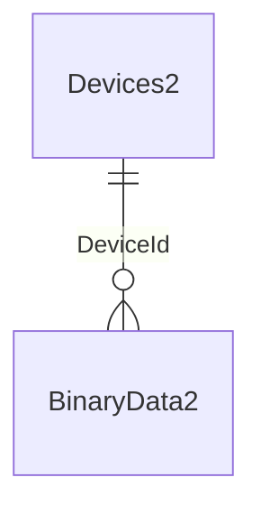

[↑ Table Inventory](#table-inventory)

### ChargeEvents2

Contains data corresponding to MyGeotab [ChargeEvent](https://developers.geotab.com/myGeotab/apiReference/objects/ChargeEvent) objects.

| Column | MSSQL Type | PG Type | Nullable | Description |
|--------|-----------|---------|----------|-------------|
| `id` | uniqueidentifier | uuid | NO | The unique identifier for the record in this table. * **NOTE** : This is also the **GeotabId** converted to its underlying GUID value. |
| `GeotabId` | nvarchar(50) | varchar(50) | NO | The unique identifier for the Entity in the Geotab system. |
| `ChargeIsEstimated` | bit | boolean | NO | Indicates whether the charge values were estimated. |
| `ChargeType` | nvarchar(50) | varchar(50) | NO | The [ChargeType](https://developers.geotab.com/myGeotab/apiReference/objects/ChargeType) provided by the external power source. |
| `DeviceId` | bigint | bigint | NO | The Id of the [Device](https://developers.geotab.com/myGeotab/apiReference/objects/Device) (in the Devices2 table) associated with the subject ChargeEvent. |
| `DurationTicks` | bigint | bigint | NO | The length of time the vehicle was charging as measured in ticks. A tick is equal to 100 nanoseconds or one ten-millionth of a second. There are 10,000 ticks in a millisecond and 10 million ticks in a second. |
| `EndStateOfCharge` | float | double precision | YES | The ending state of charge for this ChargeEvent. |
| `EnergyConsumedKwh` | float | double precision | YES | The energy consumed during the ChargeEvent. |
| `EnergyUsedSinceLastChargeKwh` | float | double precision | YES | * **NOTE** : This property is **DEPRECATED** in the MyGeotab API and this column is no longer populated. It has been kept for those with historical data. The amount of energy drawn from the battery since the last ChargeEvent. |
| `Latitude` | float | double precision | YES | The latitude of the location where the ChargeEvent occurred. |
| `Longitude` | float | double precision | YES | The longitude of the location where the ChargeEvent occurred. |
| `MaxACVoltage` | float | double precision | YES | The maximum AC Voltage over the ChargeEvent. |
| `MeasuredBatteryEnergyInKwh` | float | double precision | YES | The amount of energy in measured during charging. |
| `MeasuredBatteryEnergyOutKwh` | float | double precision | YES | The amount of energy out measured during charging. |
| `MeasuredOnBoardChargerEnergyInKwh` | float | double precision | YES | The total amount of energy in measured on board during charging. |
| `MeasuredOnBoardChargerEnergyOutKwh` | float | double precision | YES | The total amount of energy out measured on board during charging. |
| `PeakPowerKw` | float | double precision | YES | The peak power used during the ChargeEvent. |
| `StartStateOfCharge` | float | double precision | YES | The starting state of charge for this ChargeEvent. |
| `StartTime` | datetime2(7) | timestamp | NO | The date and time at which the ChargeEvent started. |
| `TripStop` | datetime2(7) | timestamp | YES | The time of the Trip.Stop from the [Trip](https://developers.geotab.com/myGeotab/apiReference/objects/Trip) this ChargeEvent occurred in. |
| `Version` | bigint | bigint | YES | The version of the entity. |
| `RecordLastChangedUtc` | datetime2(7) | timestamp | NO | A timestamp, in Coordinated Universal Time (UTC), indicating the last time that the subject record was updated in this table. |

**PK**: (`id`, `StartTime`) — Partitioned by `StartTime`

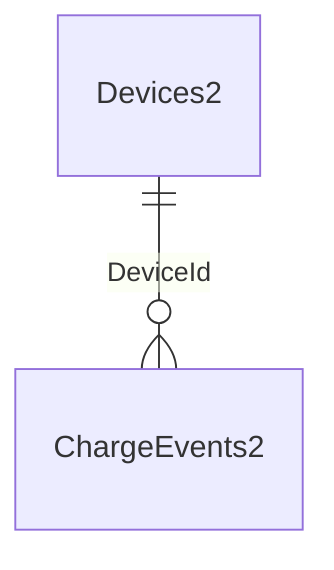

[↑ Table Inventory](#table-inventory)

### DriverChanges2

Contains data corresponding to MyGeotab [DriverChange](https://developers.geotab.com/myGeotab/apiReference/objects/DriverChange) objects.

| Column | MSSQL Type | PG Type | Nullable | Description |
|--------|-----------|---------|----------|-------------|
| `id` | uniqueidentifier | uuid | NO | The unique identifier for the record in this table. * **NOTE** : This is also the **GeotabId** converted to its underlying GUID value. |
| `GeotabId` | nvarchar(50) | varchar(50) | NO | The unique identifier for the Entity in the Geotab system. |
| `DateTime` | datetime2(7) | timestamp | NO | The date and time of the driver change. |
| `DeviceId` | bigint | bigint | NO | The Id of the [Device](https://developers.geotab.com/myGeotab/apiReference/objects/Device) (in the Devices2 table) associated with the subject DriverChange. |
| `DriverId` | bigint | bigint | YES | The Id of the [Driver](https://developers.geotab.com/myGeotab/apiReference/objects/Driver) (corresponding to the Id in the Users2 table) associated with the subject DriverChange. |
| `Type` | nvarchar(50) | varchar(50) | NO | The [DriverChangeType](https://developers.geotab.com/myGeotab/apiReference/objects/DriverChangeType). |
| `Version` | bigint | bigint | YES | The version of the entity. |
| `RecordLastChangedUtc` | datetime2(7) | timestamp | NO | A timestamp, in Coordinated Universal Time (UTC), indicating the last time that the subject record was updated in this table. |

**PK**: (`id`, `DateTime`) — Partitioned by `DateTime`

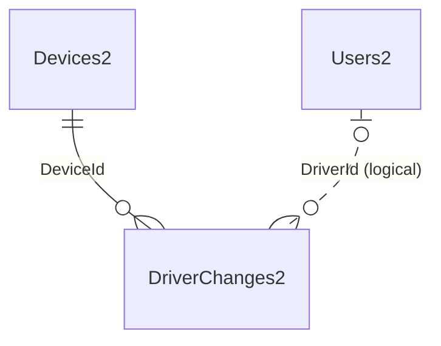

[↑ Table Inventory](#table-inventory)

### DutyStatusLogs2

Contains data corresponding to MyGeotab [DutyStatusLog](https://developers.geotab.com/myGeotab/apiReference/objects/DutyStatusLog) objects.

| Column | MSSQL Type | PG Type | Nullable | Description |
|--------|-----------|---------|----------|-------------|
| `id` | uniqueidentifier | uuid | NO | The unique identifier for the record in this table. * **NOTE** : This is also the **GeotabId** converted to its underlying GUID value. |
| `GeotabId` | nvarchar(50) | varchar(50) | NO | The unique identifier for the Entity in the Geotab system. |
| `Annotations` | nvarchar(max) | text | YES | The list of [AnnotationLog](https://developers.geotab.com/myGeotab/apiReference/objects/AnnotationLog) (s) which are associated with this log. |
| `CoDrivers` | nvarchar(max) | text | YES | The list of the co-driver [User](https://developers.geotab.com/myGeotab/apiReference/objects/User) (s) (in the Users2 table) for this log. |
| `DateTime` | datetime2(7) | timestamp | NO | The date and time the log was created. |
| `DeferralMinutes` | int | integer | YES | The deferral minutes. |
| `DeferralStatus` | nvarchar(50) | varchar(50) | YES | The [DutyStatusDeferralType](https://developers.geotab.com/myGeotab/apiReference/objects/DutyStatusDeferralType). |
| `DeviceId` | bigint | bigint | YES | The Id of the [Device](https://developers.geotab.com/myGeotab/apiReference/objects/Device) (in the Devices2 table) associated with the subject DutyStatusLog. |
| `DistanceSinceValidCoordinates` | real | real | YES | The distance since last valid coordinate measurement. |
| `DriverId` | bigint | bigint | YES | The Id of the [User](https://developers.geotab.com/myGeotab/apiReference/objects/User) (corresponding to the Id in the Users2 table) who created this log. |
| `EditDateTime` | datetime2(7) | timestamp | YES | The date and time the log was edited. If the log has not been edited, this will not be set. |
| `EditRequestedByUserId` | bigint | bigint | YES | The Id of the [User](https://developers.geotab.com/myGeotab/apiReference/objects/User) (corresponding to the Id in the Users2 table) that requested an edit to this log. |
| `EngineHours` | float | double precision | YES | The engine hours for the **DeviceId** at the **DateTime** of this log. The unit is seconds (not hours). |
| `EventCheckSum` | bigint | bigint | YES | The event checksum of this log. |
| `EventCode` | int | smallint | YES | The event code of this log (Table 6; 7.20 of the ELD Final Rule). |
| `EventRecordStatus` | int | smallint | YES | The record status number of this log 1 = active 2 = inactive - changed 3 = inactive - change requested 4 = inactive - change rejected. |
| `EventType` | int | smallint | YES | The event type number of this log 1 = A change in driver's duty-status 2 = An intermediate log 3 = A change in driver's indication of authorized personal use of CMV or yard moves 4 = A driver's certification/re-certification of records 5 = A driver's login/logout activity 6 = CMV's engine power up / shut down activity 7 = A malfunction or data diagnostic detection occurrence (Table 6; 7.25 of the ELD Final Rule). |
| `IsHidden` | bit | boolean | YES | Indicates whether the log is hidden. |
| `IsIgnored` | bit | boolean | YES | If the log is ignored. True means it will not affect the Driver's HOS availability. |
| `IsTransitioning` | bit | boolean | YES | A value indicating whether the log is in transitioning state. |
| `Location` | nvarchar(max) | text | YES | An object with the location information for the log data. |
| `LocationX` | float | double precision | YES | The longitude of the **Location**. |
| `LocationY` | float | double precision | YES | The latitude of the **Location**. |
| `Malfunction` | nvarchar(50) | varchar(50) | YES | The [DutyStatusMalfunctionTypes](https://developers.geotab.com/myGeotab/apiReference/objects/DutyStatusMalfunctionTypes) of this DutyStatusLog record. As a flag it can be both a diagnostic and malfunction state which is used to mark status based records (e.g. "D", "SB") as having a diagnostic or malfunction present at time of recording. |
| `Odometer` | float | double precision | YES | The odometer in metres for the **DeviceId** at the **DateTime** of this log. |
| `Origin` | nvarchar(50) | varchar(50) | YES | The [DutyStatusOrigin](https://developers.geotab.com/myGeotab/apiReference/objects/DutyStatusOrigin) from where this log originated. |
| `ParentId` | nvarchar(50) | varchar(50) | YES | The **GeotabId** of the parent **DutyStatusLog**. Used when a DutyStatusLog is edited. When returning history, this field will be populated. |
| `Sequence` | bigint | bigint | YES | The sequence number, which is used to generate the sequence ID. |
| `State` | nvarchar(50) | varchar(50) | YES | The [DutyStatusState](https://developers.geotab.com/myGeotab/apiReference/objects/DutyStatusState) of the DutyStatusLog record. |
| `Status` | nvarchar(50) | varchar(50) | YES | The [DutyStatusLogType](https://developers.geotab.com/myGeotab/apiReference/objects/DutyStatusLogType) representing the driver's duty status. |
| `UserHosRuleSet` | nvarchar(max) | text | YES | The linked UserHosRuleSet. Only used to link rulesets to log events that affect the driver's operating zone and/or cycle. (Canadian ELD) |
| `VerifyDateTime` | datetime2(7) | timestamp | YES | The date and time the log was verified. If the log is unverified, this will not be set. |
| `Version` | bigint | bigint | YES | The version of the entity. |
| `RecordCreationTimeUtc` | datetime2(7) | timestamp | NO | A timestamp, in Coordinated Universal Time (UTC), indicating when the subject record was created in this table. |

**PK**: (`id`, `DateTime`) — Partitioned by `DateTime`

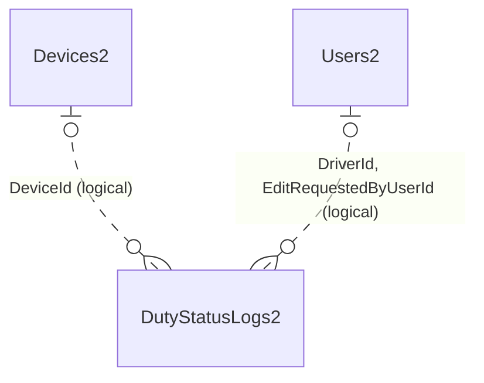

[↑ Table Inventory](#table-inventory)

### DVIRDefectRemarks2

Contains data corresponding to MyGeotab [DefectRemark](https://developers.geotab.com/myGeotab/apiReference/objects/DefectRemark) objects.

| Column | MSSQL Type | PG Type | Nullable | Description |
|--------|-----------|---------|----------|-------------|
| `id` | uniqueidentifier | uuid | NO | The unique identifier for the record in this table. * **NOTE** : This is also the **GeotabId** converted to its underlying GUID value. |
| `GeotabId` | nvarchar(50) | varchar(50) | NO | The unique identifier for the Entity in the Geotab system. |
| `DVIRDefectId` | uniqueidentifier | uuid | NO | The Id of the [DVIRDefect](https://developers.geotab.com/myGeotab/apiReference/objects/DVIRDefect) (in the DVIRDefects2 table) with which the subject DVIRDefect is associated. |
| `DVIRLogDateTime` | datetime2(7) | timestamp | NO | The DateTime of the [DVIRLog](https://developers.geotab.com/myGeotab/apiReference/objects/DVIRLog) (in the DVIRLogs2 table) with which the [DVIRDefect](https://developers.geotab.com/myGeotab/apiReference/objects/DVIRDefect) with which the subject DVIRDefectRemark is associated. * **NOTE** : This column is duplicated here only because it is necessary for database partitioning purposes. |
| `DateTime` | datetime2(7) | timestamp | NO | The date and time the remark was created. |
| `Remark` | nvarchar(max) | text | YES | The text content of the remark. |
| `RemarkUserId` | bigint | bigint | YES | The Id of the [User](https://developers.geotab.com/myGeotab/apiReference/objects/User) (in the Users2 table) who created the remark. |
| `RecordLastChangedUtc` | datetime2(7) | timestamp | NO | A timestamp, in Coordinated Universal Time (UTC), indicating the last time that the subject record was updated in this table. |

**PK**: (`id`, `DVIRLogDateTime`) — Partitioned by `DVIRLogDateTime`

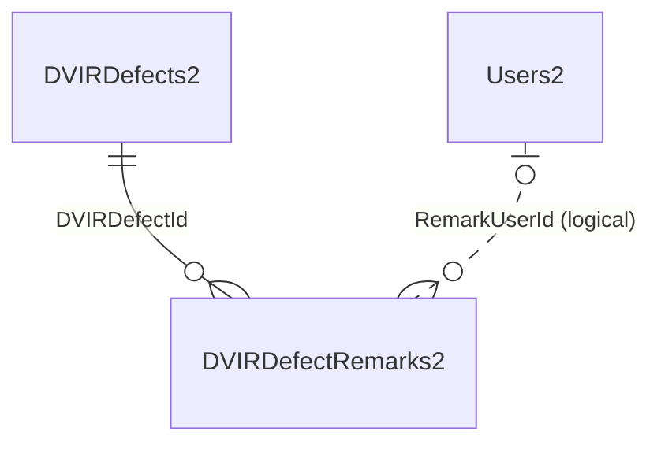

[↑ Table Inventory](#table-inventory)

### DVIRDefects2

Contains data corresponding to defects associated with DVIRLogs. It includes data derived from MyGeotab [DVIRLog](https://developers.geotab.com/myGeotab/apiReference/objects/DVIRLog), [DVIRDefect](https://developers.geotab.com/myGeotab/apiReference/objects/DVIRDefect), [Defect](https://developers.geotab.com/myGeotab/apiReference/objects/Defect) and [Group](https://developers.geotab.com/myGeotab/apiReference/objects/Group) objects.

| Column | MSSQL Type | PG Type | Nullable | Description |
|--------|-----------|---------|----------|-------------|
| `id` | uniqueidentifier | uuid | NO | The unique identifier for the record in this table. * **NOTE** : This is also the **GeotabId** converted to its underlying GUID value. |
| `GeotabId` | nvarchar(50) | varchar(50) | NO | The unique identifier for the Entity in the Geotab system. |
| `DVIRLogId` | uniqueidentifier | uuid | NO | The Id of the [DVIRLog](https://developers.geotab.com/myGeotab/apiReference/objects/DVIRLog) (in the DVIRLogs2 table) with which the subject DVIRDefect is associated. |
| `DVIRLogDateTime` | datetime2(7) | timestamp | NO | The DateTime of the [DVIRLog](https://developers.geotab.com/myGeotab/apiReference/objects/DVIRLog) (in the DVIRLogs2 table) with which the subject DVIRDefect is associated. * **NOTE** : This column is duplicated here only because it is necessary for database partitioning purposes. |
| `DefectListAssetType` | nvarchar(50) | varchar(50) | YES | The asset type of the defect list. |
| `DefectListId` | nvarchar(50) | varchar(50) | YES | The Id of the defect list ([Group](https://developers.geotab.com/myGeotab/apiReference/objects/Group)) that the defect belongs to. |
| `DefectListName` | nvarchar(255) | varchar(255) | YES | The Name of the defect list ([Group](https://developers.geotab.com/myGeotab/apiReference/objects/Group)) that the defect belongs to. |
| `PartId` | nvarchar(50) | varchar(50) | YES | The Id of the part ([Group](https://developers.geotab.com/myGeotab/apiReference/objects/Group)) that has the defect. |
| `PartName` | nvarchar(255) | varchar(255) | YES | The Name of the part ([Group](https://developers.geotab.com/myGeotab/apiReference/objects/Group)) that has the defect. |
| `DefectId` | nvarchar(50) | varchar(50) | YES | The Id of the [Defect](https://developers.geotab.com/myGeotab/apiReference/objects/Defect). |
| `DefectName` | nvarchar(255) | varchar(255) | YES | The Name of the [Defect](https://developers.geotab.com/myGeotab/apiReference/objects/Defect). |
| `DefectSeverityId` | smallint | smallint | YES | The id of the [DefectSeverity](https://developers.geotab.com/myGeotab/apiReference/objects/DefectSeverity) (in the DefectSeverities2 table) of the Defect. |
| `RepairDateTime` | datetime2(7) | timestamp | YES | The date and time the [DVIRDefect](https://developers.geotab.com/myGeotab/apiReference/objects/DVIRDefect) was repaired. |
| `RepairStatusId` | smallint | smallint | YES | The id of the [RepairStatusType](https://developers.geotab.com/myGeotab/apiReference/objects/RepairStatusType) (in the RepairStatuses2 table) of the [DVIRDefect](https://developers.geotab.com/myGeotab/apiReference/objects/DVIRDefect). |
| `RepairUserId` | bigint | bigint | YES | The Id of the [User](https://developers.geotab.com/myGeotab/apiReference/objects/User) (in the Users2 table) who repaired the [DVIRDefect](https://developers.geotab.com/myGeotab/apiReference/objects/DVIRDefect). |
| `RecordLastChangedUtc` | datetime2(7) | timestamp | NO | A timestamp, in Coordinated Universal Time (UTC), indicating the last time that the subject record was updated in this table. |

**PK**: (`id`, `DVIRLogDateTime`) — Partitioned by `DVIRLogDateTime`

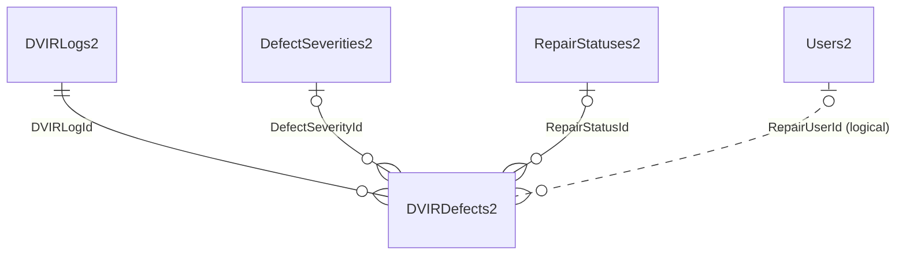

[↑ Table Inventory](#table-inventory)

### DVIRLogs2

Contains data corresponding to MyGeotab [DVIRLog](https://developers.geotab.com/myGeotab/apiReference/objects/DVIRLog) objects.

| Column | MSSQL Type | PG Type | Nullable | Description |
|--------|-----------|---------|----------|-------------|
| `id` | uniqueidentifier | uuid | NO | The unique identifier for the record in this table. * **NOTE** : This is also the **GeotabId** converted to its underlying GUID value. |
| `GeotabId` | nvarchar(50) | varchar(50) | NO | The unique identifier for the Entity in the Geotab system. |
| `AuthorityAddress` | nvarchar(255) | varchar(255) | YES | The authority address for the driver at the time of this log. |
| `AuthorityName` | nvarchar(255) | varchar(255) | YES | The authority name for the driver at the time of this log. |
| `CertifiedByUserId` | bigint | bigint | YES | The Id of the [User](https://developers.geotab.com/myGeotab/apiReference/objects/User) (in the Users2 table) who certified the repairs (or comments, if no repairs were made) to the Device or Trailer. |
| `CertifiedDate` | datetime2(7) | timestamp | YES | The date and time that the Device or Trailer was certified. |
| `CertifyRemark` | nvarchar(max) | text | YES | The remark recorded by the User who certified the repairs (or no repairs made) to the Device or Trailer. |
| `DateTime` | datetime2(7) | timestamp | NO | The date and time the log was created. |
| `DeviceId` | bigint | bigint | NO | The Id of the [Device](https://developers.geotab.com/myGeotab/apiReference/objects/Device) (in the Devices2 table) associated with the DVIR. |
| `DriverId` | bigint | bigint | YES | The Id of the [User](https://developers.geotab.com/myGeotab/apiReference/objects/User) (in the Users2 table) who created the log. |
| `DriverRemark` | nvarchar(max) | text | YES | The remark recorded by the driver for this log. |
| `DurationTicks` | bigint | bigint | YES | The total time spent to complete the DVIRLog as measured in ticks. A tick is equal to 100 nanoseconds or one ten-millionth of a second. There are 10,000 ticks in a millisecond and 10 million ticks in a second. |
| `EngineHours` | real | real | YES | The engine hours, **measured in seconds**, of the Device at the time of this log. |
| `IsSafeToOperate` | bit | boolean | YES | Indicates whether the Device or Trailer was certified as safe to operate. |
| `LoadHeight` | real | real | YES | The load height, **measured in meters**, if it was manually recorded by the driver. |
| `LoadWidth` | real | real | YES | The load width, **measured in meters**, if it was manually recorded by the driver. |
| `LocationLatitude` | float | double precision | YES | The latitude of the location of the log. |
| `LocationLongitude` | float | double precision | YES | The longitude of the location of the log. |
| `LogType` | nvarchar(50) | varchar(50) | YES | The [DVIRLogType](https://developers.geotab.com/myGeotab/apiReference/objects/DVIRLogType) of the log. |
| `Odometer` | float | double precision | YES | The odometer or hubometer, **measured in meters**, of the vehicle or trailer. |
| `RepairDate` | datetime2(7) | timestamp | YES | The date and time the Device or Trailer was repaired. |
| `RepairedByUserId` | bigint | bigint | YES | The Id of the [User](https://developers.geotab.com/myGeotab/apiReference/objects/User) (in the Users2 table) who repaired the Device or Trailer. |
| `RepairRemark` | nvarchar(max) | text | YES | The remark recorded by the User who repaired the Device or Trailer. |
| `Version` | bigint | bigint | YES | The version of the entity. |
| `RecordLastChangedUtc` | datetime2(7) | timestamp | NO | A timestamp, in Coordinated Universal Time (UTC), indicating the last time that the subject record was updated in this table. |

**PK**: (`DateTime`, `id`) — Partitioned by `DateTime`

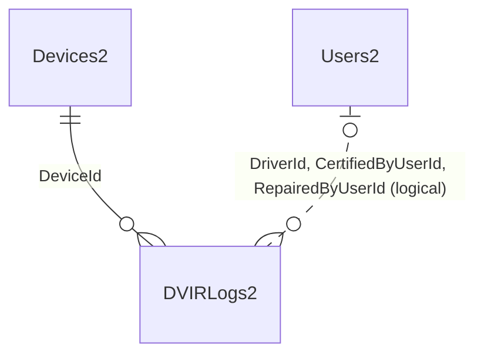

[↑ Table Inventory](#table-inventory)

### EntityMetadata2

Used to store the combination of DeviceId + DateTime + EntityType + EntityId. Each time a record is inserted into one of the FaultData2, LogRecords2 or StatusData2 tables, a corresponding record is inserted into this table. It is used by stored procedures/functions that must relate these different entities based on DateTime and DeviceId to perform location interpolation.

| Column | MSSQL Type | PG Type | Nullable | Description |
|--------|-----------|---------|----------|-------------|
| `id` | bigint IDENTITY | bigint GENERATED | NO | The unique identifier for the record in this table. Entirely unrelated to the Geotab system. |
| `DeviceId` | bigint | bigint | NO | The **DeviceId** value of the corresponding record in the FaultData2, LogRecords2 or StatusData2 table (which one is dependent on **EntityType**). Also the Id of the [Device](https://developers.geotab.com/myGeotab/apiReference/objects/Device) (in the Devices2 table) associated with the subject Entity. |
| `DateTime` | datetime2(7) | timestamp | NO | The **DateTime** value of the corresponding record in the FaultData2, LogRecords2 or StatusData2 table (which one is dependent on **EntityType**). |
| `EntityType` | tinyint | smallint | NO | The Id of the EntityType enumeration. Indicates which table the subject record’s corresponding record resides in. **1 = LogRecord (LogRecords2). 2 = StatusData (StatusData2). 3 = FaultData (FaultData2)**. |
| `EntityId` | bigint | bigint | NO | The **Id** value of the corresponding record in the FaultData2, LogRecords2 or StatusData2 table (which one is dependent on **EntityType**). |
| `IsDeleted` | bit | boolean | YES | For future use. |
| `RecordCreationTimeUtc` | datetime2(7) | timestamp | NO | A timestamp, in Coordinated Universal Time (UTC), indicating when the subject record was inserted into this table. |

**PK**: `id`

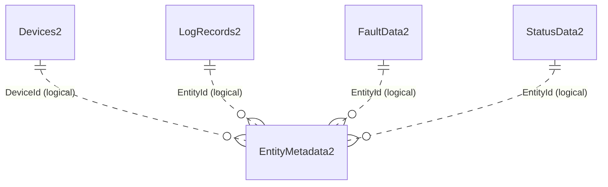

[↑ Table Inventory](#table-inventory)

### ExceptionEvents2

Contains data corresponding to MyGeotab [ExceptionEvent](https://developers.geotab.com/myGeotab/apiReference/objects/ExceptionEvent) objects.

| Column | MSSQL Type | PG Type | Nullable | Description |
|--------|-----------|---------|----------|-------------|
| `id` | uniqueidentifier | uuid | NO | The unique identifier for the record in this table. * **NOTE** : This is also the **GeotabId** converted to its underlying GUID value. |
| `GeotabId` | nvarchar(50) | varchar(50) | NO | The unique identifier for the Entity in the Geotab system. |
| `ActiveFrom` | datetime2(7) | timestamp | NO | The start date and time of the ExceptionEvent; at or after this date and time. |
| `ActiveTo` | datetime2(7) | timestamp | YES | The end date and time of the ExceptionEvent; at or before this date and time. |
| `DeviceId` | bigint | bigint | NO | The Id of the [Device](https://developers.geotab.com/myGeotab/apiReference/objects/Device) (in the Devices2 table) associated with the subject ExceptionEvent. |
| `Distance` | real | real | YES | The distance (in KMs) travelled since the start of the ExceptionEvent. |
| `DriverId` | bigint | bigint | YES | The Id of the [Driver](https://developers.geotab.com/myGeotab/apiReference/objects/Driver) (corresponding to the Id in the Users2 table) associated with the subject ExceptionEvent. |
| `DurationTicks` | bigint | bigint | YES | The duration of the ExceptionEvent as measured in ticks. A tick is equal to 100 nanoseconds or one ten-millionth of a second. There are 10,000 ticks in a millisecond and 10 million ticks in a second. |
| `LastModifiedDateTime` | datetime2(7) | timestamp | YES | The last time this ExceptionEvent was updated (in the MyGeotab database). |
| `RuleId` | bigint | bigint | YES | The Id of the [Rule](https://developers.geotab.com/myGeotab/apiReference/objects/Rule) (corresponding to the Id in the Rules2 table) associated with the subject ExceptionEvent. |
| `State` | int | integer | YES | The [ExceptionEventState](https://developers.geotab.com/myGeotab/apiReference/objects/ExceptionEventState) of the subject ExceptionEvent. **0 = Valid. 1 = Invalid. 2 = Dismissed**. |
| `Version` | bigint | bigint | YES | The version of the entity. |
| `RecordLastChangedUtc` | datetime2(7) | timestamp | NO | A timestamp, in Coordinated Universal Time (UTC), indicating the last time that the subject record was updated in this table. |

**PK**: (`id`, `ActiveFrom`) — Partitioned by `ActiveFrom`

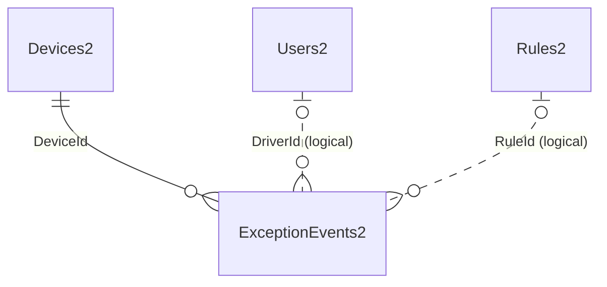

[↑ Table Inventory](#table-inventory)

### FaultData2

Contains data corresponding to MyGeotab [FaultData](https://developers.geotab.com/myGeotab/apiReference/objects/FaultData) objects.

| Column | MSSQL Type | PG Type | Nullable | Description |
|--------|-----------|---------|----------|-------------|
| `id` | bigint | bigint | NO | The unique identifier for the record in this table. * **NOTE** : This is also the **GeotabId** converted to its underlying numeric value. |
| `GeotabId` | nvarchar(50) | varchar(50) | NO | The unique identifier for the Entity in the Geotab system. |
| `AmberWarningLamp` | bit | boolean | YES | Indicates whether the amber warning lamp is on. |
| `ClassCode` | nvarchar(50) | varchar(50) | YES | The [DtcClass](https://developers.geotab.com/myGeotab/apiReference/objects/DtcClass) code of the fault. |
| `ControllerId` | nvarchar(100) | varchar(100) | NO | The Id of the [Controller](https://developers.geotab.com/myGeotab/apiReference/objects/Controller) related to the fault code; if applicable. |
| `ControllerName` | nvarchar(255) | varchar(255) | YES | The Name of the [Controller](https://developers.geotab.com/myGeotab/apiReference/objects/Controller) related to the fault code; if applicable. |
| `Count` | int | integer | NO | The number of times the fault occurred. |
| `DateTime` | datetime2(7) | timestamp | NO | The date and time at which the event occurred. |
| `DeviceId` | bigint | bigint | NO | The Id of the [Device](https://developers.geotab.com/myGeotab/apiReference/objects/Device) (in the Devices2 table) associated with the subject FaultData. |
| `DiagnosticId` | bigint | bigint | NO | The Id of the [Diagnostic](https://developers.geotab.com/myGeotab/apiReference/objects/Diagnostic) (in the DiagnosticIds2 table) associated with the subject FaultData. |
| `DismissDateTime` | datetime2(7) | timestamp | YES | The date and time that the fault was dismissed. |
| `DismissUserId` | bigint | bigint | YES | The Id of the [User](https://developers.geotab.com/myGeotab/apiReference/objects/User) (in the Users2 table) associated with the subject FaultData entity. |
| `EffectOnComponent` | nvarchar(max) | text | YES | The effect on component for enriched fault. |
| `FailureModeCode` | int | integer | YES | The Failure Mode Identifier (FMI) associated with the [FailureMode](https://developers.geotab.com/myGeotab/apiReference/objects/FailureMode). |
| `FailureModeId` | nvarchar(50) | varchar(50) | NO | The Id of the [FailureMode](https://developers.geotab.com/myGeotab/apiReference/objects/FailureMode) associated with the subject FaultData entity. |
| `FailureModeName` | nvarchar(255) | varchar(255) | YES | The Name of the [FailureMode](https://developers.geotab.com/myGeotab/apiReference/objects/FailureMode) associated with the subject FaultData entity. |
| `FaultDescription` | nvarchar(max) | text | YES | The fault description for enriched fault. |
| `FaultLampState` | nvarchar(50) | varchar(50) | YES | The [FaultLampState](https://developers.geotab.com/myGeotab/apiReference/objects/FaultLampState) of a J1939 vehicle. |
| `FaultState` | nvarchar(50) | varchar(50) | YES | The [FaultState](https://geotab.github.io/sdk/software/api/reference/#T:Geotab.Checkmate.ObjectModel.Engine.FaultState) code from the engine system of the specific device. |
| `FlashCodeId` | nvarchar(255) | varchar(255) | YES | The Id of the [Flashcode](https://developers.geotab.com/myGeotab/apiReference/objects/FlashCode) associated with the subject FaultData entity. |
| `FlashCodeName` | nvarchar(255) | varchar(255) | YES | The Name of the [Flashcode](https://developers.geotab.com/myGeotab/apiReference/objects/FlashCode) associated with the subject FaultData entity. |
| `MalfunctionLamp` | bit | boolean | YES | Indicates whether the malfunction lamp is on. |
| `ProtectWarningLamp` | bit | boolean | YES | Indicates whether the protect warning lamp is on. |
| `Recommendation` | nvarchar(max) | text | YES | The recommendation for enriched fault. |
| `RedStopLamp` | bit | boolean | YES | Indicates whether the red stop lamp is on. |
| `RiskOfBreakdown` | float | double precision | YES | The risk of breakdown associated with the fault. * **NOTE** : This column is currently not populated as the associated property is not available in the.NET API client. Once it becomes available, this note will be removed. |
| `Severity` | nvarchar(50) | varchar(50) | YES | The [DtcSeverity](https://developers.geotab.com/myGeotab/apiReference/objects/DtcSeverity) of the fault. |
| `SourceAddress` | int | integer | YES | The source address for enhanced faults. |
| `RecordCreationTimeUtc` | datetime2(7) | timestamp | NO | A timestamp, in Coordinated Universal Time (UTC), indicating when the subject record was inserted into this table. |

**PK**: (`id`, `DateTime`) — Partitioned by `DateTime`

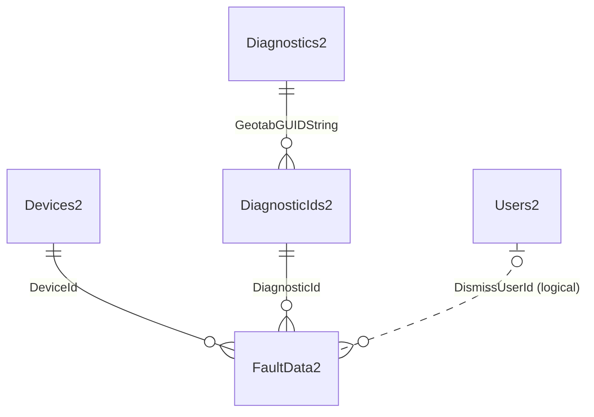

[↑ Table Inventory](#table-inventory)

### FuelAndEnergyUsed2

Contains data corresponding to MyGeotab [FuelAndEnergyUsed](https://developers.geotab.com/myGeotab/apiReference/objects/FuelAndEnergyUsed) objects.

| Column | MSSQL Type | PG Type | Nullable | Description |
|--------|-----------|---------|----------|-------------|
| `id` | uniqueidentifier | uuid | NO | The unique identifier for the record in this table. * **NOTE** : This is also the **GeotabId** converted to its underlying GUID value. |
| `GeotabId` | nvarchar(50) | varchar(50) | NO | The unique identifier for the Entity in the Geotab system. |
| `DateTime` | datetime2(7) | timestamp | NO | The date and time of the fuel and energy usage record. |
| `DeviceId` | bigint | bigint | NO | The Id of the [Device](https://developers.geotab.com/myGeotab/apiReference/objects/Device) (in the Devices2 table) associated with the subject fuel and energy usage record. |
| `TotalEnergyUsedKwh` | float | double precision | YES | The total energy used, in kilowatt-hours (kWh). |
| `TotalFuelUsed` | float | double precision | YES | The volume of fuel used in liters. |
| `TotalIdlingEnergyUsedKwh` | float | double precision | YES | The total energy used while idling, in kilowatt-hours (kWh). |
| `TotalIdlingFuelUsedL` | float | double precision | YES | The volume of fuel used while idling, in liters. |
| `Version` | bigint | bigint | YES | The version of the entity. |
| `RecordLastChangedUtc` | datetime2(7) | timestamp | NO | A timestamp, in Coordinated Universal Time (UTC), indicating the last time that the subject record was updated in this table. |

**PK**: (`id`, `DateTime`) — Partitioned by `DateTime`

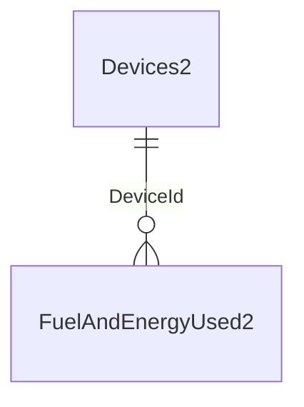

[↑ Table Inventory](#table-inventory)

### LogRecords2

Contains data corresponding to MyGeotab [LogRecord](https://developers.geotab.com/myGeotab/apiReference/objects/LogRecord) objects.

| Column | MSSQL Type | PG Type | Nullable | Description |
|--------|-----------|---------|----------|-------------|
| `id` | bigint | bigint | NO | The unique identifier for the record in this table. * **NOTE** : This is also the **GeotabId** converted to its underlying numeric value. |
| `GeotabId` | nvarchar(50) | varchar(50) | NO | The unique identifier for the Entity in the Geotab system. |
| `DateTime` | datetime2(7) | timestamp | NO | The date and time the log was recorded. |
| `DeviceId` | bigint | bigint | NO | The Id of the [Device](https://developers.geotab.com/myGeotab/apiReference/objects/Device) (in the Devices2 table) associated with the subject FaultData. |
| `Latitude` | float | double precision | NO | The latitude of the log record. |
| `Longitude` | float | double precision | NO | The longitude of the log record. |
| `Speed` | real | real | NO | The logged speed or an invalid speed (in km/h). |
| `RecordCreationTimeUtc` | datetime2(7) | timestamp | NO | A timestamp, in Coordinated Universal Time (UTC), indicating when the subject record was inserted into this table. |

**PK**: (`id`, `DateTime`) — Partitioned by `DateTime`

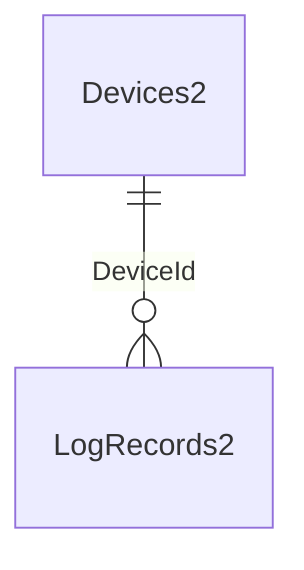

[↑ Table Inventory](#table-inventory)

### StatusData2

Contains data corresponding to MyGeotab [StatusData](https://developers.geotab.com/myGeotab/apiReference/objects/StatusData) objects.

| Column | MSSQL Type | PG Type | Nullable | Description |
|--------|-----------|---------|----------|-------------|
| `id` | bigint | bigint | NO | The unique identifier for the record in this table. * **NOTE** : This is also the **GeotabId** converted to its underlying numeric value. |
| `GeotabId` | nvarchar(50) | varchar(50) | NO | The unique identifier for the Entity in the Geotab system. |
| `Data` | float | double precision | YES | The recorded value of the diagnostic parameter. |
| `DateTime` | datetime2(7) | timestamp | NO | The date and time of the logged event. |
| `DeviceId` | bigint | bigint | NO | The Id of the [Device](https://developers.geotab.com/myGeotab/apiReference/objects/Device) (in the Devices2 table) associated with the subject StatusData. |
| `DiagnosticId` | bigint | bigint | NO | The Id of the [Diagnostic](https://developers.geotab.com/myGeotab/apiReference/objects/Diagnostic) (in the DiagnosticIds2 table) associated with the subject StatusData. |
| `RecordCreationTimeUtc` | datetime2(7) | timestamp | NO | A timestamp, in Coordinated Universal Time (UTC), indicating when the subject record was inserted into this table. |

**PK**: (`id`, `DateTime`) — Partitioned by `DateTime`

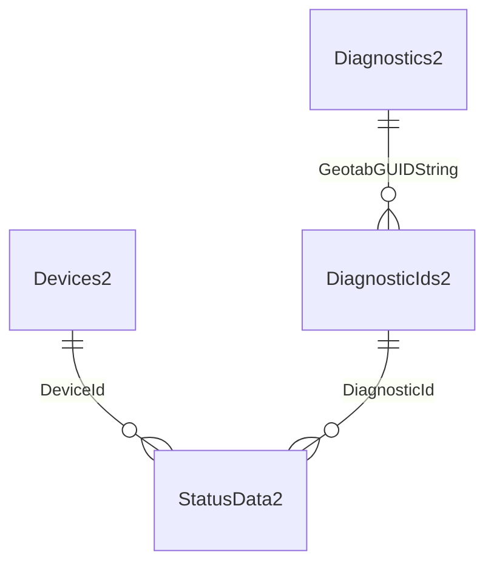

[↑ Table Inventory](#table-inventory)

### Trips2

Contains data corresponding to MyGeotab [Trip](https://developers.geotab.com/myGeotab/apiReference/objects/Trip) objects.

| Column | MSSQL Type | PG Type | Nullable | Description |
|--------|-----------|---------|----------|-------------|
| `id` | bigint IDENTITY | bigint GENERATED | NO | The unique identifier for the record in this table. Entirely unrelated to the Geotab system. |
| `GeotabId` | nvarchar(50) | varchar(50) | NO | The unique identifier for the Entity in the Geotab system. * **NOTE** : Unlike other entities, with Trips, the GeotabId **changes** each time a Trip is updated. As such, it cannot be used as a unique identifier for Trips. |
| `AfterHoursDistance` | real | real | YES | The distance the vehicle was driven after work hours (in km). |
| `AfterHoursDrivingDurationTicks` | bigint | bigint | YES | The duration the vehicle was driven after work hours as measured in ticks. A tick is equal to 100 nanoseconds or one ten-millionth of a second. There are 10,000 ticks in a millisecond and 10 million ticks in a second. |
| `AfterHoursEnd` | bit | boolean | YES | Whether the trip ends after hours. |
| `AfterHoursStart` | bit | boolean | YES | Whether the trip starts after hours. |
| `AfterHoursStopDurationTicks` | bigint | bigint | YES | The duration the vehicle was stopped after work hours as measured in ticks. A tick is equal to 100 nanoseconds or one ten-millionth of a second. There are 10,000 ticks in a millisecond and 10 million ticks in a second. |
| `AverageSpeed` | real | real | YES | Average speed in km/h. This only includes the average speed while driving. |
| `DeletedDateTime` | datetime2(7) | timestamp | YES | If the trip was deleted due to recalculation or reprocessing, the date and time that the trip was deleted. Otherwise, the value will be **null**. |
| `DeviceId` | bigint | bigint | NO | The Id of the [Device](https://developers.geotab.com/myGeotab/apiReference/objects/Device) (in the Devices2 table) associated with the subject Trip. |
| `Distance` | real | real | NO | The distance the vehicle was driven during the trip (in km). |
| `DriverId` | bigint | bigint | YES | The Id of the [Driver](https://developers.geotab.com/myGeotab/apiReference/objects/Driver) (corresponding to the Id in the Users2 table) associated with the subject Trip. |
| `DrivingDurationTicks` | bigint | bigint | NO | The duration between the start and stop of the trip as measured in ticks. A tick is equal to 100 nanoseconds or one ten-millionth of a second. There are 10,000 ticks in a millisecond and 10 million ticks in a second. |
| `IdlingDurationTicks` | bigint | bigint | YES | Total end-of-trip idling (idling is defined as speed being 0 with ignition on). It is calculated from the beginning of the current trip to the beginning of the next trip. Measured in ticks. A tick is equal to 100 nanoseconds or one ten-millionth of a second. There are 10,000 ticks in a millisecond and 10 million ticks in a second. |
| `MaximumSpeed` | real | real | YES | The maximum speed of the vehicle during this trip (in km/h). |
| `NextTripStart` | datetime2(7) | timestamp | NO | The start date and time of the next trip. |
| `SpeedRange1` | int | integer | YES | The number of incidents where the vehicle reached the first range of speeding triggers. |
| `SpeedRange1DurationTicks` | bigint | bigint | YES | The duration where the vehicle drove in the first range of speeding triggers as measured in ticks. A tick is equal to 100 nanoseconds or one ten-millionth of a second. There are 10,000 ticks in a millisecond and 10 million ticks in a second. |
| `SpeedRange2` | int | integer | YES | The number of incidents where the vehicle reached the second range of speeding triggers. |
| `SpeedRange2DurationTicks` | bigint | bigint | YES | The duration where the vehicle drove in the second range of speeding triggers as measured in ticks. A tick is equal to 100 nanoseconds or one ten-millionth of a second. There are 10,000 ticks in a millisecond and 10 million ticks in a second. |
| `SpeedRange3` | int | integer | YES | The number of incidents where the vehicle reached the third range of speeding triggers. |
| `SpeedRange3DurationTicks` | bigint | bigint | YES | The duration where the vehicle drove in the third range of speeding triggers as measured in ticks. A tick is equal to 100 nanoseconds or one ten-millionth of a second. There are 10,000 ticks in a millisecond and 10 million ticks in a second. |
| `Start` | datetime2(7) | timestamp | NO | The date and time that the trip started. |
| `Stop` | datetime2(7) | timestamp | NO | The date and time the trip stopped. |
| `StopDurationTicks` | bigint | bigint | NO | The duration that the vehicle was stopped at the end of the trip. This also includes any idling done at the end of a trip. Measured in ticks. A tick is equal to 100 nanoseconds or one ten-millionth of a second. There are 10,000 ticks in a millisecond and 10 million ticks in a second. |
| `StopPointX` | float | double precision | YES | The longitude of the [Coordinate](https://developers.geotab.com/myGeotab/apiReference/objects/Coordinate) at which the Trip stopped. |
| `StopPointY` | float | double precision | YES | The latitude of the [Coordinate](https://developers.geotab.com/myGeotab/apiReference/objects/Coordinate) at which the Trip stopped. |
| `WorkDistance` | real | real | YES | The distance the vehicle was driven during work hours (in km). |
| `WorkDrivingDurationTicks` | bigint | bigint | YES | The duration the vehicle was driven during work hours as measured in ticks. A tick is equal to 100 nanoseconds or one ten-millionth of a second. There are 10,000 ticks in a millisecond and 10 million ticks in a second. |
| `WorkStopDurationTicks` | bigint | bigint | YES | The duration the vehicle was stopped during work hours as measured in ticks. A tick is equal to 100 nanoseconds or one ten-millionth of a second. There are 10,000 ticks in a millisecond and 10 million ticks in a second. |
| `EngineHours` | float | double precision | YES | A value indicating the engine hours as of the end of the trip (measured **in seconds**). |
| `Odometer` | float | double precision | YES | A value indicating the vehicle odometer value as of the end of the trip (**in meters**). |
| `EntityStatus` | int | integer | NO | Indicates whether the subject corresponding object is active or deleted in the MyGeotab database. **1 = Active. 0 = Deleted**. |
| `RecordLastChangedUtc` | datetime2(7) | timestamp | NO | A timestamp, in Coordinated Universal Time (UTC), indicating the last time that the subject record was updated in this table. |

**PK**: (`id`, `Start`) — Partitioned by `Start`

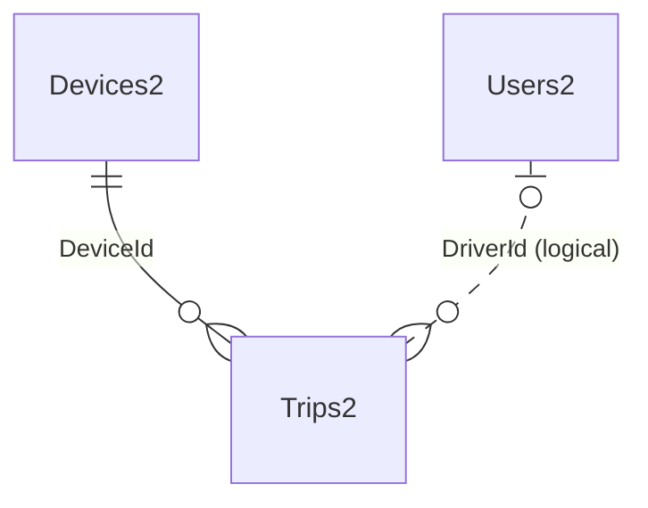

[↑ Table Inventory](#table-inventory)

---

## Reference Data Tables

These tables generally contain user-added data. Values are referenced by GeotabId in the feed data tables. Records in reference data tables can change over time and only the latest version of each record is maintained. Record counts in reference data tables tend to be small and relatively stable over time.

### DefectSeverities2

Represents the list of values in the MyGeotab [DefectSeverity](https://developers.geotab.com/myGeotab/apiReference/objects/DefectSeverity) entity.

| Column | MSSQL Type | PG Type | Nullable | Description |
|--------|-----------|---------|----------|-------------|
| `id` | smallint | smallint | NO | The underlying numeric value of the DefectSeverity. |
| `Name` | nvarchar(50) | varchar(50) | NO | The name of the DefectSeverity. |

**PK**: `id`

[↑ Table Inventory](#table-inventory)

### Devices2

Contains data corresponding to MyGeotab [Device](https://developers.geotab.com/myGeotab/apiReference/objects/Device) objects.

| Column | MSSQL Type | PG Type | Nullable | Description |
|--------|-----------|---------|----------|-------------|
| `id` | bigint | bigint | NO | The unique identifier for the record in this table. * **NOTE** : This is also the **GeotabId** converted to its underlying numeric value. * **NOTE** : **-1** = **NoDeviceId** |
| `GeotabId` | nvarchar(50) | varchar(50) | NO | The unique identifier for the Entity in the Geotab system. |
| `ActiveFrom` | datetime2(7) | timestamp | YES | The date the device is active from. |
| `ActiveTo` | datetime2(7) | timestamp | YES | The date the device is active to. |
| `Comment` | nvarchar(1024) | varchar(1024) | YES | Free text field where any user information can be stored and referenced for this entity. |
| `DeviceType` | nvarchar(50) | varchar(50) | NO | Specifies the GO or Custom [DeviceType](https://developers.geotab.com/myGeotab/apiReference/objects/DeviceType). |
| `Groups` | nvarchar(max) | text | YES | The list of [Group](https://developers.geotab.com/myGeotab/apiReference/objects/Group) (s) the subject entity belongs to. Presented in the form of a JSON array (e.g. [{"id":"GroupVehicleId"},{"id":"b2868"}]). Group Ids in this list correspond with **GeotabId** values in the Groups table. |
| `LicensePlate` | nvarchar(50) | varchar(50) | YES | The vehicle license plate details of the vehicle associated with the device. |
| `LicenseState` | nvarchar(50) | varchar(50) | YES | The state or province of the vehicle associated with the device. |
| `Name` | nvarchar(100) | varchar(100) | NO | The display name assigned to the device. |
| `ProductId` | int | integer | YES | The product Id. Each device is assigned a unique hardware product Id. |
| `SerialNumber` | nvarchar(12) | varchar(12) | YES | The serial number of the device. |
| `VIN` | nvarchar(50) | varchar(50) | YES | The Vehicle Identification Number (VIN) of the vehicle associated with the device. |
| `CustomProperties` | nvarchar(max) | text | YES | The list of CustomProperty objects associated with the subject Device. Presented as a JSON array. Each element includes a Property definition (Name, ExternalReference, PropertyType, etc.) and an optional Value. Devices without CustomProperties values will contain property schema definitions with null values. |
| `TmpTrailerGeotabId` | nvarchar(50) | varchar(50) | YES | The string representation of the Trailer Id associated with the Device, if the Device has a Trailer Id assigned. Used to associate Trailer Ids with Device Ids for entities such as DVIRLog where Trailer Ids have not yet been fully migrated to Device Ids. |
| `TmpTrailerId` | uniqueidentifier | uuid | YES | The GUID representation of the Trailer Id associated with the Device (converted from **TmpTrailerGeotabId**). Has a filtered unique index (`UI_Devices2_TmpTrailerId`) on non-null values. |
| `EntityStatus` | int | integer | NO | Indicates whether the subject corresponding object is active or deleted in the MyGeotab database. **1 = Active. 0 = Deleted**. |
| `RecordLastChangedUtc` | datetime2(7) | timestamp | NO | A timestamp, in Coordinated Universal Time (UTC), indicating the last time that the subject record was updated in this table. |

**PK**: `id`

[↑ Table Inventory](#table-inventory)

### DeviceStatusInfo2

Contains data corresponding to MyGeotab [DeviceStatusInfo](https://developers.geotab.com/myGeotab/apiReference/objects/DeviceStatusInfo) objects.

| Column | MSSQL Type | PG Type | Nullable | Description |
|--------|-----------|---------|----------|-------------|
| `id` | bigint | bigint | NO | Equal to **DeviceId**. Since this table contains one record per Device with records being updated over time, the Id values of individual DeviceStatusInfo records offer no value. |
| `GeotabId` | nvarchar(50) | varchar(50) | NO | The unique identifier for the Entity in the Geotab system. * **NOTE** : This value gets updated each time there is a new DeviceStatusInfo record for the subject Device. |
| `Bearing` | float | double precision | NO | Current bearing |
| `CurrentStateDuration` | nvarchar(50) | varchar(50) | NO | The duration between the last Trip state change (i.e. driving or stop), and the most recent date of location information. |
| `DateTime` | datetime2(7) | timestamp | NO | The most recent DateTime of the latest piece of status, GPS or fault data. |
| `DeviceId` | bigint | bigint | NO | The Id of the [Device](https://developers.geotab.com/myGeotab/apiReference/objects/Device) (in the Devices2 table) associated with the subject DeviceStatusInfo. |
| `DriverId` | bigint | bigint | YES | The Id of the [Driver](https://developers.geotab.com/myGeotab/apiReference/objects/Driver) (corresponding to the Id in the Users2 table) associated with the subject DeviceStatusInfo. |
| `IsDeviceCommunicating` | bit | boolean | NO | A value indicating whether the Device is communicating. |
| `IsDriving` | bit | boolean | NO | A value indicating whether the current Device state. If set true, is driving. Otherwise, it is stopped. |
| `IsHistoricLastDriver` | bit | boolean | NO | Indicates whether the [Device](https://developers.geotab.com/myGeotab/apiReference/objects/Device) has been assigned to "UnknownDriver" and the last [Trip](https://developers.geotab.com/myGeotab/apiReference/objects/Trip) [Driver](https://developers.geotab.com/myGeotab/apiReference/objects/Driver) is represented in the **DriverId** column. |
| `Latitude` | float | double precision | NO | The last known latitude of the Device. |
| `Longitude` | float | double precision | NO | The last known longitude of the Device. |
| `Speed` | real | real | NO | The current vehicle speed (in km/h). NaN represents an invalid speed. |
| `RecordLastChangedUtc` | datetime2(7) | timestamp | NO | A timestamp, in Coordinated Universal Time (UTC), indicating the last time that the subject record was updated in this table. |

**PK**: `id`

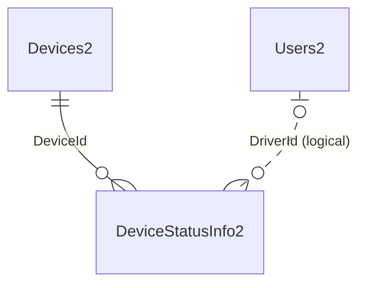

[↑ Table Inventory](#table-inventory)

### DiagnosticIds2

Contains data corresponding to MyGeotab [Diagnostic](https://developers.geotab.com/myGeotab/apiReference/objects/Diagnostic) objects.

| Column | MSSQL Type | PG Type | Nullable | Description |
|--------|-----------|---------|----------|-------------|
| `id` | bigint IDENTITY | bigint GENERATED | NO | The unique identifier for the record in this table. Entirely unrelated to the Geotab system. |
| `GeotabGUIDString` | nvarchar(100) | varchar(100) | NO | The underlying Globally Unique Identifier (GUID) of the Diagnostic. In the event that the GeotabId changes as a result of the assignment of a KnownId, this GeotabGUID will remain unchanged and can be used for reconciliation of Diagnostic Ids in any downstream integrations. |
| `GeotabId` | nvarchar(100) | varchar(100) | NO | The unique identifier for the Entity in the Geotab system. |
| `HasShimId` | bit | boolean | NO | Indicates whether the Diagnostic is one that has a KnownId on the MyGeotab server side, but is unknown in the MyGeotab.NET API client (Geotab.Checkmate.ObjectModel NuGet package) used at the time of download. |
| `FormerShimGeotabGUIDString` | nvarchar(100) | varchar(100) | YES | If there is an earlier version of the Diagnostic where HasShimId is true, this value lists the GeotabGUID of that earlier Diagnostic so that the two, along with any associated data, can be logically related. |
| `RecordLastChangedUtc` | datetime2(7) | timestamp | NO | A timestamp, in Coordinated Universal Time (UTC), indicating the last time that the subject record was updated in this table. |

**PK**: `id`

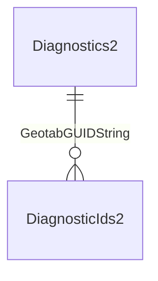

[↑ Table Inventory](#table-inventory)

### Diagnostics2

Contains data corresponding to MyGeotab [Diagnostic](https://developers.geotab.com/myGeotab/apiReference/objects/Diagnostic) objects.

| Column | MSSQL Type | PG Type | Nullable | Description |
|--------|-----------|---------|----------|-------------|
| `id` | bigint IDENTITY | bigint GENERATED | NO | The unique identifier for the record in this table. Entirely unrelated to the Geotab system. |
| `GeotabId` | nvarchar(100) | varchar(100) | NO | The unique identifier for the Entity in the Geotab system. |
| `GeotabGUIDString` | nvarchar(100) | varchar(100) | NO | The underlying Globally Unique Identifier (GUID) of the Diagnostic. In the event that the GeotabId changes as a result of the assignment of a KnownId, this GeotabGUID will remain unchanged and can be used for reconciliation of Diagnostic Ids in any downstream integrations. |
| `HasShimId` | bit | boolean | NO | Indicates whether the Diagnostic is one that has a KnownId on the MyGeotab server side, but is unknown in the MyGeotab.NET API client (Geotab.Checkmate.ObjectModel NuGet package) used at the time of download. |
| `FormerShimGeotabGUIDString` | nvarchar(100) | varchar(100) | YES | If there is an earlier version of the Diagnostic where HasShimId is true, this value lists the GeotabGUID of that earlier Diagnostic so that the two, along with any associated data, can be logically related. |
| `ControllerId` | nvarchar(100) | varchar(100) | YES | The applicable [Controller](https://developers.geotab.com/myGeotab/apiReference/objects/Controller) for the diagnostic. |
| `DiagnosticCode` | int | integer | YES | The diagnostic parameter code number. |
| `DiagnosticName` | nvarchar(max) | text | NO | The name of this entity that uniquely identifies it and is used when displaying this entity. |
| `DiagnosticSourceId` | nvarchar(50) | varchar(50) | NO | The Id of the [Source](https://developers.geotab.com/myGeotab/apiReference/objects/Source) of the Diagnostic. |
| `DiagnosticSourceName` | nvarchar(255) | varchar(255) | NO | The Name of the [Source](https://developers.geotab.com/myGeotab/apiReference/objects/Source) of the Diagnostic. |
| `DiagnosticUnitOfMeasureId` | nvarchar(50) | varchar(50) | NO | The Id of the [UnitOfMeasure](https://developers.geotab.com/myGeotab/apiReference/objects/UnitOfMeasure) used by the Diagnostic. |
| `DiagnosticUnitOfMeasureName` | nvarchar(255) | varchar(255) | NO | The Name of the [UnitOfMeasure](https://developers.geotab.com/myGeotab/apiReference/objects/UnitOfMeasure) used by the Diagnostic. |
| `OBD2DTC` | nvarchar(50) | varchar(50) | YES | The OBD-II Diagnostic Trouble Code (DTC), if the Diagnostic is from an OBD Source. |
| `EntityStatus` | int | integer | NO | Indicates whether the subject corresponding object is active or deleted in the MyGeotab database. **1 = Active. 0 = Deleted**. |
| `RecordLastChangedUtc` | datetime2(7) | timestamp | NO | A timestamp, in Coordinated Universal Time (UTC), indicating the last time that the subject record was updated in this table. |

**PK**: `id`

[↑ Table Inventory](#table-inventory)

### DutyStatusAvailabilities2

Contains data corresponding to MyGeotab [DutyStatusAvailability](https://developers.geotab.com/myGeotab/apiReference/objects/DutyStatusAvailability) objects.

| Column | MSSQL Type | PG Type | Nullable | Description |
|--------|-----------|---------|----------|-------------|
| `id` | bigint | bigint | NO | The unique identifier for the record in this table. * **NOTE** : This is also equal to the **DriverId**. Since there is one record per Driver in this table, the actual id returned by the API call is of no use. |
| `GeotabId` | nvarchar(50) | varchar(50) | NO | The unique identifier of the [Driver](https://developers.geotab.com/myGeotab/apiReference/objects/Driver) in the Geotab system. |
| `DriverId` | bigint | bigint | NO | The Id of the [Driver](https://developers.geotab.com/myGeotab/apiReference/objects/Driver) (corresponding to the Id in the Users2 table) associated with the subject DutyStatusAvailability record. |
| `CycleAvailabilities` | nvarchar(max) | text | YES | Cycle available to the driver in the future. JSON array of DateTime/Available pairs. |
| `CycleDrivingTicks` | bigint | bigint | YES | The duration of cycle driving hours left. Measured in ticks (1 tick = 100 nanoseconds). |
| `CycleTicks` | bigint | bigint | YES | The duration of cycle duty hours left. Measured in ticks. |
| `CycleRestTicks` | bigint | bigint | YES | The duration left before cycle rest must be taken. Measured in ticks. |
| `DrivingBreakDurationTicks` | bigint | bigint | YES | The duration of the driving break (USA only). Measured in ticks. |
| `DrivingTicks` | bigint | bigint | YES | The duration left for driving. Measured in ticks. |
| `DutyTicks` | bigint | bigint | YES | The duration of total on-duty time left in a day. Measured in ticks. |
| `DutySinceCycleRestTicks` | bigint | bigint | YES | The duty hours left since Cycle Rest. Measured in ticks. |
| `Is16HourExemptionAvailable` | bit | boolean | YES | Indicates whether 16 hour exemption is available. |
| `IsAdverseDrivingApplied` | bit | boolean | YES | Indicates whether adverse driving exemption is applied. |
| `IsAdverseDrivingExemptionAvailable` | bit | boolean | YES | Indicates whether adverse driving exemption is available. |
| `IsOffDutyDeferralExemptionAvailable` | bit | boolean | YES | Indicates whether off-duty deferral exemption is available. |
| `IsRailroadExemptionAvailable` | bit | boolean | YES | Indicates whether railroad exemption is available. |
| `Recap` | nvarchar(max) | text | YES | Chronological array of each day's on-duty time since the beginning of cycle. JSON array of DateTime/Duration pairs. |
| `RestTicks` | bigint | bigint | YES | The duration left before rest break must be taken. Measured in ticks. |
| `WorkdayTicks` | bigint | bigint | YES | The duration of workday left in a day. Workday is a consecutive window that begins with first on-duty. Measured in ticks. |
| `RecordLastChangedUtc` | datetime2(7) | timestamp | NO | A timestamp, in Coordinated Universal Time (UTC), indicating the last time that the subject record was updated in this table. |

**PK**: `id`

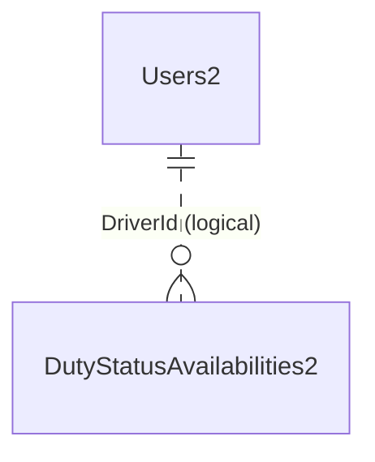

[↑ Table Inventory](#table-inventory)

### Groups2

Contains data corresponding to MyGeotab [Group](https://developers.geotab.com/myGeotab/apiReference/objects/Group) objects.

| Column | MSSQL Type | PG Type | Nullable | Description |
|--------|-----------|---------|----------|-------------|
| `id` | bigint IDENTITY | bigint GENERATED | NO | The unique identifier for the record in this table. Entirely unrelated to the Geotab system. |
| `GeotabId` | nvarchar(50) | varchar(50) | NO | The unique identifier for the specific Entity object in the Geotab system. |
| `Children` | nvarchar(max) | text | YES | The GeotabIds of any direct children of the subject Group. Presented in the form of a JSON array (e.g. [{"id":"b3D88"},{"id":"b5F70"},{"id":"b2718"}]). |
| `Color` | nvarchar(50) | varchar(50) | YES | The color used to render assets in the subject Group in the MyGeotab user interface. Presented in JSON format (e.g. {"a":255,"b":0,"g":0,"r":0}). |
| `Comments` | nvarchar(1024) | varchar(1024) | YES | A free text field where any user information can be stored and referenced for this entity. |
| `Name` | nvarchar(255) | varchar(255) | YES | The name of this entity that uniquely identifies it and is used when displaying this entity. |
| `Reference` | nvarchar(255) | varchar(255) | YES | The string reference to add to the database entry for this group. |
| `EntityStatus` | int | integer | NO | Indicates whether the subject corresponding object is active or deleted in the MyGeotab database. **1 = Active. 0 = Deleted.** |
| `RecordLastChangedUtc` | datetime2(7) | timestamp | NO | A timestamp, in Coordinated Universal Time (UTC), indicating the last time that the subject record was updated in the adapter database. |

**PK**: `id`

[↑ Table Inventory](#table-inventory)

### RepairStatuses2

Represents the list of values in the MyGeotab [RepairStatusType](https://developers.geotab.com/myGeotab/apiReference/objects/RepairStatusType) entity.

| Column | MSSQL Type | PG Type | Nullable | Description |
|--------|-----------|---------|----------|-------------|
| `id` | smallint | smallint | NO | The underlying numeric value of the RepairStatusType. |
| `Name` | nvarchar(50) | varchar(50) | NO | The name of the RepairStatusType. |

**PK**: `id`

[↑ Table Inventory](#table-inventory)

### Rules2

Contains data corresponding to MyGeotab [Rule](https://developers.geotab.com/myGeotab/apiReference/objects/Rule) objects.

| Column | MSSQL Type | PG Type | Nullable | Description |
|--------|-----------|---------|----------|-------------|
| `id` | bigint IDENTITY | bigint GENERATED | NO | The unique identifier for the record in this table. Entirely unrelated to the Geotab system. * **NOTE** : **-1** = **NoRuleId**. |
| `GeotabId` | nvarchar(50) | varchar(50) | NO | The unique identifier for the Entity in the Geotab system. |
| `ActiveFrom` | datetime2(7) | timestamp | YES | Start date and time of the Rule's notification activity period. |
| `ActiveTo` | datetime2(7) | timestamp | YES | End date and time of the Rule's notification activity period. |
| `BaseType` | nvarchar(50) | varchar(50) | YES | The [ExceptionRuleBaseType](https://developers.geotab.com/myGeotab/apiReference/objects/ExceptionRuleBaseType) of the Rule. |
| `Comment` | nvarchar(max) | text | YES | Free text field where any user information can be stored and referenced for this entity. |
| `Condition` | nvarchar(max) | text | YES | The hierarchical tree of Condition(s) defining the logic of a Rule. A Rule should have one or more conditions in its tree. Presented in JSON form. |
| `Groups` | nvarchar(max) | text | YES | The list of [Group](https://developers.geotab.com/myGeotab/apiReference/objects/Group) (s) the subject entity belongs to. Presented in the form of a JSON array (e.g. [{"id":"b1769"},{"id":"b2858"}]). Group Ids in this list correspond with GeotabId values in the Groups2 table. |
| `Name` | nvarchar(255) | varchar(255) | YES | The name of the rule entity that uniquely identifies it and is used when displaying this entity. |
| `Version` | bigint | bigint | NO | The version of the entity. |
| `EntityStatus` | int | integer | NO | Indicates whether the subject corresponding object is active or deleted in the MyGeotab database. **1 = Active. 0 = Deleted**. |
| `RecordLastChangedUtc` | datetime2(7) | timestamp | NO | A timestamp, in Coordinated Universal Time (UTC), indicating the last time that the subject record was updated in this table. |

**PK**: `id`

[↑ Table Inventory](#table-inventory)

### Users2

Contains data corresponding to MyGeotab [User](https://developers.geotab.com/myGeotab/apiReference/objects/User) objects.

| Column | MSSQL Type | PG Type | Nullable | Description |
|--------|-----------|---------|----------|-------------|
| `id` | bigint | bigint | NO | The unique identifier for the record in this table. * **NOTE** : This is also the **GeotabId** converted to its underlying numeric value. * **NOTE** : **-1** = **NoUserId**, **-2** = **NoDriverId**, **-3** = **UnknownDriverId**. |
| `GeotabId` | nvarchar(50) | varchar(50) | NO | The unique identifier for the Entity in the Geotab system. |
| `ActiveFrom` | datetime2(7) | timestamp | NO | The date the user is active from. |
| `ActiveTo` | datetime2(7) | timestamp | NO | The date the user is active to. |
| `CompanyGroups` | nvarchar(max) | text | YES | The list of [Group](https://developers.geotab.com/myGeotab/apiReference/objects/Group) (s) the subject entity belongs to. Presented in the form of a JSON array (e.g. [{"id":"b834"},{"id":"b9b1"}]). Group Ids in this list correspond with **GeotabId** values in the Groups table. |
| `EmployeeNo` | nvarchar(50) | varchar(50) | YES | The employee number or external identifier. |
| `FirstName` | nvarchar(255) | varchar(255) | YES | The first name of the user. |
| `HosRuleSet` | nvarchar(max) | text | YES | The HosRuleSet the user follows. **Default: None**. |
| `IsDriver` | bit | boolean | NO | Indicates whether the user is classified as a driver. |
| `LastAccessDate` | datetime2(7) | timestamp | YES | A timestamp, in Coordinated Universal Time (UTC), indicating the last time that the subject user accessed the MyGeotab system. |
| `LastName` | nvarchar(255) | varchar(255) | YES | The last name of the user. |
| `Name` | nvarchar(255) | varchar(255) | NO | The user's email address / login name. |
| `Designation` | nvarchar(50) | varchar(50) | YES | The designation or title of the employee. Maximum length of 50 characters. Default: empty string. |
| `EntityStatus` | int | integer | NO | Indicates whether the subject corresponding object is active or deleted in the MyGeotab database. **1 = Active. 0 = Deleted**. |
| `RecordLastChangedUtc` | datetime2(7) | timestamp | NO | A timestamp, in Coordinated Universal Time (UTC), indicating the last time that the subject record was updated in this table. |

**PK**: `id`

[↑ Table Inventory](#table-inventory)

### Zones2

Contains data corresponding to MyGeotab [Zone](https://developers.geotab.com/myGeotab/apiReference/objects/Zone) objects.

| Column | MSSQL Type | PG Type | Nullable | Description |
|--------|-----------|---------|----------|-------------|
| `id` | bigint | bigint | NO | The unique identifier for the record in this table. * **NOTE** : This is also the **GeotabId** converted to its underlying numeric value. * **NOTE** : **-1** = **NoZoneId**. |
| `GeotabId` | nvarchar(100) | varchar(100) | NO | The unique identifier for the Entity in the Geotab system. |
| `ActiveFrom` | datetime2(7) | timestamp | YES | The date the zone is active from. |
| `ActiveTo` | datetime2(7) | timestamp | YES | The date the zone is active to. |
| `CentroidLatitude` | float | double precision | YES | The latitude of the geographic centre of the zone. |
| `CentroidLongitude` | float | double precision | YES | The longitude of the geographic centre of the zone. |
| `Comment` | nvarchar(500) | varchar(500) | YES | A free text field where any user information can be stored and referenced for this entity. |
| `Displayed` | bit | boolean | YES | A value indicating whether this zone must be displayed when viewing a map or it should be hidden. |
| `ExternalReference` | nvarchar(255) | varchar(255) | YES | Any type of external reference to be attached to the zone. May be used to link zones with corresponding entities in other systems. |
| `Groups` | nvarchar(max) | text | YES | The list of [Group](https://developers.geotab.com/myGeotab/apiReference/objects/Group) (s) the subject entity belongs to. Presented in the form of a JSON array (e.g. [{"id":"b1266"},{"id":"b2998"}]). Group Ids in this list correspond with **GeotabId** values in the Groups table. |
| `MustIdentifyStops` | bit | boolean | YES | Indicates whether this zone name must be shown when devices stop in this zone. If true, a "zone stop rule" (Rule with BaseType: ZoneStop) will automatically be created for this zone. This is to facilitate reporting on zone stops. The rule is not visible via the MyGeotab UI. |
| `Name` | nvarchar(255) | varchar(255) | NO | The name of this entity that uniquely identifies it and is used when displaying this entity. |
| `Points` | nvarchar(max) | text | YES | The list of points (see [Coordinate](https://developers.geotab.com/myGeotab/apiReference/objects/Coordinate)) that make up the zone. A zone should be closed (i.e. the first point should consist of the same set of coordinates as the last point). JSON array of X/Y coordinate pairs. |
| `ZoneTypeIds` | nvarchar(max) | text | NO | The Id(s) of the [ZoneType](https://developers.geotab.com/myGeotab/apiReference/objects/ZoneType) (s) that this zone belongs to. Presented in the form of a JSON array (e.g. [{"Id":"ZoneTypeOfficeId"},{"Id":"ZoneTypeCustomerId"}]). Ids correspond to GeotabId values in the ZoneTypes2 table. |
| `Version` | bigint | bigint | YES | The version of the entity. |
| `EntityStatus` | int | integer | NO | Indicates whether the subject corresponding object is active or deleted in the MyGeotab database. **1 = Active. 0 = Deleted**. |
| `RecordLastChangedUtc` | datetime2(7) | timestamp | NO | A timestamp, in Coordinated Universal Time (UTC), indicating the last time that the subject record was updated in this table. |

**PK**: `id`

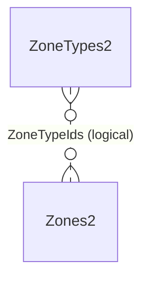

[↑ Table Inventory](#table-inventory)

### ZoneTypes2

Contains data corresponding to MyGeotab [ZoneType](https://developers.geotab.com/myGeotab/apiReference/objects/ZoneType) objects.

| Column | MSSQL Type | PG Type | Nullable | Description |
|--------|-----------|---------|----------|-------------|
| `id` | bigint IDENTITY | bigint GENERATED | NO | The unique identifier for the record in this table. Entirely unrelated to the Geotab system. |
| `GeotabId` | nvarchar(100) | varchar(100) | NO | The unique identifier for the Entity in the Geotab system. |
| `Comment` | nvarchar(255) | varchar(255) | YES | A free text field where any user information can be stored and referenced for this entity. |
| `Name` | nvarchar(255) | varchar(255) | NO | The name of this entity that uniquely identifies it and is used when displaying this entity. |
| `EntityStatus` | int | integer | NO | Indicates whether the subject corresponding object is active or deleted in the MyGeotab database. **1 = Active. 0 = Deleted**. |
| `RecordLastChangedUtc` | datetime2(7) | timestamp | NO | A timestamp, in Coordinated Universal Time (UTC), indicating the last time that the subject record was updated in this table. |

**PK**: `id`

[↑ Table Inventory](#table-inventory)

---

## Enhanced Data Tables

Tables in this category are populated by services that enhance and augment the raw data in associated feed data tables. For example, the `StatusDataLocationService2` populates the `StatusDataLocations2` table with location information to augment corresponding records in the `StatusData2` feed data table.

### FaultDataLocations2

Contains interpolated location data for MyGeotab [FaultData](https://developers.geotab.com/myGeotab/apiReference/objects/FaultData) objects. For each record inserted into the FaultData2 table, a corresponding record is inserted into this table. If the [EnableFaultDataLocationService](README.md#48-dataenhancementservices) setting is set to true, records in this table will be updated with location information interpolated using data from the LogRecords2 table.

| Column | MSSQL Type | PG Type | Nullable | Description |
|--------|-----------|---------|----------|-------------|
| `id` | bigint | bigint | NO | The Id value of the corresponding record in the FaultData2 table. |
| `DeviceId` | bigint | bigint | NO | The DeviceId value of the corresponding record in the FaultData2 table. |
| `DateTime` | datetime2(7) | timestamp | NO | The DateTime value of the corresponding record in the FaultData2 table. This column is only included in this table for database partitioning purposes. |
| `Latitude` | float | double precision | YES | The interpolated latitude of the corresponding record in the FaultData2 table. |
| `Longitude` | float | double precision | YES | The interpolated longitude of the corresponding record in the FaultData2 table. |
| `Speed` | real | real | YES | The interpolated speed (in **km/h**) of the corresponding record in the FaultData2 table. |
| `Bearing` | real | real | YES | The interpolated bearing (heading) in **degrees** of the corresponding record in the FaultData2 table. |
| `Direction` | nvarchar(3) | varchar(3) | YES | The interpolated compass direction (e.g. “N”, “SE”, “WSW”, etc.) of the corresponding record in the FaultData2 table. |
| `LongLatProcessed` | bit | boolean | NO | Indicates whether the subject record has been processed for interpolation. |
| `LongLatReason` | tinyint | smallint | YES | If **not null** and **LongLatProcessed = true**, indicates the reason why it was not possible to interpolate Longitude and Latitude values for the subject record. See [LocationInterpolationResultReason](#locationinterpolationresultreason-enumeration). |
| `RecordLastChangedUtc` | datetime2(7) | timestamp | NO | A timestamp, in Coordinated Universal Time (UTC), indicating the last time that the subject record was updated in this table. |

**PK**: (`id`, `DateTime`) — Partitioned by `DateTime`

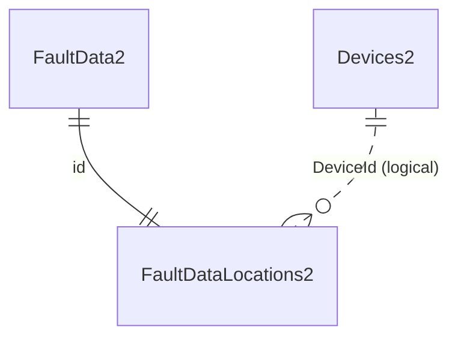

[↑ Table Inventory](#table-inventory)

### StatusDataLocations2

Contains interpolated location data for MyGeotab [StatusData](https://developers.geotab.com/myGeotab/apiReference/objects/StatusData) objects. For each record inserted into the StatusData2 table, a corresponding record is inserted into this table. If the [EnableStatusDataLocationService](README.md#48-dataenhancementservices) setting is set to true, records in this table will be updated with location information interpolated using data from the LogRecords2 table.

Same structure as FaultDataLocations2 (id references StatusData2 instead of FaultData2).

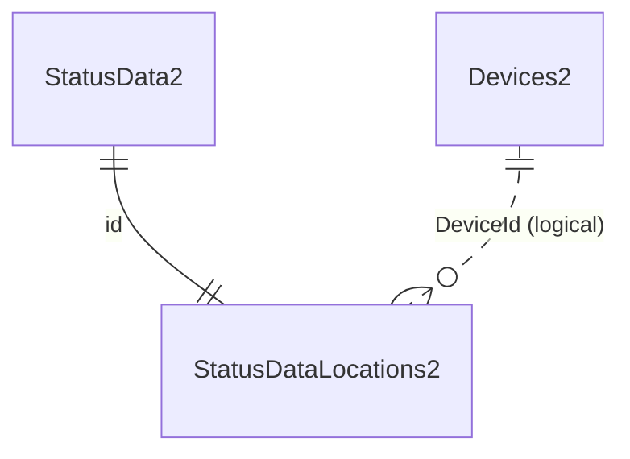

[↑ Table Inventory](#table-inventory)

### LocationInterpolationResultReason (Enumeration)

The LocationInterpolationResultReason enumeration is not represented in a physical table. It is used to identify reasons why location interpolation was not possible for a given Entity. Referenced by the `LongLatReason` column in the FaultDataLocations2 and StatusDataLocations2 tables.

| Id | Name | Description |
|----|------|-------------|
| 1 | LagLeadDbLogRecord2InfoNotFound | Lag/lead records were not found in the LogRecords2 table for an unknown reason. |
| 2 | LeadDateTimeLessThanLagDateTime | The lead DateTime value was less than the lag DateTime value. |
| 3 | TargetDateTimeGreaterThanLeadDateTime | The target DateTime value (for which location was to be interpolated) was greater than the lead DateTime value. |
| 4 | TargetDateTimeLessThanLagDateTime | The target DateTime value (for which location was to be interpolated) was less than the lag DateTime value. |
| 5 | TargetEntityDateTimeBelowMinDbLogRecord2DateTime | The target DateTime value was older than the earliest DateTime of any record in the LogRecords2 table. It is normal for devices to report some StatusData and/or FaultData before reporting any LogRecords upon initial activation. |
| 6 | TargetEntityDateTimeBelowMinDbLogRecord2DateTimeForDevice | The target DateTime value was older than the earliest DateTime of any record in the LogRecords2 table for the subject Device. The same points noted for #5 apply here on a per-device level. |

---

## Command Tables

These tables are used for issuing data manipulation commands to the Geotab platform — for example, updating the repair status of DVIRDefects after related work orders have been completed in an external system. Rather than having to use the MyGeotab SDK to send updates back to the MyGeotab database, the details of these updates can simply be inserted as rows into the relevant command tables and the adapter will take care of the SDK-related work.

### upd_DVIRDefectUpdates2

May be used to send [DVIRDefect](https://developers.geotab.com/myGeotab/apiReference/objects/DVIRDefect) updates to the MyGeotab database with which the API Adapter is configured to communicate. See the [DVIRLog Manipulator](README.md#35-dvirlog-manipulator) section of the README for more information.

| Column | MSSQL Type | PG Type | Nullable | Description |
|--------|-----------|---------|----------|-------------|
| `id` | bigint IDENTITY | bigint GENERATED | NO | The unique identifier for the record in the adapter database table. Entirely unrelated to the Geotab system. |
| `DVIRLogId` | uniqueidentifier | uuid | NO | The Id of the [DVIRLog](https://developers.geotab.com/myGeotab/apiReference/objects/DVIRLog) (in the DVIRLogs2 table) with which the subject DVIRDefect is associated. |
| `DVIRDefectId` | uniqueidentifier | uuid | NO | The Id of the [DVIRDefect](https://developers.geotab.com/myGeotab/apiReference/objects/DVIRDefect) (in the DVIRDefects2 table) that is to be updated in the Geotab system |
| `RepairDateTimeUtc` | datetime2(7) | timestamp | YES | The date and time the DVIRDefect was repaired, in Coordinated Universal Time (UTC). |
| `RepairStatusId` | smallint | smallint | YES | The Id of the [RepairStatusType](https://developers.geotab.com/myGeotab/apiReference/objects/RepairStatusType) (in the RepairStatuses2 table) of this DVIRDefect. |
| `RepairUserId` | bigint | bigint | YES | The Id of the [User](https://developers.geotab.com/myGeotab/apiReference/objects/User) (in the Users2 table) who repaired this DVIRDefect. |
| `Remark` | nvarchar(max) | text | YES | The remark text. |
| `RemarkDateTimeUtc` | datetime2(7) | timestamp | YES | The date and time the remark was created, in Coordinated Universal Time (UTC). |
| `RemarkUserId` | bigint | bigint | YES | The Id of the [User](https://developers.geotab.com/myGeotab/apiReference/objects/User) (in the Users2 table) who created the remark. |
| `RecordCreationTimeUtc` | datetime2(7) | timestamp | NO | A timestamp, in Coordinated Universal Time (UTC), indicating when this record was created in the table. |

**PK**: `id`

```mermaid
erDiagram
    DVIRLogs2 ||..o{ upd_DVIRDefectUpdates2 : "DVIRLogId (logical)"
    DVIRDefects2 ||..o{ upd_DVIRDefectUpdates2 : "DVIRDefectId (logical)"
    RepairStatuses2 o|..o{ upd_DVIRDefectUpdates2 : "RepairStatusId (logical)"
    Users2 o|..o{ upd_DVIRDefectUpdates2 : "RepairUserId, RemarkUserId (logical)"
```

[↑ Table Inventory](#table-inventory)

---

## Command Exception Tables

For each command table, there is an associated command exception table. If a row inserted into a command table does not pass data validation checks, or if an exception occurs when the adapter attempts to execute the command, a copy of the original row will be added to the command exception table along with the related error message. This assists in debugging and provides feedback that would otherwise be provided in the responses to commands issued via the MyGeotab SDK.

### fail_DVIRDefectUpdateFailures2

Associated with the upd_DVIRDefectUpdates2 table. If a row is inserted into the upd_DVIRDefectUpdates2 table and it does not pass data validation checks, or if an exception occurs when the adapter attempts to execute the command, a copy of the original row in the upd_DVIRDefectUpdates2 table will be added to this table along with the related error message which will appear in the FailureMessage column. See the [DVIRLog Manipulator](README.md#35-dvirlog-manipulator) section of the README for more information.

| Column | MSSQL Type | PG Type | Nullable | Description |
|--------|-----------|---------|----------|-------------|
| `id` | bigint IDENTITY | bigint GENERATED | NO | The unique identifier for the record in the adapter database table. Entirely unrelated to the Geotab system. |
| `DVIRDefectUpdateId` | bigint | bigint | NO | The value of the id field for the original row in the upd_DVIRDefectUpdates2 table that resulted in the failure. |
| `DVIRLogId` | uniqueidentifier | uuid | NO | The Id of the [DVIRLog](https://developers.geotab.com/myGeotab/apiReference/objects/DVIRLog) (in the DVIRLogs2 table) with which the subject DVIRDefect is associated. |
| `DVIRDefectId` | uniqueidentifier | uuid | NO | The Id of the [DVIRDefect](https://developers.geotab.com/myGeotab/apiReference/objects/DVIRDefect) (in the DVIRDefects2 table) that is to be updated in the Geotab system |
| `RepairDateTimeUtc` | datetime2(7) | timestamp | YES | The date and time the DVIRDefect was repaired, in Coordinated Universal Time (UTC). |
| `RepairStatusId` | smallint | smallint | YES | The Id of the [RepairStatusType](https://developers.geotab.com/myGeotab/apiReference/objects/RepairStatusType) (in the RepairStatuses2 table) of this DVIRDefect. |
| `RepairUserId` | bigint | bigint | YES | The Id of the [User](https://developers.geotab.com/myGeotab/apiReference/objects/User) (in the Users2 table) who repaired this DVIRDefect. |
| `Remark` | nvarchar(max) | text | YES | The remark text. |
| `RemarkDateTimeUtc` | datetime2(7) | timestamp | YES | The date and time the remark was created, in Coordinated Universal Time (UTC). |
| `RemarkUserId` | bigint | bigint | YES | The Id of the [User](https://developers.geotab.com/myGeotab/apiReference/objects/User) (in the Users2 table) who created the remark. |
| `FailureMessage` | nvarchar(max) | text | YES | The reason why this record failed to result in an update of the subject DVIRDefect in the MyGeotab database. |
| `RecordCreationTimeUtc` | datetime2(7) | timestamp | NO | A timestamp, in Coordinated Universal Time (UTC), indicating when this failure record was created in the table. |

**PK**: `id`

```mermaid
erDiagram
    upd_DVIRDefectUpdates2 ||..o{ fail_DVIRDefectUpdateFailures2 : "DVIRDefectUpdateId (logical)"
```

[↑ Table Inventory](#table-inventory)

---

## Staging Tables

Each staging table mirrors the column structure of its destination table. Data is written to staging tables first, then upserted into destination tables via merge stored procedures.

| Staging Table | Destination Table | Merge SP |
|---------------|-------------------|----------|
| `stg_ChargeEvents2` | `ChargeEvents2` | `spMerge_stg_ChargeEvents2` |
| `stg_Devices2` | `Devices2` | `spMerge_stg_Devices2` |
| `stg_DeviceStatusInfo2` | `DeviceStatusInfo2` | `spMerge_stg_DeviceStatusInfo2` |
| `stg_Diagnostics2` | `Diagnostics2` | `spMerge_stg_Diagnostics2` |
| `stg_DriverChanges2` | `DriverChanges2` | `spMerge_stg_DriverChanges2` |
| `stg_DutyStatusAvailabilities2` | `DutyStatusAvailabilities2` | `spMerge_stg_DutyStatusAvailabilities2` |
| `stg_DutyStatusLogs2` | `DutyStatusLogs2` | `spMerge_stg_DutyStatusLogs2` |
| `stg_DVIRDefectRemarks2` | `DVIRDefectRemarks2` | `spMerge_stg_DVIRDefectRemarks2` |
| `stg_DVIRDefects2` | `DVIRDefects2` | `spMerge_stg_DVIRDefects2` |
| `stg_DVIRLogs2` | `DVIRLogs2` | `spMerge_stg_DVIRLogs2` |
| `stg_ExceptionEvents2` | `ExceptionEvents2` | `spMerge_stg_ExceptionEvents2` |
| `stg_FuelAndEnergyUsed2` | `FuelAndEnergyUsed2` | `spMerge_stg_FuelAndEnergyUsed2` |
| `stg_Groups2` | `Groups2` | `spMerge_stg_Groups2` |
| `stg_Rules2` | `Rules2` | `spMerge_stg_Rules2` |
| `stg_Trips2` | `Trips2` | `spMerge_stg_Trips2` |
| `stg_Users2` | `Users2` | `spMerge_stg_Users2` |
| `stg_Zones2` | `Zones2` | `spMerge_stg_Zones2` |
| `stg_ZoneTypes2` | `ZoneTypes2` | `spMerge_stg_ZoneTypes2` |

[↑ Table Inventory](#table-inventory)

---

## System Tables

These tables are used internally by the adapter and do not offer any other specific benefit.

### DBMaintenanceLogs2

A system table used by the MyGeotab API Adapter.

| Column | MSSQL Type | PG Type | Nullable | Description |
|--------|-----------|---------|----------|-------------|
| `id` | bigint IDENTITY | bigint GENERATED | NO | The unique identifier for the record in this table. Entirely unrelated to the Geotab system. |
| `MaintenanceTypeId` | tinyint | smallint | NO | The unique identifier for the Entity in the Geotab system. **1 = Level1. 2 = Level2. 3 = Partition**. |
| `StartTimeUtc` | datetime2(7) | timestamp | NO | A timestamp, in Coordinated Universal Time (UTC), indicating when the database maintenance operation started. |
| `EndTimeUtc` | datetime2(7) | timestamp | YES | A timestamp, in Coordinated Universal Time (UTC), indicating when the database maintenance operation completed. |
| `Success` | bit | boolean | YES | Indicates whether the database maintenance operation completed successfully. **Default is null**. |
| `RecordLastChangedUtc` | datetime2(7) | timestamp | NO | A timestamp, in Coordinated Universal Time (UTC), indicating the last time that the subject record was updated in this table. |

**PK**: `id`

[↑ Table Inventory](#table-inventory)

### DBPartitionInfo2

A system table used by the MyGeotab API Adapter. Created by `spManagePartitions` (separate script file, not in cumulative schema).

| Column | MSSQL Type | PG Type | Nullable | Description |
|--------|-----------|---------|----------|-------------|
| `id` | bigint IDENTITY | bigint GENERATED | NO | The unique identifier for the record in this table. Entirely unrelated to the Geotab system. |
| `InitialMinDateTimeUTC` | datetime2(7) | timestamp | NO | A timestamp, in Coordinated Universal Time (UTC), indicating the lower DateTime boundary used for the first database partition. |
| `InitialPartitionInterval` | nvarchar(50) | varchar(50) | NO | Indicates the time interval used for partitioning database tables and indexes. Must be **monthly**, **weekly** or **daily**. |
| `RecordCreationTimeUtc` | datetime2(7) | timestamp | NO | A timestamp, in Coordinated Universal Time (UTC), indicating when the subject record was inserted into this table. |

**PK**: `id`

[↑ Table Inventory](#table-inventory)

### MiddlewareVersionInfo2

A system table used by the MyGeotab API Adapter.

| Column | MSSQL Type | PG Type | Nullable | Description |
|--------|-----------|---------|----------|-------------|
| `id` | bigint IDENTITY | bigint GENERATED | NO | The unique identifier for the record in this table. Entirely unrelated to the Geotab system. |
| `DatabaseVersion` | nvarchar(50) | varchar(50) | NO | The version of the adapter database. |
| `RecordCreationTimeUtc` | datetime2(7) | timestamp | NO | A timestamp, in Coordinated Universal Time (UTC), indicating when the subject record was inserted into this table. |

**PK**: `id`

[↑ Table Inventory](#table-inventory)

### MyGeotabVersionInfo2

Contains software version information (obtained from MyGeotab API [VersionInformation](https://developers.geotab.com/myGeotab/apiReference/objects/VersionInformation)) about the MyGeotab server and database that the subject adapter database is associated with via the MyGeotab API Adapter.

| Column | MSSQL Type | PG Type | Nullable | Description |
|--------|-----------|---------|----------|-------------|
| `DatabaseName` | nvarchar(58) | varchar(58) | NO | The name of the MyGeotab database. |
| `Server` | nvarchar(50) | varchar(50) | NO | The server on which the MyGeotab database resides. |
| `DatabaseVersion` | nvarchar(50) | varchar(50) | NO | The current version of the MyGeotab databases on the server. |
| `ApplicationBuild` | nvarchar(50) | varchar(50) | NO | The MyGeotab application build. |
| `ApplicationBranch` | nvarchar(50) | varchar(50) | NO | The MyGeotab application branch. |
| `ApplicationCommit` | nvarchar(50) | varchar(50) | NO | The MyGeotab application commit. |
| `GoTalkVersion` | nvarchar(50) | varchar(50) | NO | The Text to Speech firmware version provided by the server. |
| `RecordCreationTimeUtc` | datetime2(7) | timestamp | NO | A timestamp, in Coordinated Universal Time (UTC), indicating when the subject record was inserted into this table. |

**PK**: `DatabaseName`

[↑ Table Inventory](#table-inventory)

### OServiceTracking2

A system table used by the MyGeotab API Adapter.

| Column | MSSQL Type | PG Type | Nullable | Description |
|--------|-----------|---------|----------|-------------|
| `id` | bigint IDENTITY | bigint GENERATED | NO | The unique identifier for the record in this table. Entirely unrelated to the Geotab system. |
| `ServiceId` | nvarchar(50) | varchar(50) | NO | An identifier for the subject service. |
| `AdapterVersion` | nvarchar(50) | varchar(50) | YES | The version of the MyGeotab API Adapter that the subject service is a part of. |
| `AdapterMachineName` | nvarchar(100) | varchar(100) | YES | The name of the machine/server that is hosting the MyGeotab API Adapter instance that the subject service is a part of. |
| `EntitiesLastProcessedUtc` | datetime2(7) | timestamp | YES | A timestamp, in Coordinated Universal Time (UTC), indicating the last time that the subject service processed any entities (data). |
| `LastProcessedFeedVersion` | bigint | bigint | YES | If applicable and the subject service uses the [GetFeed](https://developers.geotab.com/myGeotab/apiReference/methods/GetFeed) method, the ToVersion of the last batch of records retrieved by the subject service. |
| `RecordLastChangedUtc` | datetime2(7) | timestamp | NO | A timestamp, in Coordinated Universal Time (UTC), indicating the last time that the subject record was updated in this table. |

**PK**: `id`

[↑ Table Inventory](#table-inventory)

---

## Views

| View | Description |
|------|-------------|
| `vwStatsForLevel1DBMaintenance` | Lists tables with at least 1,000 modifications since last statistics update. Used by `DatabaseMaintenanceService2` to identify tables needing Level 1 maintenance. |
| `vwStatsForLevel2DBMaintenance` | Lists indexes (at least 1 KB) with fragmentation over 10%. Used by `DatabaseMaintenanceService2` to identify indexes needing reorganization or rebuild. |
| `vwStatsForLocationInterpolationProgress` | Shows location interpolation progress for both FaultData and StatusData — total records, processed count, and completion percentage. |

---

## Stored Procedures

### Merge Stored Procedures

Each staging table has a corresponding merge stored procedure that upserts staging data into the destination table. These are called by the adapter, not by external systems.

| Stored Procedure | Staging Table | Destination Table |
|-----------------|---------------|-------------------|
| `spMerge_stg_ChargeEvents2` | stg_ChargeEvents2 | ChargeEvents2 |
| `spMerge_stg_Devices2` | stg_Devices2 | Devices2 |
| `spMerge_stg_DeviceStatusInfo2` | stg_DeviceStatusInfo2 | DeviceStatusInfo2 |
| `spMerge_stg_Diagnostics2` | stg_Diagnostics2 | Diagnostics2 |
| `spMerge_stg_DriverChanges2` | stg_DriverChanges2 | DriverChanges2 |
| `spMerge_stg_DutyStatusAvailabilities2` | stg_DutyStatusAvailabilities2 | DutyStatusAvailabilities2 |
| `spMerge_stg_DutyStatusLogs2` | stg_DutyStatusLogs2 | DutyStatusLogs2 |
| `spMerge_stg_DVIRDefectRemarks2` | stg_DVIRDefectRemarks2 | DVIRDefectRemarks2 |
| `spMerge_stg_DVIRDefects2` | stg_DVIRDefects2 | DVIRDefects2 |
| `spMerge_stg_DVIRLogs2` | stg_DVIRLogs2 | DVIRLogs2 |
| `spMerge_stg_ExceptionEvents2` | stg_ExceptionEvents2 | ExceptionEvents2 |
| `spMerge_stg_FuelAndEnergyUsed2` | stg_FuelAndEnergyUsed2 | FuelAndEnergyUsed2 |
| `spMerge_stg_Groups2` | stg_Groups2 | Groups2 |
| `spMerge_stg_Rules2` | stg_Rules2 | Rules2 |
| `spMerge_stg_Trips2` | stg_Trips2 | Trips2 |
| `spMerge_stg_Users2` | stg_Users2 | Users2 |
| `spMerge_stg_Zones2` | stg_Zones2 | Zones2 |
| `spMerge_stg_ZoneTypes2` | stg_ZoneTypes2 | ZoneTypes2 |

### Data Enhancement Stored Procedures

| Stored Procedure | Description |
|-----------------|-------------|
| `spFaultData2WithLagLeadLongLatBatch` | Retrieves FaultData records with lag/lead LogRecord locations for interpolation |
| `spStatusData2WithLagLeadLongLatBatch` | Retrieves StatusData records with lag/lead LogRecord locations for interpolation |

### Partition Management

| Stored Procedure | Script File | Description |
|-----------------|-------------|-------------|
| `spManagePartitions` | `MSSQL_0.0.0.1_spManagePartitions.sql` / `PG_0.0.0.1_spManagePartitions.sql` | Creates and manages filegroups, files, and partitions on a monthly/weekly/daily basis |

---

## SELECT Examples

**Service health (SQL Server):**

```sql
SELECT TOP 100
    ServiceId,
    AdapterVersion,
    AdapterMachineName,
    EntitiesLastProcessedUtc,
    LastProcessedFeedVersion,
    RecordLastChangedUtc
FROM [dbo].[OServiceTracking2] WITH (NOLOCK)
ORDER BY ServiceId;
```

**Service health (PostgreSQL):**

```sql
SELECT
    "ServiceId",
    "AdapterVersion",
    "AdapterMachineName",
    "EntitiesLastProcessedUtc",
    "LastProcessedFeedVersion",
    "RecordLastChangedUtc"
FROM "OServiceTracking2"
ORDER BY "ServiceId"
LIMIT 100;
```

**Location interpolation progress (SQL Server):**

```sql
SELECT * FROM [dbo].[vwStatsForLocationInterpolationProgress] WITH (NOLOCK);
```

**Location interpolation progress (PostgreSQL):**

```sql
SELECT * FROM "vwStatsForLocationInterpolationProgress";
```

**Database schema version (SQL Server):**

```sql
SELECT * FROM [dbo].[MiddlewareVersionInfo2] WITH (NOLOCK);
```

**Database schema version (PostgreSQL):**

```sql
SELECT * FROM "MiddlewareVersionInfo2";
```
